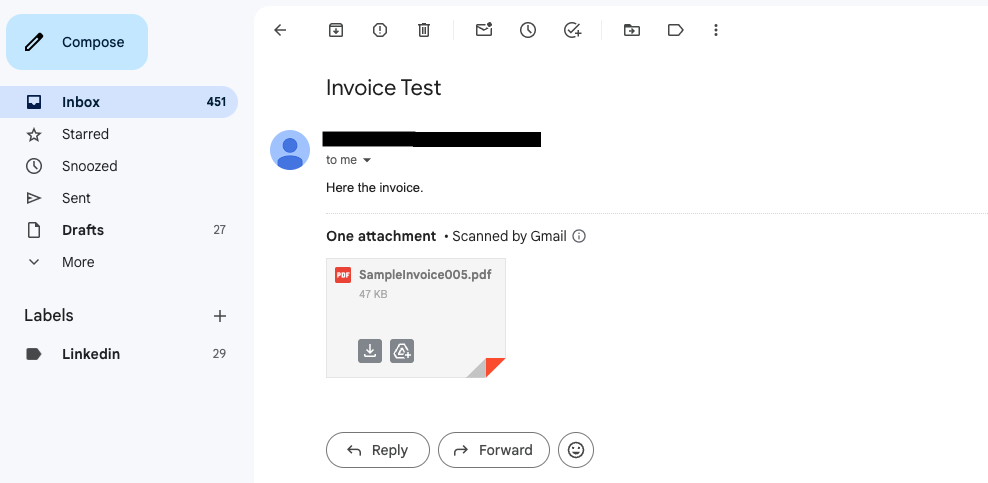
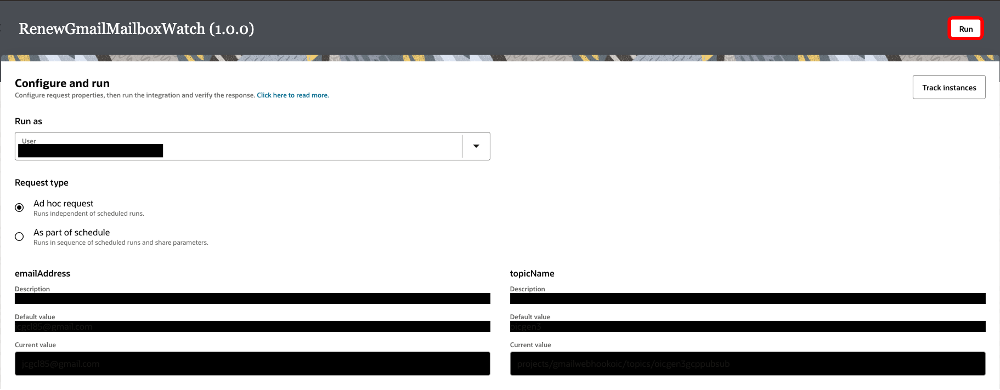
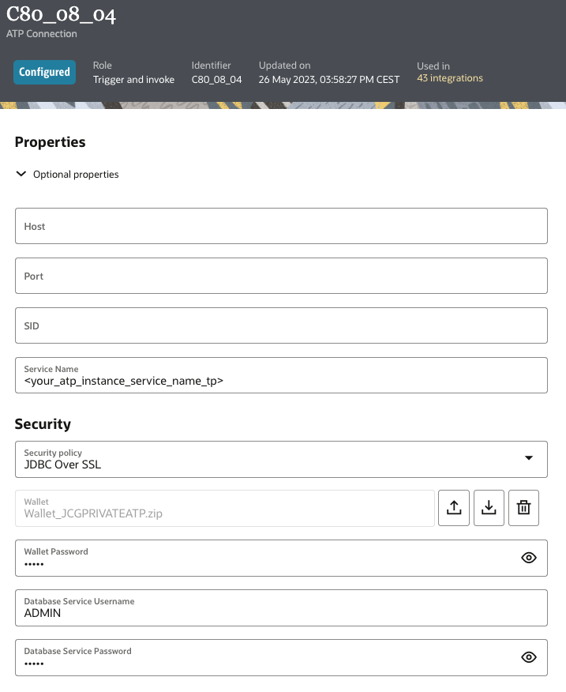

# Invoice Document Processing from Gmail into ERP Systems using OCI Document Understanding & Oracle Integration Cloud

Reviewed: 06.04.2024

# Introduction

In this article, we'll explore how to process invoice documents from Gmail using OCI Document Understanding and Oracle Integration Cloud (OIC). This tool can be super useful in different situations: For example, it could help to accelerate the ProcuretoPay process, as well it could help account payable analysts to avoid manual processing of incoming invoices and speed up validation processes, or automatically process purchase orders, but these are only a few examples. It can be applied to process invoice documents coming from any other Email Channel, it is adaptable to any Financial, Procurement, Accounting documents, and others, and it could be expanded to meet different vendor's invoice formats.

</img>

</img>

</img>

# Prerequisites

Before getting started, make sure you have access to the following Oracle Cloud Infrastructure (OCI) services:

- OCI Document Understanding Service 
- Oracle Integration Cloud (OIC)
- OCI Object Storage 
- OCI Event Rules
- OCI Streaming
- Oracle Autonomous Database (ATP)

Make sure you have access to the following Oracle SaaS Applications:

- Oracle Fusion ERP Cloud

And also, make sure you have access to the following Google Cloud Platform (GCP) services:

- Google Cloud Pub/Sub

# Solution Architecture

In this section, we'll dive into the building blocks of the solution architecture.

</img>

We've built the solution using Gmail API, which uses the Google Cloud Pub/Sub service (as part of GCP) to deliver Gmail push notifications, and it smoothly runs through Oracle Integration Cloud as the main, low-code orchestration tool. OCI Document Understanding is there to handle the invoice document processing, and Oracle ERP Cloud is the target ERP system for the ai-processed payable invoices:

1. Real-Time Capture of Gmail messages with attached Payable Invoices using Google Cloud Pub/Sub:

- Gmail Push Notifications can be capture in real-time via Google Cloud Pub/Sub service. It provides messaging capabilities through Topics, so Oracle Integration Cloud can subscribe to Gmail message events using the native adapter it has to this Google Cloud service. 

2. Guarantee the delivery of Gmail messages with attached invoices with OCI Streaming Service:

- OCI Streaming (Oracle-managed Kafka service) deocuples Gmail from ERP target systems, and guarantees the delivery of Gmail messages with attached invoices to be further processed

3. Handling Gmail's History using Autonomous Database:

- For every action on an email, Gmail creates a new history log created for it which is then used throughout the Gmail API to fecth the records starting from a specific history id. To handle this, we store the history log in Oracle Autonomous Database using the native adapter we have for it

4. Document Processing with OCI Document Understanding Service:

- The role of OCI Document Understanding is to extract content from document images and other document file types, as Invoices can be in different formats
- The service employs machine learning and optical character recognition capabilities(OCR) to analyze and extract information from various types of documents

5. Integration and orchestration using OIC:

- Oracle Integration Cloud adopts a low-code approach, allowing the creation of integrations and workflows with minimal coding effort and this accelerates the development process. OIC includes monitoring and analytics tools that provide real-time visibility into integration flows. This helps to track performance, identify bottlenecks, and change and optimize AI service integration flows like the one we are exploring here

6. Connecting to different ERP systems using Oracle Integration Cloud:

- Oracle Integration Cloud native adapters to different ERP systems can be used to be able to automatically create invoices after the documents are analyzed and processed. In this case, we are using the native adapter to Oracle Fusion ERP Cloud 

# Solution Flow in Detail

In this solution:

**Step1.** The Gmail API uses the Google Cloud Pub/Sub service API to deliver push notifications that let you watch for changes to Gmail mailboxes.

</img>

</img>

</img>

</img>

</img>

**Step2.** Oracle Integration Cloud can subscribe to the Google Cloud Pub/Sub topic created in Step1 to receive Gmail Push Notifications in near real-time, using the native adapter it has to this GCP service.
Every time a new email comes into your Gmail Inbox, a push notification is sent to Google Cloud Pub/Sub topic, triggering the **OIC Gmail_MessageAdded_to_Stream Low-Code Integration Flow**, which in turn sends it to an OCI Streaming Kafka Topic for further processing.

</img>

</img>

</img>

</img>

</img>

</img>

</img>

**Step3.** Once Oracle Integration Cloud is subscribed to Google Cloud Pub/Sub topic activating the integration flow described in Step2, Gmail account needs to be configured to send notifications to your Cloud Pub/Sub topic. In this case you have to execute the **OIC RenewGmailMailboxWatch Low-Code Scheduled Integration Flow** (receive email push notifications in Google Cloud Pub/Sub topic with the Gmail Watch REST API) on demand.
After that initial Ad-Hoc request, you must schedule this integration flow to re-call Gmail watch REST API at least every 7 days to avoid stop receiving Gmail push notifications.

</img>

</img>

</img>

</img>

</img>

</img>

**Step4.** After receiving the Gmail Push notification into the GmailStream the Kafka Topic, the **OIC GmailStream_to_AI_DocUnderst_to_ERP Low-Code Parent Integration Flow** is triggered. 
The new Gmail notification comes with a new history ID which is stored in an Oracle Autonomous Database table, and then the last saved history ID is used via the Gmail API to get the most updated email messages starting from it, together with the data and attachments from those.

</img>
</img>
</img>
</img>

**Step5.** At this step, each email message attachment (invoice document) is analized via  Document Understanding, triggering the **OIC AI_DocUnderstSynchJob_to_ObjectStorage Low-Code Child Integration Flow** (Payable Invoices Data Extraction with Document Understanding and Object Storage REST APIs).

</img>

</img>

</img>

</img>

</img>

</img>

</img>

**Step6.** After extracting the data from the invoice document using OCI AI Document Understanding, the invoice is created in the ERP system. In this case, the Oracle ERP Cloud native adapter in Oracle Integration Cloud is used to achieve the final part of the AI-based flow.

</img>
</img>
</img>
</img>

**Step7.** The payable invoice is created into the ERP system (Oracle Fusion ERP Cloud in this case), with all the header fields as well as the line items extracted from the original document.

</img>

# Code
      OIC Gmail_MessageAdded_to_Stream Low-Code Integration Flow - I176_08_04_01.00.0000.iar
      OIC RenewGmailMailboxWatch Low-Code Scheduled Integration Flow - RENEWGMAILMAILBOXWATCH_01.00.0000.iar
      OIC GmailStream_to_AI_DocUnderst_to_ERP Low-Code Parent Integration Flow - GMAILSTR_TO_AI_DOCUMENT_01.00.0000.iar
      OIC AI_DocUnderstSynchJob_to_ObjectStorage Low-Code Child Integration Flow - AI_DOCUNDER_TO_OBJECTST_01.00.0000.iar
      Invoice Samples - invoice_samples folder

Please find the **email_invoice_processing_erp_sol_resources** archive in <a href="./email_invoice_processing_erp_sol_resources.zip">/files/email_invoice_processing_erp_sol_resources.zip</a>

# Conclusion

In conclusion, using OCI Document Understanding, Oracle Integration Cloud (OIC) you may build a nice solution that may sort and help to speed up the Procure to Pay Process, processing documents from emails across various Email channels, ERP modules, vendors, etc. Its adaptability and ease of use can become a handy tool to help streamlining document proccessing and validation processes by saving time, and helping enhance productivity across a wide range of business scenarios.

### Authors

<a href="https://github.com/jcgocol">@jcgocol</a>

# License
 
Copyright (c) 2024 Oracle and/or its affiliates.
 
Licensed under the Universal Permissive License (UPL), Version 1.0.
 
See [LICENSE](https://github.com/oracle-devrel/technology-engineering/blob/main/LICENSE) for more details.
	
