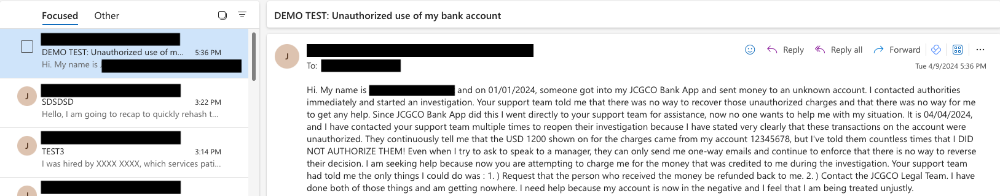
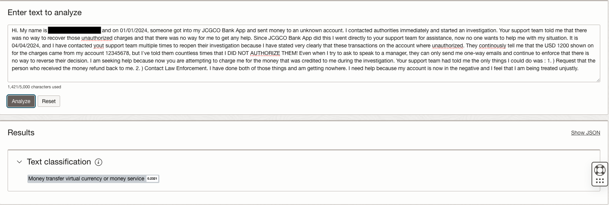

# Real-Time Email Categorization, Sentiment Analysis & "Quick Replies" using OCI AI Language, Generative AI & Oracle Integration Cloud

Reviewed: 11.04.2024

# Introduction

In this article, we'll explore how we can process emails from Outlook in real-time using Oracle Integration Cloud (OIC), OCI API Gateway and Microsoft Graph API Webhooks, perform sentiment analysis, custom email categorization and email body PII masking using OCI AI Language, and generate email "quick replies" using OCI Generative AI. Finally all this Email Analysis data is sent to Oracle Autonomous Database for further visualization in an Oracle Analytics Cloud Dashboard. 

This tool can be useful in different situations: for example, it could help Customer Support Teams for better understanding of customer feedbacks coming from outlook emails, as well it could provide a recommendation for email classification and categorization on top of negative feddbacks for better service ticket routing by Queue Managers, or provide a customer service recommendation for email replies on top of neutral/positive feddbacks based on the email conversation and CX knowledge base, but these are only a few examples. It can be applied to analyse emails coming from any other Email Channel, it is adaptable to Financial, Recruitment, , it could be expanded to other customer feedback channels like social media platforms, web apps, etc.

</img>

</img>

</img>

</img>

</img>

# Prerequisites

Before getting started, make sure you have access to the following Oracle Cloud Infrastructure (OCI) services:

- OCI AI Language 
- OCI Generative AI
- Oracle Integration Cloud (OIC)
- OCI API Gateway
- OCI Object Storage 
- OCI Streaming
- Oracle Autonomous Database (ATP)
- Oracle Analytics Cloud

And also, make sure you have access to the following Microsoft services:

- Microsoft 365
- Microsoft Azure Account associated with 365 subscription 

# Solution Architecture

In this section, we'll dive into the building blocks of the solution architecture.

</img>

We've built the solution using Microsoft Graph API to deliver Outlook email change notifications using OCI API Gateway as the notification url, and it smoothly runs through Oracle Integration Cloud as the main, low-code orchestration tool. OCI AI Language is there to handle email sentiment analysis, email classification and categorization & email body PII masking. OCI Generative AI is used to generate email body summarization as well as generating email "Quick Replies" based on the email context, Oracle Autonomous Database is used to store the email analysys data and an Oracle Analytics Cloud dashboard is configured on top of the email analysis tables to visualize the email insights:

1. Real-Time Capture of Outlook Email messages using Microsoft Graph API:

- Outlook Email Change Notifications can be captured in real-time via Microsoft Graph API webhooks, so an OCI API Gateway endpoint notification URL can subscribe to those. Then OCI API Gateway routes the email notifications to Oracle Integration Cloud, triggering REST-triggered orchestration flows.

2. Guarantee the delivery of Outlook email messages with OCI Streaming Service:

- OCI Streaming (Oracle-managed Kafka service) deocuples Outlook from the downstream applications/systems which will receive the email analysis data (in this case Oracle Autonomous Database), and guarantees the delivery of Outlook email messages to be further processed

3. Handling Outlook's History using Autonomous Database:

- For every email message, Outlook associates a conversation id which could be then used throughout the Microsoft Graph API to fetch the email messages that are part of an email conversation as well as to set the status of the email (new email, conversation, etc.). To handle this, we store the email conversation id in Oracle Autonomous Database using the native adapter we have for it

4. Email Text Analysis with OCI AI Language:

- The role of OCI AI Language is to process the email body text, performing **PII masking** to obfuscate sensitive information on the email text before the email is analyzed, **sentiment analysis** to detect the overall sentiment emotion of the email as well as the sentiment score which will be further used to set the priority of the email, and **custom text classification** to categorize the email based on 2 custom labelled email training datasets (2 CSVs which contain a subset of historical emails with the email body and the corresponding category and subcategory), so we have 1 custom model for the email category, and another one for the subcategory
- The service employs machine learning to analyze and extract key information from text

. Email Summarization & "Quick Replies" Generation with OCI Generative AI:

- The role of OCI Generatice AI is to **generate a concise summary** of the email body text (which could be helpful for a customer service agent/manager to understand the email description), and **generate an email reply** based on the email body (which could be helpful to provide quick replies to neutral/positive customer feedbacks, scenarios where the user might be just asking a question instead of complaining for something) 

5. Integration and orchestration using OIC:

- Oracle Integration Cloud adopts a low-code approach, allowing the creation of integrations and workflows with minimal coding effort and this accelerates the development process. OIC includes monitoring and analytics tools that provide real-time visibility into integration flows. This helps to track performance, identify bottlenecks, and change and optimize AI service integration flows like the one we are exploring here

6. Connecting to the target destination apps/systems of the email analysis data using Oracle Integration Cloud:

- Oracle Integration Cloud native adapters to different CX Apps, Databases, Datawarehouses, and other downstream applications could be used to be able to store the email analysis data in target DBs/DWs, automatically create service tickets in Customer Service Applications on top of negative emails (setting the severity of the ticket based on the overall sentiment score of the email, setting the queue and category of the ticket based on the corresponding custom text classification model results, augmenting the information of the ticket with the aspect-based sentiment analysis results and setting the problem description of the ticket with the generative-ai summary), and others. 
In this case, we are using the native adapter to Oracle Autonomous Transaction Processing to store the email analysis data

7. Outlook Email Analysis Dashboard:

- Oracle Analytics cloud adopts a no-code approach, allowing the creation of dashboards, visuals and useful insights on top of the data stored in a DB/DW. In this case we configured a live dashboard on top of Oracle Autonomous Database tables (email analysis data store)

# Solution Flow in Detail

In this solution:

**Step1.** The Microsoft Graph API deliver Outlook Email message notifications that let you watch for changes to Outlook mailboxes, as well as read and write email messages. You configure the API in the Microsoft Azure Portal associated with your Microsoft 365 Account.

</img>

</img>

</img>

</img>

</img>

**Step2.** The Microsoft Graph API allows you subscribe to changes from Outlook email messages like message creation, update, or deletion and receive notifications via webhooks. 

A subscription (including a notification URL) is needed to be able to receive notifications of those changes, so we use an OCI API Gateway deployment endpoint URL to receive those Outlook email notifications.

For this purpose, the OCI API Gateway Deployment endpoint has 2 routes: one to receive the request from Microsoft Graph API to check if the notification URL is valid, which in turn triggers the **OIC ValidateNotificationURL_from_OutlookWebhook Low-Code Integration Flow**, and a second one to receive the Outlook Email change notifications in near real-time,  which in turn triggers the **OIC GetChangeNotification_from_OutlookWebhook Low-Code Integration Flow**.

</img>

</img>

</img>

</img>

</img>

</img>

</img>

</img>

</img>

</img>

</img>

**Step3.** Every time a new email comes into your Outlook Inbox, a change notification is sent to the OCI API Gateway notification URL, triggering the **OIC GetChangeNotification_from_OutlookWebhook Low-Code Integration Flow**, which in turn sends it to an OCI Streaming Kafka Topic for further processing.

</img>

</img>

</img>

</img>

</img>

</img>

</img>

**Step4.** Outlook account needs to be configured so inbox change notitications are sent to your OCI API Gateway Notification Endpoint URL via a subscription. 

In this case you have to execute the **OIC RenewOutlookWebhookSubscription Low-Code Scheduled Integration Flow** (receive Outlook email change notifications in OCI API Gateway Notification Endpoint URL with the Microsoft Graph REST API) on demand.

After that initial Ad-Hoc request, you must schedule this integration flow to re-call Microsoft Graph REST API every 2 days to avoid stop receiving Outlook email message change notifications.

</img>

</img>

</img>

</img>

</img>

</img>

**Step5.** After receiving the Outlook email change notification into the OutlookStream the Kafka Topic, the **OIC Outlook_MailMessageStream_to_REST_SentimentAnalysisAPI_to_EmailCategorization Low-Code Parent Integration Flow** is triggered. 
The new Outlook email change notification comes with the email message id as well as a conversation ID.

The email message and conversation IDs are then used to get the message data (including the email body), and to fetch the email message conversation history (list of new email messages and email replies) correspondingly, via the Microsoft Graph API. 
The conversation history is then used by the integration flow to further evaluate if the email is a message reply or a new message.

</img>
</img>
</img>
</img>

**Step6.** At this step, each new email message body text is analized via OCI AI Language, triggering the **OIC REST_AIBasedEmailCategorization_SentimentAnalysis Low-Code Child Integration Flow** (Email Sentiment Analysis and Categorization with OCI AI Language REST APIs, and Email Priority using an Oracle Integration Cloud Decision Rule on top of the AI Sentiment Score).

</img>

</img>

</img>

</img>

</img>

</img>

</img>

</img>

</img>

</img>

</img>

</img>

</img>

</img>

</img>

</img>

</img>

</img>

</img>

</img>

</img>

</img>

**Step7.** At this step, each new email message body text is summarized via OCI Generative AI Inference REST API, within the **OIC Outlook_MailMessageStream_to_REST_SentimentAnalysisAPI_to_EmailCategorization Low-Code Parent Integration Flow**. 

As an alternative, you could use the OCI Generative AI Summarization REST API instead.

</img>

</img>

</img>

</img>

**Step8.** After analyzing the sentiment of the email, categorizating it using OCI AI Language, and summarizatng it using OCI Generative AI, the email analysis data is sent to the email analysis tables in the data store. In this case, the Oracle Autonomous Database native adapter in Oracle Integration Cloud is used to achieve this part of the AI-based flow.

</img>

</img>

</img>

</img>

</img>

</img>

</img>

**Step9.** Then depending the overall sentiment of the new email message, either a new CX service request is created for negative emails (in this case we are representing your customer service application as an email service requests table in Oracle Autonomous Database, but you could use your own instead) or an email "Quick Reply" generated by OCI Generative AI is sent back to Outlook, as the final part of the AI flow.

</img>

</img>

</img>

</img>

</img>

</img>

**Step10.** The email sentiment analysis, categorization and summarization data is visualized using Oracle Analytics cloud.

</img>

# Code
      OIC ValidateNotificationURL_from_OutlookWebhook Low-Code Integration Flow - I151_08_04_OUTLOOK_01.00.0000.iar
      OIC GetChangeNotification_from_OutlookWebhook Low-Code Integration Flow - I149_08_04_OUTLOOK_01.00.0000.iar
      OIC RenewOutlookWebhookSubscription Low-Code Scheduled Integration Flow - I150_08_04_01.00.0000.iar
      OIC Outlook_MailMessageStream_to_REST_SentimentAnalysisAPI_to_EmailCategorization Low-Code Parent Integration Flow - I152_08_04_AIEMAILC_01.00.0000.iar
      OIC REST_AIBasedEmailCategorization_SentimentAnalysis Low-Code Child Integration Flow - I177_08_04_OUTLOOK_01.00.0000.iar
      OIC Smart Ticket Severity (Email Priority Rule) Decision Rule - SmartTicketSeverity.expx
      Email Body Samples - email_test_samples.txt
      Email Analysis Table Scripts - emailcategorization.sql
      AI Language Custom Text Classification Model for Email Category Training Dataset - bank_complaints_category.csv
      AI Language Custom Text Classification Model for Email SubCategory Training Dataset - bank_complaints_subcategory.csv

Please find the **email_sent_analysis_categ_sol_resources** archive in <a href="./email_sent_analysis_categ_sol_resources.zip">/files/email_sent_analysis_categ_sol_resources.zip</a>

# Conclusion

In conclusion, using OCI AI Language, OCI Generative AI and Oracle Integration Cloud (OIC) you may build a nice solution that may sort and help to speed up the Incident Resolution Cycle within a Customer Support Team, processing customer feedbacks from emails across various Email channels, Social Media Platforms, etc. Its adaptability and ease of use can become a handy tool to help streamlining email analysis and categorization processes by saving time, and helping enhance productivity across a wide range of business scenarios.

### Authors

<a href="https://github.com/jcgocol">@jcgocol</a>

# License
 
Copyright (c) 2024 Oracle and/or its affiliates.
 
Licensed under the Universal Permissive License (UPL), Version 1.0.
 
See [LICENSE](https://github.com/oracle-devrel/technology-engineering/blob/main/LICENSE) for more details.
	
