# Document Evaluation Tool using Oracle Generative AI, OCI Document Understanding and Oracle Integration Cloud

Reviewed: 14.03.2024

# Introduction

In this article, we'll explore how to make a handy tool that helps to evaluate documents using Oracle Generative AI, OCI Document Understanding, and Oracle Integration Cloud (OIC). 
This tool can be super useful in different situations:
For example, it could help recruiters in identifying the top nN% of resumes to get the best candidate for a job, as well it could help to check the RFP compliance in a vendor bid, or easily figure out what's in a bunch of email attachments without opening each one, but these are only a few examples. It can be applied to any industry and is adaptable to any department like HR, Procurement, Marketing, Customer Service, and others.

Here are 2 use cases for how you may use the document evaluation sample application:

A CV Evaluation App as part of a recruitment process:

</img>
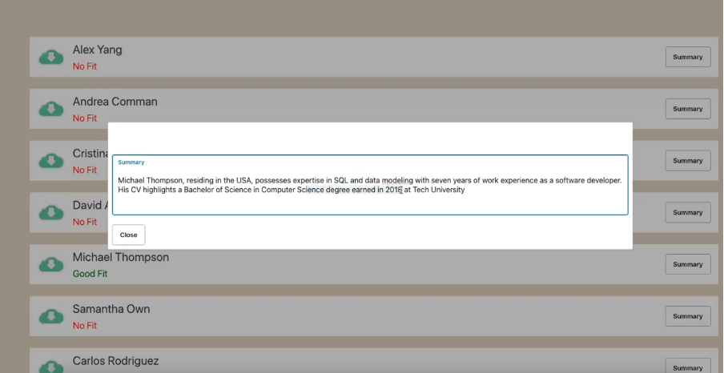</img>

A Supplier Proposal Evaluation App as part of a vendor bid.

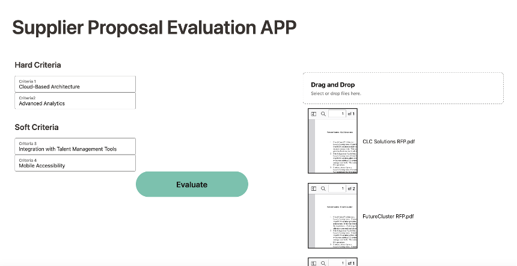</img>
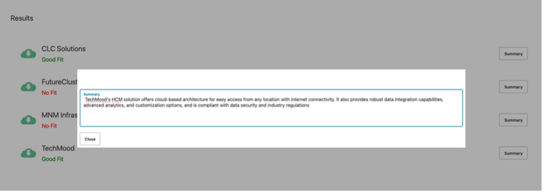</img>

In this article we will use as a case study: **"CV Evaluation APP"**

# Prerequisites

Before getting started, make sure you have access to the following Oracle Cloud Infrastructure (OCI) services:

- Oracle Generative AI Service (GenAI)
- Oracle Document Understanding Service 
- Oracle Integration Cloud (OIC) with Visual Builder(VBCS) enabled
- Oracle Object Storage 

# Solution Architecture

In this section, we'll dive into the building blocks of the solution architecture.
</img>

We've built the application using Oracle Visual Builder (as part of OIC), and it smoothly runs through Oracle Integration Cloud  as the main, low-code orchestration tool. OCI Document Understanding is there to handle the document processing, and Generative AI Multi-Chain Prompt technique for extracting key information from these CVs, summarizing them, and helping to facilitate the decision-making process:

1. Document Evaluation Tool App interface built using VBCS:

- The “CV Evaluation App” discussed in this context is crafted within the VBCS platform. Oracle Visual Builder Cloud Service serves as a hosted environment for building your application development infrastructure. It offers an open-source, standards-based development service for creating, collaborating on, and deploying applications within the Oracle Cloud. 

2. Document Processing with OCI Document Understanding.:
- The role of OCI Document Understanding is to extract content from document images and other document file types, as CVs can be in different formats.
- The service employs machine learning and optical character recognition capabilities(OCR) to analyze and extract information from various types of documents.

3. Key Criteria Extraction using OCI Generative AI Service:
- The extracted CV data from Document Understanding is sent to the OCI Generative AI Service to perform the following two tasks: CV Summarization and evaluation criteria extraction. This action is performed via one single prompt, which we will later explore in the section “Prompting with Oracle Generative AI”.

4. Integration and orchestration using OIC:
- Oracle Integration Cloud adopts a low-code approach, allowing the creation of integrations and workflows with minimal coding effort and this accelerates the development process. OIC includes monitoring and analytics tools that provide real-time visibility into integration flows. This helps to track performance, identify bottlenecks, and change and optimize LLM integration flows like the one we are exploring here.

5. Document Evaluation using Generative AI:
- The decision-making process could be facilitated in this case with the help of Oracle Generative AI. We are using prompting techniques to help recruiters with useful information that they can use in the decision-making process.

# Application Flow in Detail

In this application:

**Step1.** The File Picker action in VBCS allows the Recruiter to upload all the CVs.

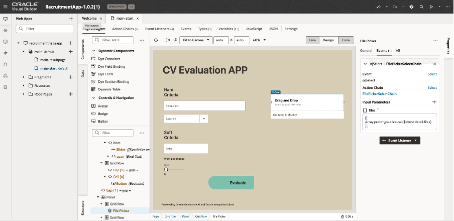</img>

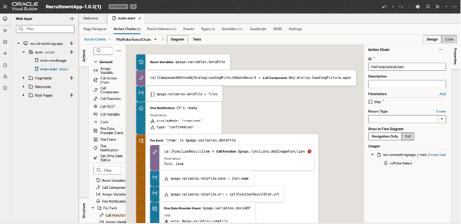</img>

**Step2.** Evaluator select hard and soft criteria(input fields) from a predifined list.

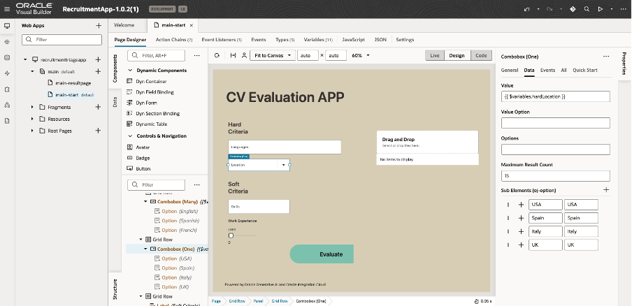</img>

**Step3.** Evaluator press the button “Evaluate”

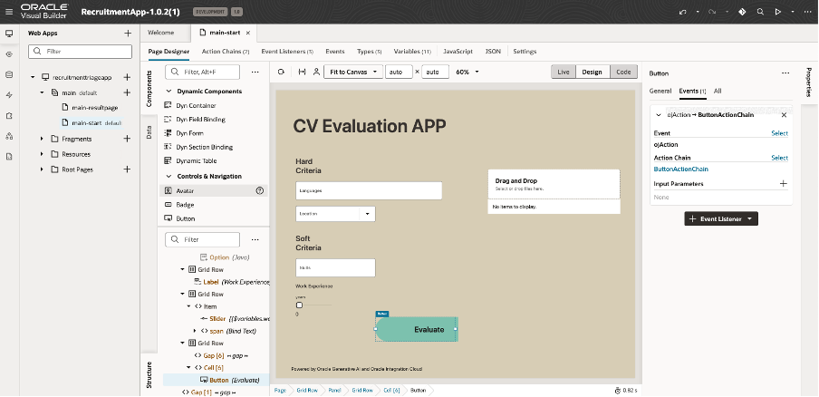</img>
</img>

**Step4.** After pressing the button “Evaluate”, each CV is processed via  Document Understanding, triggering the **OIC Data Loader Low-Code Child Integration Flow** (CVs Data Extraction with Document Understanding REST API)

</img>
</img>
</img>
</img>
</img>
</img>

**Step5.** At this step, using Generative AI the summary of the CV is created, and also evaluation criteria are extracted, triggering the **OIC Query Engine Low-Code Parent Integration Flow** (CV Summary Generation and Evaluation Criteria extraction with Generative AI Inference REST API).

</img>
</img>
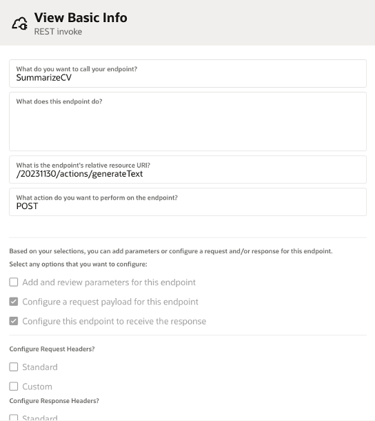</img>
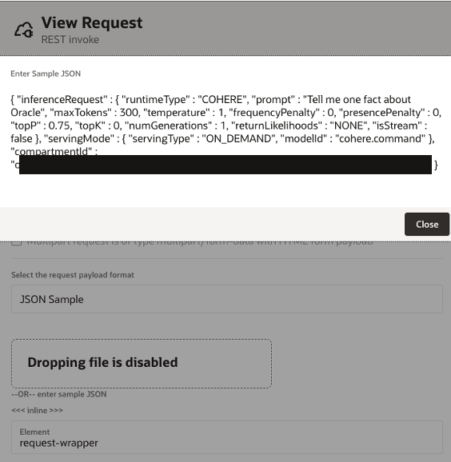</img>
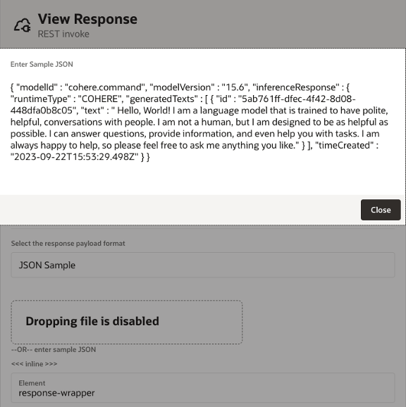</img>
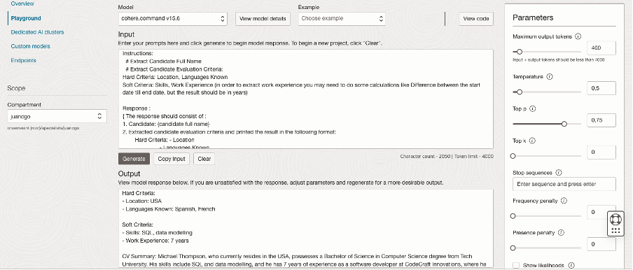</img>

**Step6.** Decision logic together with Evaluator Criteria and Extracted Criteria from the Candidate CV are sent to  Generative AI Inference REST API, to obtain one of the responses “Good Fit”/ “No Fit” 

</img>
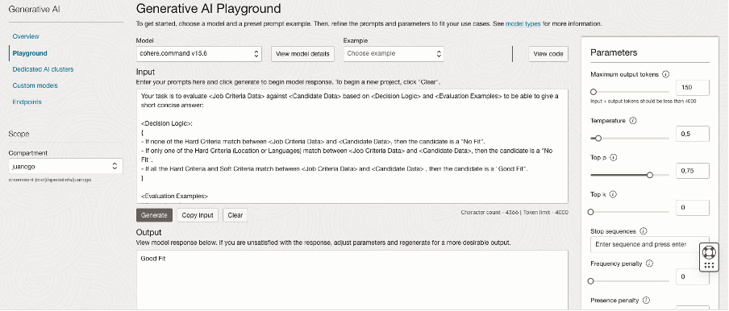</img>

**Step7.** The list of all candidates is shown on the screen together with the response if the candidate is a good fit or not. Also, a summary of each CV is available.

</img>

# Prompting with Oracle Generative AI

In the following CV Evaluation APP use case we are using a Generative AI Multi-Chain Prompting technique to get the results. It consists of 2 prompts:

**Important Note:** 
**All examples and data presented in this article are purely fictive and for showcasing purposes only. Any resemblance to real persons, or actual companies is purely coincidental. Dummy users and entities have been created for this demo, and no real data or information about individuals or organizations is being disclosed. We prioritize privacy and ethical considerations in the presentation of information, and any similarities to real-world entities are unintentional.**

## Prompt 1: Summarization and Key Criteria Extraction

To extract the right skills from the CV that match the Evaluator input, we have created a prompt in a Zero-shot technique, where we explicitly mention the output we need to gather out of the document:

</img>

Please access the full prompt <a href="./images/CVEvaluationAppPrompts.pdf">here</a>

## Prompt 2: Final candidate skills evaluation

To evaluate all the CVs, a single prompt was built using two combined techniques: **Few-shot Prompting** and **Chain-of-Thought Prompting**.

</img>

Please access the full prompt <a href="./images/CVEvaluationAppPrompts.pdf">here</a>

# Code
      VBCS app - RecruitmentApp-1.0.zip
      OIC CV Summary Generation and Evaluation Criteria extraction Parent Integration Flow - CV_JOB_MATCH_FINDER_01.00.0000.iar
      OIC CVs Data Extraction Child Integration Flow - AIDOCUMENTPROCESSING_01.00.0000.iar
      Generative AI Prompts: CVEvaluationAppPrompts.pdf
      CV Samples - cv_samples folder

Please find the **document_evaluation_app_resources.zip** archive in <a href="./document_evaluation_app_resources.zip">/files/document_evaluation_app_resources.zip</a>

# Conclusion

In conclusion,  using Oracle Generative AI, OCI Document Understanding, and Oracle Integration Cloud (OIC)  you may build a nice solution that may  sort and help in evaluating documents across various industries and departments. Its adaptability and ease of use can become a handy tool for streamlining document management processes, saving time, and helping enhance productivity across a wide range of business scenarios.

### Authors

<a href="https://github.com/jcgocol">@jcgocol</a>, <a href="https://github.com/clemnaru">@clemnaru</a>

# License
 
Copyright (c) 2024 Oracle and/or its affiliates.
 
Licensed under the Universal Permissive License (UPL), Version 1.0.
 
See [LICENSE](https://github.com/oracle-devrel/technology-engineering/blob/main/LICENSE) for more details.
	
