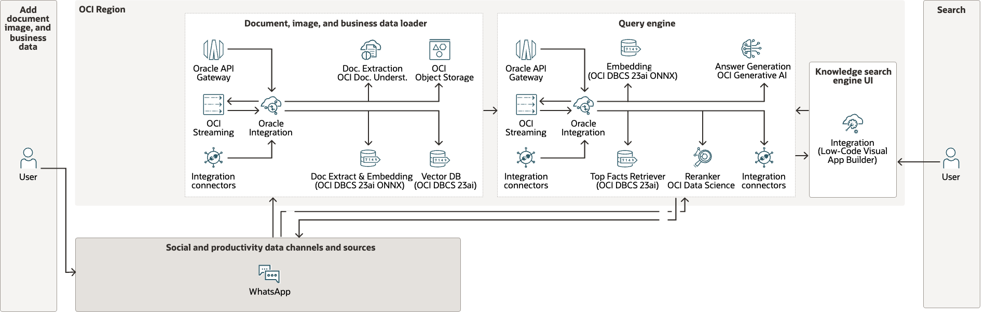
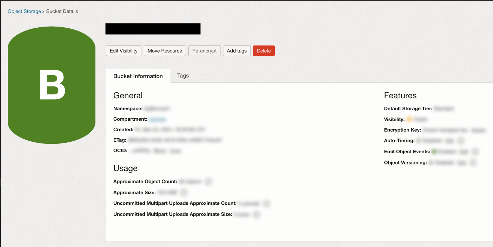

# Low Code Modular RAG-based Knowledge Search Engine using OCI Generative AI, OCI Vector Search, and Oracle Integration Cloud

Reviewed: 30.05.2024

# Introduction

In this article, we'll explore how to enable an enterprise-grade RAG-based Knowledge Search Engine with a low-code approach.

You’ll learn how to use Oracle Integration Cloud to integrate and orchestrate business chanels like a Web Application built in Oracle Visual Builder, productivity channels like OCI Object Storage, local large and small language models (LLMs), and vector databases to ingest live data into the RAG-based Knowledge Search Engine store. 

You'll use Oracle Cloud Infrastructure (OCI) Document Understanding to extract information from different document types. Leverage OCI Generative AI for document summarization, generation and synthesis of answers to questions on documents. Use OCI DB Cloud Service 23AI for Document Extraction, Vector Search and Embedding (using ONNX local models to the DB) capabilities , and apply local OCI Data Science models for better answers from advanced RAG.

</img>
</img>

# Prerequisites

Before getting started, make sure you have access to the following Oracle Cloud Infrastructure (OCI) services:

- OCI Generative AI Service (GenAI)
- OCI Document Understanding Service 
- Oracle Integration Cloud (OIC) with Visual Builder(VBCS) enabled
- OCI Object Storage 
- OCI Base Database Cloud Service (23ai) 
- OCI Data Science

And also, make sure you have access to the following Meta services:

- Whats App Business Account

# Solution Architecture

In this section, we'll dive into the building blocks of the solution architecture.
</img>

We've built the application using Oracle Visual Builder (as part of OIC), and it smoothly runs through Oracle Integration Cloud  as the main, low-code orchestration tool. OCI Document Understanding is there to handle the document extraction, OCI Base Database Cloud Service 23ai for document extraction, local embeddings using onnx models within Oracle 23ai, Generative AI for answer synthesis and OCI Data Science as the Reranker model for advance RAG:

1. A low-code or no-code approach for the Data Loader and Query Engine flows of your LLM Application with Oracle Integration visual orchestration tools and native adapters for different Social, Productivity and Business Data Channels (users input to the LLM App Engine, either documents, images, business data or queries) and Sources (source of the data used by the LLM App Engine), as well as native adapters to the different OCI Services used by the LLM App Engine (OCI Generative AI REST APIs, Vector Databases or Stores, Oracle Cloud Infrastructure Language REST APIs, Oracle Cloud Infrastructure Data Science Custom Model REST Endpoints and more). This helps to quickly set up your LLM Application Business Flows 

2. An event-driven pattern to decouple the Document, Image and Business Data Channels and Sources as well as the Query Channels from the Data Loader and Query Engine modules of the LLM App Engine using the OCI Streaming Service (Oracle managed Kafka Service) and the native adapter we have for this OCI Service in Oracle Integration. This helps to enable a scalable and performant LLM application.

3. A private connection to 3rd party cloud, on-premises apps, systems, and so on, using the Oracle Integration Connectivity Agent, which is the key enabler for hybrid and multicloud integration architectures, specially in an LLM Application where documents, images, business data, query from users can come from those systems and you want to keep the transit for documents and data private and secured. This helps to improve the security of the end-to-end LLM Flow, keeping the traffic within private networks.

4. The possibility to use local LLM models within Oracle 23ai in OCI Base Database Cloud service and dedicate cluster for OCI Generative AI service (orchestrating OCI Base Database Cloud service 23ai ONNX models, OCI Generative AI Model Endpoints or OCI Data Science Model Endpoints using Oracle Integration cloud native adapters and with the connectivity agent for private models).

5. A flexible approach to plug or unplug your own User Interface (UI) for your LLM Application with the LLM APP Engine (in this case whatsapp for uploading documents), or a low-code approach to build the UI either using Visual App Builder under Oracle Integration (using Visual Builder Web App for the Q&A UI)


# Application Flow in Detail

Step by step to set up this application:

***Data Loader Flow Setup***

**Step1.** The WhatsApp Business API delivers WhatsApp message notifications (webhooks) that let you watch for changes to a WhatsApp Business Account, as well as read and write WhatsApp messages. You configure the API in the Facebook (Meta) Developers website associated with your WhatsApp Business Account.

In this step, we are configuring a **sandbox WhatsApp application**. Do the following:

1. Go to the Facebook Developers website (https://developers.facebook.com) and log in with your Facebook account.

2. Click on the "Get Started" button and select "Create App".

</img>

3. Choose "Business" as the app type and then click "Next".

4. Choose a name for your application, inform the contact email and if the sandbox configuration is already ready, select the business account (this is an optional step. If you do not have this account set up, use 7 - "Create a Business Account" below) and then click on "Create app" as shown in the image below.

</img>

5. Click "Set Up" under "WhatsApp".

</img>

6. In the "WhatsApp Business Account" section, click "Add".

7. If you don't have a Business Account already set up, click on "Create a Business Account" and the "Getting Started" screen will appear. In this screen, you need to get the **Temporary Access Token** information. 
You will need this token to configure the Oracle Integration Cloud flows that get the data from WhatsApp Messages later, so please store it in a temporary file. 
This temporary access token is valid for 24 hours, so in testing, you may have to update this information in your code, or you can opt for a permanent token going to facebook developers website Tools section and following the instructions there.

</img>

8. Add a recipient (To) phone number as above and verify it with the code which WhatsApp will send on the number.

9. Click on “Send Message”, for testing and getting the messages on the "Phone Number" mentioned in the sandbox page. Test the flow with the API which is given and see how messages are flowing from test number to the recipient number.

</img>

You can also test the APIs via Postman. In this step it is important that you store two pieces of information in your temporary file. You will need them later in the code setup. This information is: the **API version** (in the image below, you can see that we are using v16.0) and the **phone ID**. This information can be obtained from the same URL, right after the API version.

</img>

10. Scroll down until “Step 3: Configure webhooks to receive messages” and click on Configure webhooks.

</img>

11. Click "Edit" and set your Callback URL with **“https://<your_oci_apigateway_hostname>/message/whatsapp”** and enter a verification token of your choice (this is optional, if you want to verifiy if the request comes from WhatsApp Business API and not from somewhere else).
We will set up the OCI API Gateway WhatsApp Notification Callback URL for this application later in **Step2**.

</img>

12. On Webhook fields area click on “Manage”

</img>

13. Click on “Subscribe” for business_capability_update, **messages**, phone_number_name_update and security options, as below. Save the “Subscription Version” as you will need it to configure your Oracle Integration Cloud flows later.

</img>


**Step2.** The WhatsApp Business API allows you subscribe to changes from WhatsApp Business Account, receiving notifications via webhooks. 

A **Callback URL** is needed to be able to receive notifications of those changes, so we use an OCI API Gateway deployment endpoint URL to receive those WhatsApp Business Account notifications.

For this purpose, the OCI API Gateway Deployment endpoint has 1 route with 2 methods: **GET** to receive the request from WhatsApp Business API to verify if the Callback URL is valid and **POST** to receive the WhatsApp Business Account notifications in near real-time, route which in turn triggers the **OIC RestWhatsApp2OCIStreaming Low-Code Integration Flow**.

In this step, we are configuring the **OCI API Gateway deployment Whatsapp Callback URL**. Do the following:

</img>

</img>

</img>

</img>

</img>


**Step3.** For the purpose of this Low-Code RAG-based Knowledge Search Engine, we are using Whatsapp as the Document/Image source channel, so every time an Admin User uploads a new document/image and sends it to your WhatsApp Business Account, a change notification is sent to the OCI API Gateway Callback URL, triggering the **OIC RestWhatsApp2OCIStreaming Low-Code Integration Flow**, which in turn sends the document/image to an OCI Streaming Kafka Topic for further processing.

</img>

In this step, we are configuring the **OIC RestWhatsApp2OCIStreaming Low-Code Integration Flow**:

</img>

 Perform the following setup in **Oracle Integration Cloud Console**:

 1. Import the **RESTWHATSAPP2OCISTREAMING_01.00.0000.iar** integration flow into your Oracle Integration Cloud instance.

 </img>

 2. Go to **Connections**, search for **RestTrigger** Connection, click on it, click on **Test** and then **Save** the Connection. The Connection should look like this: 

 </img>

3. Go to your **Oracle Cloud Infrastructure (OCI) Console** and create a new Stream (Oracle-managed Kafka Topic) with the name **"WhatsAppStream"** under the **Streaming** Service (**for more information on how to create a new Stream click [here](https://docs.oracle.com/en-us/iaas/Content/Streaming/Tasks/creatingstreamsandstreampools_create-stream.htm))**. The WhatsApp Stream should look like this:

 </img>

4. Come back to your **Oracle Integration Cloud Console**, go to **Connections**, search for **C34_08_04** Connection, click on it and fill out the connection fields with the details of the **OCI Stream Pool** associated with the **"WhatsAppStream"** Stream that you created before (**for more information on how to fill out the fields of a connection to OCI Streaming in Oracle Integration Cloud click [here](https://docs.oracle.com/en/cloud/paas/application-integration/stream-service-adapter/prerequisites-creating-connection.html))**.
Then click on **Test** and then **Save** the Connection. The Connection should look like this: 

</img>

5. Go to **Integrations**, search for **RestWhatsApp2OCIStreaming** Integration, move your mouse over the right side of the integration and then click on the **"Activate"** icon. The Integration should look like this:

</img>


**Step4.** After receiving the WhatsApp Business Account notification into the **"WhatsAppStream"** Kafka Topic, the **OIC WhatsAppStream2ObjectStorage Low-Code Parent Integration Flow** is triggered. 

The new WhatsApp Business change notification comes with the WhatsApp Message type and Media Id, which are then used to get either the document/image file, via the WhatsApp Business API. 

In this step, we are configuring the **OIC WhatsAppStream2ObjectStorage Low-Code Parent Integration Flow**:

</img>

Perform the following setup in **Oracle Integration Cloud Console**:

 1. Import the **WHATSA_TO_RAGDAT_TO_RAGQUE_01.00.0000.iar** integration flow into your Oracle Integration Cloud instance.

 </img>

 2. Go to **Connections**, search for **C67_08_04** Connection, click on it, fill out the connection fields with the details of the WhatsApp Business API you configured in **Step1** before. 
 Then click on **Test** and then **Save** the Connection. The Connection should look like this: 

 </img>

3. Go to **Connections**, search for **C138_08_04** Connection, click on it and fill out the connection fields with the details of the WhatsApp Business Download API (Connection URL field should be **"https://lookaside.fbsbx.com"**).
Then click on **Test** and then **Save** the Connection. The Connection should look like this: 

 </img>

 4. Go to **Connections**, search for **C137_08_04** Connection, click on it and fill out the connection fields with the details of your Oracle Integration Cloud Instance IDCS App (Connection URL field should be **"https://<your_oracle_integration_cloud_hostname>/ic/api/integration/v1/flows/rest/RESTUPLOADDOCUMENT2OBJECTSTORAGE/1.0"**). 
Then click on **Test** and then **Save** the Connection. The Connection should look like this: 

 </img>

5. Go to **Integrations**, search for **WhatsAppStream2ObjectStorage** Integration, move your mouse over the right side of the integration and then click on the **"Activate"** icon. The Integration should look like this:

</img>

6. Go to **Lookups**, search for **WhatsAppParameters**, copy the WhatsApp Application **Temporary Access Token** (or permanent access token of you opted for a permanent one) that you saved in **Step1** before, and then paste it into the Param_value associated with Param_name **"access_token"**, replacing the default value it has. Then click on **Save**.
The Lookup should look like this:

</img>

**Step5.** At this step, each new document/image is uploaded to OCI Object Storage for further AI-based processing, triggering the **OIC RestUploadDocument2ObjectStorage Low-Code Child Integration Flow** (WhatsApp Document/Image Upload with OCI Object Storage REST API).

In this step, we are configuring the **OIC RestUploadDocument2ObjectStorage Low-Code Child Integration Flow**:

</img>

Perform the following setup in **Oracle Integration Cloud Console**:

1. Import the **RESTUPLOADDOCUMENT2OBJECTSTORAGE_01.00.0000.iar** integration flow into your Oracle Integration Cloud instance.

 </img>

 2. Go to your **Oracle Cloud Infrastructure (OCI) Console** and create a new **Bucket** under the **Object Storage** Service with a **name**, set the **visibility** of the bucket (**for testing purposes you can set the visibility of the bucket to Public**, but the best practice is to set Private visibility and enable Pre-Authenticated Requests for users to be able to visualize documents within the Visual Builder UI for the Low-Code & RAG-based Knowledge Search Engine), and enable **Emit Object Events** for the bucket (**for more information on how to create a new Bucket click [here](https://docs.oracle.com/en-us/iaas/Content/Object/Tasks/managingbuckets_topic-To_create_a_bucket.htm))**. 
 You will need the **Bucket Name** and the **Bucket Namespace** to configure the Oracle Integration Cloud flows that uploads documents/images from WhatsApp Messages into OCI Object Storage later, so please store both in a temporary file.
 The **Search Bucket** should look like this:

      </img>

3. Come back to your **Oracle Integration Cloud Console**, go to **Connections**, search for **RestObjectStorage** Connection, click on it and fill out the connection fields with the details of the **OCI Object Storage Bucket** that you created before (**for more information on how to fill out the fields of a connection to OCI Object Storage in Oracle Integration Cloud using OCI Signature V1 as the security policy click [here](https://docs.oracle.com/en/cloud/paas/application-integration/rest-adapter/prerequisites-creating-connection.html#GUID-3AD30504-4B87-4954-B870-BA7078B2738B__GUID-B15F3CE8-F3A6-4C14-B6A6-F55064755D6E))**.
Then click on **Test** and then **Save** the Connection. The Connection should look like this: 

</img>

4. Go to **Integrations**, search for **RestUploadDocument2ObjectStorage** Integration, move your mouse over the right side of the integration and then click on the **"Activate"** icon. The Integration should look like this:

</img>

5. Go to **Lookups**, search for **ObjectStorageParameters**, copy your OCI Object Storage **Bucket Name** and **Bucket Namespace** that you saved in 2 before, and then paste them into the Param_value associated with Param_name **"bucket_name"** and into the Param_value associated with Param_name **"namespace_name"** correspondingly, replacing the default value both parameters have. Then click on **Save**.
The Lookup should look like this:

</img>

**Step6.** After a new document/image is uploaded to OCI Object Storage, a **createobject/updateobject event** is raised, sending the metadata of the object/file as a JSON payload to an OCI Streaming Kafka Topic with name **"OOSStream"**.
After receiving the OCI Object Storage event notification into the **"OOSStream"** Kafka Topic, the **OIC ObjectStorage2RAGDataLoader Low-Code Parent Integration Flow** is triggered. 

The new OCI Object Storage Event notification comes with the Bucket's name and namespace as well as the object/file name, which are then used to get either the document/image file, via the OCI Object Storage API. 

In this step, we are configuring the **OIC ObjectStorage2RAGDataLoader Low-Code Parent Integration Flow**:

</img>

Perform the following setup in **Oracle Integration Cloud Console**:

 1. Import the **OBJECTSTORAGE2VECTORDB_01.00.0028.iar** integration flow into your Oracle Integration Cloud instance.

 </img>

 2. Go to your **Oracle Cloud Infrastructure (OCI) Console** and create a new Stream (Oracle-managed Kafka Topic) with the name **"OOSStream"** under the **Streaming** Service (**for more information on how to create a new Stream click [here](https://docs.oracle.com/en-us/iaas/Content/Streaming/Tasks/creatingstreamsandstreampools_create-stream.htm)**). The **OOSStream** Stream should look like this:

      </img>

      Then go to your **Oracle Cloud Infrastructure (OCI) Console** and create a new **Rule** under the **Events** Service with a **name**, set the **Event Rule Conditions** for the **OCI Object Storage Bucket** that was created before including **Object - Create, Object - Delete & Object - Update** event types, and **bucketName = <your_oci_bucket>** event condition, and finally set the action including **Streaming** as the action type, **Stream Compartment = <your_oci_compartment_name>** and **"OOSStream"** as the target stream. 
      This will allow **OCI Object Storage** to send the metadata of files created, uploaded or deleted in/to/from your **input bucket** to **OCI Streaming OOSStream**.

      </img>

 3. Come back to your **Oracle Integration Cloud Console**, go to **Connections**, search for **StreamInputBucket** Connection, click on it and fill out the connection fields with the details of the **OCI Stream Pool** associated with the **"OOSStream"** Stream that you created before (**for more information on how to fill out the fields of a connection to OCI Streaming in Oracle Integration Cloud click [here](https://docs.oracle.com/en/cloud/paas/application-integration/stream-service-adapter/prerequisites-creating-connection.html))**.
Then click on **Test** and then **Save** the Connection. The Connection should look like this: 

</img>

**Step7.** At this step, the **OIC RestObjectStorage2OCIVectorSearch Low-Code Child Integration Flow** (Document/Image Upload with the OCI Base Database Cloud service 23ai native adapter in Oracle Integration Cloud ) is triggered. In this demo asset, this happens if you choose to use **OCI Base Database Cloud service 23ai Vector Search Document Text Extraction capabilities** for docx and pdf document formats (**for more information on additional document formats available in Oracle 23ai click [here](https://docs.oracle.com/en/database/oracle/oracle-database/23/ccref/oracle-text-supported-document-formats.html#GUID-163096EB-9E82-4939-91C1-3047FBDB6482)**).

Within this flow, each new document/image is retrieved from the **OCI Object Storage Bucket** you created in **Step5**, then it's content and metadata is uploaded to an OCI Base Database Cloud service 23ai Vector DB's **"MY_DOCUMENT_FILES"** table, then it's data is summarized and the **"MY_DOCUMENT_FILES"** table is updated, and finally the document/image content is extracted, splitted by chunks, embedded (**using a small and local embedding model imported into OCI Vector DB as an ONNX Model**) and stored into an OCI Base Database Cloud service 23ai Vector DB's **"MY_DOCUMENTS"** table.
If the document already existed, then both tables are updated.

In this step, we are configuring the **OIC RestObjectStorage2OCIVectorSearch Low-Code Child Integration Flow**:

</img>
</img>
</img>
</img>

Perform the following setup in **Oracle Integration Cloud Console**:

1. Import the **RESTOBJECTSTORAGE2OCIVECTORSEARC_01.00.0000.iar** integration flow into your Oracle Integration Cloud instance.

   </img>

2. Go to your **Oracle Cloud Infrastructure (OCI) Console** and create a new DB System with **23ai** as database version under the **Oracle Base Database** Service (**for more information on how to create an Oracle Database 23ai on OCI Base Database Service click [here](https://youtu.be/9F4RbnXCXeM?si=zcafFX7nbHiFq6Hy)**). 
In our case, this is an **Oracle Base Database 23ai** deployed within a private OCI subnet, but for testing purposes you can deploy it within a public one if you wish.
The **OCI Base Database Service 23ai** should look like this:
 </img>
    Then, perform the following steps:

    - Connect to your **Oracle Base Database 23ai DB System VM** via ssh and execute the following commands:
        ```console
        $ ssh -i <your_ssh_key_name>.pem opc@<your_oci_base_db_23ai_host>
        $ sudo su - oracle
        $ . oraenv
        ORACLE_SID = [<your_oci_base_db_23ai_sid>] ? --> press enter
        The Oracle base has been set to /u01/app/oracle
     - Connect to sqlplus as **sysdba** and execute the following commands:
        ```console
        $ sqlplus / as sysdba
        SQL> show parameter SGA_
        NAME				     TYPE	 VALUE
        ------------------------------------ ----------- ------------------------------
        sga_max_size			     big integer 14848M
        sga_min_size			     big integer 0
        sga_target			     big integer 14848M

        SQL> show parameter VECTOR_MEMORY_SIZE
        NAME				     TYPE	 VALUE
        ------------------------------------ ----------- ------------------------------
        vector_memory_size		     big integer 0 

        SQL> alter system set VECTOR_MEMORY_SIZE = 7000M scope=spfile;
        System altered.

        SQL> shutdown immediate 
        Database closed.
        Database dismounted.
        ORACLE instance shut down.

        SQL> startup
        ORACLE instance started.

        Total System Global Area 1.5545E+10 bytes
        Fixed Size		    5378360 bytes
        Variable Size		 1375731712 bytes
        Database Buffers	 6677331968 bytes
        Redo Buffers		  138514432 bytes
        Vector Memory Area	 7348420608 bytes
        Database mounted.
        Database opened.

        SQL> show parameter VECTOR_MEMORY_SIZE
        NAME				     TYPE	 VALUE
        ------------------------------------ ----------- ------------------------------
        vector_memory_size		     big integer 7008M

        SQL> show pdbs
            CON_ID CON_NAME			  OPEN MODE  RESTRICTED
        ---------- ------------------------------ ---------- ----------
                 2 PDB$SEED			  READ ONLY  NO
                 3 YOURPDB	                  READ WRITE NO

        SQL> alter pluggable database all open;
        Pluggable database altered.

        SQL> alter session set container=YOURPDB;
        Session altered.

        SQL> show parameter VECTOR_MEMORY_SIZE
        NAME				     TYPE	 VALUE
        ------------------------------------ ----------- ------------------------------
        vector_memory_size		     big integer 7008M

        SQL> exit
        Disconnected from Oracle Database 23ai Enterprise Edition Release 23.0.0.0.0 - Production
        Version 23.4.0.24.05
     - Export **OML4Py ONNX embedding models** :
        ```console
        $ sudo su - oracle
        $ . oraenv
        ORACLE_SID = [JCGVDB] ? --> press enter
        The Oracle base has been set to /u01/app/oracle

        $ cd $ORACLE_HOME/python
        $ export PYTHONHOME=$ORACLE_HOME/python
        $ export PATH=$PYTHONHOME/bin:$PATH
        $ export LD_LIBRARY_PATH=$PYTHONHOME/lib:$LD_LIBRARY_PATH
        $ python3 -m pip install --upgrade pip
        Requirement already satisfied: pip in ./lib/python3.12/site-packages (24.0)

        $ python3
        Python 3.12.1 (main, Feb  6 2024, 12:09:55) [GCC 8.5.0 20210514 (Red Hat 8.5.0-18.0.6)] on linux
        Type "help", "copyright", "credits" or "license" for more information.

        >>> import sys
        >>> print(sys.executable)
        /u01/app/oracle/product/23.0.0.0/dbhome_1/python/bin/python3
        >>> quit

        $ exit
        logout

        $ sudo yum install perl-Env libffi-devel openssl openssl-devel tk-devel xz-devel zlib-devel bzip2-devel readline-devel libuuid-devel ncurses-devel
        Complete

        $ sudo su - oracle
        $ . oraenv
        ORACLE_SID = [JCGVDB] ? --> press enter
        The Oracle base has been set to /u01/app/oracle

        $ cd $ORACLE_HOME/python
        $ export PYTHONHOME=$ORACLE_HOME/python
        $ export PATH=$PYTHONHOME/bin:$PATH
        $ export LD_LIBRARY_PATH=$PYTHONHOME/lib:$LD_LIBRARY_PATH
        $ rpm -qa perl-Env
        <<You should see an output here>>
        $ rpm -qa libffi-devel
        <<You should see an output here>>
        $ rpm -qa openssl
        <<You should see an output here>>
        $ rpm -qa openssl-devel
        <<You should see an output here>>
        $ rpm -qa tk-devel
        <<You should see an output here>>
        $ rpm -qa xz-devel
        <<You should see an output here>>
        $ rpm -qa zlib-devel
        <<You should see an output here>>
        $ rpm -qa bzip2-devel
        <<You should see an output here>>
        $ rpm -qa readline-devel
        <<You should see an output here>>
         $ rpm -qa libuuid-devel
        <<You should see an output here>>
        $ rpm -qa ncurses-devel
        <<You should see an output here>>

        $ cd bin
        $ pip3.12 install pandas==2.1.1
        <<You should see an output here after successfully installed the library>>
        $ pip3.12 install setuptools==68.0.0
        <<You should see an output here after successfully installed the library>>
        $ pip3.12 install scipy==1.12.0
        <<You should see an output here after successfully installed the library>>
        $ pip3.12 install matplotlib==3.7.3
        <<You should see an output here after successfully installed the library>>
        $ pip3.12 install oracledb==2.0.1
        <<You should see an output here after successfully installed the library>>
        $ pip3.12 install joblib==1.2.0
        <<You should see an output here after successfully installed the library>>
        $ pip3.12 install scikit-learn==1.4.2
        <<You should see an output here after successfully installed the library>>
        $ pip3.12 install numpy==1.26.4
        <<You should see an output here after successfully installed the library>>
        $ pip3.12 install onnxruntime==1.17.0
        <<You should see an output here after successfully installed the library>>
        $ pip3.12 install onnxruntime-extensions==0.10.1
        <<You should see an output here after successfully installed the library>>
        $ pip3.12 install onnx==1.16.0
        <<You should see an output here after successfully installed the library>>
        $ pip3.12 install --extra-index-url "https://download.pytorch.org/whl/cpu" torch==2.2.0+cpu
        <<You should see an output here after successfully installed the library>>
        $ pip3.12 install transformers==4.38.1
        <<You should see an output here after successfully installed the library>>
        $ pip3.12 install sentencepiece==0.2.0
        <<You should see an output here after successfully installed the library>>
        $ exit
        $ exit
     - Download and extract the **OML4Py client** installation file from **[here](https://www.oracle.com/technetwork/database/database-technologies/python/machine-learning-for-python/downloads/index.html)**, by accepting the licence agreement, selecting **Oracle Machine Learning for Python Downloads (v2.0)**, then selecting **Oracle Machine Learning for Python Client Install for Oracle Database on Linux 64 bit** and then saving the zip file to your desktop (to an accesible directory)
     - Transfer **oml4py-client-linux-x86_64-2.0.zip** file from your desktop to your Oracle Base Database 23ai DB System VM via ssh:
        ```console
        $ scp -i <your_ssh_key_name>.pem oml4py-client-linux-x86_64-2.0.zip opc@<your_oci_base_db_23ai_host>:/home/oracle
     - Connect again to your Oracle Base Database 23ai DB System VM via ssh and execute the following commands:
        ```console
        $ ssh -i <your_ssh_key_name>.pem opc@<your_oci_base_db_23ai_host>
        $ sudo su - oracle
        $ . oraenv
        ORACLE_SID = [<your_oci_base_db_23ai_sid>] ? --> press enter
        The Oracle base has been set to /u01/app/oracle

        $ cd $ORACLE_HOME
        $ mv oml4py-client-linux-x86_64-2.0.zip $ORACLE_HOME/python/bin
        $ cd $ORACLE_HOME/python/bin
        $ unzip oml4py-client-linux-x86_64-2.0.zip
        $ cd ..
        $ export PYTHONHOME=$ORACLE_HOME/python
        $ export PATH=$PYTHONHOME/bin:$PATH
        $ export LD_LIBRARY_PATH=$PYTHONHOME/lib:$LD_LIBRARY_PATH
        $ cd bin
        $ perl -Iclient client/client.pl
        Oracle Machine Learning for Python 2.0 Client.

        Copyright (c) 2018, 2024 Oracle and/or its affiliates. All rights reserved.
        Checking platform .................. Pass
        Checking Python .................... Pass
        Checking dependencies .............. /u01/app/oracle/product/23.0.0.0/dbhome_1/python/bin/check_deps.py:2: DeprecationWarning: pkg_resources is deprecated as an API. See https://setuptools.pypa.io/en/latest/pkg_resources.html
        from pkg_resources import WorkingSet, VersionConflict, DistributionNotFound
        Pass
        Checking OML4P version ............. Pass
        Current configuration
        Python Version ................... 3.12.1
        PYTHONHOME ....................... /u01/app/oracle/product/23.0.0.0/dbhome_1/python
        Existing OML4P module version .... None

        Operation ........................ Install/Upgrade

        Proceed? [yes]yes

        Processing ./client/oml-2.0-cp312-cp312-linux_x86_64.whl
        Installing collected packages: oml
        Successfully installed oml-2.0

        Done

        $ python3
        Python 3.12.1 (main, Feb  6 2024, 12:09:55) [GCC 8.5.0 20210514 (Red Hat 8.5.0-18.0.6)] on linux
        Type "help", "copyright", "credits" or "license" for more information.

        >>> import oml
        >>> oml.__path__
        ['/u01/app/oracle/product/23.0.0.0/dbhome_1/python/lib/python3.12/site-packages/oml']

        >>> from oml.utils import EmbeddingModel, EmbeddingModelConfig
        >>> em = EmbeddingModel(model_name="intfloat/multilingual-e5-small",settings={"cache_dir":"/tmp/.cache/OML"})
        >>> em.export2file("multie5smallembeddings",output_dir="/tmp")
        >>> quit()
     - Connect to sqlplus as **sysdba** and execute the following commands:
        ```console
        $ sqlplus / as sysdba
        SQL> CREATE TABLESPACE tbs1
             DATAFILE 'tbs5.dbf' SIZE 20G AUTOEXTEND ON
             EXTENT MANAGEMENT LOCAL
             SEGMENT SPACE MANAGEMENT AUTO;
        TABLESPACE TBS1 created.
         
        SQL> create user vector identified by <your_vector_user_password> DEFAULT TABLESPACE tbs1 quota unlimited on tbs1;
        User VECTOR created.

        SQL> grant connect to vector;
        Grant succeeded.
        
        SQL> grant resource to vector;
        Grant succeeded.
        
        SQL> grant DB_DEVELOPER_ROLE to vector;
        Grant succeeded.

        SQL> grant execute on dbms_vector to vector;
        Grant succeeded.

        SQL> grant CREATE CREDENTIAL to vector;
        Grant succeeded.

        SQL> create or replace directory VEC_DUMP as '/tmp/';
        Directory VEC_DUMP created.

        SQL> grant read, write on directory VEC_DUMP to vector;
        Grant succeeded.

        SQL> begin
                  dbms_network_acl_admin.append_host_ace(
                           host =>'*',
                           lower_port => 443,
                           upper_port => 443,
                           ace => xs$ace_type(
                           privilege_list => xs$name_list('http', 'http_proxy'),
                           principal_name => upper('VECTOR'),
                           principal_type => xs_acl.ptype_db)
                     );
              end;
        PL/SQL procedure successfully completed.
        
        SQL> exit
        Disconnected from Oracle Database 23ai Enterprise Edition Release 23.0.0.0.0 - Production
        Version 23.4.0.24.05
     - Connect to sqlplus as user **vector** and execute the following commands:
        ```console
        $ sqlplus vector/<your_vector_user_password>@<your_oci_base_database_pdb_connection_string>
        SQL*Plus: Release 23.0.0.0.0 - Production on Wed Jun 5 09:49:55 2024
        Version 23.4.0.24.05

        Copyright (c) 1982, 2024, Oracle.  All rights reserved.

        Last Successful login time: Wed Jun 05 2024 09:45:11 +00:00

        Connected to:
        Oracle Database 23ai Enterprise Edition Release 23.0.0.0.0 - Production
        Version 23.4.0.24.05

        SQL> EXECUTE dbms_vector.load_onnx_model('VEC_DUMP', 'multie5smallembeddings.onnx', 'multie5smallembeddings', JSON('{"function" : "embedding", "embeddingOutput" : "embedding" , "input": {"input": ["DATA"]}}'));
        PL/SQL procedure successfully completed.

        SQL> CREATE TABLE my_document_files (
               document_name  VARCHAR2(4000),
               document_data  BLOB,
               document_path  VARCHAR2(4000),
               document_summary VARCHAR2(4000),
               CONSTRAINT my_document_files_pk PRIMARY KEY (document_name)
            );
            COMMIT;
        Table MY_DOCUMENT_FILES created.

        Commit complete.
        
        SQL> CREATE TABLE my_documents (
               document_name  VARCHAR2(4000),
               chunk_id       NUMBER,
               chunk_data     VARCHAR2(4000),
               chunk_vector   VECTOR(384, *),
               document_path  VARCHAR2(4000),
               document_summary VARCHAR2(4000),
               CONSTRAINT my_documents_pk PRIMARY KEY (document_name, chunk_id)
            );
            COMMIT;
        Table MY_DOCUMENTS created.

        Commit complete.   

        SQL> CREATE VECTOR INDEX my_documents_vidx ON my_documents (chunk_vector) ORGANIZATION NEIGHBOR PARTITIONS
        DISTANCE COSINE 
        WITH TARGET ACCURACY 95;

        COMMIT;
        Vector INDEX created.

        Commit complete.

        SQL> declare
         jo json_object_t;
         begin
            jo := json_object_t();
            jo.put('user_ocid','<your_oci_user_ocid>');
            jo.put('tenancy_ocid','<your_oci_tenancy_ocid>');
            jo.put('compartment_ocid','<your_oci_compartment>');
            jo.put('private_key','<your_oci_user_private_api_key>');
            jo.put('fingerprint','<your_oci_user_api_key_fingerprint>');
            dbms_vector.create_credential(
               credential_name   => '23ai_genai',
               params            => json(jo.to_string)
            );
         end;
        PL/SQL procedure successfully completed.

        SQL> exit
        Disconnected from Oracle Database 23ai Enterprise Edition Release 23.0.0.0.0 - Production
        Version 23.4.0.24.05
        
        $ exit
3. Come back to your **Oracle Integration Cloud Console**, go to **Connections**, search for **OCI DB Vector Search** Connection, click on it and fill out the connection fields with the details of the **OCI Base Database Service 23ai** that you created before (**for more information on how to fill out the fields of a connection to OCI Base Database Cloud Service in Oracle Integration Cloud click [here](https://docs.oracle.com/en/cloud/paas/application-integration/dbaas-adapter/create-connection.html#GUID-10DBB72D-F6F9-4851-B2BA-9E593CF65F2E)**).
As mentioned before, in our case, we created an **Oracle Base Database 23ai** deployed within a private OCI subnet, so that's why we are using the Oracle Integration Cloud Connectivity Agent as the **Access Type** in the connection to our private **Oracle Base Database 23ai** (**for more information on how to install the OIC Connectivity Agent and associate it with a connection [here](https://docs.oracle.com/en/cloud/paas/application-integration/dbaas-adapter/prerequisites-creating-connection.html#GUID-64745056-BFCA-4AA6-A8EB-39C96F877E91)**), but for testing purposes you can deploy the **Oracle Base Database 23ai** within a public subnet if you wish, and in this case you wouldn't need to associate an **Oracle Integration Cloud Connectivity Agent** to this Connection, just set up the **Host** as the OCI Base Database hostname and Access Type** as **Public gateway**.
Then click on **Test** and then **Save** the Connection. The Connection should look similar to this: 

   </img>
   
**Step8.** At this step, the **OIC RestGenerativeAISummarization Low-Code Child Integration Flow** (Document/Image Summarization via **DBMS_VECTOR_CHAIN.UTL_TO_SUMMARY** in OCI Base Database Cloud service 23ai using OCI DBCS native adapter in Oracle Integration Cloud or Text Summarization via **OCI Generative AI Summarization REST API** using a REST adapter in Oracle Integration Cloud in our case) is triggered. 

If it is Document/Image Summarization and If the **Summary Model Method** is via **oci_vector_search**, then each new document/image is retrieved from the OCI Base Database Cloud service 23ai Vector DB's **"MY_DOCUMENT_FILES"** table that you created in **Step7**,  and then it's data is summarized using the **DBMS_VECTOR_CHAIN.UTL_TO_SUMMARY** in OCI Base Database Cloud service 23ai.

If it is Text Summarization and if the **Summary Model Method** is via **oci_generative_ai**, then each new text is summarized using **OCI Generative AI Summarization REST API**.

You can add additional Text and Document/Image Summarization options as this is a modular RAG-based Knowledge Search Engine.

In this step, we are configuring the **OIC RestGenerativeAISummarization Low-Code Child Integration Flow**:

</img>

1. Import the **RESTGENERATIVEAISUMMARIZATION_01.00.0000.iar** integration flow into your Oracle Integration Cloud instance.

   </img>

2. Go to **Connections**, search for **RestGenerativeAI** Connection, click on it and fill out the connection fields with the details of your OCI Tenancy and User (**for more information on how to fill out the fields of a connection to OCI REST API in Oracle Integration Cloud using OCI Signature V1 as the security policy click [here](https://docs.oracle.com/en/cloud/paas/application-integration/rest-adapter/prerequisites-creating-connection.html#GUID-3AD30504-4B87-4954-B870-BA7078B2738B__GUID-B15F3CE8-F3A6-4C14-B6A6-F55064755D6E))**.
Then click on **Test** and then **Save** the Connection. The Connection should look like this: 

   </img>

3. Go to **Integrations**, search for **RestGenerativeAISummarization** Integration, move your mouse over the right side of the integration and then click on the **"Activate"** icon. The Integration should look like this:

   </img>

4. Go to **Lookups**, search for **SummarizationParameters**, copy your **OCI Compartment OCID** and then paste it into the Param_value associated with Param_name **"oci_compartment_ocid"**, replacing the default value the parameter has. Then click on **Save**.
The Lookup should look like this:

</img>

**Step9.** At this step, the **OIC RESTDeleteFromVectorDB Low-Code Child Integration Flow** (Delete Document/Image Chunks from OCI Base Database Cloud service 23ai Vector Search using OCI DBCS native adapter in Oracle Integration Cloud in our case or via other Vector DBs' REST APIs using REST Connector in Oracle Integration Cloud if you are using another vector DB) is triggered. 

If the Vector DB is **OCI Base Database Cloud service 23ai Vector DB**, then all the data chunks for the given document/image path are deleted from the OCI Base Database Cloud service 23ai Vector DB's **"MY_DOCUMENTS"** table that you created in **Step7**.

You can add additional Vector DBs' delete operations as this is a modular RAG-based Knowledge Search Engine.

In this step, we are configuring the **OIC RESTDeleteFromVectorDB Low-Code Child Integration Flow**:

</img>

1. Import the **RESTDELETEFROMVECTORDB_01.00.0000.iar.00.0000.iar** integration flow into your Oracle Integration Cloud instance.

   </img>

2. Go to **Integrations**, search for **RESTDeleteFromVectorDB** Integration, move your mouse over the right side of the integration and then click on the **"Activate"** icon. The Integration should look like this:

   </img>

3. Go to **Integrations**, search for **RestObjectStorage2OCIVectorSearch** Integration, move your mouse over the right side of the integration and then click on the **"Activate"** icon. The Integration should look like this:

   </img>

4. Go to **Lookups**, search for **EmbeddingParameters**, copy your **OCI Compartment OCID** and then paste it into the Param_value associated with Param_name **"compartmentId"**, replacing the default value the parameter has. Then click on **Save**.
The Lookup should look like this:

   </img>

**Step10.** At this step, the **OIC RestDocumentUnderstanding2ObjectStorage Low-Code Child Integration Flow** (Document/Image Text Extraction with the OCI Document Understanding REST API using a REST adapter in Oracle Integration Cloud) is triggered. 

In this demo asset, this happens if you choose to use **OCI Document Understanding Text Extraction capabilities** for jpeg, png, pdf and tiff document formats (**for more information on additional document formats available in OCI Document Understanding click [here](https://docs.public.oneportal.content.oci.oraclecloud.com/en-us/iaas/Content/document-understanding/using/pretrained_doc_ai_models.htm#pretrained_doc_ai_models)**).

Within this flow, each new document/image with text is retrieved from the **OCI Object Storage Bucket** you created in **Step5**, then it's metadata is used to trigger an asynchronous Processor Job in **OCI Document Understanding**, which finally extracts the document/image content and put's the result in an output **OCI Object Storage Bucket**.

In this step, we are configuring the **OIC RestDocumentUnderstanding2ObjectStorage Low-Code Child Integration Flow**:

</img>

Perform the following setup in **Oracle Integration Cloud Console**:

1. Import the **RESTDOCUMENTUNDERSTANDINGOBJECTS_01.00.0000.iar** integration flow into your Oracle Integration Cloud instance.

   </img>

2. Go to **Connections**, search for **RestDocumentUnderstandingAI** Connection, click on it and fill out the connection fields with the details of your OCI Tenancy and User (**for more information on how to fill out the fields of a connection to OCI REST API in Oracle Integration Cloud using OCI Signature V1 as the security policy click [here](https://docs.oracle.com/en/cloud/paas/application-integration/rest-adapter/prerequisites-creating-connection.html#GUID-3AD30504-4B87-4954-B870-BA7078B2738B__GUID-B15F3CE8-F3A6-4C14-B6A6-F55064755D6E))**.
Then click on **Test** and then **Save** the Connection. The Connection should look like this: 

   </img>

3. Go to **Integrations**, search for **RestDocumentUnderstanding2ObjectStorage** Integration, move your mouse over the right side of the integration and then click on the **"Activate"** icon. The Integration should look like this:

   </img>

**Step11.** At this step, the **OIC RestVisionObjectStorage Low-Code Child Integration Flow** (Image Classification/Object Detection with the OCI Vision REST API using a REST adapter in Oracle Integration Cloud) is triggered. 

In this demo asset, this happens if you choose to use **OCI Vision Image Detection capabilities** for png an jpg image formats (**for more information on additional image formats available in OCI Vision click [here](https://docs.public.oneportal.content.oci.oraclecloud.com/en-us/iaas/Content/vision/using/pretrained_image_analysis_models.htm#pretrained_image_analysis_image_class)**).

Within this flow, each new image is retrieved from the **OCI Object Storage Bucket** you created in **Step5**, then it's metadata is used to call the Analyze Image operation in **OCI Vision**, which finally extracts the image's metadata and text.

In this step, we are configuring the **OIC RestVision2ObjectStorage Low-Code Child Integration Flow**:

</img>

Perform the following setup in **Oracle Integration Cloud Console**:

1. Import the **RESTVISIONOBJECTSTORAGE_01.00.0000.iar** integration flow into your Oracle Integration Cloud instance.

   </img>

2. Go to **Connections**, search for **RestVisionAI** Connection, click on it and fill out the connection fields with the details of your OCI Tenancy and User (**for more information on how to fill out the fields of a connection to OCI REST API in Oracle Integration Cloud using OCI Signature V1 as the security policy click [here](https://docs.oracle.com/en/cloud/paas/application-integration/rest-adapter/prerequisites-creating-connection.html#GUID-3AD30504-4B87-4954-B870-BA7078B2738B__GUID-B15F3CE8-F3A6-4C14-B6A6-F55064755D6E))**.
Then click on **Test** and then **Save** the Connection. The Connection should look like this: 

   </img>

3. Go to **Integrations**, search for **RestVision2ObjectStorage** Integration, move your mouse over the right side of the integration and then click on the **"Activate"** icon. The Integration should look like this:

   </img>   

**Step12.** At this step, the **OIC RestSpeech2ObjectStorage Low-Code Child Integration Flow** (Audio Transcription with the OCI Speech REST API using a REST adapter in Oracle Integration Cloud) is triggered. 

In this demo asset, this happens if you choose to use **OCI Speech Transcription capabilities** for mp4, mp3, m4a and wav audio formats (**for more information on additional audio formats available in OCI Speech click [here](https://docs.oracle.com/en-us/iaas/Content/speech/using/speech.htm)**).

Within this flow, each new audio file is retrieved from the **OCI Object Storage Bucket** you created in **Step5**, then it's metadata is used to trigger an asynchronous Transcription Job in **OCI Speech**, which finally extracts the audio content and put's the result in an output **OCI Object Storage Bucket**.

In this step, we are configuring the **OIC RestSpeech2ObjectStorage Low-Code Child Integration Flow**:

</img>

Perform the following setup in **Oracle Integration Cloud Console**:

1. Import the **RESTSPEECHOBJECTSTORAGE_01.00.0000.iar** integration flow into your Oracle Integration Cloud instance.

   </img>

2. Go to **Connections**, search for **RestSpeechAI** Connection, click on it and fill out the connection fields with the details of your OCI Tenancy and User (**for more information on how to fill out the fields of a connection to OCI REST API in Oracle Integration Cloud using OCI Signature V1 as the security policy click [here](https://docs.oracle.com/en/cloud/paas/application-integration/rest-adapter/prerequisites-creating-connection.html#GUID-3AD30504-4B87-4954-B870-BA7078B2738B__GUID-B15F3CE8-F3A6-4C14-B6A6-F55064755D6E))**.
Then click on **Test** and then **Save** the Connection. The Connection should look like this: 

   </img>

3. Go to **Integrations**, search for **RestSpeech2ObjectStorage** Integration, move your mouse over the right side of the integration and then click on the **"Activate"** icon. The Integration should look like this:

   </img>


**Step13.** At this step, the **OIC DocumentUnderstanding2PageText Low-Code Child Integration Flow** (Document/Image Text Extraction Result to Text utility in Oracle Integration Cloud) is triggered.

In this step, we are configuring the **OIC DocumentUnderstanding2PageText Low-Code Child Integration Flow**:

</img>

Perform the following setup in **Oracle Integration Cloud Console**:

1. Import the **DOCUMENTUNDERSTANDING2PAGETEXT_01.00.0000.iar** integration flow into your Oracle Integration Cloud instance.

   </img>

2. Go to **Integrations**, search for **DocumentUnderstanding2PageText** Integration, move your mouse over the right side of the integration and then click on the **"Activate"** icon. The Integration should look like this:

   </img>

**Step14.** At this step, the **OIC RestAddToVectorDB Low-Code Child Integration Flow** (Document/Image with Text Chunks Embedding and Upload with the OCI Base Database Cloud service 23ai native adapter in Oracle Integration Cloud ) is triggered. 

In this demo asset, this happens if you choose to use **OCI Base Database Cloud service 23ai Vector Search Text Embedding capabilities** to embed text strings (**for more information on how to perform text_to_embedding transformations in Oracle 23ai click [here](https://docs.oracle.com/en/database/oracle/oracle-database/23/vecse/convert-text-string-embedding.html)**). 
As this is a modular, RAG-based Knowledge Search Engine, you can opt for another way of embedding and another Vector DB.

Within this flow, each new text chunk is received, then it is embedded (**using a small and local embedding model imported into OCI Vector DB as an ONNX Model**), and finally the chunk embedding as well as its metadata are inserted into the OCI Base Database Cloud service 23ai Vector DB's **"MY_DOCUMENTS"** table, that you alaready created in **Step7** before.

In this step, we are configuring the **OIC RestAddToVectorDB Low-Code Child Integration Flow**:

</img>

Perform the following setup in **Oracle Integration Cloud Console**:

1. Import the **RESTADDTOVECTORDB_01.00.0000.iar** integration flow into your Oracle Integration Cloud instance.

   </img>

2. Go to **Integrations**, search for **RestAddToVectorDB** Integration, move your mouse over the right side of the integration and then click on the **"Activate"** icon. The Integration should look like this:

   </img>

3. Go to **Integrations**, search for **ObjectStorage2RAGDataLoader** Integration, move your mouse over the right side of the integration and then click on the **"Activate"** icon. The Integration should look like this:

   </img>

4. Go to **Lookups**, search for **EmbeddingParameters**, copy your **OCI Compartment OCID** and then paste it into the Param_value associated with Param_name **"compartmentId"**, replacing the default value the parameter has. Then click on **Save**.
The Lookup should look like this:

   </img>

This completes the setup of the **Data Loader** Parent Flow.

***Query Engine Flow Setup***

**Step1.** After a new **query** is received from a social, productivity ot business channel (**in our case we have an Oracle Integration Cloud's Visual Builder Web Application as the UI for the Low-Code Modular RAG-based Knowledge Search Engine**), the **OIC Rest2RAGQueryEngine Low-Code Parent Integration Flow** is triggered. 

The new query is sent to a **Retriever Child Integration Flow**, which performs **semantic search** on top of the Vector DB where we stored the indexed document/image/audio data (**in our case it is OCI Base Database Cloud Service 23ai Vector DB**) in order to get the most relevant data chunks to the input query. Then it goes through the **Reranker Child Integration Flow**, which reorder the relevancy of the chunks obtained from the **Retriever** and get the most semantically data chunks relevant to the query with a Reranker LLM Model (**in our case a private OCI Data Science Reranker**). Finally, the answer is sent to the **Synthesizer** together with the relevant context (reranked chunks) to provide a final synthesized response to the query channel using a LLM Model (**in our case Meta LLama-3-70b-instruct Model via OCI Generative AI**, but it could've been cohere-command-r-16k model via OCI Generative AI or other llm models via other deployment methods).

In this step, we are configuring the **OIC Rest2RAGQueryEngine Low-Code Parent Integration Flow**:

</img>

Perform the following setup in **Oracle Integration Cloud Console**:

 1. Import the **RESTOCIVECTORSEARCH_01.00.0000.iar** integration flow into your Oracle Integration Cloud instance.

      </img>

**Step2.** At this step, the **OIC RestRelevantContextRetrieval Low-Code Child Integration Flow** (Query Embedding via **VECTOR_EMBEDDING** and Document/Image/Audio Similarity Search via **VECTOR_DISTANCE** in OCI Base Database Cloud service 23ai using OCI DBCS native adapter in Oracle Integration Cloud in our case) is triggered. 

If it is Document/Image/Audio Chunks Retrieval and If the **Vector DB** is **oci_vector_search**, then the most relevant document/image/audio data chunks are retrieved from the OCI Base Database Cloud service 23ai Vector DB's **"MY_DOCUMENTS"** table that you created in **Step7** of the ***Data Loader Setup***,  

You can add additional Document/Image/Audio Semantic Search retreival options via other **Vector DBs** as this is a modular RAG-based Knowledge Search Engine.

In this step, we are configuring the **OIC RestRelevantContextRetrieval Low-Code Child Integration Flow**:

</img>

1. Import the **RESTRELEVANTCONTEXTRETRIEVAL_01.00.0000.iar** integration flow into your Oracle Integration Cloud instance.

   </img>

2. Go to **Integrations**, search for **RestRelevantContextRetrieval** Integration, move your mouse over the right side of the integration and then click on the **"Activate"** icon. The Integration should look like this:

   </img>

**Step3.** At this step, the **OIC RestRelevantContextReranking Low-Code Child Integration Flow** (Relevant Chunks from the result of Document/Image/Audio Similarity Search are reranked based on the input query via a local **Reranking LLM Model** REST API using REST adapter in Oracle Integration Cloud in our case) is triggered.  

You can add additional Document/Image/Audio Data Chunks Reranking options via other **Reranking LLM models** and other deployment options as this is a modular RAG-based Knowledge Search Engine.

In this step, we are configuring the **OIC RestRelevantContextReranking Low-Code Child Integration Flow**:

</img>

1. Import the **RESTRELEVANTCONTEXTRERANKING_01.00.0000.iar** integration flow into your Oracle Integration Cloud instance.

   </img>

**Step4.** At this step, the **OIC Rest_OCIDataScience_Reranker Low-Code Child Integration Flow** (Rerank the Most Relevant Chunks from the result of Document/Image/Audio Similarity Search to get the most semantically relevant chunks to the input query via a **Reranker Model** deployed in **OCI Data Science** using OCI Data Science Model Endpoint REST API via REST adapter in Oracle Integration Cloud in our case) is triggered.  

You can add additional Document/Image/Audio Data Chunks Reranking options via other **Reranker models** in OCI Data Science as this is a modular RAG-based Knowledge Search Engine.

In this step, we are configuring the **OIC Rest_OCIDataScience_Reranker Low-Code Child Integration Flow**:

</img>

1. Import the **REST_OCIDATASCI_RERANKER_01.00.0000.iar** integration flow into your **Oracle Integration Cloud** instance.

   </img>

2. Then, perform the following steps in your **Oracle Cloud Infrastructure (OCI) Console**  to **Deploy a Reranker model using OCI Data Science, Model Deployment**:
   
   ##### Task 1: Create a Notebook session
   - In Oracle Cloud, click on the hamburger menu, and following on Analytics & AI
   - Click on **Data Science**
   - Select the correct compartment on the left
   - Select **Create Project**. You can name the Project to your own liking
   - Click on **Create**. This will create a project. 
   - Step inside the project
      
      
   - Click **Create Notebook**
   - You can use all default settings
   - Optional: change the shape of the notebook session by clicking on **Change Shape**
   - Use **Default Networking**
   - Leave Block storage size empty
   - Click on **Create**
   - This may take a few minutes, when the notebook is **Active**, click on the name of the notebook to access the main page
      
   - Click on **Open** to open the notebook
   - When you are prompted to log in, log in with your Oracle Cloud credentials
   - The page as shown in the screenshot below should appear
      

   ##### Task 2: Clone Repository and run notebook
   - Click on the **Git** tab on the left
   - Click on **Clone a Repository**
   - Add https://github.com/oracle-devrel/technology-engineering/tree/main/ai-and-app-modernisation/ai-services/generative-ai-service/lowcode-rag-genai/files
   - Click **Clone**. A new, **lowcode-rag-genai/files** repository should appear in the directory on the left
   - Step inside the new folder
   - Open the notebook: **deploy\_rerank\_model.ipynb**
   - When prompted for **Select Kernel**, just click on **Select**
   - Follow the steps in the notebook closely.
      
      

3. Come back to your **Oracle Integration Cloud Console**, go to **Connections**, search for **OCI_DataScience_Rerank_API** Connection, click on it and fill out the Connection URL field with the URL of the **OCI Data Science Reranker Model Endpoint** that you created before as well as with the details of your OCI Tenancy and User (**for more information on how to fill out the fields of a connection to OCI REST API in Oracle Integration Cloud using OCI Signature V1 as the security policy click [here](https://docs.oracle.com/en/cloud/paas/application-integration/rest-adapter/prerequisites-creating-connection.html#GUID-3AD30504-4B87-4954-B870-BA7078B2738B__GUID-B15F3CE8-F3A6-4C14-B6A6-F55064755D6E))**.
In our case, we created a local **OCI Data Science Model** deployed within a private OCI subnet, so that's why we are using the Oracle Integration Cloud Connectivity Agent as the **Access Type** in the connection to our private **OCI Data Science Model Endpoint** (**for more information on how to install the OIC Connectivity Agent and associate it with a connection [here](https://docs.oracle.com/en/cloud/paas/application-integration/dbaas-adapter/prerequisites-creating-connection.html#GUID-64745056-BFCA-4AA6-A8EB-39C96F877E91)**), but for testing purposes you can deploy the **OCI Data Science Model** within a public subnet if you wish, and in this case you wouldn't need to associate an **Oracle Integration Cloud Connectivity Agent** to this Connection, just set up the Access Type** as **Public gateway**.
Then click on **Test** and then **Save** the Connection. The Connection should look similar to this: 

   </img>

4. Go to **Integrations**, search for **Rest_OCIDataScience_Reranker** Integration, move your mouse over the right side of the integration and then click on the **"Activate"** icon. The Integration should look like this:

   </img>

5. Go to **Integrations**, search for **RestRelevantContextReranking** Integration, move your mouse over the right side of the integration and then click on the **"Activate"** icon. The Integration should look like this:

   </img>

**Step5.** At this step, the **OIC RestResponseSynthesis Low-Code Child Integration Flow** (Synthesize Answer with the Reranked Chunks as relevant context and the input query generting the response via a **LLM Model** REST API using REST adapter in Oracle Integration Cloud in our case) is triggered.  

You can add additional Response Synthesis options via other **LLM models** and other deployment options as this is a modular RAG-based Knowledge Search Engine.

In this step, we are configuring the **OIC RestResponseSynthesis Low-Code Child Integration Flow**:

</img>

1. Import the **RESTRESPONSESYNTHESIS_01.00.0000.iar** integration flow into your Oracle Integration Cloud instance.

   </img>

**Step6.** At this step, the **OIC RestOCIGenerativeAISynthesizer Low-Code Child Integration Flow** (Synthesize via Prompting the response to the input query based on the most relevant reranked chunks to the query via **Meta LLama-3-70b-instruct Model** deployed as a service through **OCI Generative AI** using OCI Generative AI REST API with a REST adapter in Oracle Integration Cloud in our case) is triggered.  

You can add additional Response Synthesis options via other **LLM Models** like the **cohere-command-r-16k** model deployed in OCI Generative AI as this is a modular RAG-based Knowledge Search Engine.

In this step, we are configuring the **OIC RestOCIGenerativeAISynthesizer Low-Code Child Integration Flow**:

</img>

1. Import the **RESTGENERATIVEAI_01.00.0000.iar** integration flow into your **Oracle Integration Cloud** instance.

   </img>

2. Go to **Integrations**, search for **RestOCIGenerativeAISynthesizer** Integration, move your mouse over the right side of the integration and then click on the **"Activate"** icon. The Integration should look like this:

   </img>

3. Go to **Integrations**, search for **RestResponseSynthesis** Integration, move your mouse over the right side of the integration and then click on the **"Activate"** icon. The Integration should look like this:

   </img>

4. Go to **Lookups**, search for **SynthesisParameters**, copy your **OCI Compartment OCID** and then paste it into the Param_value associated with Param_name **"compartment_id"**, replacing the default value the parameter has. Then click on **Save**.
The Lookup should look like this:

   </img>

5. Go to **Integrations**, search for **Rest2RAGQueryEngine** Integration, move your mouse over the right side of the integration and then click on the **"Activate"** icon. The Integration should look like this:

   </img>

This completes the setup of the **Query Engine** Parent Flow.

***Knowledge Search Engine UI Setup***

You could plug your own User Interface (UI) to the **Data Loader** and **Query Engine** Integration Flows, or you could use a low-code approach to build the Modular RAG-based Knowledge Search Engine UI either using Visual App Builder under Oracle Integration (as in our case), or Oracle APEX.

Follow these steps to setup the **Low-Code Modular RAG-based Knowledge Search Engine UI** in Visual App Builder (VBCS) under Oracle Integration:

**Step1.** Go to your **Oracle Integration Cloud Instance** console and click on **Visual builder**.

</img>

**Step2.** Import the **ocivectorsearch-1.0.zip** visual builder web application into your **Oracle Integration Cloud**'s Visual Builder instance.

</img>

**Step3.** Click on the **ocivectorsearch** web application, and the VBCS canvas will appear.

</img>

**Step4.** Test the **Low-Code Modular RAG-based Knowledge Search Engine UI** in Visual App Builder (VBCS) under Oracle Integration as follows:

1. The **Input Search** action in VBCS allows users to type the question to the Low-Code Modular RAG-based Knowledge Search Engine.

   </img>

2. If the user presses the button **Semantic Search** (you can either click on the **Live** tab at the upper right of the canvas or click on the **Play Icon** at the upper right of the web page), the query is processed via the **Query Engine** module of the low-Code Modular Knowledge Search Engine, triggering the **OIC Rest2RAGQueryEngine Low-Code Parent Integration Flow** (Relevant Retriever + Reranker child integration flows)

   </img>
   </img>
   </img>
   </img>

3. The list of the most Relevant Reranked Chunks to the input query is retrieved.

   </img>

4. If the user presses the button **RAG** (you can either click on the **Live** tab at the upper right of the canvas or click on the **Play Icon** at the upper right of the web page), the list of the most Relevant Reranked Chunks retrieved via the **Query Engine** module are sent together with the input query to the **Answer Synthesizer** of the low-Code Modular Knowledge Search Engine, triggering the **OIC RestResponseSynthesis Low-Code Integration Flow** (Response Synthesizer child integration flow)

   </img>
   </img>
   </img>
   </img>

5. The synthesized response from for the input query is retrieved.

   </img>

# Prompting with Oracle Generative AI

In the Low-Code Modular RAG-based Knowledge Search Engine use case we are using a Generative AI Zero-shot Prompting technique to get the results. It consists of 1 prompt:

**Important Note:** 
**All examples and data presented in this article are purely fictive and for showcasing purposes only. Any resemblance to real persons, or actual companies is purely coincidental. Dummy users and entities have been created for this demo, and no real data or information about individuals or organizations is being disclosed. We prioritize privacy and ethical considerations in the presentation of information, and any similarities to real-world entities are unintentional.**

## Prompt 1: RAG Response Synthesized Answer 

To provide a synthesized answer in natural language based on the RAG Query Engine Response, we have created a prompt using a Zero-shot technique, where we explicitly mention the output we need:

</img>

Please access the full prompt <a href="./images/LowCodeModularRAGKnowledgeSearchEnginePrompts.pdf">here</a>

# Code

      VBCS app -> ocivectorsearch-1.0.zip
      OIC RestWhatsApp2OCIStreaming Low-Code Integration Flow —> RESTWHATSAPP2OCISTREAMING_01.00.0000.iar
      OIC WhatsAppStream2ObjectStorage Low-Code Parent Integration Flow —> WHATSA_TO_RAGDAT_TO_RAGQUE_01.00.0000.iar
      OIC RestUploadDocument2ObjectStorage Low-Code Child Integration Flow —> RESTUPLOADDOCUMENT2OBJECTSTORAGE_01.00.0000.iar
      OIC ObjectStorage2RAGDataLoader Low-Code Parent Integration Flow —> OBJECTSTORAGE2VECTORDB_01.00.0028.iar
      OIC RestObjectStorage2OCIVectorSearch Low-Code Child Integration Flow —> RESTOBJECTSTORAGE2OCIVECTORSEARC_01.00.0000.iar
      OIC RestGenerativeAISummarization Low-Code Child Integration Flow —> RESTGENERATIVEAISUMMARIZATION_01.00.0000.iar
      OIC RESTDeleteFromVectorDB Low-Code Child Integration Flow —> RESTDELETEFROMVECTORDB_01.00.0000.iar.00.0000.iar
      OIC RestDocumentUnderstanding2ObjectStorage Low-Code Child Integration Flow —> RESTDOCUMENTUNDERSTANDINGOBJECTS_01.00.0000.iar
      OIC RestVisionObjectStorage Low-Code Child Integration Flow —> RESTVISIONOBJECTSTORAGE_01.00.0000.iar
      OIC RestSpeech2ObjectStorage Low-Code Child Integration Flow —> RESTSPEECHOBJECTSTORAGE_01.00.0000.iar
      OIC DocumentUnderstanding2PageText Low-Code Child Integration Flow —> DOCUMENTUNDERSTANDING2PAGETEXT_01.00.0000.iar
      OIC RestAddToVectorDB Low-Code Child Integration Flow —> RESTADDTOVECTORDB_01.00.0000.iar
      OIC Rest2RAGQueryEngine Low-Code Parent Integration Flow —> RESTOCIVECTORSEARCH_01.00.0000.iar
      OIC RestRelevantContextRetrieval Low-Code Child Integration Flow —> RESTRELEVANTCONTEXTRETRIEVAL_01.00.0000.iar
      OIC RestRelevantContextReranking Low-Code Child Integration Flow —> RESTRELEVANTCONTEXTRERANKING_01.00.0000.iar
      OIC Rest_OCIDataScience_Reranker Low-Code Child Integration Flow —> REST_OCIDATASCI_RERANKER_01.00.0000.iar
      OIC RestResponseSynthesis Low-Code Child Integration Flow —> RESTRESPONSESYNTHESIS_01.00.0000.iar
      OIC RestOCIGenerativeAISynthesizer Low-Code Child Integration Flow —> RESTGENERATIVEAI_01.00.0000.iar
      Generative AI Prompts: LowCodeModularRAGKnowledgeSearchEnginePrompts.pdf
      Document Samples - sample_files folder
      Query Samples - query_test_samples.txt

Please find the **lowcode_rag_knowledge_search_engine_sol_resources.zip** archive in <a href="./lowcode_rag_knowledge_search_engine_sol_resources.zip">/files/lowcode_rag_knowledge_search_engine_sol_resources.zip</a>

# Conclusion
In conclusion, The Oracle Low-Code Modular LLM App Engine can enable enterprise-ready retrieval-augmented generation (RAG)-based applications by using Oracle Integration Cloud to integrate and orchestrate social media, productivity, and business app sources and channels, large language models (LLMs), and vector databases to ingest live data into the RAG-based Knowledge Search Engine store, using Oracle Cloud Infrastructure (OCI) Document Understanding to extract information from different document types, leveraging OCI Generative AI private llms for response synthesis and OCI Base Database Service 23ai to extract, chunk and  embed document data to be stored in the vector db and using local, private ONNX embedding models for better security, and applying local, private OCI Data Science models for better answers from advanced RAG (w.g. reranking).

### Authors

<a href="https://github.com/jcgocol">@jcgocol</a>, <a href="https://github.com/bobpeulen">@bobpeulen</a>


# License
 
Copyright (c) 2024 Oracle and/or its affiliates.
 
Licensed under the Universal Permissive License (UPL), Version 1.0.
 
See [LICENSE](https://github.com/oracle-devrel/technology-engineering/blob/main/LICENSE) for more details.
	
