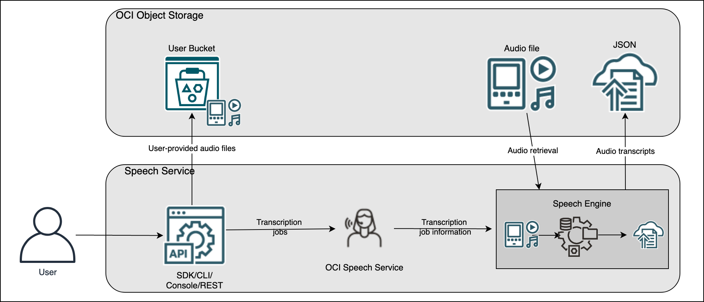

# Integrate OCI AI Speech Service and Generative AI Summarization in Visual Builder

# Introduction

OCI Speech is an AI service that applies automatic speech recognition technology to transform audio-based content into text.  Generative AI, The Large Language Model (LLM) analyzes the text input and can generate, summarize, transform, and extract information. Using these AI capabilities, we built a low code application- “Integrate OCI AI Speech Service and Generative AI Summarization in Visual Builder "  to invoke AI Speech REST API to convert audio files into text and then further invoke the Generative AI REST API to Summarize it.       

Reviewed: 20.02.2024

</img>

# Prerequisites

Before getting started, make sure you have access to these services:

- Oracle Speech Service
- Oracle Generative AI Service
- Oracle Visual Builder Cloud Service
- Oracle Visual Builder Service Connection

# AI Speech and OCI Generative AI Service Integration Architecture

1. AI Speech App using VBCS

- Oracle Visual Builder Cloud Service (VBCS) is a hosted environment for your application development infrastructure. It provides an open-source standards-based development service to create, collaborate on, and deploy applications within Oracle Cloud. This application is developed in VBCS.

2.	Transcriptions with OCI AI Speech Service:
- Speech harnesses the power of spoken language enabling you to easily convert media files containing human speech into highly exact text transcriptions.
- Produces accurate and easy-to-use JSON and SubRip Subtitle (SRT) files written directly to the Object Storage bucket you choose.

3.	Integration with OCI Generative AI Service:
- The transcriptions (text) are sent to the OCI Generative AI Service for text summarization.

4.	Integration with OCI AI Vision and OCI Generative AI Service using Visual Builder Service Endpoint:
- Build a Service Connection Endpoint option is used to integrate the VBCS app and OCI Object Storage, OCI AI Speech Service, and Generative AI Summarization.

5.	Summarization Process:
- OCI Generative AI Service generates text using the keywords received from OCI Speech service, to create a concise summary of the audio or video.

      
</img>

# Application Flow in Detail (VBCS, OCI Speech, OCI Generative AI Service)

In this application, the drag-and-drop component in VBCS allows the user to drop the audio or video. 
- Create a Service Endpoint connection in Visual Builder to handle the communication between Visual Builder and OCI Speech Service.
- Pass the selected audio or video from Visual Builder to OCI Speech Service to convert it into text.
- OCI Speech Service analyzes the media (audio or video) file and converts it into text.
- The OCI Speech Service returns the transcription to the AI Speech Service Endpoint and returns the results to the Visual Builder app.
- The transcription further passes to the Generative AI Service Endpoint and returns the Summarization results to the Visual Builder app.

         User (Visual Builder) --> (Drag and Drop File) --> |Media File (adudio or video) --> (Service Endpoint) --> |OCI Speech Service| --> |Speech to Text| --> (Service Endpoint) --> |Result| --> (Visual Builder) --> (Gen AI Service Endpoint) --> |Result| --> (Visual Builder) 

   </img>

# Service Endpoint call - Invoke OCI Object Storage

      uploadfile - /n/{namespaceName}/b/{bucketName}/o/{objectName}
      getObject - /n/{namespaceName}/b/{bucketName}/o/{outputFolderName}/{outputObjectName}

# Service Endpoint call - Invoke AI Speech Service 

      create transcription - /transcriptionJobs
      get transcription - transcriptionJobs/{transcriptionJobId}

# Service Endpoint call - Invoke Generative AI Service

      create summary - /20231130/actions/summarizeText

# Conclusion

In this article, we've covered how to utilize Oracle AI Speech Service features to provide a transription and summarize using Generative AI service.  

Feel free to modify and expand upon this template according to your specific use case and preferences.

# License
 
Copyright (c) 2024 Oracle and/or its affiliates.
 
Licensed under the Universal Permissive License (UPL), Version 1.0.
 
See [LICENSE](https://github.com/oracle-devrel/technology-engineering/blob/main/LICENSE) for more details.
	