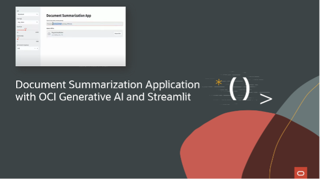

# Document Summarization Using Oracle Generative AI

Often, it would be useful to see a summary of a document before reading it fully. There are many reasons—for example, we could be in a time crunch and need to quickly understand a large amount of text at a high level. In the past, seeing a document summary would have been extremely difficult unless the author wrote one. However, now it can be possible anytime with [Oracle Cloud Infrastructure (OCI) Generative AI](https://www.oracle.com/uk/artificial-intelligence/generative-ai/generative-ai-service/). Simply upload any document and witness instant, efficient summarization.   
This project will show you how to set up such a system, feed it documents, and have it deliver summaries that will help accelerate your organization’s efficiency.  



## Prerequisites

1. Oracle Cloud account—[sign-up page](https://signup.cloud.oracle.com/)
2. Getting started with OCI Generative AI for summarization—[docs](https://docs.oracle.com/en-us/iaas/Content/generative-ai/use-playground-summarize.htm#playground-summarize)
3. OCI Generative AI—[Python SDK ](https://pypi.org/project/oci/)
4. Front-end framework—[Streamlit](https://streamlit.io/)
5. Development Framework—[LangChain](https://python.langchain.com/docs/get_started/introduction)

## Running the application

Open `src` directory in CLI

```console
cd src/
```

Install LangChain and OCI SDK

```console
pip install -U langchain oci
```

Install requirements

```console
pip install -r requirements.txt
```

For next step you will need [OCI Compartment ID](https://docs.oracle.com/en/cloud/foundation/cloud_architecture/governance/compartments.html#what-is-a-compartment), then run

```console
streamlit run ocidocumentSummarizeUpload.py
```

## Additional resources

- [How to run the application](https://www.youtube.com/watch?v=6A3KGyKy91Q&t=21s)
- [Blog - Different methods of sumarization](https://medium.com/@anshuman4luv/revolutionizing-document-summarization-innovative-methods-with-langchain-and-large-language-models-f12272c7e8cd)

## License

Copyright (c) 2024 Oracle and/or its affiliates.
Licensed under the Universal Permissive License (UPL), Version 1.0.
See [LICENSE](https://github.com/oracle-devrel/technology-engineering/blob/main/LICENSE) for more details.