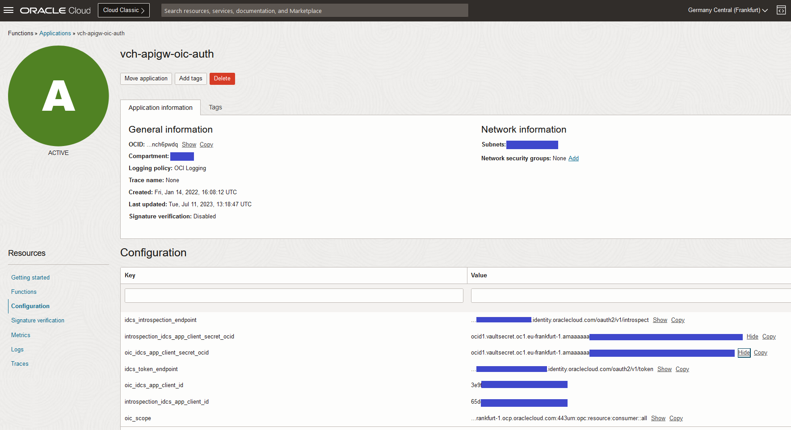

# FN App Configuration
* idcs_introspection_endpoint https://<idcs_host>/oauth2/v1/introspect
* introspection_idcs_app_client_id
* introspection_idcs_app_client_secret_ocid
* idcs_token_endpoint         https://<idcs_host>/oauth2/v1/token
* oic_idcs_app_client_id
* oic_idcs_app_client_secret_ocid
* oic_scope

# Deploy and test the function

    cd oci-apigw-oic-auth
    fn -v deploy --app <my-fn-app>

    echo -n '{"data": {"token": "Bearer <token-value>"}}' | fn invoke <my-fn-app> oci-apigw-oic-auth | jq .

# Inspiration and Credits
* [OIC & OAuth 2.0 - Part 3](http://niallcblogs.blogspot.com/2022/04/908-oic-oauth-20-part-3.html)
* [Protect OIC REST APIs with OCI API Gateway and OAuth2 – 2/2](https://mytechretreat.com/protect-oic-rest-apis-with-oci-api-gateway-and-oauth2-2-2/)
* [Authenticating Oracle Integration flows using OAuth token from 3rd party provider](https://blogs.oracle.com/integration/post/authenticating-oic-flows-through-third-party-bearer-token)

# Licence

Copyright (c)  2023,  Oracle and/or its affiliates.

Licensed under the Universal Permissive License (UPL), Version 1.0 as shown at https://oss.oracle.com/licenses/upl.