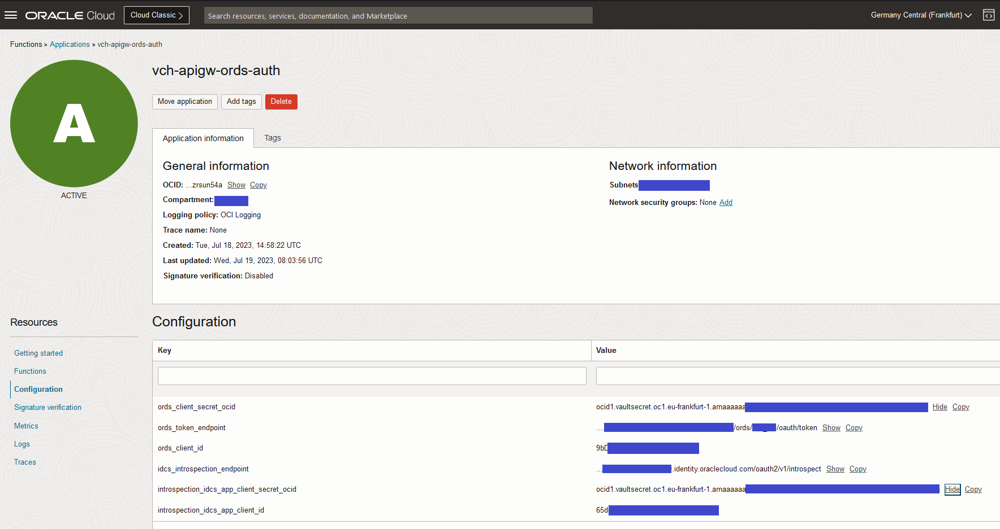

# FN App Configuration
* idcs_introspection_endpoint https://<idcs_host>/oauth2/v1/introspect
* introspection_idcs_app_client_id
* introspection_idcs_app_client_secret_ocid
* ords_token_endpoint         https://<ords_host>/ords/<schema_alias>/oauth/token
* ords_client_id
* ords_client_secret_ocid

# Deploy and test the function

    cd oci-apigw-ords-auth
    fn -v deploy --app <my-fn-app>

    echo -n '{"data": {"token": "Bearer <token-value>"}}' | fn invoke <my-fn-app> oci-apigw-ords-auth | jq .

# Inspiration and Credits
* [A-Team - Identity Propagation to ORDS for a VBCS Fusion SaaS Extension](https://www.ateam-oracle.com/post/identity-propagation-to-ords-for-a-vbcs-fusion-saas-extension)

# License

Copyright (c)  2023,  Oracle and/or its affiliates.

Licensed under the Universal Permissive License (UPL), Version 1.0 as shown at https://oss.oracle.com/licenses/upl.