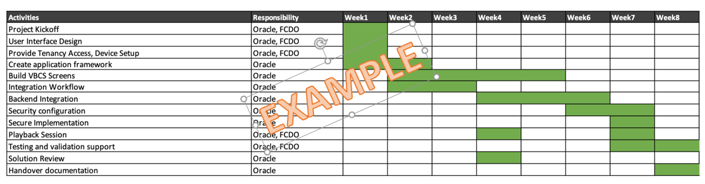

# Document Control

## Version Control

| Version | Author | Date               | Comment                                                                                                           |
|---------|--------|--------------------|-------------------------------------------------------------------------------------------------------------------|
| 1.3     | Name   | April 4th, 2022    | Update after review: Non functional requirements refinements                               |
| 1.2     | Name   | March 22nd, 2022   | Update after review: Non functional requirements, Internal notes, Deployment Build section |
| 1.1     | Name   | February 3rd, 2022 | Update after review                                                                                               |
| 1.0     | Name   | January 21st, 2022 | First version                                                                                                     |
| 0.1     | Name   | January 14th, 2022 | First draft                                                                                                       |

## Team

| Name | eMail                   | Role            | Company |
|------|-------------------------|-----------------|---------|
| Name | name.surname@oracle.com | Cloud Architect | Oracle  |

## Abbreviations List

| Abbreviation | Meaning                                  |
|--------------|------------------------------------------|
| OCI          | Oracle Cloud Infrastructure              |
| IDCS         | Identity Cloud service                   |
| OIC          | Oracle Integration Cloud                 |
| VBCS         | Visual Builder Cloud Service             |
| API          | Applicaton Programming Interface         |
| ATP          | Oracle Autonomous Transaction Processing |
| PaaS         | Platform as a service                    |
| IaaS         | Infrastructure as a service              |
| FAQs         | Frequently Asked Questions               |
| IdP          | Identity provider                        |
| SP           | Service Provider                         |
| RTO          | Recovery Time Objective                  |
| RPO          | Recovery Point Operation                 |

## Document Purpose

This document provides a high-level solution definition for the Oracle solution and aims at describing the current state, to-be state as well as a potential 'Oracle Lift' project scope and timeline. The intended purpose is to provide all parties involved a clear and well-defined insight into the scope of work and intention of the project as it will be done as part of the Oracle Lift service.

The scope of this document is the solution definition for the provisioning of the PaaS architecture that will be used by Customer to create integration platform using Oracle Cloud Integration and Identity and Access Management services.

# Business Context

[Customer_name](link%20to%20customer%20website) is ....

To enable this transformation Customer_Name is defining:

-   the Application Integration Architecture to manage all required integrations between Oracle Cloud Fusion Applications and its IT systems through their current integration layer.

-   the Identity and Access Management architecture to manage access of employees and business partners to Oracle Cloud Fusion Applications and related customizations

## Workload Business Value

**TBD - TO be assisted by ACE for additional and more specific information for this section. Following is just an example**

The current customer initiative will implement a new business system, straighten processes and controls to improve how Customer_Name works and set them up to meet future regulatory challenges. This program will be fundamental in transforming the business community and to support Customer_name going forward, providing the right, accurate information in good time to enable decision making.

The Application Integration platform in scope for this project will enable Customer_Name to:

-   easily make existing applications share information with the new business systems

-   easily develop extended functionalities that will exploit new digital business objects and current information

# Workload Requirements and Architecture

## Overview

Customer_Name is building its OCI Infrastructure to integrate with Oracle Fusion Applications and to implement Identity and Access Management platform.

The overall workload in scope for this Workload Architecture Document considers integrations on Oracle Integration Cloud (OIC), management of users (employees and partners) authentication and authorization in federation with customer's Identity Provider and is focused on definition of architecture and provisioning of Cloud services.

## Non Functional Requirements

### Integration and Interfaces

**TBD: list all the integrations in place, focusing on the ones that can be impacted in the TO BE solution. Following are some examples that usually can be found as requirements for integration. Customize as per customer real scenario. Then remove this line.**

| Name           | Source | Target        | Protocol    | Frequency | Volumes / execution |
|:---------------|:-------|:--------------|:------------|:----------|:--------------------|
| Purchase Order | EBS    | Order Portal  | SFTP        | Hourly    | 10 MB               |
| Exchange Rates | EBS    | Supply Portal | Web Service | On demand | 40 KB               |

### Regulations and Compliances

**TBD: add regulations and compliance for which customer has a specific focus. Following are some examples that usually can be found as requirements for integration. Customize based on the customer scenario. Then remove this line.**

The following compliance to standard B2B are required for integrations to be part of the solution:

| Integration standard | Description                                                               | Version          | Compliance detail                                                                                          |     |
|:---------------------|:--------------------------------------------------------------------------|:-----------------|:-----------------------------------------------------------------------------------------------------------|:----|
| HL7                  | Exchange of electronic health information that supports clinical practice | Version 2.x (V2) | Exchange of healthcare information between healthcare providers and vendors                                |     |
| HL7                  | Exchange of electronic health information that supports clinical practice | FHIR             | Exchange of healthcare information between healthcare providers, patients, caregivers, payers, researchers |     |
| X12 HIPAA EDI        | Accredited Standards Committee X12                                        | X12              | American National Standard Institute standard exchange format                                              |     |
| UN/EDIFACT           | Electronic Data Interchange For Administration, Commerce and Transport    | UN/EDIFACT       | United Nations Electronic Data Interchange for Administration, Commerce and Transport                      |     |

The following compliance to canonical data model is required for the implementation of the data model of the solution:

| Data model standard | Description                                                   | Version    | Compliance detail                                       |
|:--------------------|:--------------------------------------------------------------|:-----------|:--------------------------------------------------------|
| OAGIS               | The Open Applications Group Integration Specification (OAGIS) | OAGIS 10.1 | Canonical business language for information integration |

### Environments

**TBD: add environments description (e.g. as in the table provided in the comments). Then remove this line.**

| Name       | Size of Prod | Location (Region) | MAA  | Scope                  |
|:-----------|:-------------|:------------------|:-----|:-----------------------|
| Production | 100%         | London (UK)       | Gold | Not in Scope / On-prem |
| DR         | 50%          | London (UK)       | None | Workload               |
| Dev & Test | 25%          | London (UK)       | None | Workload - Lift        |

### Resilience and Recovery

**TBD: add specific resilience and recovery requirements customer has for RPO, RTO, SLA, HA and DR. Usually it is unlikely that nothing can be said here. AT least HA requirements usually are there, even if implicit. Then remove this line.**

The current integration architecture is in HA, with both integration servers and database distributed in 2 nodes each. Also, a DR setup is in place.

Customer has defined it RTO according to ISO 22300:2021 as “period of time following an incident within which a product or service or an activity is resumed, or resources are recovered.”.

Customer has defined it RPO according to ISO 22300:2021 as “point to which information used by an activity is restored to enable the activity to operate on resumption; can also be referred to as ‘maximum data loss.’”

RPO and RTO are currently defined as follows:

| Area        | Requirement | Value (minutes) | Notes                                                                                                    |     |
|:------------|:------------|:----------------|:---------------------------------------------------------------------------------------------------------|:----|
| Integration | RPO         | 120             | Affected by the time required for a successful sync of underlying database for long running transactions |     |
| Integration | RTO         | 200             | Affected by the time required for the whole DR activation procedure                                      |     |
| Database    | RPO         | 120             | N/A                                                                                                      |     |
| Database    | RTO         | 220             | N/A                                                                                                      |     |

For SLA customer has defined the following:

| Area        | Type of SLA  | Value  | Notes                                                              |     |
|:------------|:-------------|:-------|:-------------------------------------------------------------------|:----|
| Integration | Availability | 99,95% | Affected by availability SLA of database used by integration layer |     |
| Database    | Availability | 99,95% | N/A                                                                |     |

### Management and Monitoring

**TBD - Add any management and monitoring AS-IS requirement and platform used by customer. Then remove this line. If nothing used by customer remove this paragraph**

### Security

**TBD - Following sentence is generic enough to be reused. Anyway customer can have more detailed security requirements. Please customize based on customer scanario. Then remove this line.**

Customer complies to ISO 27001 security framework.

Customer requirements are based on following security approach:

-   Integrations are exposed through APIs accessed through the OAuth 2.0 authorization framework

-   Some integrated endpoints which expose APIs are accessed through SAML Authentication

-   Some integrated endpoint which expose APIs are accessed through Basic authentication

-   File transfer made through SFTP protocol is secured through SSH keys

-   Some integrations transport PGP encripted data

Customer API Management and API consumption best practices are based on the following main specification to be considered as requirements:

-   OAuth 2.0

-   API Key Validation

-   Application key released by API layer and API key header injection

-   Basic Authentication

-   CORS

#### Identity and Access management

**TBD - Following sentence refers to a common situation and is generic enough to be reused. Anyway customer can have more detailed security requirements. Customize based on customer scenario. Then remove this line.**

Customer_Name uses its own Identity Provider for authenticating and authorizing their employees regarding access to Oracle Fusion Applications. A subset of these employees need, depending on their authorization, to have Single Sign On access to the different applications and services on Oracle Cloud.

## Current State Architecture

**TBD - Following sentence refers to a common situation and is generic enough to be reused. Put a picture of the current architecture usually getting it from customer. If no Current State architecture is there then remove whole paragraph. Then remove this line**

The current state architecture of Customer_Name is being constructed outside the scope of this architecture. It will consist of Oracle Fusion Applications and customer existing systems that will be integrated with the solution in scope of this document.

## Future State Logical Architecture

### Integration capabilities

Integration refers to a system of tools and technologies that connects various applications, systems, repositories, and IT environments for exchange of data and execution of processes. Once combined, the data and integrated cloud services can then be accessed by multiple devices over a network or via the internet.

Following are the main **Application Integration** capabilities:

-   Orchestration: ability to call different services that collaborate to accomplish the whole integration. Usually means delegating task to other components.

-   Communication protocol: ability to use any protocol to access / exchange data (e.g. http(s), jdbc, etc). It is usually the basic enabler for Event based communication or Near Real Time communication.

-   Message Based Integration: ability to emit, get or propagate messages as a common MOM (Message Oriented Middleware). Asynchronous message queuing and propagation through a pub / sub approach is natively available and included in this capability. External message queuing technologies / services can be integrated if needed by the integration requirements.

-   Technology and Application Adapters: ability to easily connect to technology layers (databases, file systems, queues). Also Application Adapters offer a similar capability, enabling and simplifying communication with packaged / SaaS applications.

-   Transformations: ability to map and rebuild information from a format / structure to another.

-   File Based Integration: ability to manage File Transfer which is a common need with legacy application and hybrid integration scenarios.

-   Integration Recipes: reuse of available integrations from marketplace.

Other capabilities of integration are:

-   UI Based Integration: ability to interact with user. Useful for stand Alone Applications or for Business Process interaction.

Some other capabilities are key to enhance integration with Business Process Automation capabilities like:

-   Process Automation: ability to model a process with BPMN like notation which includes interaction with system through services / adapters and interaction with users through Human Workflow services.
-   Case Management: ability to model «dynamic» business processes.

**Application Extension** capabilities are:

-   Build a custom Application with a set of UIs and its related data model to extend functionalities of SaaS applications.

-   Access the extended functionalities in a seemless way directly from the SaaS Application UI with Single Sign On Access capabilities.

**Data Staging** capabilities are the ones required in order to have a persistent layer where transformation and lookup activities can be made during integration. Also it can be used as a persistent store for the data model of any customization and application extension.

### Logical Architecture

**TBD: scenario 1 - Integration to OnPremise through API Gateway. Select this or another one and remove this line**

[Figure 1](#fig1) shows a logical representation of the **Future State Logical Architecture**, with all the Oracle Cloud Infrastructure components which are part of the Integration solution.

{#fig1}

This integration address the following needs / problems:

-   On Premise systems are reached through VPN and so expose private IPs.

-   No use of Oracle Connectivity Agent.

**TBD: scenario 2 - Integration to OnPremise through Connectivity Agent deployed in OCI infrastructure. Select this or another one and remove this line**

[Figure 1](#fig1) shows a logical representation of the **Future State Logical Architecture**, with all the Oracle Cloud Infrastructure components which are part of the Integration solution.

{#fig1}

This integration address the following needs / problems:

-   On Premise systems are reached through VPN.

-   Oracle Connectivity Agent is used in a specific private VCN of Oracle Cloud Infrastructure.

While multiple connectivity agents can run on a single host, this is not the recommended practice. If you follow this practice, you must ensure that the physical host has enough resources to run multiple connectivity agents

**TBD: scenario 3 - Integration using database residing on OCI private network. Select this or another one and remove this line**

[Figure 1](#fig1) shows a logical representation of the **Future State Logical Architecture**, with all the Oracle Cloud Infrastructure components which are part of the Integration solution.

{#fig1}

This integration address the following needs / problems:

-   Database resides on private OCI network for strict security rules.

While multiple connectivity agents can run on a single host, this is not the recommended practice. If you follow this practice, you must ensure that the physical host has enough resources to run multiple connectivity agents

**TBD: scenario 4 - Integration to OnPremise through public network. Select this or another one and remove this line**

[Figure 1](#fig1) shows a logical representation of the **Future State Logical Architecture**, with all the Oracle Cloud Infrastructure components which are part of the Integration solution.

{#fig1}

This integration address the following needs / problems:

-   Integration must reach onPremise systems but no VPN is in scope of the architecture.

-   Security approach is required: no customer services exposed on internet from OnPremise.

About security approach, the following is important to be stated about security posture due to Connectivity Agent behavior:

-   No ports are opened on the on-premises system for communication.

-   All communication is secured using SSL.

-   The on-premises connectivity agent registers with Oracle Integration over SSL using the provided Oracle Integration credentials.

-   The on-premises connectivity agent checks for work by making outbound requests through the firewall.

-   The on-premises connectivity agent can use a proxy to access the internet (the same proxy as other internal applications and browsers use). Authentication support for outbound proxy access is provided.

-   The on-premises connectivity agent connections are configured by the agent retrieving the configuration details from Oracle Integration.

-   The on-premises connectivity agent processes requests by pulling messages from Oracle Integration across SSL.

-   The on-premises connectivity agent posts responses by pushing messages to Oracle Integration across SSL.

-   All communication is initiated by the on-premises connectivity agent.

-   No private SOAP-based web services are exposed.

-   No existing J2EE container is required to deploy the on-premises connectivity agent.

-   No data is persisted in the on-premises agent.

Following sections describe the main capabilities of the architecture.

#### Integration and custom applications

The architecture above depicts a complete Integration solution based on Oracle Cloud Infrastructure services.

The platform enables **Application Integration** in the following way:

-   Oracle Integration Cloud (logically positioned in the Integration Layer) is the OCI Integration component and interacts with:

    -   Customer_Name integration layer (Cloud Based layer). It is expected that this interaction will happen mainly with SOAP/REST and SFTP protocols.

    -   Oracle Cloud Fusion Applications through OIC Adapters and through WS/REST APIs available for these applications.

    -   ATP database as staging persistence layer (logically positioned in the Data Staging Layer) for data transformation, lookups, etc.

The platform enables **Application Extensions** in the following way:

-   Oracle Integration Cloud (logically positioned in the Custom Application Layer) is also the OCI custom application component and interacts with Oracle ATP to use information made available by the integration layer. It uses ATP also as persistence database for management of any custom application business objects.

    ``{=html}

Target architecture benefits per Oracle Cloud Service:

-   **OIC**

-   fully Oracle managed service seamlessly integrates applications and data by leveraging an extensive library of pre-built adapters.

-   helps Customer_Name to simplify all types of integrated process automation projects by leveraging pre-built integration flows and templates.

-   it is low code integration and process automation tool to:

-   Accelerate integrations using a point-and-click visual designer and pre-built adapters and process flows.

-   Integrate all types of applications, databases, and business processes.

-   Maximize the value of your on-premise and SaaS investments by efficiently connecting data and processes across applications.

-   for this Lift implementation OIC covers:

-   all the needed capabilities for **Application Integration**.

-   all the needed interface modes (batch or near-real time scheduling). Oracle Integration Cloud is enabled to use the different interface modes through its adapters: refer to [OIC Adapters](https://docs.oracle.com/en/cloud/paas/integration-cloud/find-adapters.html) for details and certification information.

-   To enable Hybrid Integration with on-premise systems Oracle Integration Cloud offers a connectivity agent. Refer to [OIC connectivity agent](https://docs.oracle.com/en/cloud/paas/integration-cloud/integrations-user/integration-cloud-service-concepts.html#GUID-ECC56F34-0578-4AE7-80F0-7F2FE9550905) for details.

-   **API Gateway**

    -   Enables to publish APIs with private endpoints that are accessible from within the internal network, and which can be exposed with public IP addresses to accept internet traffic.

-   **OCI Logging Service**

-   is a highly scalable and fully managed single pane of glass for all the logs in the A Company Making Everything tenancy. Logging provides access to logs from Oracle Cloud Infrastructure resources. These logs include critical diagnostic information that describes how resources are performing and being accessed. Use Logging Service to enable, manage, and search logs.

-   **OCI Logging Analytics**

-   lets you index, enrich, aggregate, explore, search, analyze, correlate, visualize and monitor all log data from OIC, API Gateway and OCI infrastructure. Contains Machine Learning Capabilities to detect anomalies.

-   **Visual Builder Studio(VBS)**

-   integrates a team development platform with code management and CI/CD automation.

-   streamlines the development lifecycle for Visual Builder developers with project templates, environments management.

-   provides build steps and CI/CD pipelines for publishing and managing.

-   **IDCS Service/IAM Identity Domain**

-   IDCS and new [IAM identity domain](https://docs.oracle.com/en-us/iaas/Content/Identity/sku/overview.htm#features__footnote2) is deployed with one of two identity domain types(TEST, PROD). Each identity domain type is associated with a different set of features and object limits.

-   It is an Identity-as-a-Service (IDaaS) solution which provides identity management, single-sign-on (SSO) and identity governance for applications, integration services and mobile applications. It provides basic identity management functions such as user management, group management, and password management.

-   **Oracle Autonomous Database (ATP)**

    It covers **Data Staging** capability for structured data to be managed for integrations. It will be used as staging database also for integration flows that will be built by Oracle Integration Cloud and optionally for any custom application / extension.

-   **Oracle Object Storage**

    It covers **Data Staging** capability for objects / files.

-   **Oracle Fusion applications**

    Are all the Oracle Applications in scope: these will be integrated through OIC Application adapters (which exploits Near Real Time communication) and can also be interfaced also through file transfer approach.

    Oracle Integration Cloud has a built in embedded SFTP server called [File Server](https://docs.oracle.com/en/cloud/paas/integration-cloud/file-server/file-server.html) that is expected to be used for the integration flows in scope.

*Note:*

-   *Business Process Management capabilities of OIC will not be in scope for this architecture*
-   *Oracle Application Extensions capabilities of OIC will not be in scope for this architecture*

#### Identity and Access Management

Oracle Identity Cloud Service (IDCS) provides an innovative, fully integrated service that delivers all the core identity and access management capabilities through a multi-tenant Cloud platform. Customer_Name uses Oracle Identity Cloud Service to facilitate Single Sign On between the Oracle Fusion Cloud ERP, Oracle Cloud EPM and Oracle Integration Cloud.

We identify 2 categories of users:

-   OCI Administrative Users

    These users are employees that have the responsibility to operate the resources in the Oracle Cloud Infrastructure tenancy e.g. databases, compartments, networking, computes, storage, etc. These users are also the users that configure and monitor the security posture.

-   Application Users

    These users are employees, suppliers and customers who access the Oracle Applications and the Oracle Integration Cloud functionality.

**OCI Administrative Users**

For OCI Administrative Users we use the default (primary) IDCS instance, which is integrated with the OCI IAM where their group memberships grant them privileges on OCI Resources.

The lifecycle (creating, changing, deleting) of OCI Administrative Users will be done manually in IDCS. This can be automatically synchronized with customer IdP at any later stage as long as there is an identity mapping based on a unique attribute e.g. the email address.

The authentication for OCI Administrative Users will be done by IDCS including Multi Factor Authentication (MFA). There will be no federation with customer IdP for these users. However, this can be done at any later stage.

IDCS group memberships are also used to make a distinction between production and non-production privileges because there is only one OCI tenancy in which both production and non-production resources will be created.

**Application Users**

For the Application Users we create a secondary IDCS instance, which is federated with Oracle Fusion Cloud Applications and it is directly linked with Oracle Integration Cloud. This allows for Single Sign On between these applications. Depending on the group memberships of these users, they will be granted access for one or more of these applications. The group membership can also be used to distinguish between employees, suppliers and customers.

The life cycle (creating, changing, deleting) of Application Users can be done in automated synchronization from customer IdP.

IDCS supports the SCIM protocol which can be used by customer IdP to provision user accounts via a REST based service into IDCS. In case the SCIM provisioning functionality might not yet be available for customer IdP some additional efforts is required from customer to address this gap. It is also possible to manage these user manually via the IDCS Console or import from CSV file (<https://docs.oracle.com/en/cloud/paas/identity-cloud/uaids/import-user-accounts.html>).

The authentication for Application Users is done by asking the login email address at a IDCS screen after which IDCS can decide to initiate a SAML Authentication flow for employees, suppliers and customers towards customer IdP. Depending on the configuration and capabilities of customer IdP, either the MFA challenge is handled by these IdP's or it is handled by IDCS.

IDCS group memberships are also used to make a distinction between production and non-production privileges because this distinction is also managed in customer IdP via group memberships.

A third IDCS Instance is created because the secondary IDCS instance contains a mix of users; employees, suppliers and customers. Since the secondary IDCS instance has the license type "Consumer User" to facilitate low priced supplier and customer users, but also contains employees, the third IDCS instance is created just to ensure that Oracle IDCS billing is correct for the employees that are in the secondary instance. This third IDCS instance will only contain the employees from the secondary instance which can be synchronized automatically from the secondary IDCS instance.

## OCI Cloud Landing Zone Architecture

The design considerations for an OCI Cloud Landing Zone have to do with OCI and industry architecture best practices, along with customer specific architecture requirements that reflect the Cloud Strategy (hybrid, multi-cloud, etc). An OCI Cloud Landing zone involves a variety of fundamental aspects that have a broad level of sophistication. A good summary of a Cloud Landing Zone has been published by [Cap Gemini](https://www.capgemini.com/2019/06/cloud-landing-zone-the-best-practices-for-every-cloud/).

#### Group Names

OCI Group Names should follow the naming scheme of the Enterprise Identity Management system for Groups or Roles.

Examples for global groups are:

-   \<prefix\>-\<purpose\>-admins
-   \<prefix\>-\<purpose\>-users

For departmental groups:

-   \<prefix\>-\<compartment\>-\<purpose\>-admins
-   \<prefix\>-\<compartment\>-\<purpose\>-users

The value for \<prefix\> or the full names **must be agreed** with customer.

### Security and Identity Management

This chapter covers the Security and Identity Management definitions and resources which will be implemented for customer.

#### Universal Security and Identity and Access Management Principles

-   Groups will be configured at the tenancy level and access will be governed by policies configured in OCI.
-   Any new project deployment in OCI will start with the creation of a new compartment. Compartments follow a hierarchy, and the compartment structure will be decided as per the application requirements.
-   It is also proposed to keep any shared resources, such as Object Storage, Networks etc. in a shared services compartment. This will allow the various resources in different compartments to access and use the resources deployed in the shared services compartment and user access can be controlled by policies related to specific resource types and user roles.
-   Policies will be configured in OCI to maintain the level of access / control that should exist between resources in different compartments. These will also control user access to the various resources deployed in the tenancy.
-   The tenancy will include a pre-provisioned Identity Cloud Service (IDCS) instance (the primary IDCS instance) or, where applicable, the Default Identity Domain. Both provide access management across all Oracle cloud services for IaaS, PaaS and SaaS cloud offerings.
-   The primary IDCS or the Default Identity Domain will be used as the access management system for all users administrating (OCI Administrators) the OCI tenant.

#### Authentication and Authorization for OCI

Provisioning of respective OCI administration users will be handled by the customer.

##### User Management

Only OCI Administrators are granted access to the OCI Infrastructure. As a good practice, these users are managed within the pre-provisioned and pre-integrated Oracle Identity Cloud Service (primary IDCS) or, where applicable, the OCI Default Identity Domain, of OCI tenancy. These users are members of groups. IDCS Groups can be mapped to OCI groups while Identity Domains groups do not require any mapping. Each mapped group membership will be considered during login.

**Local Users**

The usage of OCI Local Users is not recommended for the majority of users and is restricted to a few users only. These users include the initial OCI Administrator created during the tenancy setup, and additional emergency administrators.

**Local Users are considered as Emergency Administrators and should not be used for daily administration activities!**

**No additional users are to be, nor should be, configured as local users.**

**The customer is responsible to manage and maintain local users for emergency use cases.**

**Federated Users**

Unlike Local Users, Federated Users are managed in the Federated or Enterprise User Management system. In the OCI User list Federated Users may be distinguished by a prefix which consists of the name of the federated service in lower case, a '/' character followed by the user name of the federated user, for example:

`oracleidentityservicecloud/user@example.com`

In order to provide the same attributes (OCI API Keys, Auth Tokens, Customer Secret Keys, OAuth 2.0 Client Credentials, and SMTP Credentials) for Local and *Federated Users* federation with third-party Identity Providers should only be done in the pre-configured primary IDCS or the Default Identity Domain where applicable.

All users have the same OCI-specific attributes (OCI API Keys, Auth Tokens, Customer Secret Keys, OAuth 2.0 Client Credentials, and SMTP Credentials).

OCI Administration user should only be configured in the pre-configured primary IDCS or the Default Identity Domain where applicable.

**Note:** Any federated user can be a member of 100 groups only. The OCI Console limits the number of groups in a SAML assertion to 100 groups. User Management in the Enterprise Identity Management system will be handled by the customer.

**Authorization**

In general, policies hold permissions granted to groups. Policy and Group naming follows the Resource Naming Conventions.

**Tenant Level Authorization**

The policies and groups defined at the tenant level will provide access to administrators and authorized users, to manage or view resources across the entire tenancy. Tenant level authorization will be granted to tenant administrators only.

These policies follow the recommendations of the [CIS Oracle Cloud Infrastructure Foundations Benchmark v1.1.0, recommendations 1.1, 1.2, 1.3](https://www.cisecurity.org/cis-benchmarks).

**Service Policy**

A Service Policy is used to enable services at the tenancy level. It is not assigned to any group.

**Shared Compartment Authorization**

Compartment level authorization for the cmp-shared compartment structure uses the following specific policies and groups.

Apart from tenant level authorization, authorization for the cmp-shared compartment provides specific policies and groups. In general, policies will be designed that lower-level compartments are not able to modify resources of higher-level compartments.

Policies for the cmp-shared compartment follow the recommendations of the [CIS Oracle Cloud Infrastructure Foundations Benchmark v1.1.0, recommendations 1.1, 1.2, 1.3](https://www.cisecurity.org/cis-benchmarks).

**Compartment Level Authorization**

Apart from tenant level authorization, compartment level authorization provides compartment structure specific policies and groups. In general, policies will be designed that lower-level compartments are not able to modify resources of higher-level compartments.

**Authentication and Authorization for Applications and Databases**

Application (including Compute Instances) and Database User management is completely separate of and done outside of the primary IDCS or Default Identity Domain. The management of these users is the sole responsibility of the customer using the application, compute instance and database specific authorization.

#### Security Posture Management

**Oracle Cloud Guard**

Oracle Cloud Guard Service will be enabled using the pcy-service policy and with the following default configuration. Customization of the Detector and Responder Recipes will result in clones of the default (Oracle Managed) recipes.

Cloud Guard default configuration provides a number of good settings. It is expected that these settings may not match with the customer's requirements.

**Targets**

In accordance with the [CIS Oracle Cloud Infrastructure Foundations Benchmark, v1.1.0, Chapter 3.15](https://www.cisecurity.org/cis-benchmarks), Cloud Guard will be enabled in the root compartment.

**Detectors**

The Oracle Default Configuration Detector Recipes and Oracle Default Activity Detector Recipes are implemented. To better meet the requirements, the default detectors must be cloned and configured by the customer.

**Responder Rules**

The default Cloud Guard Responders will be implemented. To better meet the requirements, the default detectors must be cloned and configured by the customer.

**Vulnerability Scanning Service**

In accordance with the [CIS Oracle Cloud Infrastructure Foundations Benchmark, v1.1.0, OCI Vulnerability Scanning](https://www.cisecurity.org/cis-benchmarks) will be enabled using the pcy-service policy.

Compute instances which should be scanned *must* implement the *Oracle Cloud Agent* and enable the *Vulnerability Scanning plugin*.

**OCI OS Management Service**

Required policy statements for OCI OS Management Service are included in the pcy-service policy.

By default, the *OS Management Service Agent plugin* of the *Oracle Cloud Agent* is enabled and running on current Oracle Linux 6 and Oracle Linux 7 platform images.

#### Monitoring, Auditing and Logging

In accordance with the [CIS Oracle Cloud Infrastructure Foundations Benchmark, v1.1.0, Chapter 3 Logging and Monitoring](https://www.cisecurity.org/cis-benchmarks) the following configurations will be made:

-   OCI Audit log retention period set to 365 days. See [CIS Oracle Cloud Infrastructure Foundations Benchmark, v1.1.0, Chapter 3.1](https://www.cisecurity.org/cis-benchmarks)
-   At least one notification topic and subscription to receive monitoring alerts. See [CIS Oracle Cloud Infrastructure Foundations Benchmark, v1.1.0, Chapter 3.3](https://www.cisecurity.org/cis-benchmarks)
-   Notification for Identity Provider changes. [See CIS Oracle Cloud Infrastructure Foundations Benchmark, v1.1.0, Chapter 3.4](https://www.cisecurity.org/cis-benchmarks)
-   Notification for IdP group mapping changes. [See CIS Oracle Cloud Infrastructure Foundations Benchmark, v1.1.0, Chapter 3.5](https://www.cisecurity.org/cis-benchmarks)
-   Notification for IAM policy changes. See [CIS Oracle Cloud Infrastructure Foundations Benchmark, v1.1.0, Chapter 3.6](https://www.cisecurity.org/cis-benchmarks)
-   Notification for IAM group changes. See [CIS Oracle Cloud Infrastructure Foundations Benchmark, v1.1.0, Chapter 3.7](https://www.cisecurity.org/cis-benchmarks)
-   Notification for user changes. See [CIS Oracle Cloud Infrastructure Foundations Benchmark, v1.1.0, Chapter 3.8](https://www.cisecurity.org/cis-benchmarks)
-   Notification for VCN changes. See [CIS Oracle Cloud Infrastructure Foundations Benchmark, v1.1.0, Chapter 3.9](https://www.cisecurity.org/cis-benchmarks)
-   Notification for changes to route tables. See [CIS Oracle Cloud Infrastructure Foundations Benchmark, v1.1.0, Chapter 3.10](https://www.cisecurity.org/cis-benchmarks)
-   Notification for security list changes. See [CIS Oracle Cloud Infrastructure Foundations Benchmark, v1.1.0, Chapter 3.11](https://www.cisecurity.org/cis-benchmarks)
-   Notification for network security group changes. See [CIS Oracle Cloud Infrastructure Foundations Benchmark, v1.1.0, Chapter 3.12](https://www.cisecurity.org/cis-benchmarks)
-   Notification for changes to network gateways. See [CIS Oracle Cloud Infrastructure Foundations Benchmark, v1.1.0, Chapter 3.13](https://www.cisecurity.org/cis-benchmarks)
-   VCN flow logging for all subnets. See [CIS Oracle Cloud Infrastructure Foundations Benchmark, v1.1.0, Chapter 3.14](https://www.cisecurity.org/cis-benchmarks)
-   Write level logging for all Object Storage Buckets. See [CIS Oracle Cloud Infrastructure Foundations Benchmark, v1.1.0, Chapter 3.17](https://www.cisecurity.org/cis-benchmarks)
-   Notification for Cloud Guard detected problems.
-   Notification for Cloud Guard remedied problems.

For IDCS or OCI Identity Domain Auditing events, the respective Auditing API can be used to retrieve all required information.

#### Data Encryption

All data will be encrypted at rest and in transit. Encryption keys can be managed by Oracle or the customer and will be implemented for identified resources.

##### Key Management

All keys for **OCI Block Volume**, **OCI Container Engine for Kubernetes**, **OCI Database**, **OCI File Storage**, **OCI Object Storage**, and **OCI Streaming** are centrally managed in a shared or a private virtual vault will be implemented and placed in the compartment cmp-security.

**Object Storage Security**

For Object Storage security the following guidelines are considered.

-   **Access to Buckets** -- Assign least privileged access for IAM users and groups to resource types in the object-family (Object Storage Buckets & Object)
-   **Encryption at rest** -- All data in the Object Storage is encrypted at rest using AES-256 and is on by default. This cannot be turned off and objects are encrypted with a master encryption key.

**Data Residency**

It is expected that data will be held in the respective region and additional steps will be taken when exporting the data to other regions to comply with the applicable laws and regulations. This should be review for every project onboard into the tenancy.

#### Operational Security

**Security Zones**

Whenever possible OCI Security Zones will be used to implement a security compartment for Compute instances or Database resources. For more information on Security Zones refer to the in the *Oracle Cloud Infrastructure User Guide* chapter on [Security Zones](https://docs.oracle.com/en-us/iaas/security-zone/using/security-zones.htm).

**Remote Access to Compute Instances or Private Database Endpoints**

To allow remote access to Compute Instances or Private Database Endpoints, the OCI Bastion will be implemented for defined compartments.

To be able to use OCI services to for OS management, Vulnerability Scanning, Bastion Service, etc. it is highly recommended to implement the Oracle Cloud Agent as documented in the *Oracle Cloud Infrastructure User Guide* chapter [Managing Plugins with Oracle Cloud Agent](https://docs.oracle.com/en-us/iaas/Content/Compute/Tasks/manage-plugins.htm).

#### Network Time Protocol Configuration for Compute Instance

Synchronized clocks are a necessity for securely operating environments. OCI provides a Network Time Protocol (NTP) server using the OCI global IP number 169.254.169.254. All compute instances should be configured to use this NTP service.

#### Regulations and Compliance

The customer is responsible for setting the access rules to services and environments that require stakeholders’ integration to the tenancy to comply with all applicable regulations. Oracle will support in accomplishing this task.

## Sizing

The OCI services and components in scope for the solution are present in the following table in which also sizing information (basic on preliminary sizing assumptions) is present.

Following sizing is based in agreement with customer indication and not from specific figures of users and volumes.

**In general (accross environments)**

| Oracle Cloud Service role                | Oracle Cloud Service             | Billing metric            | Part \# | Qty              |
|:-----------------------------------------|:---------------------------------|:--------------------------|:--------|:-----------------|
| OCI Administrator Users (primary)        | Oracle Identity Cloud - Standard | Enterprise User Per Month | B90555  | 10 \*\*          |
| Application Users all (secondary)        | Oracle Identity Cloud - Standard | Consumer User Per Month   | B90555  | 600 - 10000 \*\* |
| Application Users employees only (third) | Oracle Identity Cloud - Standard | Enterprise User Per Month | B90555  | 600 \*\*         |

\*\* The amount of users are based on assumptions.

**Development Environment**

| Oracle Cloud Service role | Oracle Cloud Service                                       | Billing metric                      | Part \# | Qty |
|:--------------------------|:-----------------------------------------------------------|:------------------------------------|:--------|:----|
| Database                  | Oracle Autonomous Transaction Processing                   | OCPU Per Hour                       | B90453  | 1   |
| Database Storage          | Oracle Autonomous Transaction Processing - Exadata Storage | Terabyte Storage Capacity Per Month | B90455  | 1   |
| Integration               | Oracle Integration Cloud Standard Ed.                      | msg packs (5000 msg/h) '\*'         | B89639  | 1   |

**Pre SIT Environment**

| Oracle Cloud Service role | Oracle Cloud Service                                       | Billing metric                      | Part \# | Qty |
|:--------------------------|:-----------------------------------------------------------|:------------------------------------|:--------|:----|
| Database                  | Oracle Autonomous Transaction Processing                   | OCPU Per Hour                       | B90453  | 1   |
| Database Storage          | Oracle Autonomous Transaction Processing - Exadata Storage | Terabyte Storage Capacity Per Month | B90455  | 1   |
| Integration               | Oracle Integration Cloud Standard Ed.                      | msg packs (5000 msg/h) '\*'         | B89639  | 1   |

**SIT Environment**

| Oracle Cloud Service role | Oracle Cloud Service                                       | Billing metric                      | Part \# | Qty |
|:--------------------------|:-----------------------------------------------------------|:------------------------------------|:--------|:----|
| Database                  | Oracle Autonomous Transaction Processing                   | OCPU Per Hour                       | B90453  | 1   |
| Database Storage          | Oracle Autonomous Transaction Processing - Exadata Storage | Terabyte Storage Capacity Per Month | B90455  | 4   |
| Integration               | Oracle Integration Cloud Standard Ed.                      | msg packs (5000 msg/h) '\*'         | B89639  | 1   |

**UAT Environment**

| Oracle Cloud Service role | Oracle Cloud Service                                       | Billing metric                      | Part \# | Qty |
|:--------------------------|:-----------------------------------------------------------|:------------------------------------|:--------|:----|
| Database                  | Oracle Autonomous Transaction Processing                   | OCPU Per Hour                       | B90453  | 2   |
| Database Storage          | Oracle Autonomous Transaction Processing - Exadata Storage | Terabyte Storage Capacity Per Month | B90455  | 8   |
| Integration               | Oracle Integration Cloud Standard Ed.                      | msg packs (5000 msg/h) '\*'         | B89639  | 1   |

**Production (non live data) Environment**

| Oracle Cloud Service role | Oracle Cloud Service                                       | Billing metric                      | Part \# | Qty |
|:--------------------------|:-----------------------------------------------------------|:------------------------------------|:--------|:----|
| Database                  | Oracle Autonomous Transaction Processing                   | OCPU Per Hour                       | B90453  | 2   |
| Database Storage          | Oracle Autonomous Transaction Processing - Exadata Storage | Terabyte Storage Capacity Per Month | B90455  | 8   |
| Integration               | Oracle Integration Cloud Standard Ed.                      | msg packs (5000 msg/h) '\*'         | B89639  | 1   |

*Note: OIC is sized through *message packs* allocation in the service console* '\*' *5,000 Messages per Hour: is defined as the number of 5,000 message quantities used as part of the Oracle Cloud Service. A message is defined as up to 50 kilobytes (KB) of in-and-out transmission from/to the Oracle Cloud Service. Any messages over 50KB in size must be counted as multiple messages, with each 50KB or portion thereof counting as equivalent to one message (e.g., 210KB would be counted as 5 messages).*

# Oracle Lift Project and Architecture

## Solution Scope

### Disclaimer

As part of the Oracle Lift Project, any scope needs to be agreed upon by both the customer and Oracle. A scope can change but must be confirmed again by both parties. Oracle can reject scope changes for any reason and may only design and implement a previously agreed scope. A change of scope can change any agreed times or deadlines and needs to be technically feasible.

All items not explicitly stated to be within the scope of the Lift project will be considered out of scope. Oracle recommends the use of professional services to implement extensions or customizations beyond the original scope, as well as to operate the solution, with an Oracle-certified partner.

### Overview

Customer_Name needs to define the overall Oracle Cloud Infrastructure for integration with Oracle Cloud Fusion Applications. Customer_Name also needs to define the overall Oracle Cloud Infrastructure for managing single sign on access to Oracle Cloud Fusion Applications Oracle Cloud Infrastructure service that will be used to implement integrations and extensions.

### Business Value

**TBD - TO be assisted by ACE for additional and more specific information for this section**

The current customer initiative will implement a world class new business system, straighten processes and controls to improve how Customer_Name works and set them up to meet future regulatory challenges. This program will be fundamental in transforming the business community and to support Customer_name going forward, providing the right, accurate information in good time to enable decision making. The integration platform in scope for this project will enable Customer_Name to:

-   easily make existing applications share information with the new business systems.

-   easily develop extended functionalities that will exploit new digital business objects and current information.

## Success Criteria

The goal of this Workload Architecture document is to define the overall architecture for integration and Identity and Access Management and provision services (and related OCI artifacts like VCN, subnets, etc.) for Oracle Integration Cloud service, Oracle ATP for the environments listed in the environments paragraph of this document and Oracle IDCS Secondary Stripe and Third Stripe.

## Workplan

This section describes the implementation scope.

This Cloud Lift proposal is based on the following scope of activities:

-   OCI Foundation Setup (Network Fundamentals, VCNs, Subnets, RTs, NSGs, SLs).
-   Provision IDCS Secondary Stripe for Prod and Non Prod.
-   Integrate OIC with ATP DB.
-   Enable Cloud Guard and Data Safe.
-   ...

### Deliverables

-   This Workload Architecture document containing additional sections related to the required configuration for provisioning (VCN names, CIDRs, subnet names, Routing rules, Security lists, etc.) will be the reference deliverable in scope.
-   Terraform scripts for OCI.

### Included Activities

**TBD**

### Recommended Activities

**TBD - List all the activities that are recommended**

Following are all the activities which are left to customer:

-   Any integration implementation or migration.
-   Any connectivity agent setup.
-   Any Data Migration
-   24\*7 Support coverage
-   Target Hardware sizing, architecture and design changes
-   Load Testing, Performance benchmarking, testing & tuning of any component in the solution
-   Third Party Firewall implementation, Security tools, monitoring tools implementation
-   Trainings on deployed products and Cloud Services
-   Customer_Name applications installation, migration, upgrade and support.
-   Any other activity not listed under “In Scope” section.
-   No Disaster Recovery Architecture

The following activities to be done in order to properly configure IDCS are considered out of scope:

-   Configure federation between Oracle Cloud Infrastructure and customer IdP account.
-   Register the Oracle Identity Cloud Service account as an identity provider.
-   Map customer IdP groups to Oracle Cloud Infrastructure groups.
-   Map the Oracle Identity Cloud Service groups to the appropriate IAM groups.
-   Register custom application in IDCS.
-   Add users to access custom application to specific groups enabled to use the application.

### Timeline

[Figure 2](#fig2) shows the representation of the **Project Timeline** listing the main activities needed for the implementation of the items in scope.

{#fig2}

### Implementation RACI

Matrix responsibilities between Oracle and Customer_Name including Customer_Name obligations and prerequisites

| SN  | Activity Details                      | Oracle | Customer_Name |
|-----|---------------------------------------|--------|---------------|
| 1   | Project kick-off                      | R      | A             |
| 2   | OCI and IDCS Admin access             | I      | RA            |
| 3   | OCI Foundation & Service provisioning | RA     | C             |
| 4   | Provision IDCS Secondary Stripe       | R      | I             |
| 5   | Provision OIC Instances               | R      | I             |
| 6   | Provision ATP DB                      | R      | I             |
| 7   | Test and Validation of Application    | R      | C             |
| 8   | Project Management                    | R      | A             |

R- Responsible, I- Informed, A- Accountable, C- Consulted

## Assumptions

For this Cloud Lift Services proposal, we have made some key assumptions:

-   Customer_Name has existing connectivity to OCI
-   Customer_Name will have adequately licensed for all the products that may/will be used during this project.
-   Customer_Name will have the necessary Oracle Support (MoS) contract for all the products that may/will be used during this project.
-   Customer_Name will be managing any other 3rd party vendors or suppliers.
-   It is assumed that all work will be done remotely and within either central European time or India standard time normal office working hours.
-   Any additional effort outside of the scope of this proposal will be managed by change control and mutually agreed by both Oracle and Customer_Name.
-   No pre-existing problems, issues, errors and anomalies will be addressed by Oracle.
-   Customer_Name will be responsible for implementing the environment specific backup strategy post migration and support of the environment.
-   All other activity which are not mentioned explicitly in scope is treated as not part of the offer.
-   The Oracle Lift team will have admin access to the customers tenancy for implementation purposes.
-   The primary IDCS instance for OCI Administrators will be Standard License - Enterprise Users. To be used for employees on the OCI tenancy and supports MFA, future federation and CASB login.
-   The secondary IDCS instances for Application Users will be Standard License - Consumer Users. To be used for all employees, suppliers and customers for all environments and support MFA, Future federation and SSO with Oracle Cloud Fusion Applications ERP, Oracle Cloud EPM and Oracle Integration Cloud service.

## Obligations

-   You will have purchased the appropriate Universal Credits for the services required for the project.
-   The Oracle Lift team will have admin access to the customers tenancy for implementation.
-   You will ensure the appropriate product training has been obtained to maintain and support the implementation.
-   Your business team will be available for the Testing phase, which will be completed within the agreed testing window.
-   You will provide project management for the project and will manage any third party suppliers or vendors.

```{=tex}
\pagebreak
```
## Physical Future State Architecture

**TBD: scenario 1 - Integration to OnPremise through API Gateway. Select this or another one and remove this line**

[Figure 3](#fig3) shows the representation of the **Future State Physical Architecture**, with all the Oracle Cloud Infrastructure components which are part of the Integration solution.

{#fig3}

**TBD: scenario 2 - Integration to OnPremise through Connectivity Agent deployed in OCI infrastructure. Select this or another one and remove this line**

[Figure 3](#fig3) shows the representation of the **Future State Physical Architecture**, with all the Oracle Cloud Infrastructure components which are part of the Integration solution.

{#fig3}

**TBD: scenario 3 - Integration using database residing on OCI private network. Select this or another one and remove this line**

[Figure 3](#fig3) shows the representation of the **Future State Physical Architecture**, with all the Oracle Cloud Infrastructure components which are part of the Integration solution.

{#fig3}

**TBD: scenario 4 - Integration to OnPremise through public network. Select this or another one and remove this line**

[Figure 3](#fig3) shows the representation of the **Future State Physical Architecture**, with all the Oracle Cloud Infrastructure components which are part of the Integration solution.

{#fig3}

Oracle Cloud spans different regions and country with its set of Data Center interconnected with a high bandwidth and low latency network. In this deployment, Customer_Name would be using Oracle’s Region_Name region for having in-country data center availability. The Region_Name Data Center offers three availability domains: three stacks of hardware which are independent one from the others from an electrical point of view, to achieve the high availability of the services.

The above shows an high level deployment of all the components of the solution in the DC.

The amber arrows represents the network connections between the architecture components.

Final architecture could be subject to substantial changes as design will progress: at least will provide more needed details (bastion host, network CIDR, routing details, security lists, etc). This picture anyway captures the basic components of the OCI Infrastructure and focuses on the following items which can be grouped in networking Components and Cloud Services (link to official documentation is provided).

**Networking components**:

-   [VCN](https://docs.oracle.com/en-us/iaas/Content/Network/Concepts/overview.htm): the OCI virtual, private network.

**Cloud Services**:

-   [Oracle Integration Cloud (OIC)](https://docs.oracle.com/en/cloud/paas/integration-cloud/index.html): fully managed service that allows to integrate your applications, automate processes, gain insight into business processes and create visual applications.

-   [Autonomous Database](https://www.oracle.com/autonomous-database/autonomous-data-warehouse/): self-driving, self-securing, self-repairing database service.

-   [API Gateway](https://docs.oracle.com/en-us/iaas/Content/APIGateway/Concepts/apigatewayoverview.htm): enables to publish APIs with private endpoints that are accessible from within your network, and which you can expose with public IP addresses if you want them to accept internet traffic.

-   [Compute](https://docs.oracle.com/en-us/iaas/Content/Compute/Concepts/computeoverview.htm): provides compute hosts, known as instances.

-   [Object Storage](https://docs.oracle.com/en-us/iaas/Content/Object/Concepts/objectstorageoverview.htm): enables safe and secure store or retrieve data directly from the internet or from within the cloud platform.

-   [Load Balancing](https://docs.oracle.com/en-us/iaas/Content/Balance/Concepts/balanceoverview.htm): provides automated traffic distribution from one entry point to multiple servers reachable from your virtual cloud network (VCN).

-   [Identity and Access Management (IAM)](https://docs.oracle.com/en-us/iaas/Content/Identity/Concepts/overview.htm): enables control om who has access to cloud resources.

-   [OCI Bastion](https://www.oracle.com/security/cloud-security/bastion/): provides restricted and time-limited secure access to resources that don't have public endpoints and require strict resource access controls.

Oracle integration Cloud will be used for its integration capabilities and for the Visual Builder Cloud Service capabilities that will allow to build specific applications with Low/Zero code approach. Also Visual Builder Cloud Service will be deployed and configured with the BYODB approach to use Oracle Autonomous Transaction Processing (ATP) database.

The connectivity between the building blocks of the architecture shown in above physical architecture, are achieved by the following configurations:

-   OIC will connect directly to the ATP database.

-   The Object storage cloud service, since it is a public service (like OIC) it is accessed using a Service Gateway.

It is expected that Customer_Name integration layer (Cloud Based layer) can access have access to OIC integration using OIC SFTP or SOAP/REST calls server through public network and that Customer_Name will expose its APIs and STFP endpoints to be reached by OIC through public network.

The logical and physical re-partition of the components on the various networks (VCN and subnet) is as follows:

-   **OCI Native Services** (a default network for OIC) - not accessible through standard OCI routing but only using a service gateway for the integration runtime, or via internet for the management service User Interfaces. Will be used to position also the ATP database used by the VBCS applications developed in OIC and configured through the BYODB approach.

-   **VCN Agent** (a virtual network for OIC Agents) - private network dedicated to OIC agents instances. Communicates with OIC through Service Gateway.

-   **VCN Database** (a virtual network for Data Integration) - private network dedicated to ATP Database. Communicates with OIC through OIC agents.

Components of the OCI architecture are deployed in [regions](https://docs.oracle.com/en-us/iaas/Content/General/Concepts/regions.htm) (Region_name for the primary site): for each region, availability domains are used to guarantee business continuity.

`\pagebreak`{=tex}

## Architecture Views

### Architecture View for Monitoring

Following monitoring features are provided by components in scope for the architecture.

-   **OCI Console** provides monitoring metrics out of the box for most of the IaaS/PaaS services.

-   **Oracle Integration Cloud** provides dashboards with detailed information about runtime and runtime/design time artefacts.

    -   We are expecting use of the Oracle Integration dashboard as primary point to see how the integrations are performing. The dashboard provides multiple views for you to check the running services. For this Lift the most important view are:

        **[View the Dashboard](https://docs.oracle.com/en/cloud/paas/integration-cloud/integrations-user/monitor-integrations.html#GUID-668FCE2E-84B0-48B8-9C94-164A1AC181FC)**

        -   You can view information about how your integrations are performing. The Dashboard data represents the entire history of the integration flow instance, including the number of messages before purging, if it ever occurred.
        -   You can view information about how your integrations are performing. The main page of the integration shows a snapshot of a state of all running integrations.

        **[Monitor Integrations](https://docs.oracle.com/en/cloud/paas/integration-cloud/integrations-user/monitor-integrations.html#GUID-5E722590-C9A8-4A9C-96C3-08B313DF0F18)**

        -   The Monitor Integrations page enables you to view the message processing status of your running integrations, such as how many messages have been received and processed, how many successful messages and errors have occurred, and how many messages have been aborted. Only activated integrations are listed on this page by default. Using the appropriate filter, you can also view data for inactive integrations.
        -   A Total Instance Count summary is displayed at the top of the page. This section is collapsed by default. Data is not immediately fetched. To fetch and view data, expand the Total Instance Count section and click the Refresh button visible within the section.

        See more in\_\_[Monitor Integrations During Runtime](https://docs.oracle.com/en/cloud/paas/integration-cloud/integrations-user/monitor-integrations-runtime.html)

        -   We are expecting new level of the error management into the A Company Making Everything integration solution. OIC contains necessary Error Management to:

            **[Manage Errors](https://docs.oracle.com/en/cloud/paas/integration-cloud/integrations-user/managing-errors.html#GUID-260E36D6-924F-451B-BCB6-5FF2B78F5608)**

            -   You can manage errors from the Errors pages in Oracle Integration. You can resubmit failed messages, discard errors, view message recovery status, view error messages, and view specific error details, including the activity stream, business identifiers and values, and message payload in failed instances.

```{=html}
<!-- -->
```
-   **OCI Logging and OCI Logging analytics**
    -   We know that Oracle Integration Activity stream logs can be downloaded from OIC using the Monitoring console. A commonly implemented solution by customers is to automate the download of activity stream logs periodically using **[Monitoring REST API](https://docs.oracle.com/en/cloud/paas/integration-cloud/rest-api/op-ic-api-integration-v1-monitoring-logs-id-get.html)** and store them in repositories like FTP servers or Object storage for offline analysis and diagnosis.
    -   However the Activity stream download is governed by size of the activity stream log file.
    -   Due to this size limitation, customers could have an issue with the ability to reliably download activity stream logs for a definite period of time, say last 1 hour.
    -   Thus Oracle provides possibility to Monitor and **[Analyze OIC Activity Stream to OCI Logging and OCI Logging Analytics](https://www.ateam-oracle.com/post/oic-activity-stream-to-oci-log-analytics)**
    -   Oracle Cloud **Logging Analytics** should be considered as target cloud solution in Oracle Cloud Infrastructure that lets you index, enrich, aggregate, explore, search, analyze, correlate, visualize and monitor all log data from your all your applications and system infrastructure.

    *[Note: There is possibility to easily test and monitor OIC platform health in OCI console and set up an Alarm for the operations Team](https://redthunder.blog/2020/11/20/oic-health-check-by-oci-monitoring-and-alarm/)*

```{=html}
<!-- -->
```
-   **Autonomous Database**

-   The Autonomous Database automates the provisioning, securing, monitoring, backup, recover, troubleshooting, and tuning of databases. This dramatically reduces mundane database maintenance tasks, reducing costs and freeing scarce administrator resources to work on higher value tasks.

`\pagebreak`{=tex}

# Oracle Lift Implementation

## Approach

```{=tex}
\newpage
```
```{=tex}
\blandscape
```
## Deployment Build

### Compartments

**TBD: this is just an example. Insert real values and remove this line**

The following compartment has been added by Lift Service.

| Name | Region                      | Parent Compartment | Description                       | Tags |
|:-----|:----------------------------|:-------------------|:----------------------------------|:-----|
| Dev  | Germany Central (Frankfurt) | ROOTCOMP -\> COMP  | Compartment for all DEV resources |      |

### Virtual Cloud Networks

**TBD: this is just an example. Insert real values and remove this line**

The following VCN has been added by Lift Service.

| Compartment | VCN Name  | CIDR Block   | DNS Label          | IGW        | DRG               | NGW        | SGW            | Region                      |
|:------------|:----------|:-------------|:-------------------|:-----------|:------------------|:-----------|:---------------|:----------------------------|
| Dev         | VCN-DEV-1 | 10.78.2.0/24 | dev1.oraclevcn.com | InternetGW | DRG-ATT-VCN-DEV-1 | NATGateway | ServiceGateway | Germany Central (Frankfurt) |

### Subnets

**TBD: this is just an example. Insert real values and remove this line**

The following Subnet has been added by Lift Service.

| Compartment | VCN Name  | Subnet Name  | CIDR Block    | Subnet Span | Type    | Security List Name                  |
|:------------|:----------|:-------------|:--------------|:------------|:--------|:------------------------------------|
| Dev         | VCN-DEV-1 | SN-DEV-OKE-1 | 10.78.2.16/28 | Regional    | Private | Default Security List for VCN-DEV-1 |

### Security Lists (Egress)

**TBD: this is just an example. Insert real values and remove this line**

The following Security List has been added by Lift Service.

| Name            | Compartment | Ingress Type   | Source    | Protocol      | Source Port | Dest. Port | VCN Name  |
|:----------------|:------------|:---------------|:----------|:--------------|:------------|:-----------|:----------|
| SL-Bastion      | Dev         | Stateful/ CIDR | 0.0.0.0/0 | TCP           | 22          | All        | VCN-DEV-1 |
| SL-EBS-Asserter | Dev         | Stateful/ CIDR | 0.0.0.0/0 | All protocols |             |            | VCN-DEV-1 |

### Security Lists (Ingress)

**TBD: this is just an example. Insert real values and remove this line**

The following Security List has been added by Lift Service.

| Name                                | Compartment | Ingress Type   | Source       | Protocol | Source Port | Dest. Port | VCN Name  |     |     |     |
|:------------------------------------|:------------|:---------------|:-------------|:---------|:------------|:-----------|:----------|:----|:----|:----|
| Default Security List for VCN-DEV-1 | Dev         | Stateful/ CIDR | 10.78.7.7/32 | TCP      | all         | 22         | VCN-DEV-1 |     |     |     |

### Compute Instances

**TBD: this is just an example. Insert real values and remove this line**

The following Compute instances have been added by Lift Service.

| Compartment | Availability Domain | Name                                      | CPU | Memory (GB) | IP (public) | IP (private) | Fault Domain | Subnet       | OS Image                                        | Shape          |     |
|:------------|:--------------------|:------------------------------------------|:----|:------------|:------------|:-------------|:-------------|:-------------|:------------------------------------------------|:---------------|:----|
| Dev         | AD-2                | EBSAsserter-wls-0                         | 2   | 30          |             | 10.78.2.69   | FD-3         | SN-DEV-APP-1 | wlsoci-custom-image-ee-BYOL-22.1.1-220208100422 | VM.Standard2.2 |     |
| Dev         | AD-1                | oke-crj5lbnyeca-nifmjqrfy4a-snafqzp3yba-2 | 2   | 30          |             | 10.78.2.25   | FD-3         | SN-DEV-OKE-1 | Oracle-Linux-7.9-2022.01.24-0                   | VM.Standard2.2 |     |

### Load Balancers

**TBD: this is just an example. Insert real values and remove this line**

The following Load balancer has been added by Lift Service

| Compartment | LB Name        | Shape    | Subnet       | Visibility | Hostnames |
|:------------|:---------------|:---------|:-------------|:-----------|:----------|
| Dev         | EBSAsserter-lb | Flexible | SN-DEV-PUB-1 | Public     |           |

#### Backend Sets

**TBD: this is just an example. Insert real values and remove this line**

The following Backend set has been added by Lift Service.

| LB Name        | Backend Set Name          | Backend Server Port             | Backend Policy |
|:---------------|:--------------------------|:--------------------------------|:---------------|
| EBSAsserter-lb | EBSAsserter-lb-backendset | 10.78.2.69:7003 10.78.2.71:7003 |                |

#### Listeners

**TBD: this is just an example. Insert real values and remove this line**

The following Listener has been added by Lift Service.

| LB Name        | Backend Set Name          | Hostname | SSL | Listener Name | Protocol | Port |
|:---------------|:--------------------------|:---------|:----|:--------------|:---------|:-----|
| EBSAsserter-lb | EBSAsserter-lb-backendset |          | Yes | https         | HTTPS    | 443  |

### API Gateway

**TBD: this is just an example. Insert real values and remove this line**

The following API Gateway has been added by Lift Service.

| Compartment | Name          | IP Address     | Visibility |
|:------------|:--------------|:---------------|:-----------|
| Dev         | EBSAPIGateway | 144.24.178.199 | Public     |

### Autonomous Databases

#### Autonomous Database Information

**TBD: this is just an example. Insert real values and remove this line**

The following Database has been provided by Lift Services.

| Compartment | Display Name    | DB Name        | Workload Type | Infra. Type | DB Version | OCPU Count | Storage (TB) |
|:------------|:----------------|:---------------|:--------------|:------------|:-----------|:-----------|:-------------|
| Dev         | ATPGRMSEXT-DEV1 | ATPGRMSEXTDEV1 | ATP           | Shared      | 19c        | 1          | 1            |

### Oracle Integration Cloud

**TBD: this is just an example. Insert real values and remove this line**

The following OIC Instance has been added by Lift Service.

| Compartment | Display Name | Consumption Model          | Message packs | File Server | Visual Buider |
|:------------|:-------------|:---------------------------|:--------------|:------------|:--------------|
| Dev         | oic-dev1     | Metered (Universal Credit) | 1             | Not Enabled | Enabled       |

```{=tex}
\elandscape
```
