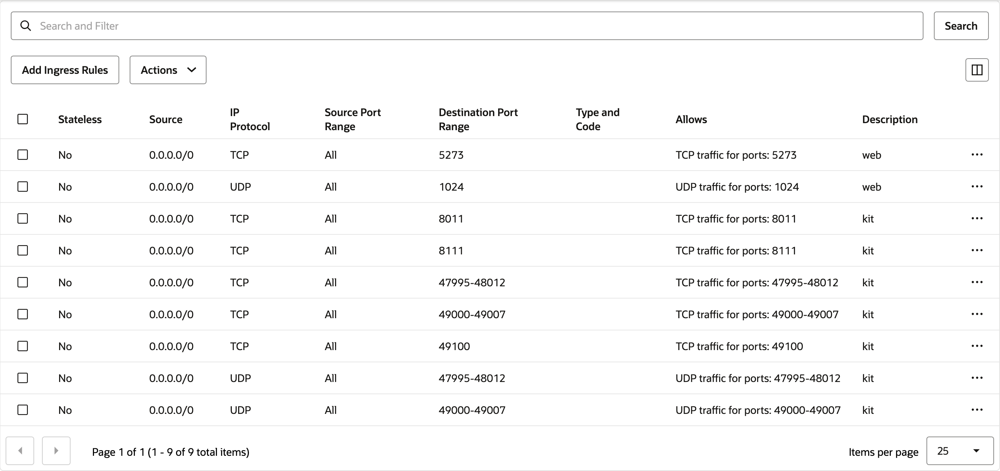
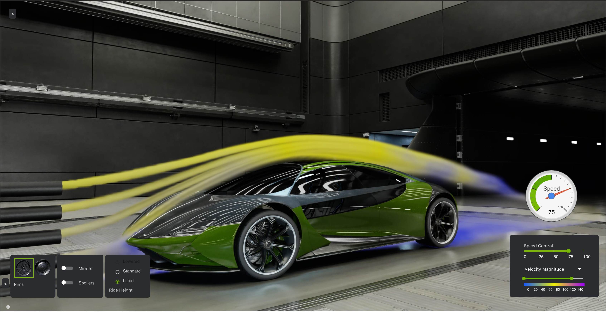

# Digital Twin Example using NVIDIA Omniverse

This solution demonstrates how to run a digital twin of an automobile in a wind
tunnel to evaluate the aerodynamic effect of modifications to the features of
the car.
The digital twin runs on the NVIDIA Omniverse software platform and uses GPU
nodes on Oracle Cloud Infrastructure (OCI) to visualize the airflow over the
car as well as AI inference to quickly assess how changes to the car will
affect the airflow.

Reviewed: 02.07.2025

# When to use this asset?

This asset is ideal for developers, educators, or any professional looking for:

- Demonstrate Oracle Cloud capabilities: This is a great demo asset to showcase
  the abilities of OCI to run applications utilizing the NVIDIA Omniverse framework

# How to use this asset?

## Prerequisites

To run this tutorial, you will need:

* An OCI tenancy with limits set for GPU based instances, with a minimum of 2 GPUs available, either:
  * NVIDIA A10 for a minimum demonstration
  * NVIDIA L40S for optimal visualization performance
* An access key to NVIDIA's NGC Catalog

The software setup is describe in depth [in the NVIDIA Omniverse Blueprint](https://github.com/NVIDIA-Omniverse-blueprints/digital-twins-for-fluid-simulation).

## Deploying the supporting GPU shape

1. Navigate to the "Instances" in the Cloud Console, and create a new instance:
   - Select "Canonical Ubuntu 24.04" as the image, and at the minimum "VM.GPU.A10.2" as the shape
   - Select a public subnet to place the machine in
     - Note the VCN and subnet used
   - Upload or paste your public SSH key
   - Increase the boot volume size to 150 Gb

2. After the instance has been created, navigate to the VCN that the instance uses, and create a new security list under the tab "Security".  Use the following settings:
   <center></center>

## Deploying the Digital Twin

1. SSH into the deployed shape and first enable the NVIDIA container toolkit repository:
   ```console
   curl -fsSL https://nvidia.github.io/libnvidia-container/gpgkey | sudo gpg --dearmor -o /usr/share/keyrings/nvidia-container-toolkit-keyring.gpg \
     && curl -s -L https://nvidia.github.io/libnvidia-container/stable/deb/nvidia-container-toolkit.list | \
        sed 's#deb https://#deb [signed-by=/usr/share/keyrings/nvidia-container-toolkit-keyring.gpg] https://#g' | \
        sudo tee /etc/apt/sources.list.d/nvidia-container-toolkit.list
   ```

2. Update the package cache and install the required software:
   ```console
   sudo apt update
   sudo apt install -y build-essential git-lfs docker-compose-v2
   sudo apt install -y nvidia-driver-570-server nvidia-container-toolkit
   ```
   
3. Configure the container runtime, add the current user to the Docker group and reboot:
   ```console
   sudo nvidia-ctk runtime configure --runtime=docker
   sudo usermod -aG docker ubuntu
   sudo reboot
   ```
   
4. Open the ZeroMQ ports required for the web app to communicate with the
   inferencing backend:
   ```console
   sudo iptables -I INPUT -p tcp -m multiport --dports 5555:5560 -j ACCEPT
   sudo iptables -I INPUT -p tcp -m multiport --sports 5555:5560 -j ACCEPT
   ```
   
5. Log into the NVIDIA container registry using `$oauthtoken` as user and your
   NGC token as password.  Then clone the digital twin example and build it:
   ```console
   docker login nvcr.io
   git clone https://github.com/NVIDIA-Omniverse-blueprints/digital-twins-for-fluid-simulation.git
   cd digital-twins-for-fluid-simulation
   ./build-docker.sh
   ```
   
6. Copy the [configuration script `setup.sh`](./files/setup.sh) to the node and
   run it, then start the digital twin:
   ```console
   bash ./setup.sh
   docker compose up
   ```
   
7. You should now be able to navigate to your node's public IP, on port 5273 in
   a browser and evaluate the digital twin:
   <center></center>


# Acknowledgments

- **Author** - Matthias Wolf (Generative AI Ecosystem Black Belt)

# External links

* [NVIDIA Omniverse Blueprint for Digital Twins for Fluid Simulation](https://github.com/NVIDIA-Omniverse-blueprints/digital-twins-for-fluid-simulation)

# License

Copyright (c) 2025 Oracle and/or its affiliates.

Licensed under the Universal Permissive License (UPL), Version 1.0.

See [LICENSE](https://github.com/oracle-devrel/technology-engineering/blob/main/LICENSE) for more details.
