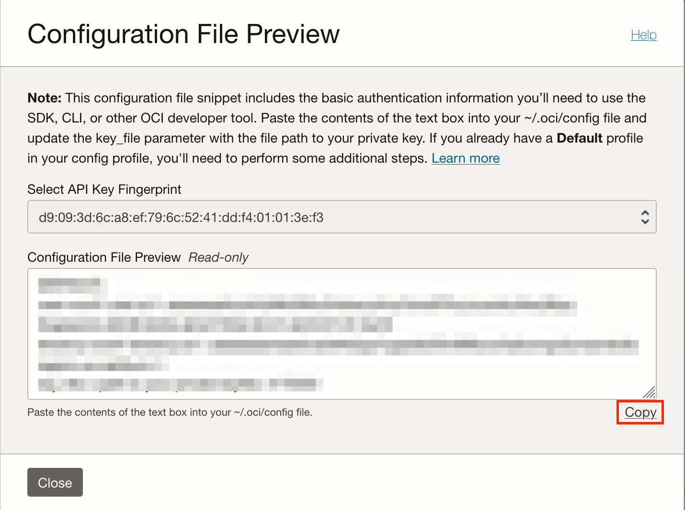

# Podcast generator using OCI Generative AI, Oracle Speech & Visual Builder

Welcome to this guide on building a groundbreaking application that uses Oracle's AI-powered tools to generate high-quality podcasts effortlessly. Leveraging the Oracle Cloud Infrastructure (OCI) GenAI and AI Speech (Text-to-Speech) services, this solution transforms written content into engaging, natural-sounding audio.
The application is designed to streamline podcast production through advanced AI capabilities. Starting from a simple text input, the app uses GenAI to generate a structured podcast script. It then enhances the speech output with SSML (Speech Synthesis Markup Language), which gives the audio a natural flow, making it sound like a professional recording. The result is a high-quality audio experience that can cater to a wide range of content needs and audiences.
This application is built using Oracle Visual Builder Cloud Service (VBCS), a powerful low-code platform that simplifies development and accelerates the creation of robust applications without extensive coding. With this low-code approach, even complex workflows are straightforward to set up, allowing developers to focus on leveraging AI's potential for high-quality audio synthesis.
This AI-powered solution not only automates and optimizes the podcast creation process but also allows content creators to deliver professional audio content at scale efficiently.

Reviewed: 29.09.2025

# When to use this asset?

This asset is ideal for developers, content creators, marketers, educators, or any professional looking to:

- **Automate podcast production**: Save time by turning written content into high-quality audio without manual recording or editing.
- **Enhance content accessibility**: Make blog posts, newsletters, or reports more accessible by offering audio formats.
- **Create engaging internal communications**: HR or corporate communications teams can quickly generate spoken updates for employees.
- **Support e-learning**: Teachers or educational platforms can generate audio lessons, summaries, or storytelling content.
- **Prototype AI-based solutions**: Developers building solutions with Oracle Cloud’s AI services can use this as a reference or starting point.
- **Demonstrate Oracle Cloud capabilities**: This is a great demo asset for solution engineers and pre-sales teams showcasing OCI GenAI and AI Speech.

Use this asset when you need a scalable, repeatable, and professional way to transform any kind of text into engaging, spoken content—quickly and efficiently.

# How to use this asset?
 
## **1. Prepare your user**
   
   In Oracle Cloud Infrastructure (OCI), API keys are used for secure authentication when accessing OCI resources through REST APIs. OCI API keys consist of two parts: a Public key and a Private key. You use the OCI console to generate the Private/Public key pair.
   Generate API Keys using OCI Console
    To Generate the API Keys using OCI Console:

  - Login into your OCI Account.
   ![alt text]
  - Click on the Profile icon at the top-right corner and select your Profile hyperlink.
   
  - Under Resources section at the bottom-left, select API Keys and then click Add API Key.
   
  - The Add API Key dialog is displayed. Select Generate API Key Pair to create a new key pair.
  
  - Click Download Private Key. A .pem file is saved to your local device. You do not need to download the public key and click Add button.
  
  

## **2.Pick you compartment**
Identify the compartment you're currently working within. Navigate to 'Identity' -> 'Compartments'. Locate your compartment and make a note of its OCID (Oracle Cloud Identifier)

## **3.Open Visual Builder**
### Import Visual Builder project
* Open Visual Builder and click on the "Import" button. Choose "Application from file".
* Drop the zip project file
* Provide a name and an ID, for example "Podcast_Generator". Click on Import button.
 
  
### Configure REST APIs authentication
* Open the recently created project.
 
* Click on Services button (left side) and click on "Backends"
 

* Now, click on TTS, and Servers to edit server authentication.

* Click the pencil to provide the OCI Crendentials
 

* Provide the crendentials you got during the step 1.
 

* Repeat the same process with the GenAI backend.

### Provide your compartmentId 
* Provide compartmentId default value in the project variable named "comparmentid" that you got during the step 2.
 

##  **4.Preview the application**
* Now can provide a topic in the text area and click "generate" button. 
 

* Automatically a podcast script will be created and will generate the audio podcast using the Cindy and Bob voices
  

### Notes
* It is important to note that, as of the time of writing this tutorial, the Speech-to-Text service is available exclusively in the Phoenix region.

## I hope you liked it.
Author: Jesús Brasero
 
# License
 
Copyright (c) 2025 Oracle and/or its affiliates.
 
Licensed under the Universal Permissive License (UPL), Version 1.0.
 
See [LICENSE](https://github.com/oracle-devrel/technology-engineering/blob/main/LICENSE) for more details.
