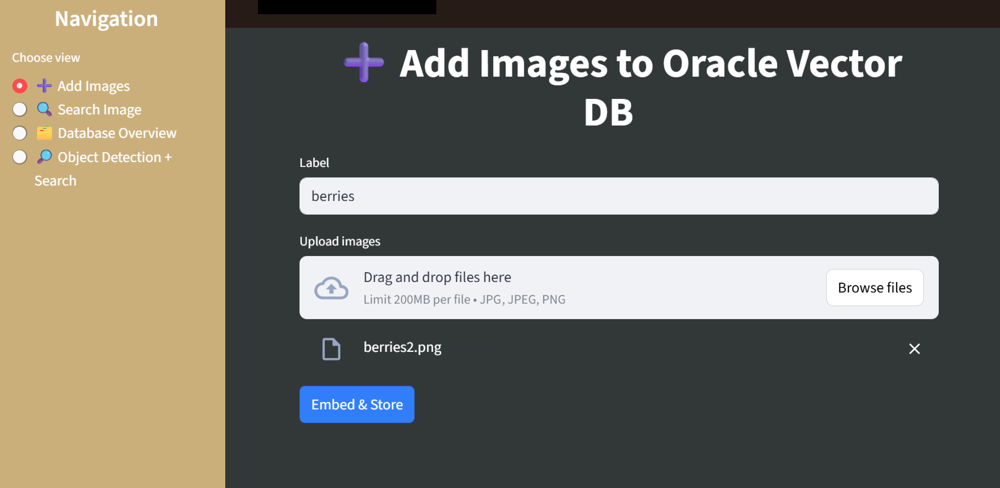
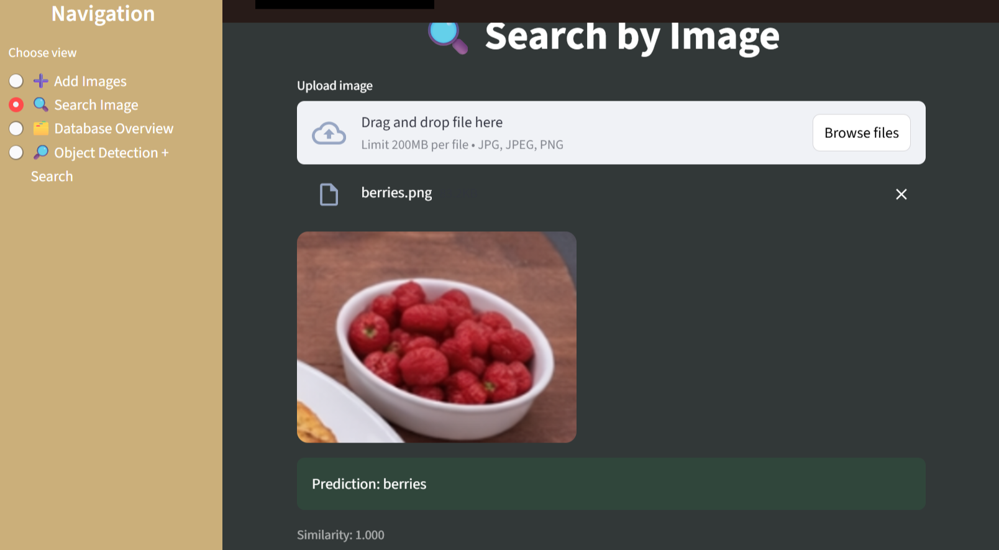
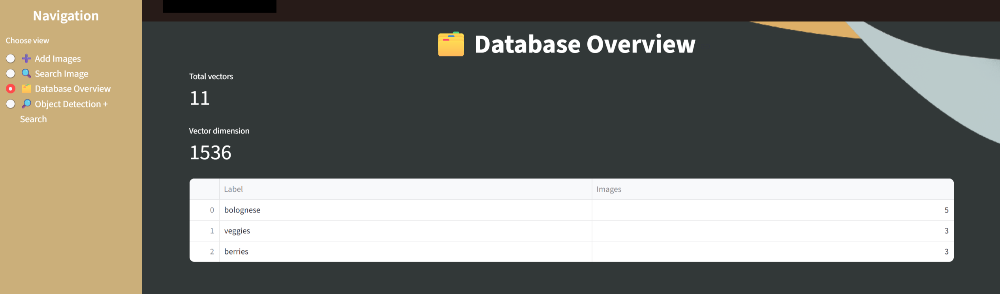
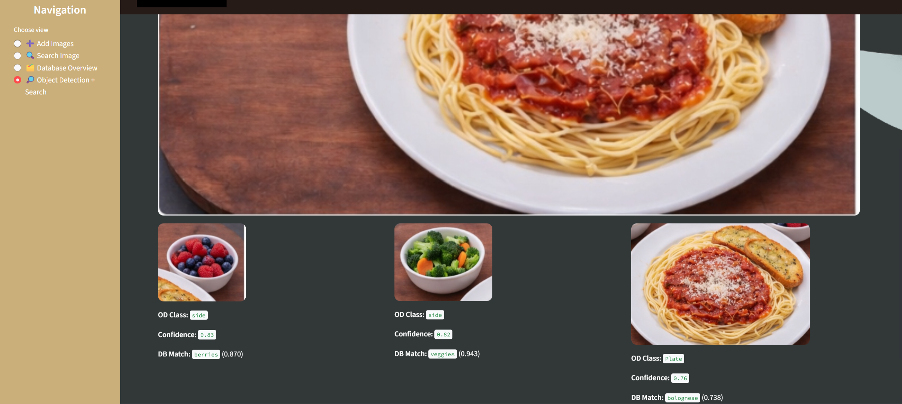

# OCI Vision + GenAI Embeddings  
## Object Detection → Vector Search Demo

## Overview

This demo showcases an **end-to-end image understanding and retrieval pipeline on Oracle Cloud Infrastructure (OCI)**:

- Detect objects in an uploaded image using **OCI Vision – Custom Object Detection**
- Crop each detected object
- Generate image embeddings for:
  - the full image, and/or
  - individual detected objects  
  using **OCI Generative AI Inference** (e.g. `cohere.embed-v4.0`)
- Store and search embeddings in **Oracle Autonomous Database Vector Search**
- Retrieve the **closest matching label** from a curated dataset

The solution is implemented as a **Streamlit application** with multiple views:

- **Add Images** – build a labeled vector dataset  
- **Search Image** – query by image similarity  
- **Database Overview** – inspect stored vectors  
- **Object Detection + Search** – detect and identify multiple objects per image  

---

## 1. Prerequisites

Before starting, ensure you have:

### OCI Resources

- **OCI Vision Custom Object Detection model**
  - Trained on your target objects  
  - Example: tray components such as `plate`, `veggies`, `berries`, `drink`
- **Oracle Autonomous Database** up and running
- **OCI configuration profile** with permissions for:
  - Generative AI Inference (Embeddings)
  - OCI Vision (AnalyzeImage)
  - Access to the target compartment

### Local Environment

- Python 3.9+
- Required libraries installed 

```
pip install -r requirements.txt
```

---

## 2. Expected Project Layout

The Streamlit app expects the following directory structure (see additional string for tree format):

- project/
- app.py
- images/
- Wallet_DB/

---

## 3. Database Setup (Vector Table)

### 3.1 Download the Wallet

- Download the Autonomous Database wallet from OCI Console
- Unzip it into `Wallet_DB/`

---

### 3.2 Create the Vector Table

Create a table to store labels and embeddings.
- Below is the schema that I used for the demo (modifications here will need to be reflected in the app)

```
CREATE TABLE image_vectors (
  id        NUMBER GENERATED BY DEFAULT AS IDENTITY PRIMARY KEY,
  label     VARCHAR2(200),
  embedding VECTOR(1536)
);

```

Notes:
- The vector dimension **must match** the embedding model output
- This demo uses **1536-dimensional embeddings**
- Keep dimensions consistent for insert and search operations

---

## 4. Run the Streamlit App

Run the application from the project directory.

```
streamlit run app.py
```

---

## 5. App Views (How to Use)

### ➕ Add Images



**Purpose:** Build your labeled vector dataset.

Steps:
1. Enter a label (e.g. veggies, berries, risotto, coke)
2. Upload one or more images
3. Click Embed & Store

Tip:
- Upload multiple images per label with different angles and lighting

---

### 🔍 Search Image



**Purpose:** Identify the closest label for a query image.

Output:
- Prediction: closest label
- Similarity score based on cosine similarity

---

### 🗂️ Database Overview



**Purpose:** Inspect stored vectors and dataset distribution.

Displays:
- total vectors stored
- expected vector dimension
- counts per label

---

### 🔎 Object Detection + Search



**Purpose:** Detect and identify multiple objects within a single image.

For each detected object:
- the image is cropped
- embedded
- searched against the vector database

The UI displays:
- cropped image
- Vision-predicted class
- detection confidence
- closest DB label and similarity score

---

## 7. Pipeline Walkthrough (Example)

Tray-of-food example:

- Upload a tray image
- Vision detects multiple food items
- Each item is cropped and embedded
- Each embedding is matched to the closest label in the vector database

This enables **multi-object identification within a single image** rather than whole-image classification.

---

## 8. Troubleshooting

### Authentication / Permissions Issues

Verify:
- OCI config path is valid
- Private key is valid
- IAM policies allow Vision and Generative AI access

---

### Object Detection Issues

Check:
- model OCID is correct and active
- confidence threshold is not too high
- images resemble training data

---

### Vector Search Issues

Ensure:
- vector dimensions match everywhere
- enough representative images per label
- labels are not overly broad

---

### Database Connection Issues

Confirm:
- wallet is correctly unzipped
- TNS name exists and is the same as the one in the wallet
- network access to Autonomous Database is allowed

---

## 9. References

- OCI Vision documentation https://docs.oracle.com/en-us/iaas/Content/vision/using/home.htm
- OCI Vision Python SDK https://docs.oracle.com/en-us/iaas/tools/python/latest/api/ai_vision.html  
- OCI Generative AI documentation https://docs.oracle.com/en-us/iaas/Content/generative-ai/home.htm
- Oracle Database Vector Search https://www.oracle.com/in/database/ai-vector-search/

---

## 10. License

Copyright © 2025  
Oracle and/or its affiliates.

Licensed under the Universal Permissive License (UPL) 1.0.  
See the LICENSE file for details."
