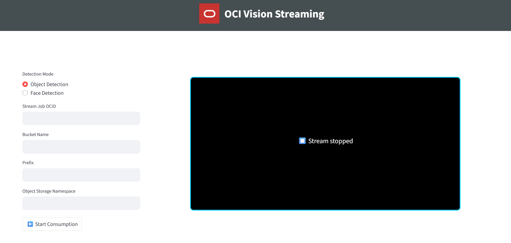

# OCI Vision Streaming Setup and Consumption

## Quick Start Guide

- The code files in this demo are 
  - OCIVisionStreamSetup.ipynb - Notebook containing cells to run to start the stream job(streaming frames from the RTSP server to the OCI Vision).
  - Stream-analysis.py - Streamlit application that can be used to consume the generated outputs of stream video analysis

## 1. Region Selection

OCI Vision Streaming is available in multiple regions.

- For the **simplest setup**, run your pipeline within the **Ashburn** region.  
  No subnet or private endpoint creation is required in Ashburn.

- To run in a region other than Ashburn, **[follow these steps](https://docs.oracle.com/en-us/iaas/Content/vision/using/video-stream-processing-top.htm)**.
  > _Running in other regions may require additional VCN/Subnet/Endpoint configuration._

---

## 2. Prerequisites

- **An active RTSP stream URL** (e.g., from an IP camera or RTSP streaming source)
- Access to a **Jupyter environment**
- Required permissions in your OCI compartment to use Vision, Stream Jobs, and Object Storage buckets

---

## 3. Setting up the Vision Streaming Job

1. **Open the** `OCIVisionStreamSetup.ipynb` **notebook in Jupyter**.

2. **Fill out the required fields at the top of the notebook:**

    - `CONFIG_PROFILE` &mdash; OCI CLI profile to use (e.g., `"DEFAULT"`)
    - `COMPARTMENT_ID` &mdash; your OCI compartment's OCID
    - `STREAM_JOB_DISPLAY_NAME` &mdash; a display name for your stream job
    - `CAMERA_URL` &mdash; your RTSP stream URL
    - `NAMESPACE` &mdash; your Object Storage namespace
    - `BUCKET` &mdash; target Object Storage bucket
    - `PREFIX` &mdash; (Optional) Prefix for output files in Object Storage
    - `FEATURES` &mdash; Detection features (`face`, `object`, etc.)

3. **Run the following notebook cells in order:**
    - Create Stream Source
    - Create Stream Job
    - Run Stream Job

    _This will start streaming frames from your camera to OCI Vision for detection (e.g., face or object recognition). The results (bounding box coordinates, frame encodings, etc.) will be stored as JSON files in the specified Object Storage bucket._

---

## 4. Consuming Streams with Streamlit

  Install the required dependencies by running 
    
      pip install -r requirements.txt
    

While the stream job is active:

1. **Start the Streamlit app (in terminal):**
   ```bash
   streamlit run streamlit_app.py 
2. In the Streamlit UI, enter the following:
    - Stream Job OCID
    - Bucket Name
    - Prefix (Object Storage path, if applicable)
    - Object Storage Namespace
    - Detection Type: choose between "Object Detection" or "Face Detection"
3. Click on Consume Stream The video with detected objects/faces will appear in your browser as annotated frames.
Note: Frames may appear slow; OCI Vision Streaming currently supports a maximum of 2 frames per second.
- Depending on whether you selected object detection or face detection in the features during the creation of the stream job, select the appropriate radio button to get the relevant analytics.


 
## 5. Resource Management — Important!
Stop the Stream Job when finished!
Leaving it running will keep streaming data into your bucket, leading to large storage consumption.
Clean up resources:
Use the notebook cells to delete the Stream Job and Stream Source.
Optionally, store the OCIDs of created resources and reuse them to avoid recreating each time.
 

## 6. References
- [OCI Vision Stream Analysis Documentation](https://docs.oracle.com/en-us/iaas/Content/vision/using/video-stream-processing-top.htm)  
- [OCI Python SDK API Reference](https://docs.oracle.com/en-us/iaas/tools/python/2.162.0/api/landing.html)
 
## 7. Troubleshooting
**Common Errors: 
If you encounter a 405 – Request Not Allowed error while running the stream job, it may be because the job is currently transitioning between states (for example, from CREATED to RUNNING). During this UPDATING phase, the job is temporarily locked, and you won’t be able to perform any actions on it. If it remains stuck in this state, try deleting the stream job and creating a new one.

## 8. License
Copyright (c) 2025 Oracle and/or its affiliates.
Licensed under the Universal Permissive License (UPL), Version 1.0.
See [License](https://github.com/facebookresearch/sam2/blob/main/LICENSE) for more details.
