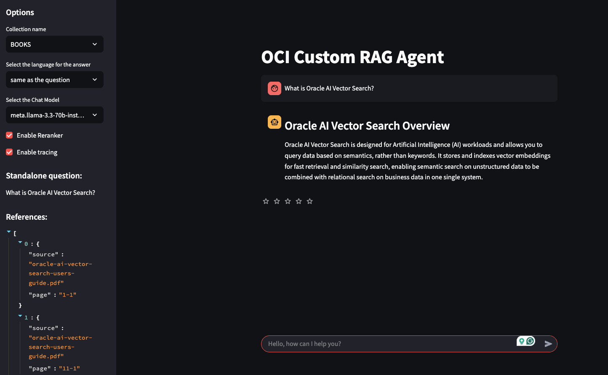

# Custom RAG agent
This repository contains all the code for the development of a **custom RAG Agent**, based on OCI Generative AI, Oracle 23AI DB and **LangGraph**

## Design and implementation
* The agent is implemented using **LangGraph**
* Vector Search is implemented, using Langchain, on top of Oracle 23AI
* A **reranker** can be used to refine the search

Design decisions:
* For every node of the graph there is a dedicated Python class (a **Runnable**, as QueryRewriter...)
* Reranker is implemented using a LLM. As other option, it is easy to plug-in, for example, Cohere reranker
* The agent is integrated with **OCI APM**, for **Observability**; Integration using **py-zipkin**
* UI implemented using **Streamlit**

Streaming:
* Support for streaming events from the agent: as soon as a step is completed (Vector Search, Reranking, ...) the UI is updated.
For example, links to the documentation' chunks are displayed before the final answer is ready.
* Streaming of the final answer.

## Status
It is **wip**.

## References
* [Integration with OCI APM](https://luigi-saetta.medium.com/enhancing-observability-in-rag-solutions-with-oracle-cloud-6f93b2675f40)

## Advantages of the Agentic approach
One of the primary advantages of the agentic approach is its modularity. 
Customer requirements often surpass the simplicity of typical Retrieval-Augmented Generation (RAG) demonstrations. Implementing a framework like **LangGraph** necessitates organizing code into a modular sequence of steps, facilitating the seamless integration of additional features at appropriate places.​

For example, to ensure that final responses do not disclose Personally Identifiable Information (PII) present in the knowledge base, one can simply append a node at the end of the graph. This node would process the generated answer, detect any PII, and anonymize it accordingly.

## Configuration
* use Python 3.11
* use the requirements.txt
* create your config_private.py using the template provided
