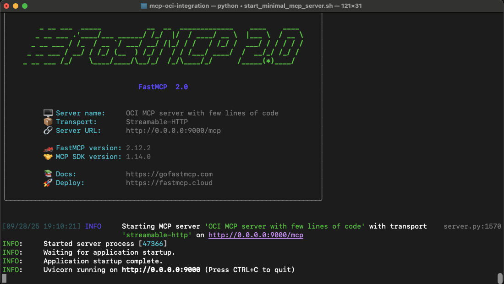

# MCP Oracle OCI integrations
This repository contains code and examples to help in the following tasks:
* **Develop** MCP servers in **Python**
* **Run** MCP servers on **Oracle OCI**
* **Integrate** MCP servers with **AI Agents**
* **Integrate** MCP servers with other **OCI resources** (ADB, Select AI, ...)
* **Integrate** MCP Servers running on OCI with AI Assistants like **ChatGPT**, Claude.ai, MS Copilot
* **Integrate** MCP Servers with OCI **APM** for **Observability**

## What is MCP?
**MCP (Model Context Protocol)** is an **open-source standard** that lets AI models (e.g. LLMs or agents) connect bidirectionally with external tools, data sources, and services via a unified interface. 

It replaces the “N×M” integration problem (where each AI × data source requires custom code) with one standard protocol. 

MCP supports **dynamic discovery** of available tools and context, enabling:
* AI Assistants to get access to relevant information, available in Enterprise Knowledge base.
* Agents to reason and chain actions across disparate systems. 

It’s quickly gaining traction: major players like OpenAI, Google DeepMind, Oracle are adopting it to make AI systems more composable and interoperable. 

In today’s landscape of agentic AI, MCP is critical because it allows models to act meaningfully in real-world systems rather than remaining isolated black boxes.

## Develop MCP Servers in Python
The easiest way is to use the [FastMCP](https://gofastmcp.com/getting-started/welcome) library.

**Examples**:
* in [Minimal MCP Server](./minimal_mcp_server.py) you'll find a **good, minimal example** of a server exposing two tools, with the option to protect them using [JWT](https://www.jwt.io/introduction#what-is-json-web-token).

If you want to start with **something simpler**, have a look at [how to start developing MCP](./how_to_start_mcp.md). It is simpler, with no support for JWT tokens.

## How to test
If you want to quickly test the MCP server you developed (or the minimal example provided here) you can use the [Streamlit UI](./ui_mcp_agent.py).

In the Streamlit application, you can:
* Specify the URL of the MCP server (default is in [mcp_servers_config.py](./mcp_servers_config.py))
* Select one of models available in OCI Generative AI
* Test making questions answered using the tools exposed by the MCP server.

In [llm_with_mcp.py](./llm_with_mcp.py) there is the complete implementation of the **tool-calling** loop.

## Semantic Search
In this repository there is a **complete implementation of an MCP server** implementing **Semantic Search** on top of **Oracle 23AI**.
To use it, you need only:
* To load the documents in the Oracle DB
* To put the right configuration, to connect to DB, in config_private.py.

The code is available [here](./mcp_semantic_search_with_iam.py). 

Access to Oracle 23AI Vector Search is through the **new** [langchain-oci integration library](https://github.com/oracle/langchain-oracle)

## Adding security
If you want to put your **MCP** server in production, you need to add security, at several levels.

Just to mention few important points:
* You don't want to expose directly the MCP server over Internet
* The communication with the MCP server must be encrypted (i.e: using TLS)
* You want to authenticate and authorize the clients

Using **OCI services** there are several things you can do to get the right level of security:
* You can put an **OCI API Gateway** in front, using it as TLS termination
* You can enable authentication using **JWT** tokens
* You can use **OCI IAM** to generate **JWT** tokens
* You can use OCI network security

More details in a dedicate page.

## Integrate MCP Semantic Search with ChatGPT
If you deploy the [MCP Semantic Search](./mcp_semantic_search_with_iam.py) server you can test the integration with **ChatGPT** in **Developer Mode**. It provides a **search** tool, compliant with **OpenAI** specs. 

Soon, we'll add a server fully compliant with **OpenAI** specifications, that can be integrated in **Deep Research**. The server must implement two methods (**search** and **fetch**) with a different behaviour, following srictly OpenAI specs.

An initial implementation is available [here](./mcp_deep_research_with_iam.py)

Details available [here](./integrate_chatgpt.md)

## Integrate OCI ADB Select AI
Another option is to use an MCP server to be able to integrate OCI **SelectAI** in ChatGPT or other assistants supporting MCP.
In this way you have an option to do full **Text2SQL** search, over your database schema. Then, the AI assistant can process your retrieved data.

An example is [here](./mcp_selectai.py)

