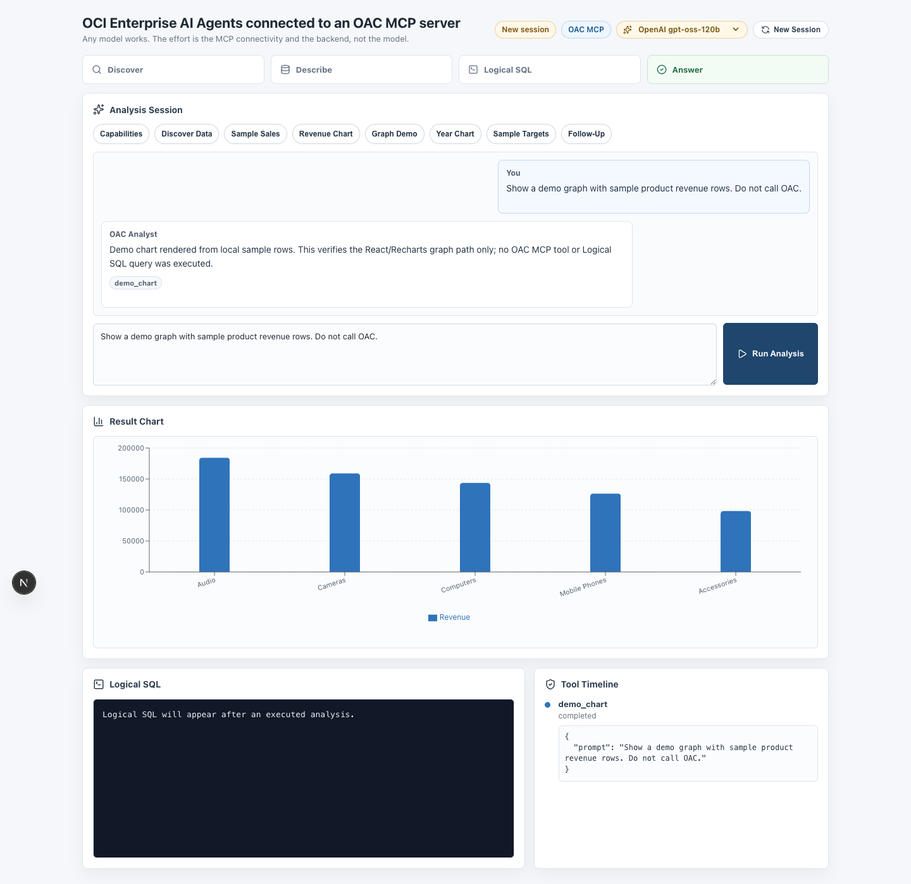
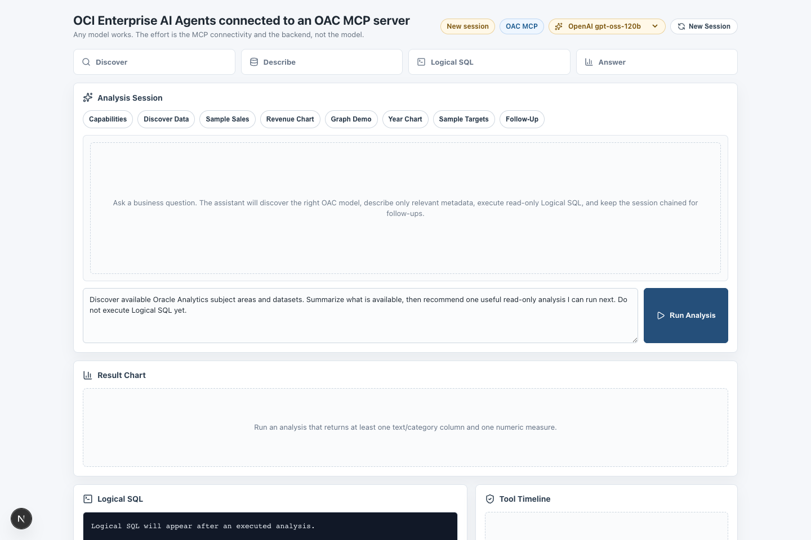

# OCI Enterprise AI Agents - OAC MCP Server

A React assistant that lets [OCI Enterprise AI](https://www.oracle.com/artificial-intelligence/enterprise-ai/) query **governed Oracle Analytics Cloud data** through the **OAC MCP server**. The model reasons through the OCI Generative AI Responses API, the app executes the delegated OAC MCP tool calls, and every numeric result is rendered as a chart - with the Logical SQL and the full tool timeline shown next to it.

Built with **Next.js 16**, **React 19**, **Recharts**, and a small **Python bridge**.



---

## Quick Start

```bash
cd files
npm install
python3 -m venv .venv
.venv/bin/pip install -r scripts/requirements.txt
cp .env.example .env    # fill in your values (see Configuration)
npm run dev
```

Open [http://localhost:3000](http://localhost:3000). Click the **Graph Demo** quick prompt and **Run Analysis** to verify the whole React → Python → chart path *without any OAC credentials*. Then configure OAC access and run a real analysis (e.g. the **Sample Sales** quick prompt).

### Requirements
- Node.js 22+
- Python 3.9+
- An OCI tenancy with **Generative AI** access: the OpenAI-compatible Responses endpoint, an API key, and a Generative AI project OCID
- An **Oracle Analytics Cloud** instance whose MCP endpoint (`/api/mcp`) is enabled, and a user with access to at least one subject area or dataset (the demo prompts use `Sample Sales Lite` / `Sample Targets Lite`)

---

## Configuration

### Required environment variables

Create `files/.env` (copy `.env.example`):

```env
# OCI Generative AI - OpenAI-compatible Responses API for your region
GENAI_BASE_URL=https://inference.generativeai.eu-frankfurt-1.oci.oraclecloud.com/openai/v1
GENAI_API_KEY=<oci-genai-api-key>
GENAI_PROJECT_ID=ocid1.generativeaiproject.oc1..xxxxx

# Oracle Analytics Cloud MCP endpoint of your instance
OAC_MCP_SERVER_URL=https://<your-oac-instance>.analytics.ocp.oraclecloud.com/api/mcp

# Optional - derived from OAC_MCP_SERVER_URL when not set
# OAC_TOKEN_REFRESH_URL=https://<your-oac-instance>.analytics.ocp.oraclecloud.com/api/dv/api/v1/tokens/token/refresh

# Optional - python used by the API route (default: files/.venv/bin/python, then python3)
# PYTHON_BIN=/usr/bin/python3
```

### OAC authentication

Two options, in the order the bridge resolves them:

1. **Access token** - set `OAC_ACCESS_TOKEN` (or `MCP_BEARER_TOKEN`) in `.env`, or paste a token in the UI. OAC access tokens expire after ~1 hour.
2. **`tokens.json` (recommended)** - in OAC go to **Profile → Mobile Authentication → Download token file** and save it as `files/tokens.json` (shape in `tokens.example.json`). The bridge reads it on every request and **refreshes it automatically** ~10 minutes before expiry, persisting the rotated refresh token back to the file. This survives well beyond the 1-hour access-token window.

> The refresh endpoint authenticates with the *access token itself*, so once a downloaded token file fully expires it cannot be refreshed - download a fresh `tokens.json` from OAC.

---

## Architecture

```
Browser (React + Recharts)
   │  POST /api/oac-demo  { prompt, previousResponseId, ... }
   ▼
Next.js API route (files/src/app/api/oac-demo/route.js)
   │  spawns one process per request, JSON over stdin/stdout
   ▼
Python bridge (files/scripts/oac_react_api.py)
   ├──► OCI Generative AI Responses API   (model reasoning, function calling)
   └──► OAC MCP server  /api/mcp          (JSON-RPC 2.0: initialize, tools/list, tools/call)
```

The model never talks to OAC directly. The bridge advertises the three OAC MCP tools to the model as function tools, executes each requested call against the OAC MCP JSON-RPC endpoint, compacts the result (large metadata is trimmed before it re-enters the context), and chains it back to the Responses API with `previous_response_id`. After the loop finishes, the bridge extracts the last Logical SQL result rows into a Recharts-friendly `{categoryKey, valueKeys, data}` payload for the UI.

Only three read-only OAC MCP tools are allowed:

| Tool | Purpose |
|---|---|
| `discover_data` | List governed Subject Areas and uploaded datasets |
| `describe_data` | Inspect columns, measures, dimensions of one model |
| `execute_logical_sql` | Run read-only Logical SQL against the governed model |

---

## Features

### Chat with chained sessions
Follow-up questions keep `previous_response_id`, so "break that down by month" works. **New Session** resets the chain.



### Governed analytics through MCP
The assistant discovers the right subject area or dataset, describes only the relevant metadata, and builds Logical SQL from the exact described column names - including the `XSA('owner'.'Dataset')` syntax for uploaded datasets.

### Automatic result charts
Any executed Logical SQL result with at least one category column and one numeric measure is rendered as a bar chart. A **Graph Demo** quick prompt renders a deterministic local chart to verify the UI path with no OAC access at all.

### Tool timeline + Logical SQL panel
Every MCP call is listed with status, arguments, and compacted output; all executed Logical SQL statements are shown verbatim.

### Token diagnostics
On 401/403 the bridge reports the token source used, whether the JWT is readable/expired, and whether the token audience matches the OAC host - the usual failure causes, stated directly in the error message.

### Display masking
Dataset owner e-mails, OCIDs, and `XSA('owner'...)` identifiers are masked in the rendered UI so demo recordings don't leak identifiers.

---

## Project Structure

```
oci-enterprise-ai-agents-oac-mcp-server/
├── README.md
├── LICENSE
├── images/                          # screenshots used in this README
└── files/
    ├── package.json                 # next, react, recharts, react-markdown, remark-gfm, lucide-react
    ├── next.config.mjs
    ├── jsconfig.json
    ├── .env.example                 # copy to .env and fill in
    ├── tokens.example.json          # shape of the downloaded OAC token file
    ├── src/app/
    │   ├── layout.js                # minimal root layout
    │   ├── globals.css
    │   ├── page.js                  # the assistant UI (chat, stages, chart, timeline)
    │   ├── page.module.css
    │   └── api/oac-demo/route.js    # spawns the Python bridge per request
    └── scripts/
        ├── oac_react_api.py         # JSON bridge: Responses API + OAC MCP + chart builder
        ├── refresh_oac_tokens.py    # CLI + importable helper for the tokens.json refresh flow
        └── requirements.txt         # openai, requests
```

---

## Data Flow

### One chat turn

1. UI POSTs `{action: "chat", prompt, previousResponseId, ...}` to `/api/oac-demo`
2. The route spawns `scripts/oac_react_api.py` and writes the payload to stdin
3. The bridge resolves an OAC token (see below) and preflights `initialize` against the OAC MCP endpoint - 401/403 fail fast with token diagnostics
4. The bridge lists the OAC MCP tools and exposes them to the model as function tools via the Responses API
5. Each model tool call is executed by the bridge against OAC MCP (`tools/call`), compacted, and returned to the model; the loop repeats until the model produces a final answer
6. The bridge extracts Logical SQL, builds the chart payload from the last SQL result rows, and emits one JSON object to stdout; the route returns it to the UI

### Token resolution order

1. `accessToken` pasted in the UI payload
2. `files/tokens.json` - used directly while valid, auto-refreshed (and persisted) when within 10 minutes of expiry
3. `OAC_ACCESS_TOKEN` / `MCP_BEARER_TOKEN` environment variables

### Chart building

`build_chart_payload` walks the tool timeline backwards to the last successful `execute_logical_sql`, normalizes rows (JSON batches, column/value arrays, or markdown tables), picks the first text column as category and up to three numeric columns as series, and caps the data at 40 rows.

---

## OCI API endpoints used

### Generative AI (inference)
- `POST {GENAI_BASE_URL}/responses` - model reasoning with function tools, chained via `previous_response_id` (OpenAI-compatible Responses API; authenticated with `GENAI_API_KEY` + `GENAI_PROJECT_ID`)

### Oracle Analytics Cloud
- `POST {OAC_MCP_SERVER_URL}` - MCP JSON-RPC 2.0: `initialize`, `tools/list`, `tools/call` (Bearer token)
- `POST .../api/dv/api/v1/tokens/token/refresh` - refreshes a downloaded token file: current access token in the `Authorization` header, refresh token as `text/plain` body; returns rotated `accessToken`/`refreshToken`

---

## Commands

```bash
npm run dev      # Dev server (Turbopack)
npm run build    # Production build
npm run start    # Production server
npm run lint     # ESLint

# Refresh a downloaded token file manually
.venv/bin/python scripts/refresh_oac_tokens.py tokens.json

# Smoke-test the bridge without the UI
echo '{"action":"config"}' | .venv/bin/python scripts/oac_react_api.py
```

---

## Troubleshooting

**`OAC MCP initialize returned HTTP 401/403`**
The token is expired, malformed, or issued for a different OAC instance. The error includes the token source used and JWT diagnostics. Fix: paste a fresh access token, or download a new `tokens.json` from the *same* OAC instance as `OAC_MCP_SERVER_URL`.

**`401` from the token refresh endpoint**
The refresh flow authenticates with the access token itself, so a fully expired `tokens.json` cannot be refreshed. Download a fresh one from OAC.

**`Missing oacMcpUrl.`**
`OAC_MCP_SERVER_URL` is not set in `files/.env` and no URL was supplied by the UI.

**`Python bridge returned no JSON.`**
The route couldn't run the bridge. Ensure the venv exists at `files/.venv` (or set `PYTHON_BIN`) and that `pip install -r scripts/requirements.txt` succeeded. The stderr excerpt is included in the error response.

**Pasted MCP URL ends in `/ui/api/mcp`**
That's the browser UI route; programmatic calls get a 302 to the login page. The bridge rewrites it to `/api/mcp` automatically.

**`EADDRINUSE: address already in use`**
Another dev server holds port 3000. Run `npm run dev -- --port 3001`.

**No chart appears after an analysis**
The chart needs at least one text/category column and one numeric measure in the *executed* SQL result. The chart panel explains which condition failed (no SQL executed, SQL failed, or no plottable rows).

---

## Tech Stack

- **Framework** - Next.js 16 (App Router, Turbopack)
- **UI** - React 19, Lucide icons, CSS Modules
- **Charts** - Recharts
- **Markdown** - react-markdown + remark-gfm
- **Bridge** - Python 3, `openai` (OCI Responses API), `requests` (OAC MCP JSON-RPC + token refresh)
- **Protocols** - MCP (JSON-RPC 2.0 over streamable HTTP), OpenAI-compatible Responses API

---

## License

Copyright (c) 2026 Oracle and/or its affiliates.

Licensed under the Universal Permissive License (UPL), Version 1.0.

See [LICENSE](LICENSE) for more details.
