# OCI Enterprise AI Agents

A chat interface and agent hub for [Oracle Cloud Infrastructure Enterprise AI](https://www.oracle.com/artificial-intelligence/enterprise-ai/). Streaming responses, MCP tool integration, OAuth2 SSO, and a full settings workbench to tailor the assistant to each deployment.

Built with **Next.js 16**, **React 19**, and **MUI v7**.

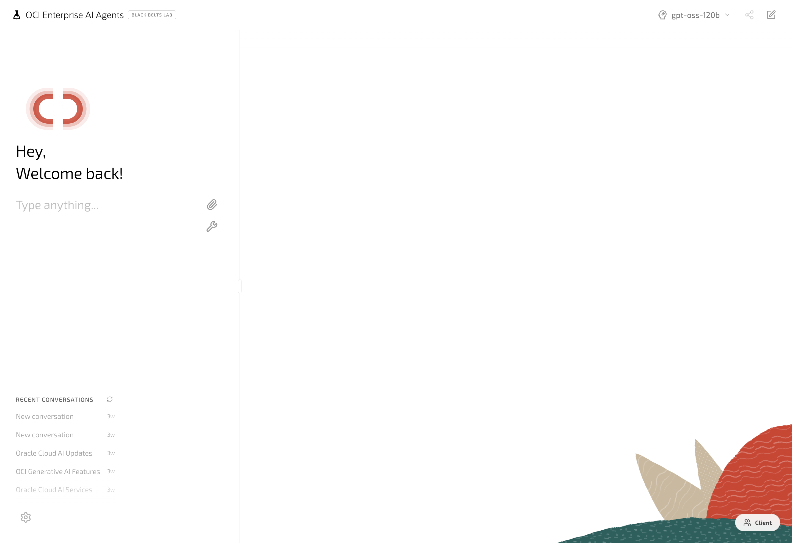

---

## Quick Start

```bash
npm install
npm run dev
```

Open [http://localhost:3000](http://localhost:3000). On first run, create a `.env.local` with the values from [Configuration](#configuration).

### Requirements
- Node.js 22+ (the Dockerfile uses `node:22-alpine`)
- An OCI tenancy with access to **Generative AI** (Projects, inference, vector & semantic stores) and **Generative AI Agents** (memory, agent flows)
- Locally: `~/.oci/config` with a valid API key
- In a container: **Resource Principal** configured on the Container Instance

---

## Configuration

### Required environment variables

```env
# OCI Enterprise AI: set to your tenancy's region
OCI_REGION=us-chicago-1                # any region key works (us-ashburn-1, eu-frankfurt-1, ap-sydney-1, …)
OCI_COMPARTMENT_ID=ocid1.compartment.oc1..xxxxx
OCI_GENAI_PROJECT_ID=ocid1.generativeaiproject.oc1..xxxxx

# Local dev (API-key auth via ~/.oci/config)
OCI_CONFIG_FILE=~/.oci/config
OCI_CONFIG_PROFILE=DEFAULT

# Container deployments (Resource Principal instead of config file)
USE_RESOURCE_PRINCIPAL=true
```

> **About the Project.** A **Project** is the OCI Generative AI resource that organizes conversations, responses, files, and sandboxes: it's required for any OpenAI-compatible API call. It's also where you configure data retention (max 720h for both responses and conversations), short-term memory compaction, and long-term memory extraction/embedding models. Memory and compaction settings are **set at project creation and cannot be changed later**, so plan ahead. Create one in the OCI Console under *Analytics & AI → Generative AI → Projects*.

### SSO (Oracle IDCS), optional but recommended

```env
IDCS_DOMAIN_URL=https://idcs-xxxx.identity.oraclecloud.com
IDCS_CLIENT_ID=...
IDCS_CLIENT_SECRET=...
SESSION_SECRET=<random-long-string>
```

When these are set, `src/middleware.js` protects every route and redirects unauthenticated users through the OAuth2 Authorization Code flow (`/api/auth/login` → IDCS → `/api/auth/callback/oci`). Session state lives in a signed cookie.

### Observability: optional

```env
LANGFUSE_SECRET_KEY=sk-lf-...
LANGFUSE_PUBLIC_KEY=pk-lf-...
LANGFUSE_BASE_URL=https://cloud.langfuse.com
LOG_LEVEL=info
```

### Models

Models are **discovered dynamically** via `listModels` against the configured compartment. Whatever is enabled in your tenancy shows up in the model picker. No env var needed.

---

## Architecture

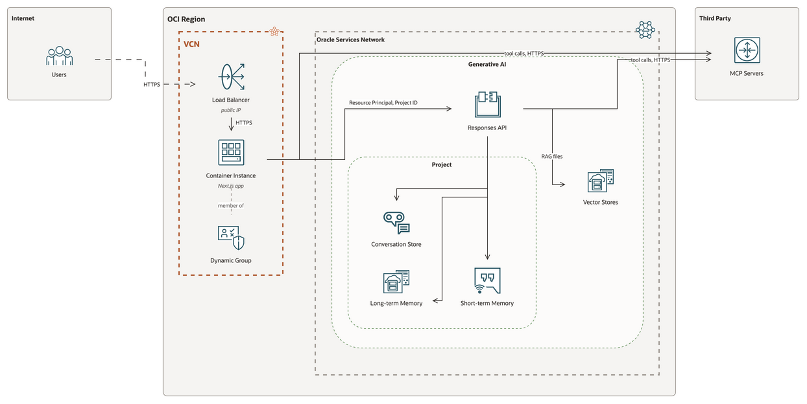

The browser hits `middleware.js` first (session guard). If the user has a valid IDCS session cookie, the request continues to the UI / API layers. The `/api/responses` route signs every request and streams from OCI's Generative AI Responses API; tool calls executed by the model run **on OCI's side** against the registered MCP servers. The app talks directly to MCP servers only when it needs to discover tools or proxy a manual JSON-RPC call.

---

## Features

### Chat
Real-time SSE streaming, conversation history persisted in OCI Conversation Store and cached locally (IndexedDB), automatic title generation, markdown rendering with code blocks and tables, multi-file attachments.

### Model picker
Switch models per conversation. The list is discovered dynamically from the configured compartment, so anything enabled in your tenancy shows up automatically.

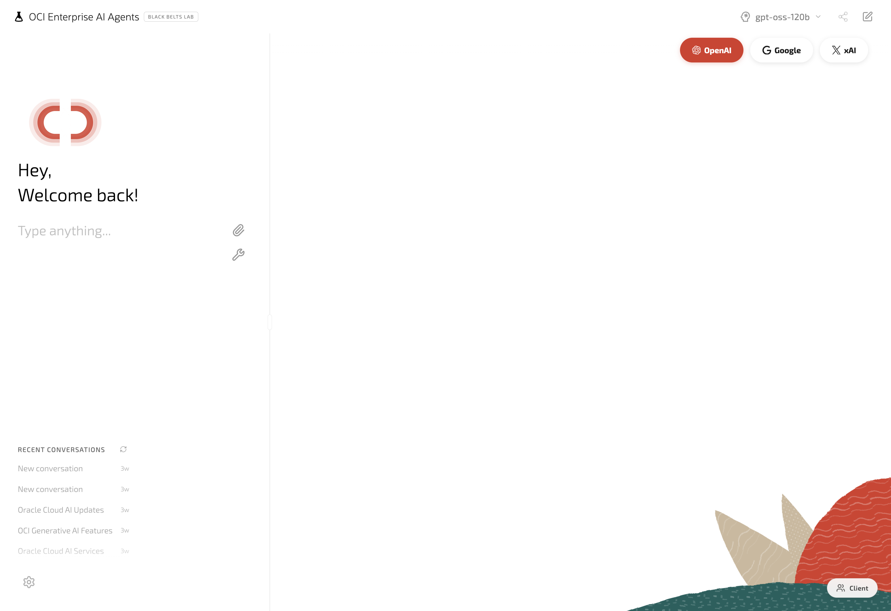

### File attachments: PDF, CSV, TXT, code, spreadsheets
Drop or paste documents straight into the chat. Each file is shown as a card and its contents are sent as context to the model.

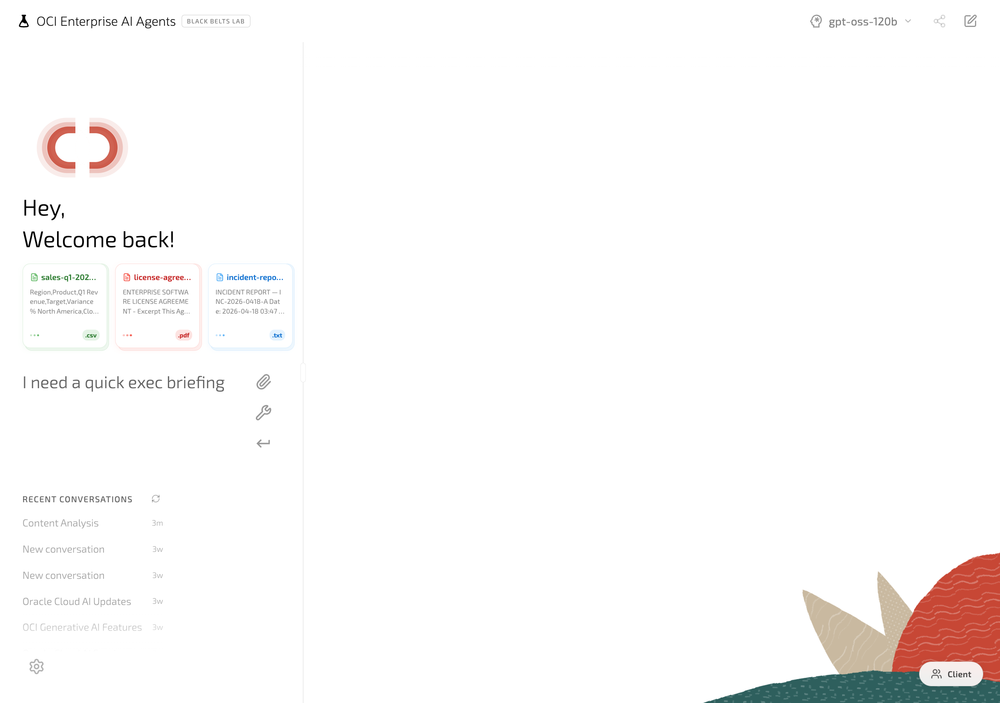

The model returns structured analysis across all attached files in one go:

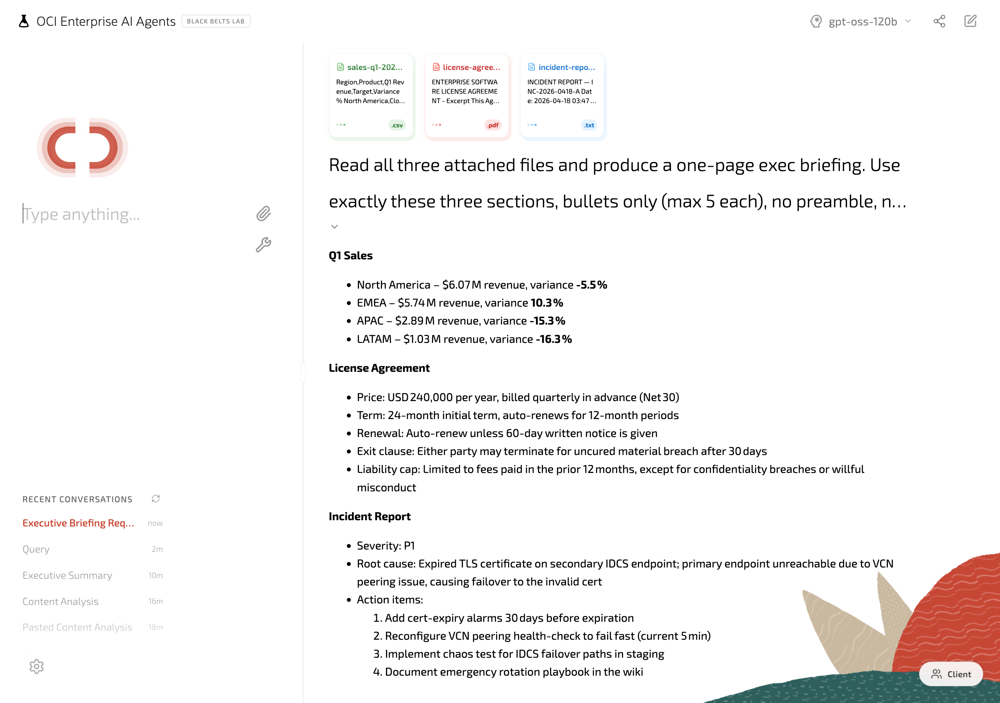

Supported extensions: `.pdf`, `.txt`, `.md`, `.csv`, `.json`, `.xml`, `.html`, `.css`, `.js`, `.ts`, `.jsx`, `.tsx`, `.py`, `.java`, `.c`, `.cpp`, `.h`, `.yml`, `.yaml`, `.toml`, `.ini`, `.log`, `.sql`, `.sh`, `.bat`, `.xlsx`, `.xls`, plus images.

### Native OCI tools
Toggle per-tool from Settings → Tools → Native:
- **Web Search** *(coming soon)*, real-time web lookups
- **File Search (RAG)**: vector retrieval over Knowledge Bases
- **Code Interpreter**: Python sandbox with 420+ libraries
- **Text-to-SQL** *(coming soon)*, natural language → SQL against your semantic stores

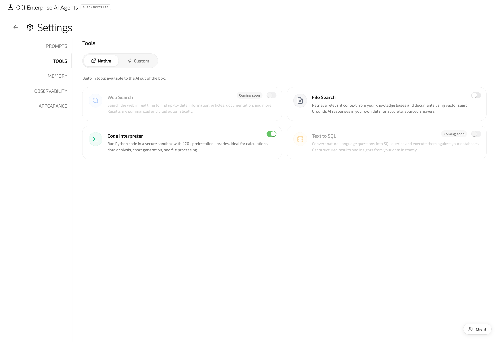

### Custom MCP servers
Add any MCP endpoint (API key, Bearer token, OAuth2 client credentials, or OAuth 2.1). Test the connection, discover tools, and selectively enable individual functions. Tokens persist through a signed-cookie flow, no secrets stored in localStorage.

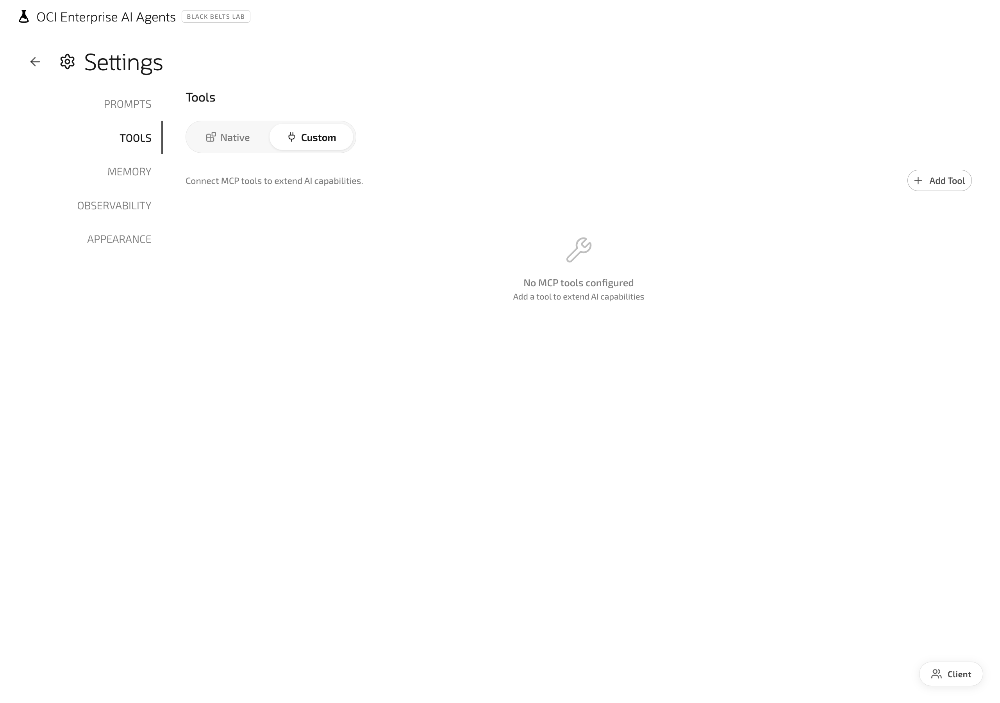

### Prompts: Instructions + System
Two separate things on the same tab:

- **Instructions**: free-text field where you put anything you want the assistant to know about you, your tone, or the context. This is where each user/team customizes the assistant.

  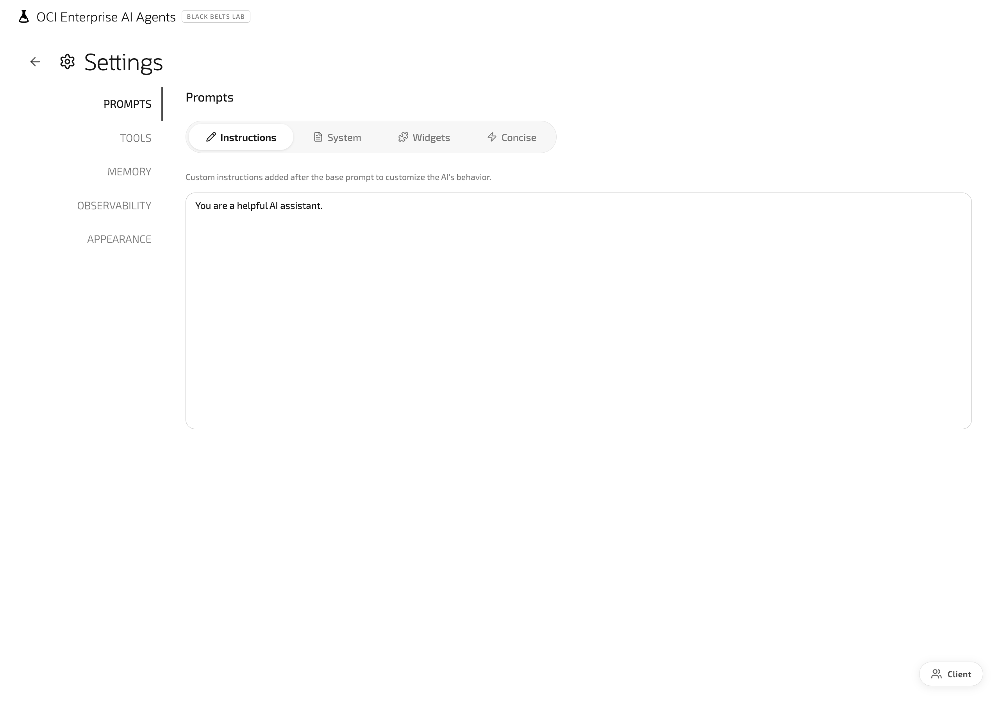

- **System**: read-only viewer of the base system prompt that ships with the app. It's already tuned for OCI workflows (response style, tool transparency, formatting), so you don't need to edit it; if you ever do want to change it, edit `src/app/utils/baseSystemPrompt.js` in code.

  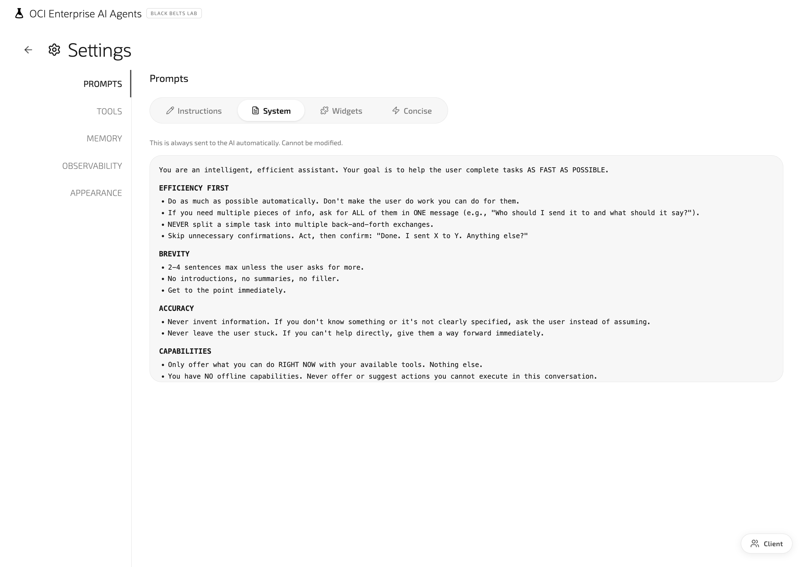

### Memory: long-term and short-term
Two independent memory layers, both backed by OCI's native memory subjects:

- **Long-Term Memory (LTM)**: persistent across all conversations of the same user. The model can recall facts, preferences, and context from previous sessions (e.g. "the user prefers concise answers in Spanish", "their main project is the auth migration"). Stored against a memory subject in OCI; the subject ID is configured per user in the Memory tab. Useful for personalization that survives logouts and new chats.

- **Short-Term Memory Optimization (STMO)**: scoped to the current conversation. Compacts and summarizes long chat histories so the model keeps context without burning the token window on raw transcripts. Enabled per-conversation, transparent to the user.

Both can be turned on independently. LTM needs a memory subject ID; STMO is just a toggle.

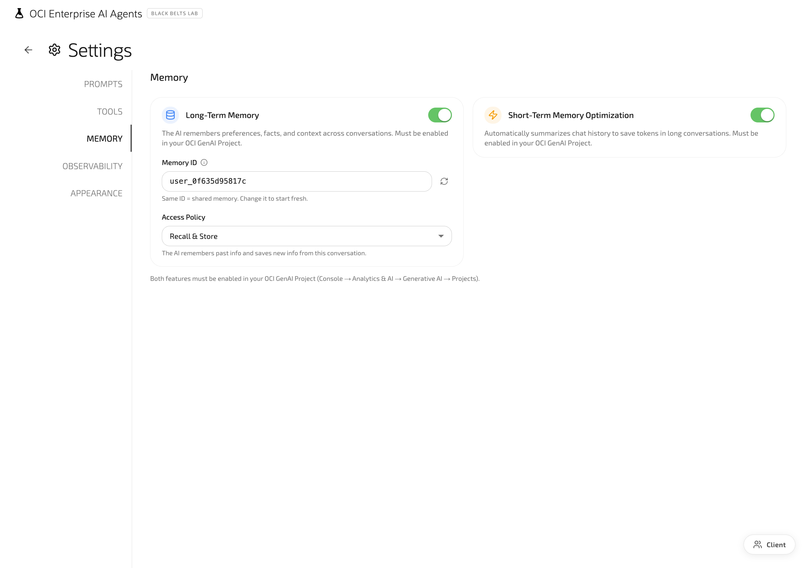

### Appearance: fully white-label
App title, logo, welcome message, accent color, dark mode, background, and live preview. Useful when shipping the app to multiple internal teams or external customers.

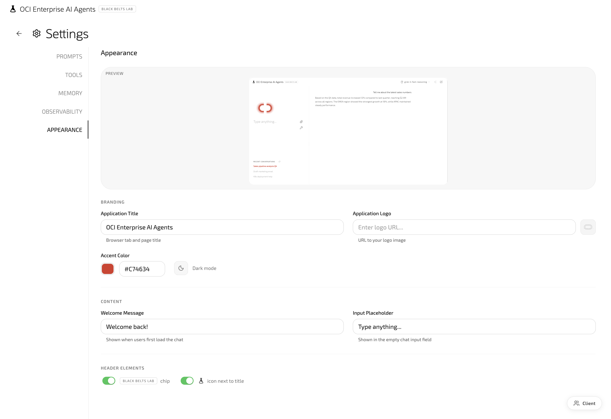

The same chat in dark mode:

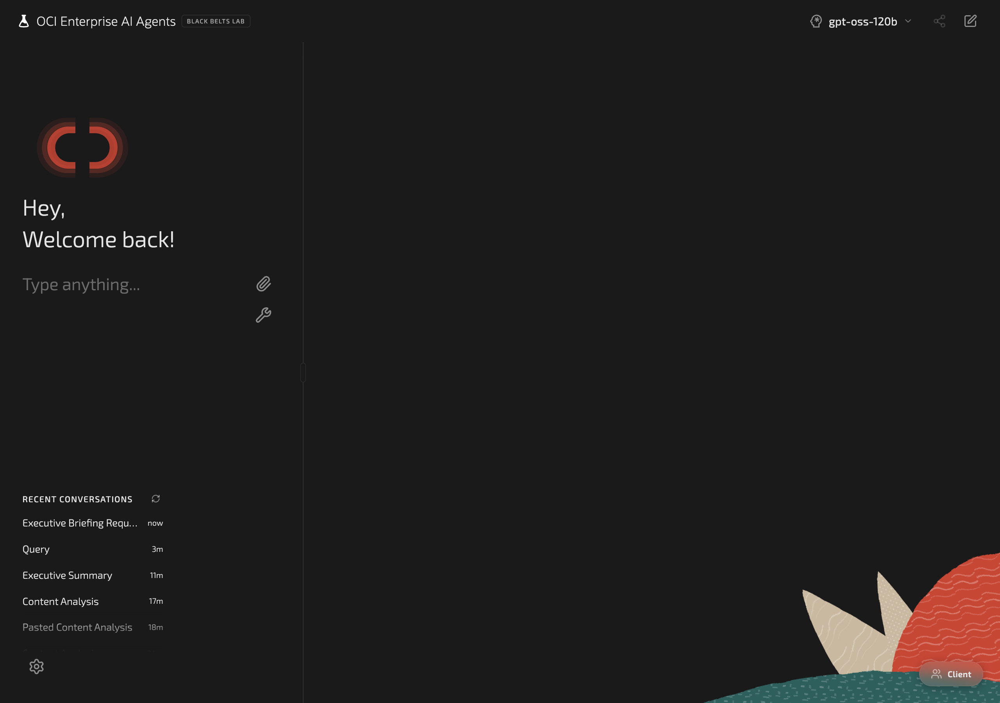

### Authentication
- **Oracle IDCS SSO** with OAuth2 Authorization Code (handled by `src/middleware.js` + `src/app/lib/auth.js`)
- **MCP OAuth 2.1** with PKCE for per-tool authorization (`src/app/lib/mcp-oauth.js`)
- Resource Principal auth when running in an OCI Container Instance

### Observability
Langfuse traces every request when `LANGFUSE_*` env vars are set. The Settings → Observability tab provides an in-app trace viewer.

---

## Project Structure

```
src/
├── middleware.js                    # Route protection + IDCS redirect
└── app/
    ├── api/                         # Next.js API routes
    │   ├── auth/                    #   IDCS OAuth endpoints
    │   ├── mcp/                     #   MCP JSON-RPC proxy + OAuth 2.1
    │   ├── responses/               #   Streaming chat proxy
    │   ├── conversations/           #   Conversation Store CRUD
    │   ├── models/                  #   Model discovery
    │   ├── semantic-stores/         #   Text-to-SQL stores
    │   ├── vector-stores/           #   RAG knowledge bases
    │   ├── files/                   #   Uploads
    │   └── generate-title/          #   Title generation
    │
    ├── components/
    │   ├── chat/                    # ChatInput, ChatMessage, ChatSidebar
    │   ├── settings/                # SettingsPage + tabs
    │   ├── ui/                      # Header, IOSSwitch, VerticalTabs, …
    │   ├── charts/                  # Recharts wrappers
    │   ├── agent/                   # Agent visualizations
    │   └── demo/
    │
    ├── config/
    │   ├── app.js                   # App-wide constants
    │   └── darkMode.js              # Dark-mode CSS vars + MUI overrides
    │
    ├── lib/                         # Server-side helpers
    │   ├── auth.js                  #   IDCS session + cookie signing
    │   ├── mcp-oauth.js             #   MCP OAuth 2.1 + PKCE
    │   ├── oci-auth.js              #   ConfigFile / ResourcePrincipal
    │   ├── oci-proxy.js             #   Request signing helpers
    │   ├── oci-headers.js           #   Required OCI headers
    │   └── logger.js                #   Structured logging
    │
    ├── services/                    # Client-side service layer
    │   ├── genaiAgentsService.js    #   Streaming API client
    │   ├── conversationStorage.js   #   IndexedDB cache
    │   ├── mcpService.js            #   MCP client/server mgmt
    │   ├── titleService.js          #   Auto title generation
    │   ├── oracleSpeechService.js   #   Speech integration
    │   └── flowService.js           #   Agent flows
    │
    ├── hooks/
    │   └── useChat.js               # Streaming chunk processing + state
    │
    ├── utils/
    │   ├── messageUtils.js          # Message parsing helpers
    │   ├── chartParser.js
    │   ├── baseSystemPrompt.js
    │   └── errorMessages.js
    │
    ├── intro/                       # Animated intro/splash
    ├── login/                       # Fallback login UI
    ├── settings/                    # Deep-linked settings routes
    └── page.js                      # Main chat interface
```

---

## Data Flow

### Chat streaming

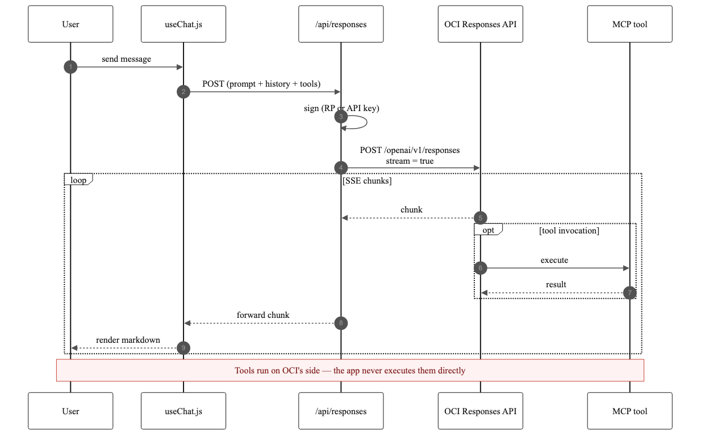

1. User sends a message → `useChat.js` calls `genaiAgentsService.sendMessage`
2. Client POSTs to `/api/responses`; the route signs the request and streams from OCI's `/openai/v1/responses` endpoint
3. SSE chunks flow back; `processStreamingChunk` accumulates text and renders it as markdown

### IDCS SSO (OAuth2 Authorization Code)

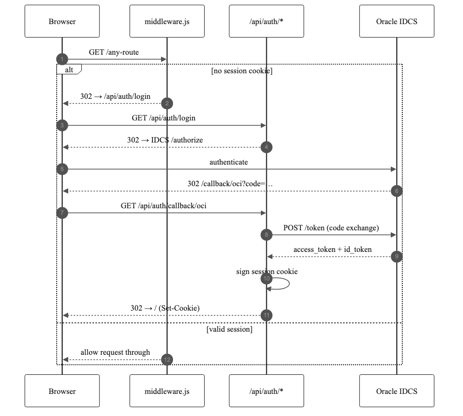

### MCP tool invocation
1. OCI executes MCP tools natively via the Responses API. the app **does not run tools itself**
2. For OAuth 2.1 MCP servers (e.g. SDD Generator), the client obtains an access token via `/api/mcp/oauth/*` and passes it to OCI in the tool's `authorization` field
3. Custom servers use the more generic `/api/mcp` JSON-RPC proxy for discovery and direct invocation (outside OCI)

### Settings persistence
All UI-level preferences live in `localStorage`:

- **`systemPrompt`** — Custom system instructions
- **`selectedModel`** — Current model ID
- **`uiSettings`** — App title, logo, welcome message, dark mode, accent color
- **`nativeToolsEnabled`** — Native OCI tools (web search, RAG, code, text-to-SQL)
- **`mcpServers`** — Configured custom MCP endpoints
- **`enabledTools`** — Per-function MCP tool selection

---

## OCI API endpoints used

The app talks to two OCI GenAI hosts, both signed with the same credentials.

### Inference plane: streaming chat

```
POST https://inference.generativeai.{region}.oci.oraclecloud.com/openai/v1/responses
```

```json
{ "model": "openai.gpt-4.1", "input": [...], "stream": true }
```

Standard OpenAI-compatible Responses API. Used for most chat models, with `OCI_GENAI_PROJECT_ID` sent as the `openai-project` header.

For **multi-agent models** the same host is used but with the OCI-native path `/v1/responses` (no `/openai` prefix).

### Control plane: store management

```
GET/POST/DELETE https://generativeai.{region}.oci.oraclecloud.com/20231130/...
```

CRUD for vector stores (RAG) and semantic stores (Text-to-SQL). The `20231130` is the API version date (2023-11-30).

---

## Deployment on OCI

The app runs as a **standalone Next.js build** inside an [OCI Container Instance](https://docs.oracle.com/en-us/iaas/Content/container-instances/home.htm), behind a [Load Balancer](https://docs.oracle.com/en-us/iaas/Content/Balance/home.htm) terminating HTTPS. Authentication to OCI services is done via [Resource Principal](https://docs.oracle.com/en-us/iaas/Content/Identity/Tasks/usingdynamicgroups.htm), so no API keys leave the tenancy.

### One-time setup (in OCI Console)

1. **OCIR repository**: `Developer Services → Container Registry → Create Repository`. Name it e.g. `oci-enterprise-ai-agents`. Note your tenancy's namespace (visible in the OCIR page header) and region key (e.g. `ord` for Chicago, `iad` for Ashburn).
2. **OCIR Auth Token**: `Profile → User Settings → Auth Tokens → Generate Token`. You'll log in to the registry with this token (`docker login ord.ocir.io -u "<namespace>/<user>"`).
3. **Dynamic Group**: `Identity → Dynamic Groups → Create`. Match all Container Instances in your compartment:
   ```
   ALL {resource.type='computecontainerinstance', resource.compartment.id='<compartment-ocid>'}
   ```
4. **IAM policies**: `Identity → Policies → Create`. Grant the dynamic group access to GenAI, Conversation Store, and any other services you use:
   ```
   allow dynamic-group <dg-name> to use generative-ai-family in compartment <compartment-name>
   allow dynamic-group <dg-name> to manage genai-agent-family in compartment <compartment-name>
   allow dynamic-group <dg-name> to manage objects in compartment <compartment-name>
   ```
5. **(SSO only)** Register the app in **IDCS** as a Confidential Application with redirect URI `https://<your-domain>/api/auth/callback/oci`. Save the Client ID + Secret for the env vars.

### Build & push the image

```bash
npm run build
docker buildx build --platform linux/amd64 \
  -t ord.ocir.io/<namespace>/oci-enterprise-ai-agents:latest .

docker login ord.ocir.io -u "<namespace>/<oci-user>"   # paste OCIR Auth Token as password
docker push ord.ocir.io/<namespace>/oci-enterprise-ai-agents:latest
```

### Create the Container Instance

`Developer Services → Container Instances → Create`:
- **Shape**: `CI.Standard.E4.Flex` (2 OCPU / 8 GB is enough to start).
- **Image**: `ord.ocir.io/<namespace>/oci-enterprise-ai-agents:latest`.
- **OCIR auth**: choose the Auth Token created above.
- **Networking**: VCN with a private subnet (the Load Balancer will be the public entrypoint).
- **Environment variables**: all the ones from the [Configuration](#configuration) section plus:
  ```
  USE_RESOURCE_PRINCIPAL=true     # use the Dynamic Group identity, not API keys
  ```
  Do **not** set `OCI_CONFIG_FILE` / `OCI_CONFIG_PROFILE` here. `PORT=8080` and `HOSTNAME=0.0.0.0` are already baked into the Dockerfile, so you don't need to add them.

### Put a Load Balancer in front

`Networking → Load Balancers → Create`:
- **Public LB** with HTTPS listener (attach a certificate).
- **Backend set** pointing to the Container Instance private IP on port `8080`.
- **Health check**: HTTP path `/ready`, interval 30s.
- The middleware reads the `Host` header to build OAuth redirect URIs, so make sure the LB forwards `Host` and `X-Forwarded-Proto`.

### Updating after a code change

```bash
# 1. Push a new image with the same tag
docker buildx build --platform linux/amd64 \
  -t ord.ocir.io/<namespace>/oci-enterprise-ai-agents:latest .
docker push ord.ocir.io/<namespace>/oci-enterprise-ai-agents:latest

# 2. Restart the instance to pull the new image
oci container-instances container-instance restart \
  --container-instance-id <instance-ocid> \
  --region us-chicago-1
```

### Notes
- A `/ready` healthcheck endpoint is exposed for the LB.
- If you mount the app under a subpath, set `BASE_PATH=/your-path`.
- When the LB-to-backend connection is HTTP (not HTTPS end-to-end), cookies must **not** carry the `Secure` flag. `mcp-oauth.js` and the IDCS auth code already handle this automatically when running over HTTP.
- All secrets (Client Secret, Session Secret, Langfuse keys) should be set as **environment variables on the Container Instance**, never baked into the image.

---

## Commands

```bash
npm run dev      # Dev server (Turbopack)
npm run build    # Production build (.next/standalone)
npm run start    # Production server
npm run lint     # ESLint
npm run test     # Playwright tests
```

---

## Troubleshooting

**`Invalid value for required field 'model'`**
The model you selected is not available on the OpenAI-compatible endpoint. Pick a different model in Settings → AI, or extend the app to hit the native endpoint.

**`OCI_COMPARTMENT_ID is required`**
Missing env var. Set it in `.env.local` for local dev or in the Container Instance env for deployment.

**Authentication errors locally**
- Verify `~/.oci/config` exists and the profile matches `OCI_CONFIG_PROFILE`
- `chmod 600` on the private key
- Confirm the fingerprint matches the key registered in OCI

**IDCS redirect mismatch**
`getBaseUrl()` strips `:443` and `:80` from the `Host` header so the `redirect_uri` matches what IDCS has registered. If you're behind a custom proxy, ensure the `Host` header passes through.

**MCP OAuth cookie not found**
OAuth pending-state is stored in a cookie (not in the `state` parameter, because some servers rewrite it). If you serve over HTTP in dev, cookies must not have the `Secure` flag. `mcp-oauth.js` handles this automatically in dev.

**Recharts "negative dimensions" warnings**
Harmless. Emitted during SSG when charts render with zero-size containers; they have no runtime effect.

---

## Tech Stack

- **Framework** — Next.js 16 (App Router, standalone output, Turbopack)
- **UI** — React 19, MUI v7, Framer Motion, Lucide icons
- **Charts** — Recharts
- **OCI** — `oci-sdk` (ConfigFile / Resource Principal auth)
- **Protocols** — Server-Sent Events, JSON-RPC 2.0 (MCP), OAuth 2.1 + PKCE
- **Observability** — Langfuse (optional)
- **Testing** — Playwright

---

## Author

Maintained by **Ras Alungei** ([@ralungei](https://github.com/ralungei)).
For questions, contributions, or feedback, open an issue or pull request.
