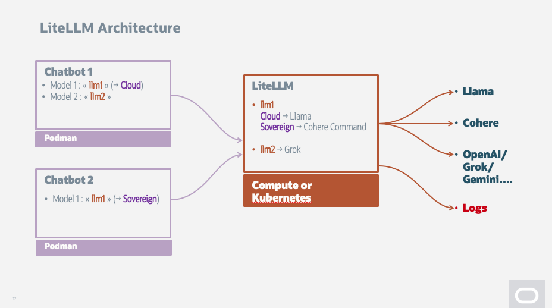

# Install OCI LiteLLM on OCI Compute

Author: M. Gueury

Reviewed: 19.01.2026

### 1.  Introduction

- **Objective**: Step-by-step instructions for installing LiteLLM on OCI
- **Overview**: Install LiteLLM on OCI Compute
- **Software Installed**: https://www.litellm.ai/
- **Goal**: LiteLLM is a OpenAI Gateway that allow to reroute LLM calls. It is very usefull if:
    - You want to call a fixed endpoint and change the LLM used without changing the program
    - You want to work in a production environment and load-balance request based on server up time or other criterias.
- **Note**: Same can be done with OKE very easily too.

### 2. Prerequisites
- None

### 3. Setting Up the OCI Environment**
- Follow the [files/README.md](files/README.md) to do the installation

