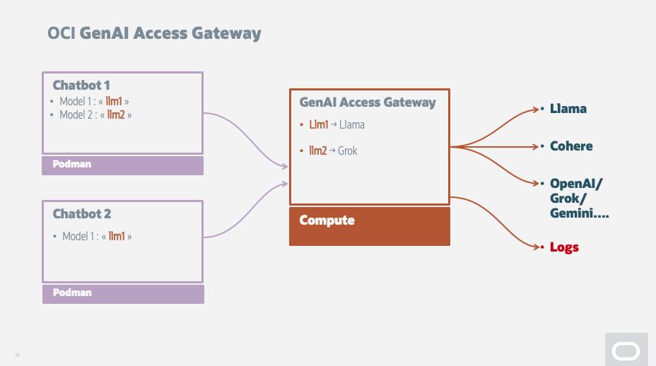

# Install OCI GenAI Access Gateway on OCI Compute

Author: M. Gueury

Reviewed: 19.01.2026

### 1. Introduction**

- **Objective**: Step-by-step instructions for installing OCI_GenAI_access_gateway on OCI
- **Overview**: Install OCI_GenAI_access_gateway on OCI Compute
- **Software Installed**: https://github.com/jin38324/OCI_GenAI_access_gateway
- **Goal**: OCI_GenAI_access_gateway is a OpenAI Gateway that allow to reroute LLM calls. It is very useful if:
    - You want to call a fixed endpoint and change the LLM used without changing the program
    - You want to work in a production environment and load-balance request based on server up time or other criterias.
    - It supports out of the box all OCI models as well as Dedicated AI Clusters.

### 2. Prerequisites
- None

### 3. Setting Up the OCI Environment
- Follow the [files/README.md](files/README.md) to do the installation

