# Creating a NL2SQL Agent on OCI

Author: M. Gueury, A. Panda

Reviewed: 15.10.2025

**1.  Introduction**

- **Objective**: Step-by-step instructions for building and implementing
  a SQL Agent.

- **Overview**: SQL Agent simplifies data tasks by converting natural
  language queries into SQL, leveraging large language models (LLMs).
  Beyond language capabilities like summarization and text analysis,
  LLMs generate SQL, enabling users to interact with databases
  effortlessly, without requiring SQL expertise.

**2. Prerequisites**

- **Database Setup:**

    Create the database (Oracle Base Database or Autonomous Database).
    Database should be in a created in a private subnet (preferred) or
    protected by access control from VCN.

- **Create Table and Load Data**

    Create tables in the above database and load data. You can follow instructions
    [here](https://docs.public.content.oci.oraclecloud.com/en-us/iaas/autonomous-database-serverless/doc/load-data-autonomous.html#GUID-BCD09013-DFC9-4850-BBD2-6A90E9AE884B)
    to connect to the DB and load data.

- **Database Tool Connection:**

    Create Database Tool Connection to connect to the above database.
    Database Tool Connection should use a Private Endpoint to connect to database, You can follow this [doc](https://docs.public.content.oci.oraclecloud.com/en-us/iaas/database-tools/home.htm) for creating a DB tool connection to any Oracle database service in OCI.

- **Prepare Tool Configuration Data**

    User must keep the table DDLs handy before creating agent. Optionally,
    they can also prepare Table Column Descriptions, In Context Examples
    and Custom Instructions. These can be provided to inline to the Agent
    creation wizard. Alternately, these can be uploaded Object Storage 
    Bucket and same be used in Agent creation wizard.

- **Policies**

  - Create a dynamic group with the below matching rules.
    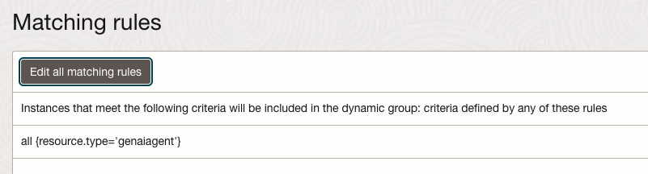

  - Add Policies to allow above dynamic group to access resources**:**

    ````
    allow dynamic-group \<dg-name\> to read database-tools-family in
    compartment \<compartment_name\>  
    allow dynamic-group \<dg-name\> to use database-tools-connections in
    compartment \<compartment_name\>  
    allow dynamic-group \<dg-name\> to read secret-family in compartment
    \<compartment_name\>  
    allow dynamic-group \<dg-name\> to read objects in tenancy
    ````

**3. Setting Up the OCI Environment**

**3.1 Logging into OCI Console**

1.  Navigate to the [OCI Console](https://www.oracle.com/cloud/).

    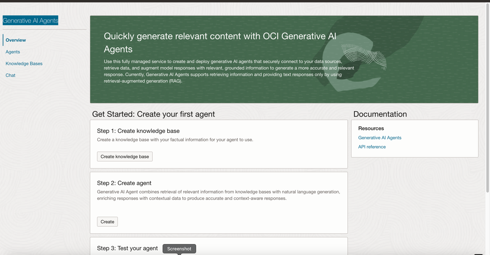
2.  Enter your credential
3.  Click **Sign In** and open Generative AI Agents service.

**4. Creating an agent**

1.  Click on **Agent** and select the appropriate **Compartment** where
    you want to create the agent.

2.  Click on the **Create Agent** button and complete the required
    fields:

    1.  Basic Information

        1.  Enter the mandatory fields: **Name** and **Welcome
            Message**. The **Description** field is optional.

        2.  Check the box to create endpoints for the agent.
        
              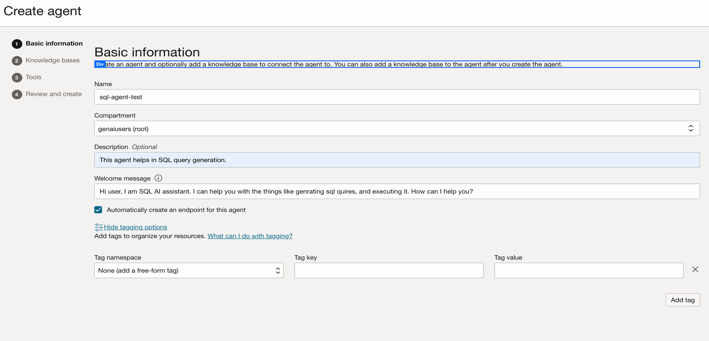
        3.  You can also
            allow to add tags to organise this resource. For more info
            check
            [this](https://docs.oracle.com/en-us/iaas/Content/Tagging/Concepts/taggingoverview.htm).
            Refer below screenshot.

    2.  **Knowledge bases – Not required for SQL.**

    3.  **Tools**: Select Conserve with your structured data in
        database(SQL). Fill in the configuration as described below.

        1.  **Name**: You need to give a meaningful name to your agent.

        2.  **Description**: Provide a detailed summary of the data to
            be used or query via this tool.

        3.  **Database schema**: There are two options available to
            import the database schema configuration for this tool.

            - **Inline** –you can directly paste the SQL schema in the
              text box.  
              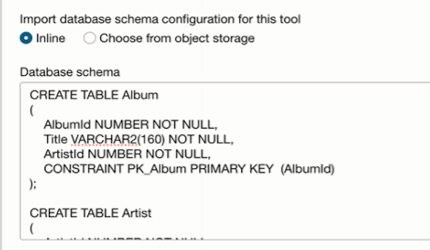

            - **Choose from object storage** – You can also import the
              database schema configuration from an object storage
              bucket. Ensure you have the correct access permissions for
              this.  
              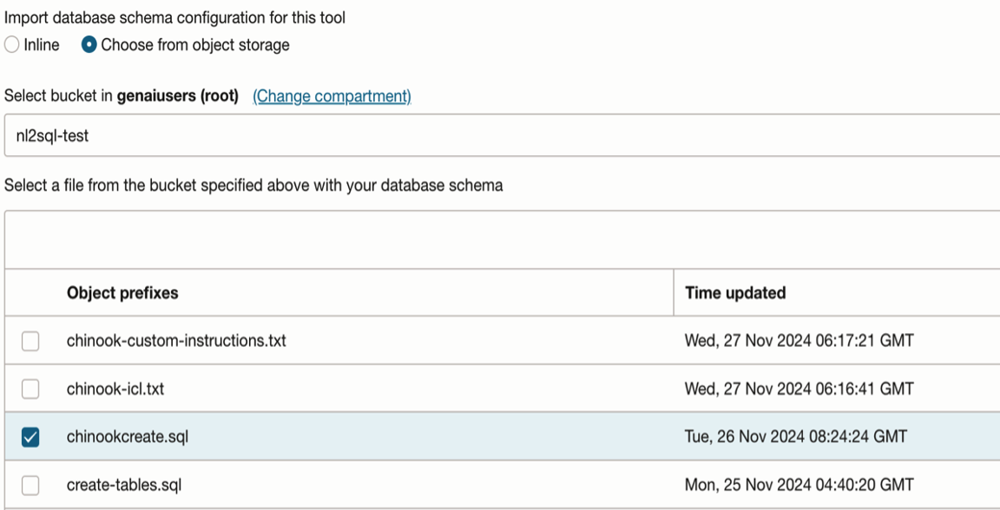

        4.  **Model customization** : It has two option. Choose based on
            your preference.

            - Small(cost-effective) – takes less time to create but less
              accuracy.

            - Large(more accurate) – longer time but better accuracy.

        5.  **Dialect** : slightly different variations of SQL, called
            dialects. While the core SQL syntax is consistent. we
            provide two option for this as well.

            - SQLite

            - Oracle SQL  
              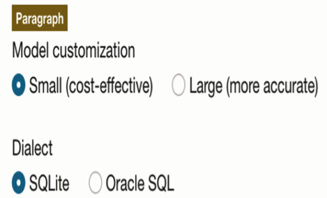

        6.  **In-Context Learning Examples:** Provide examples to help
            the tool generate more accurate queries. This step is
            optional. You can import examples either inline or from an
            object storage bucket. 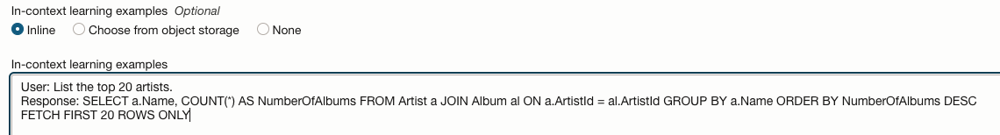**  
            **

        7.  **Database tool connection:** you need to select and test
            appropriate connection tool present in your compartment.  
            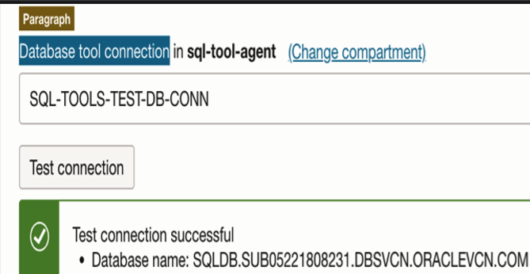

        8.  **Enable SQL Execution**: To enable SQL execution, turn on
            the **Enable SQL Execution** button. This allows the SQL
            Agent to execute the query and return the result. If
            disabled, the agent will not be able to execute the query.

        9.  **Enable Self-Correction**: Enable **Self-Correction** by
            turning on the **Enable Self-Correction** button. This
            allows the SQL Agent to automatically correct the query if
            any corrections are needed.  
            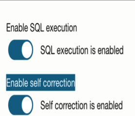

        10. **Custom instructions** : you can give custom instructions
            like below examples. Or can leave it empty.  
            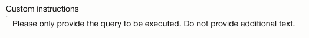

        11. D**escription of tables and columns:** You can use this
            option to provide descriptions for tables and columns.
            Descriptions can be imported from object storage, added
            inline, or left blank (none).  
            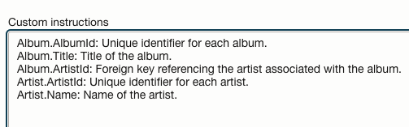

3.  Click on next button, review and create an agent.

   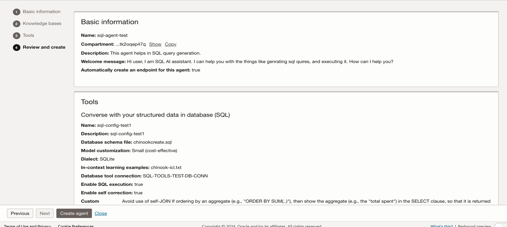

**4. Launch chat**

1.  Once the agent is ready and tool is created. You can launch the
    chat.  
    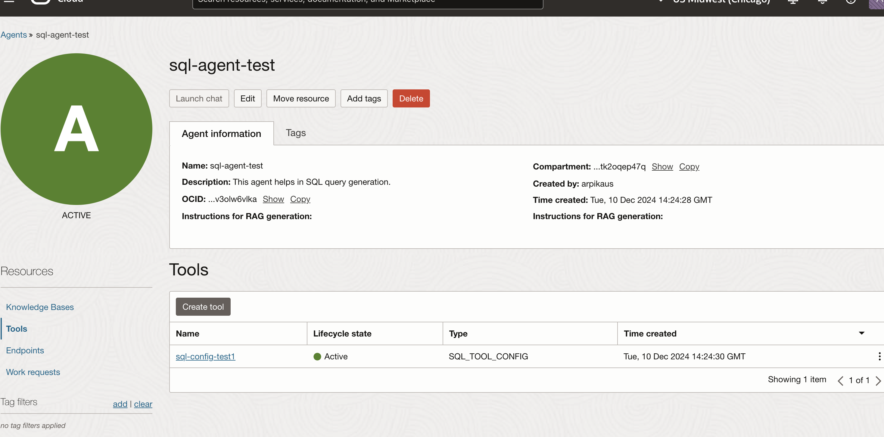  
      
    2. This is how the chat interface will appear, displaying the same
    **Welcome Message** that you provided earlier.  
    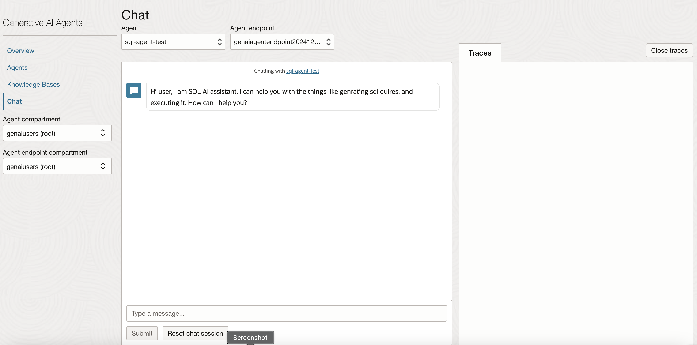

2.  You can start asking some basic question to get SQL query like
    this.  
    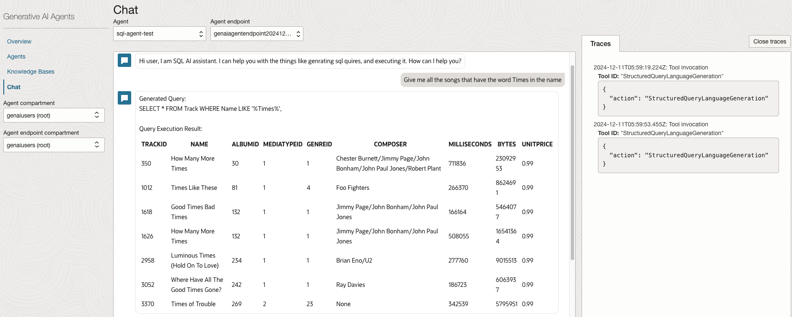

3.  You can reset chat session to start new chat.
