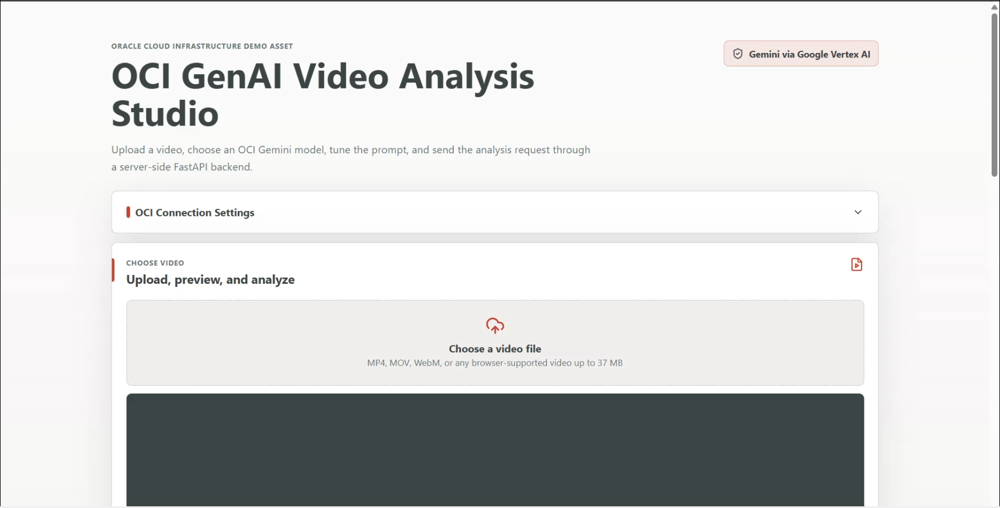

# OCI GenAI Video Analysis Studio

Analyze an uploaded video with Gemini models on Oracle Cloud Infrastructure Generative AI.



## Publication Status

- Confidentiality: Public
- Content type: Example application
- License: UPL-1.0

## What It Does

- Upload and preview a video.
- Pick an analysis mode or write a custom prompt.
- Choose a Gemini model or compare up to three supported public Gemini models.
- Send the video to OCI Generative AI through the local Python backend.
- Show the model output, token metadata when OCI returns it, and backend latency.
- Copy or download the analysis result.

## Run It With Codex

Open this `video-analysis-studio` folder in Codex and ask:

```text
Set up this project and run it locally. Use the setup scripts in this repo. Use uv for Python dependencies. If npm install is needed, ask me before running it. When the app is running, tell me the local frontend URL.
```

Codex should install the local dependencies, start the FastAPI backend and Vite frontend, and give you a URL like:

```text
http://127.0.0.1:5173
```

Before asking Codex to run it, make sure you have:

- Node.js for the React frontend.
- Python for the FastAPI backend.
- OCI API key profile authentication configured on this machine.
- Access to an OCI compartment and a Gemini-supported OCI Generative AI endpoint.

The setup scripts use `uv` for Python dependencies. If `uv` is not installed, Codex can install it through the setup script.

## Manual Setup

Use these steps from this `video-analysis-studio` folder if you are not using Codex, or if you want to run the commands yourself.

Run setup once:

Windows:

```powershell
.\setup.ps1
```

macOS/Linux:

```bash
chmod +x setup.sh start.sh
./setup.sh
```

The setup script creates `.venv`, installs Python dependencies with `uv`, creates `.env` from `.env.example` when needed, and offers to run `npm install` if `node_modules` is missing.

If your network requires VPN or proxy access for npm, enable it before allowing the setup script to run `npm install`.

Start the app:

Windows:

```powershell
.\start.ps1
```

macOS/Linux:

```bash
./start.sh
```

Open the frontend:

```text
http://127.0.0.1:5173
```

By default, the backend runs at `http://127.0.0.1:8002` and the frontend runs at `http://127.0.0.1:5173`.

## Use The App

1. Confirm the OCI compartment, region endpoint, and profile settings.
2. Upload a video under the app's size limit.
3. Choose an analysis mode or enter a custom prompt.
4. Pick one model, or use the comparison view to run the same video and prompt against multiple models.
5. Run the analysis and copy or download the result.

The frontend must not collect private keys, API signing keys, config file contents, auth tokens, tenancy secrets, or other private credentials.

## Common Fixes

If setup cannot download npm packages, configure network access to the public npm registry and run setup again.

If the app says the backend is missing, make sure `.\start.ps1` or `./start.sh` is still running.

If ports are already in use, choose different ports before starting.

Windows:

```powershell
$env:BACKEND_PORT="8004"
$env:FRONTEND_PORT="5181"
.\start.ps1
```

macOS/Linux:

```bash
BACKEND_PORT=8004 FRONTEND_PORT=5181 ./start.sh
```

If analysis fails with a browser fetch error, check the backend health route:

```bash
curl http://127.0.0.1:8002/api/health
```

## More Context

See [context.md](./context.md) for project structure, API details, OCI configuration behavior, model catalog notes, component embedding notes, and implementation background for maintainers.
