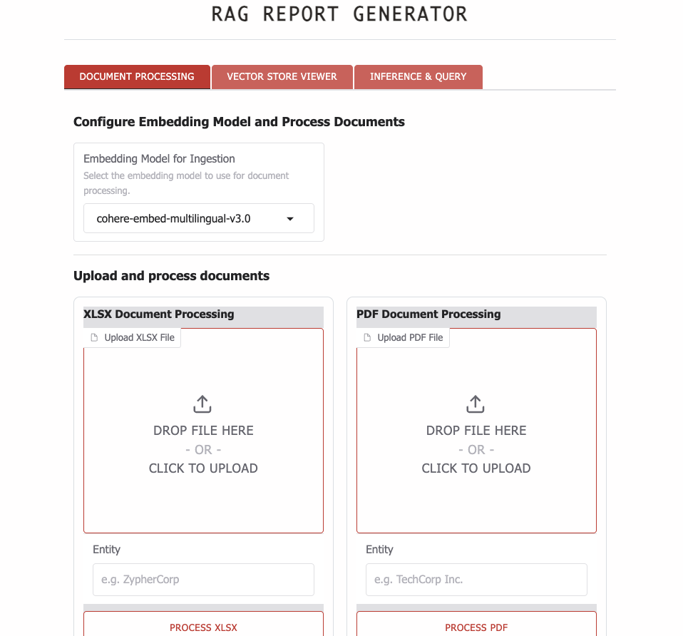

# RAG Report Generator

An enterprise-grade Retrieval-Augmented Generation (RAG) system for generating comprehensive business reports from multiple document sources using Oracle Cloud Infrastructure (OCI) Generative AI services.

Reviewed date: 03.11.2025

---
# When to use this asset?
## Features

- **Multi-Document Processing**: Ingest and process PDF and XLSX documents
- **Multiple Embedding Models**: Support for Cohere multilingual and v4.0 embeddings
- **Advanced LLM Support**: Integration with OCI models (Grok-3, Grok-4, Llama 3.3, Cohere Command)
- **Agentic Workflows**: Multi-agent system for intelligent report generation
- **Hierarchical Report Structure**: Automatically organizes content based on user queries
- **Citation Tracking**: Source attribution with references
- **Multi-Language Support**: Generate reports in English, Arabic, Spanish, and French
- **Visual Analytics**: Automatic chart and table generation from data

---
# How to use this asset?
## Prerequisites

- Python 3.11+
- OCI Account with Generative AI service access
- OCI CLI configured with appropriate credentials

## Installation

1. Clone the repository:
```bash
git clone <repository-url>
cd agentic_rag
```

2. Create a virtual environment:
```bash
python -m venv venv
source venv/bin/activate  # On Windows: venv\Scripts\activate
```

3. Install dependencies:
```bash
pip install -r requirements.txt
```

4. Configure OCI credentials:
```bash
# Create OCI config directory if it doesn't exist
mkdir -p ~/.oci

# Add your OCI configuration to ~/.oci/config
# See: https://docs.oracle.com/en-us/iaas/Content/API/Concepts/sdkconfig.htm
```

5. Set up environment variables:
```bash
# Create .env file with your configuration
cat > .env << EOF
# OCI Configuration
OCI_COMPARTMENT_ID=your-compartment-id
COMPARTMENT_ID_DAC=your-dac-compartment-id  # If using dedicated cluster

# Model IDs (get from OCI Console)
OCI_GROK_3_MODEL_ID=your-grok3-model-id
OCI_GROK_4_MODEL_ID=your-grok4-model-id
OCI_LLAMA_3_3_MODEL_ID=your-llama-model-id
OCI_COHERE_COMMAND_A_MODEL_ID=your-cohere-model-id

# Default Models (optional)
DEFAULT_EMBEDDING_MODEL=cohere-embed-multilingual-v3.0
DEFAULT_LLM_MODEL=grok-3
EOF
```
---

## Quick Start

1. Launch the Gradio interface:
```bash
python gradio_app.py
```

2. Open your browser to `http://localhost:7863`

3. Follow these steps in the interface:
   - **Document Processing Tab**: Upload and process your documents (PDF/XLSX) - see samples in sample_data folder
   - **Vector Store Viewer Tab**: View and manage your document collections
   - **Inference & Query Tab**: Enter queries and generate reports - see sample queries in sample_queries folder

## Usage Guide

### Document Processing

1. Select an embedding model (e.g., cohere-embed-multilingual-v3.0)
2. Upload documents:
   - **XLSX**: Financial data, ESG metrics, structured data
   - **PDF**: Reports, policies, unstructured documents
3. Specify the entity name for each document, i.e. the bank or institition's name
4. Click "Process" to ingest into the vector store

### Generating Reports

1. In the **Inference & Query** tab:
   - Enter your query (can be structured with numbered sections)
   - Select LLM model (Grok-3 recommended for reports)
   - Choose data sources (PDF/XLSX collections)
   - Enable "Agentic Workflow" for comprehensive multi-agent reports
   - Click "Run Query"

2. Example structured query:
```
Prepare a comprehensive ESG comparison report between Company A and Company B:

1) Climate Impact & Emissions
   - Net-zero commitments and targets
   - Scope 1, 2, and 3 emissions
   
2) Social & Governance
   - Diversity targets
   - Board oversight
   
3) Financial Performance
   - Revenue and profitability
   - ESG investments
```

### Report Features

Generated reports include:
- Executive summary addressing your specific query
- Hierarchically organized sections
- Data tables and visualizations
- Source citations [1], [2] for traceability
- References section with full source details
- Professional formatting (Times New Roman, black headings)

## Project Structure

```
agentic_rag/
├── gradio_app.py           # Main application interface
├── local_rag_agent.py      # Core RAG system logic
├── vector_store.py         # Vector database management
├── oci_embedding_handler.py # OCI embedding services
├── agents/
│   ├── agent_factory.py   # Agent creation and management
│   └── report_writer_agent.py # Report generation logic
├── handlers/
│   ├── query_handler.py   # Query processing
│   ├── pdf_handler.py     # PDF document processing
│   ├── xlsx_handler.py    # Excel document processing
│   └── vector_handler.py  # Vector store operations
├── ingest_pdf.py          # PDF ingestion pipeline
├── ingest_xlsx.py         # Excel ingestion pipeline
├── sample_data/           # Sample documents for testing
├── sample_queries/        # Example queries for reports
└── utils/
    └── demo_logger.py     # Logging utilities
```

## Advanced Configuration

### Embedding Models

Available embedding models:
- `cohere-embed-multilingual-v3.0` (1024 dimensions)
- `cohere-embed-v4.0` (1024 dimensions)
- `chromadb-default` (384 dimensions, local)

### LLM Models

Supported OCI Generative AI models:
- **Grok-3**: Best for comprehensive reports (16K output tokens)
- **Grok-4**: Advanced reasoning (120K output tokens)
- **Llama 3.3**: Fast inference (4K output tokens)
- **Cohere Command**: Instruction following (4K output tokens)

### Vector Store Management

- Collections are automatically created per embedding model
- Switch between models without data loss
- Delete collections via the Vector Store Viewer tab

## Troubleshooting

### Common Issues

1. **OCI Authentication Error**
   - Verify ~/.oci/config is properly configured
   - Check compartment ID in .env file
   - Ensure your user has appropriate IAM policies

2. **Embedding Model Errors**
   - Verify model IDs in .env file
   - Check OCI service limits and quotas
   - Ensure embedding service is enabled in your region

3. **Memory Issues**
   - For large documents, process in smaller batches
   - Adjust chunk size in ingestion settings
   - Consider using pagination for large result sets

### Logs

Check `logs/app.log` for detailed debugging information.

## API Usage (Optional)

For programmatic access:

```python
from local_rag_agent import RAGSystem
from vector_store import EnhancedVectorStore

# Initialize system
vector_store = EnhancedVectorStore(
    persist_directory="embed-cohere-embed-multilingual-v3.0",
    embedding_model="cohere-embed-multilingual-v3.0"
)

rag_system = RAGSystem(
    vector_store=vector_store,
    model_name="grok-3",
    use_cot=True
)

# Process query
response = rag_system.process_query("Your query here")
print(response["answer"])
```
---

# Docs & References

📘 [OCI Generative AI Overview](https://docs.oracle.com/en-us/iaas/Content/generative-ai/home.htm)

---

# License

Copyright (c) 2026 Oracle and/or its affiliates.
Licensed under the Universal Permissive License (UPL), Version 1.0.

See [LICENSE](https://github.com/oracle-devrel/technology-engineering/blob/main/LICENSE.txt) for more details.

