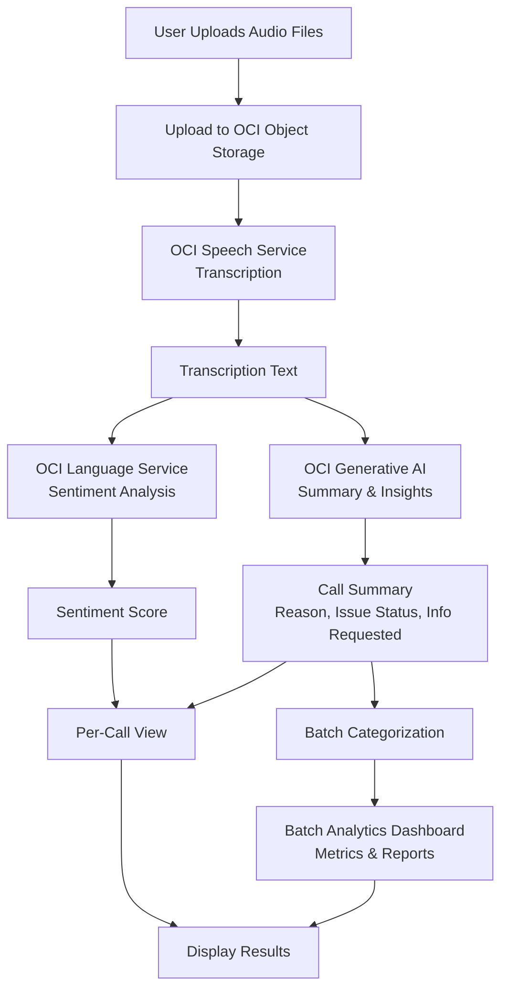

Project that transcribes audio from Call Centers using OCI Speech and then gets insights using OCI Generative AI Service with OpenAI gpt-oss models.

Example to test it out: [Gridspace-Stanford Harper Valley Dataset](https://github.com/cricketclub/gridspace-stanford-harper-valley)

# About the example dataset
If you want to use the example dataset, and not your own, you can do it in 2 ways:
- Pick up the selected samples in the folder `selected_samples`.
- Use the notebooks:
   - [notebook 1](1_check_dataset.ipynb): downloads the dataset, makes statistics (you can edit the methodology) and picks up some samples.
   - [notebook 2](2_prepare_files.ipynb): generates the sampled dataset in a folder `dataset`, including mixed audios (agent&caller in a single audio).

# How to run the app
Install requirements:

Go to the main app folder:
cd app

Create a .config file with the following variables:


1. Install Python (this project requires Python 3.13.5 or later). You can check your current Python version by running:
   ```
   python --version
   ```
   or
   ```
   python3 --version
   ```
2. Install the requirements from `requirements.txt` file or the `app/requirements.txt` if you want to run the demo with the examples in `selected_samples` folder.
   ```
   pip install -r requirements.txt
   pip install -r app/requirements.txt
   ```
3. **Create a bucket in OCI**, copy the namespace and name for the configuration.
4. Move to the app folder: ```cd app```
5. Create a `.config` file with the following variables:
   ```
   CONFIG_FILE_PATH = <path_to_oci_login_config_file>
   PROFILE_NAME = "DEFAULT" ## profile name in config file
   COMPARTMENT_ID = <compartment_OCID>

   # Change the endpoint to match your account's region
   ENDPOINT = "https://inference.generativeai.eu-frankfurt-1.oci.oraclecloud.com"

   BUCKET_NAMESPACE = "<bucket-namespace>"
   BUCKET_NAME = "<bucket-name>"
   ```

6. Run the app:
   ```
   streamlit run app.py
   ```

# About the App
Built using Streamlit and OCI Python SDK, it allows the user to upload a list of audio files (recordings of a call center) to be analysed.



Process:
1. Files are sent to a bucket.
2. Speech processes them and gets a transcription in JSON format.
3. The transcription is used to get insights using generative AI:
   - Summary of the call contents
   - Reason for the call
   - Solved/unsolved issue
   - Sentiment
   - Information requested by the agent
4. Batch Analytics & Reporting
   - Calls are categorized automatically (e.g., Checkbook Request, Card Replacement, Money Transfer, etc.).
   - Aggregated metrics such as sentiment averages, resolution rates, and category-level insights are visualized in a dashboard.
   - Detailed per-category reports highlight trends, best/worst interactions, and operational improvement opportunities.

# Useful documentation
- [OCI Generative AI documentation](https://docs.oracle.com/en-us/iaas/Content/generative-ai/home.htm)
- [OCI Speech documentation](https://docs.oracle.com/en-us/iaas/Content/speech/home.htm)
- [OCI Python SDK documentation](https://docs.oracle.com/en-us/iaas/tools/python/latest/)

# Authors
- Yainuvis Socarras
- Cristina Granes

# Contributing
We welcome contributions to improve and expand the capabilities of this demo. Please fork the repository and submit a pull request with your changes.

# License
Copyright (c) 2025 Oracle and/or its affiliates.
 
Licensed under the Universal Permissive License (UPL), Version 1.0.
 
See [LICENSE](../LICENSE) for more details.
