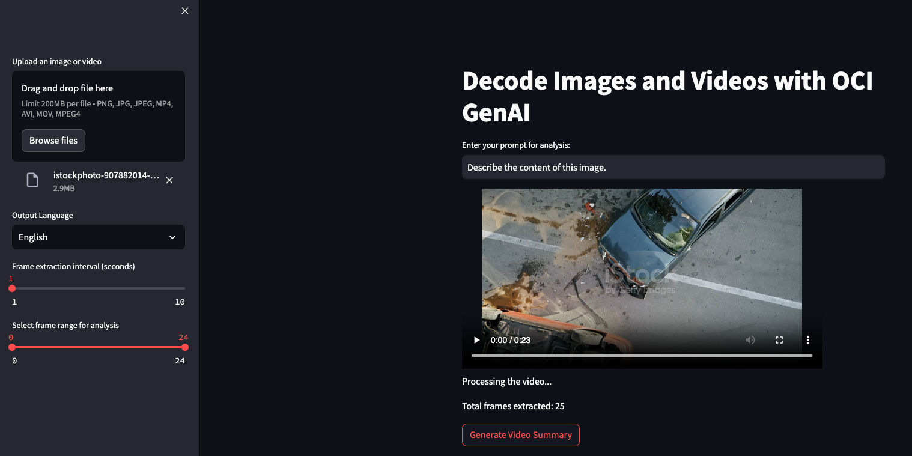
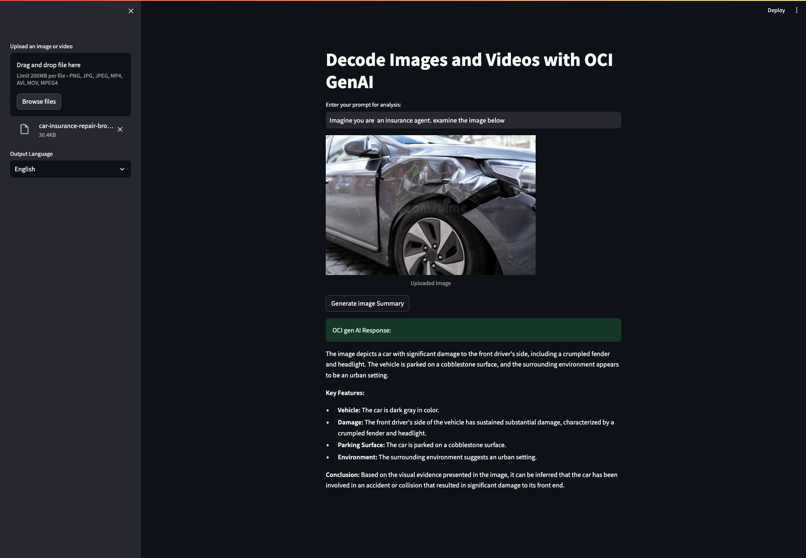

# Decode Images and Videos with OCI GenAI

This is an AI-powered application designed to unlock insights hidden within media files using the Oracle Cloud Infrastructure (OCI) Generative AI services. This application enables users to analyze images and videos, generating detailed summaries in multiple languages. Whether you are a content creator, researcher, or media enthusiast, this app helps you interpret visual content with ease.


</img>
Reviewed date: 22.09.2025

## Features

### 🌍 **Multi-Language Support**
- Receive summaries in your preferred language, including:
  - English, French, Arabic, Spanish, Italian, German, Portuguese, Japanese, Korean, and Chinese.

### 🎥 **Customizable Frame Processing for Videos**
- Extract video frames at user-defined intervals.
- Analyze specific frame ranges to tailor your results for precision.

### ⚡ **Parallel Processing**
- Uses efficient parallel computation for quick and accurate frame analysis.

### 🖼️ **Image Analysis**
- Upload images to generate detailed summaries based on your input prompt.

### 🧠 **Cohesive Summaries**
- Combines individual frame insights to create a seamless, cohesive summary of the video’s overall theme, events, and key details.

---

## Technologies Used
- **[Streamlit](https://streamlit.io/):** For building an interactive user interface.
- **[Oracle Cloud Infrastructure (OCI) Generative AI](https://docs.oracle.com/en-us/iaas/Content/generative-ai/home.htm):** For powerful image and video content analysis.
- **[OpenCV](https://opencv.org/):** For video frame extraction and processing.
- **[Pillow (PIL)](https://pillow.readthedocs.io/):** For image handling and processing.
- **[tqdm](https://tqdm.github.io/):** For progress visualization in parallel processing.

---

## Installation

1. **Clone the repository:**
   

2. **Install dependencies:**
   Make sure you have Python 3.8+ installed. Then, install the required libraries:
   ```bash
   pip install -r requirements.txt
   ```

3. **Configure OCI:**
   - Set up your OCI configuration by creating or updating the `~/.oci/config` file with your credentials and profile.
   - Replace placeholders like `compartmentId`, `llm_service_endpoint`, and `visionModel` in the code with your actual values.

---

## Usage

1. **Run the application:**
   ```bash
   streamlit run app.py
   ```

2. **Upload a file:**
   - Use the sidebar to upload an image (`.png`, `.jpg`, `.jpeg`) or a video (`.mp4`, `.avi`, `.mov`).

3. **Set parameters:**
   - For videos, adjust the frame extraction interval and select specific frame ranges for analysis.

4. **Analyze and summarize:**
   - Enter a custom prompt to guide the AI in generating a meaningful summary.
   - Choose the output language from the sidebar.

5. **Get results:**
   - View detailed image summaries or cohesive video summaries directly in the app.

---

## Screenshots
### Image Analysis

</img>

### Video Analysis

</img>

---


## Acknowledgments
- Oracle Cloud Infrastructure Generative AI for enabling state-of-the-art visual content analysis.
- Open-source libraries like OpenCV, Pillow, and Streamlit for providing powerful tools to build this application.

---

## Contact
If you have questions or feedback, feel free to reach out via [anshuman.p.panda@oracle.com](mailto:email@example.com).

## License
Copyright (c) 2025 Oracle and/or its affiliates.

Licensed under the Universal Permissive License (UPL), Version 1.0.

See [LICENSE](LICENSE.txt) for more details.

ORACLE AND ITS AFFILIATES DO NOT PROVIDE ANY WARRANTY WHATSOEVER, EXPRESS OR IMPLIED, FOR ANY SOFTWARE, MATERIAL OR CONTENT OF ANY KIND CONTAINED OR PRODUCED WITHIN THIS REPOSITORY, AND IN PARTICULAR SPECIFICALLY DISCLAIM ANY AND ALL IMPLIED WARRANTIES OF TITLE, NON-INFRINGEMENT, MERCHANTABILITY, AND FITNESS FOR A PARTICULAR PURPOSE.  FURTHERMORE, ORACLE AND ITS AFFILIATES DO NOT REPRESENT THAT ANY CUSTOMARY SECURITY REVIEW HAS BEEN PERFORMED WITH RESPECT TO ANY SOFTWARE, MATERIAL OR CONTENT CONTAINED OR PRODUCED WITHIN THIS REPOSITORY. IN ADDITION, AND WITHOUT LIMITING THE FOREGOING, THIRD PARTIES MAY HAVE POSTED SOFTWARE, MATERIAL OR CONTENT TO THIS REPOSITORY WITHOUT ANY REVIEW. USE AT YOUR OWN RISK. 
