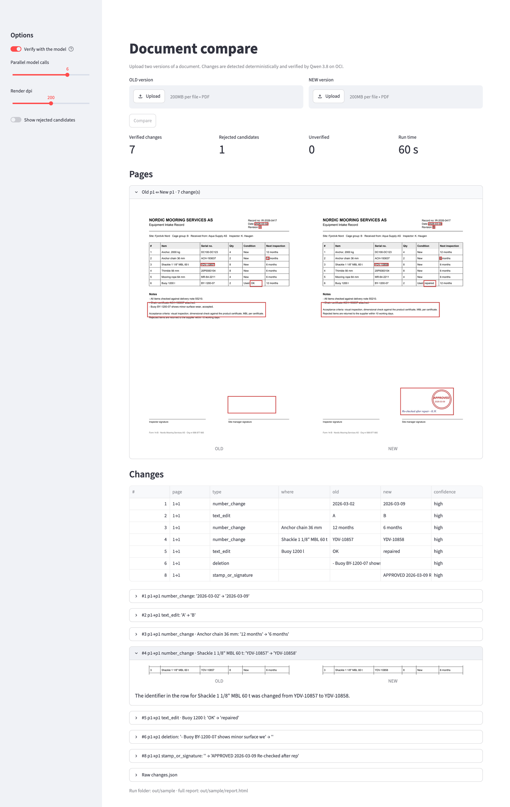

# Diff Two Docs — exact, grounded change detection between two document versions

*Compare two versions of a PDF — scanned, image-only documents that need image processing as well as machine-readable ones — and get a precise list of what changed: every change carries the page, the pixel box on both pages, the two image crops, the old and new text, and a vision-model verdict with confidence. Detection is deterministic; the model on OCI Generative AI only adjudicates small crop pairs.*



Author: Brona Nilsson

Reviewed: 08.10.2026

# When to use this asset?

Use it when a process depends on knowing **exactly** what changed between two revisions of a document and a free-text "summarise the differences" answer is not good enough: re-issued certificates, revised manuals and procedures, inspection records, contracts, regulatory submissions.

### Who
- Compliance, assurance and quality teams that must act on each change in a revised document
- Developers building document pipelines on OCI who need a comparison step with provenance
- Solution architects evaluating how to combine deterministic processing with vision LLMs

### When
- Documents are image-heavy (scans, stamps, signatures, handwritten notes) as well as born-digital
- Each reported change must be traceable to a location on both pages and reviewable by a person
- Hallucinated or missed changes are costly, so the model must not be the one hunting for differences

# How to use this asset?

## How it works

```
OLD.pdf, NEW.pdf
  │
  ├─ 1 render + ground      born-digital page → exact words and boxes from the PDF text layer (no model)
  │                         scanned page      → tiled OCR by the vision model
  ├─ 2 align pages          dynamic programming over page similarity (handles inserted / removed pages)
  ├─ 3 register + pixel diff  homography between the two page images, tolerant ink comparison → changed blobs
  ├─ 4 text diff            word-level alignment → candidates with exact old / new strings and boxes
  ├─ 5 combine              text candidates ⊕ pixel blobs, capped per page
  ├─ 6 verify               one model call per candidate: OLD crop + NEW crop → JSON verdict
  │                         (scanned text changes get a second, hint-free opinion)
  └─ changes.json + report.html
```

The model never sees two whole pages and is never asked "what changed". Stages 1 to 5 are deterministic code (pypdfium2, OpenCV, difflib). Stage 6 sends two small crops, widened to the full table row so the row label is visible, and asks for a fixed JSON schema: changed or not, change type, exact old and new text, row label, a one-sentence description, confidence. Log-probs are requested so a numeric confidence sits next to the self-reported one.

| module (`files/doccompare/`) | role |
|---|---|
| `pages.py`, `textlayer.py` | page model; exact words + boxes from the text layer, rotation-aware |
| `vlm_ocr.py`, `tile.py` | tiled OCR for scanned pages; box-frame handling |
| `align.py` | page alignment across versions |
| `register.py` | ORB + RANSAC registration, tolerant pixel diff, box mapping |
| `textdiff.py`, `candidates.py` | word-level diff; merging with pixel evidence; cap; de-duplication |
| `verify.py`, `prompts.py` | crop pairs, model verdicts, schemas |
| `report.py` | `changes.json` with full provenance and a self-contained `report.html` |
| `compare.py` | command-line orchestrator |
| `models/registry.py`, `models/client.py` | `.env`-driven model registry and OCI chat client (dedicated or on-demand) |
| `../app.py` | Streamlit front end: upload two PDFs, see the changes, download the JSON |

## Prerequisites

- Python 3.10+
- An OCI API-key configuration in `~/.oci/config` (`DEFAULT` profile)
- A vision model behind the OCI Generative AI chat API: a dedicated endpoint (Qwen 3.8 27B was used to build and measure this asset) or an on-demand multimodal model
- IAM policy allowing `use generative-ai-family` in the compartment

## Setup

```bash
cd files
python -m venv .venv && source .venv/bin/activate
pip install -r requirements.txt
cp .env.example .env        # fill in the compartment OCID and the endpoint OCID or model id
```

## Run

Browser UI:

```bash
streamlit run app.py
```

Upload the two versions, press **Compare**, then review: both pages side by side with every change outlined, a table of changes, one expander per change with the exact crops the model saw, and a download of `changes.json`. `DOCCOMPARE_RUN_DIR=out/<run> streamlit run app.py` reopens an earlier run.

Command line, on the included sample pair (two revisions of an equipment intake record: a serial number, an inspection interval and a condition changed, one note removed, a stamp and a handwritten note added):

```bash
python -m doccompare.compare data/intake_record_A.pdf data/intake_record_B.pdf --out out/sample --workers 6
```

Options: `--no-verify` (deterministic candidates only, seconds), `--no-ocr` (scanned pages by pixel diff only), `--pages-old 1-3 --pages-new 1-4`, `--dpi 200`, `--max-candidates 40` per page pair, `--ocr-frame norm1000|pixel|auto`.

## Output

`out/<run>/changes.json` holds `changes` (verified), `rejected` (raised by the deterministic stages, dismissed by the model) and `unverified` (model errors), plus page pairs and timings. One change:

```json
{"id": 3, "old_page": 1, "new_page": 1, "kind": "text", "op": "replace", "sources": ["textdiff", "pixeldiff"],
 "old_bbox": [630.0, 839.0, 741.0, 889.0], "new_bbox": [630.0, 839.0, 741.0, 889.0],
 "crops": {"old": "out/sample/crops/c003_old.png", "new": "out/sample/crops/c003_new.png"},
 "hint": {"old_text": "YDV-10857", "new_text": "YDV-10858"},
 "verdict": {"changed": true, "change_type": "number_change", "old_text": "YDV-10857", "new_text": "YDV-10858",
             "row_label": "Shackle 1 1/8\" MBL 60 t", "confidence": "high", "token_prob": 0.97}}
```

`report.html` shows both pages side by side with overlays and one row per candidate with the crops the model saw. Rendered pages and OCR results are cached under the run folder, so a re-run only repeats verification.

## Assumptions and limits

- The two files are versions of each other and are passed deliberately; there is no search for a counterpart.
- Same-layout documents (certificates, forms, re-issued reports) are the strong case: pixel diff and text diff reinforce each other. Reflowed text is handled by the text diff alone.
- A born-digital text layer is trusted as truth; scanned pages depend on the model's OCR, so text changes there are confirmed twice.
- Tables are not parsed as tables: the row label comes from a row-wide crop, column headers are usually empty.
- One crop yields one verdict, so two edits inside the same cell are reported as one change.
- Verification costs one model call per candidate (15–40 s each on a single-GPU dedicated endpoint); a dense scanned page can raise 20–40 candidates.
- Measured on synthetic revision pairs of real documents: full recall on every pair; precision 1.0 on born-digital pairs and 0.67 on a dense two-scan pair, the misses being model misreads of ~6 pt header text.

# Useful Links

- [OCI Generative AI documentation](https://docs.oracle.com/en-us/iaas/Content/generative-ai/home.htm)
- [Dedicated AI clusters and endpoints](https://docs.oracle.com/en-us/iaas/Content/generative-ai/ai-cluster.htm)
- [OCI Python SDK — Generative AI Inference](https://docs.oracle.com/en-us/iaas/tools/python/latest/api/generative_ai_inference.html)
- [pypdfium2](https://github.com/pypdfium2-team/pypdfium2) · [OpenCV](https://opencv.org/)

# License

Copyright (c) 2026 Oracle and/or its affiliates.
Licensed under the Universal Permissive License (UPL), Version 1.0.

See [LICENSE](https://github.com/oracle-devrel/technology-engineering/blob/main/LICENSE.txt) for more details.
