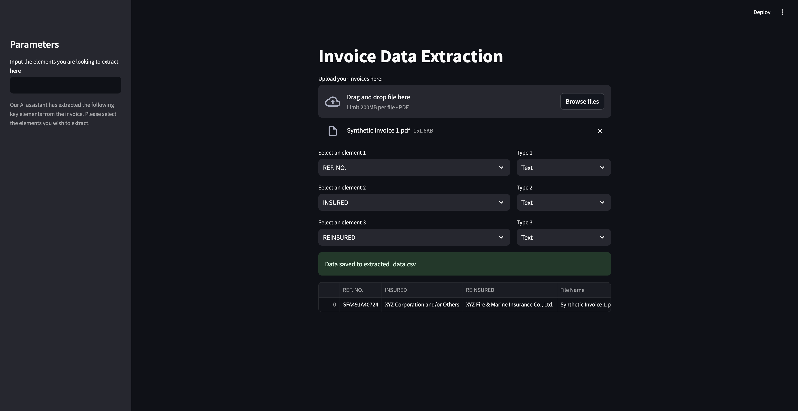

# 🧾 Invoice Analysis Plus

An intelligent invoice data extractor built with **OCI Generative AI**, **LangChain**, and **Streamlit**. Upload any invoice PDF and this app will extract structured data like REF. NO., POLICY NO., DATES, etc. using multimodal LLMs.

Reviewed date: 04.08.2026


</img>

---

## 🎯 When to Use This Asset (Who & When)

### Who
- **Finance & accounting teams** processing inbound invoices  
- **Insurance & operations teams** extracting policy-linked invoice data  
- **AP automation & digital transformation teams** reducing manual entry  

### When
- When invoices arrive as **unstructured PDF scans**  
- When required fields **vary by invoice type or vendor**  
- When high accuracy is needed from **visual + textual context**  
- When structured **JSON/CSV outputs** are needed for downstream systems  


## 🚀 Features

- 🔍 Automatically identifies key invoice headers using OCI Vision LLM (LLaMA 3.2 90B Vision or Llama 4 Maverick)
- 🤖 Lets you choose what elements to extract (with type selection)
- 🧠 Leverages a text-based LLM (Cohere Command R+) for context-aware value extraction
- 🧪 Outputs data in clean **JSON** and saves to **CSV**
- 🖼️ Uses image-based prompt injection for high accuracy

---

## 🛠️ Tech Stack

| Tool                | Usage                                   |
|---------------------|------------------------------------------|
| 🧠 OCI Generative AI | Vision + Text LLMs for extraction       |
| 🧱 LangChain         | Prompt orchestration and LLM chaining   |
| 📦 Streamlit         | Interactive UI and file handling        |
| 🖼️ pdf2image         | Convert PDFs into JPEGs                 |
| 🧾 Pandas            | CSV creation & table rendering          |
| 🔐 Base64            | Encodes image bytes for prompt injection|

---

## 🧠 How to use this asset

1. **User Uploads Invoice PDF**  
   The file is uploaded and converted into an image using `pdf2image` (Ensure you upload one page documents ONLY)

2. **Initial Header Detection (LLaMA-3.2 Vision or Llama 4 Maverick)**  
   The first page is passed to the multimodal LLM which returns a list of fields that are likely to be useful (e.g., "Policy No.", "Amount", "Underwriter").

3. **User Selects Fields and Types**  
   A UI allows the user to pick 3 fields from the detected list, and specify their data types (Text, Number, etc.).

4. **Prompt Generation (Cohere Command A)**  
   The second LLM generates a custom system prompt to extract those fields as JSON.

5. **Full Invoice Extraction (LLaMA-3.2 Vision or Llama 4 Maverick)**  
   Each page image is passed into the multimodal LLM using the custom prompt, returning JSON values for the requested fields.

6. **Data Saving & Display**  
   All data is shown in a `st.dataframe()` and saved to CSV.

---

### 📁 File Structure

```bash
.
├── app.py               # Main Streamlit app
├── requirements.txt     # Python dependencies
└── README.md            # This file
```

---

### 🔧 Setup

1. **Clone the repository**

```bash
git clone <repository-url>
cd <repository-folder>
```

2. **Install dependencies**

```bash
pip install -r requirements.txt
```

3. **Run the app**

```bash
streamlit run app.py
```

> ⚠️ **Important Configuration:**
>
> - Replace all instances of `<YOUR_COMPARTMENT_OCID_HERE>` with your actual **OCI Compartment OCID**
> - Ensure you have access to **OCI Generative AI Services** with correct permissions
> - Update model IDs in the code if needed:  
>   - Vision model: `meta.llama-3.2-90b-vision-instruct` or `meta.llama-4-maverick-17b-128e-instruct-fp8`
>   - Text model: `cohere.command-a-03-2025`

---

### 📁 Output Sample

```json
[
  {
    "REF. NO.": "IN123456",
    "INSURED": "Acme Corp",
    "POLICY NO.": "POL987654",
    "File Name": "invoice1.pdf",
    "Page Number": 1
  },
  ...
]
```

---

# Docs & References

📘 [OCI Generative AI Overview](https://docs.oracle.com/en-us/iaas/Content/generative-ai/home.htm)

---

# License

Copyright (c) 2026 Oracle and/or its affiliates.
Licensed under the Universal Permissive License (UPL), Version 1.0.

See [LICENSE](https://github.com/oracle-devrel/technology-engineering/blob/main/LICENSE.txt) for more details.

