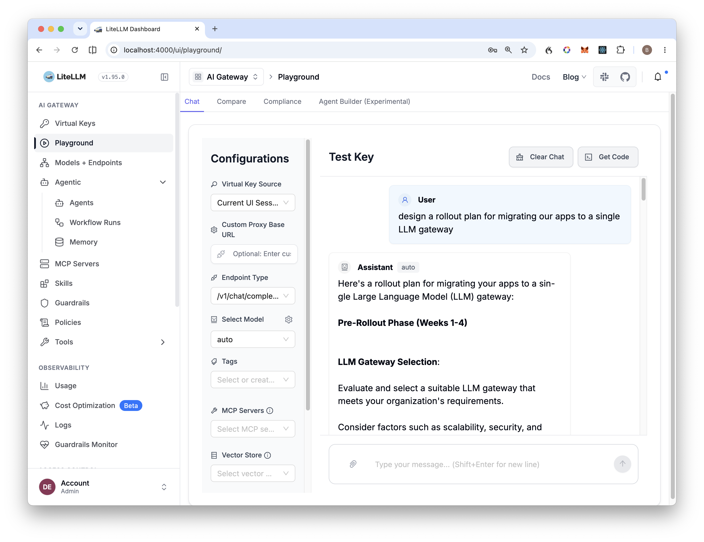

# LiteLLM Gateway for OCI Generative AI

*One OpenAI-compatible endpoint in front of every LLM your organization uses — OCI GenAI on-demand models, imported models on Dedicated AI Clusters, and external providers — with automatic complexity-based routing, virtual API keys, OCI Guardrails and agentic observability.*

Author: Brona Nilsson

Reviewed: 06.08.2026



# When to use this asset?

### Who

- Customers standardizing LLM access across teams who want **one API key scheme and one endpoint** for all models, inside and outside OCI.
- Platform teams that need **request-level model selection** (cost vs. capability) without pushing that logic into every application.
- Security teams that want **OCI Guardrails** (content moderation, PII masking, prompt-injection defense) enforced centrally — including on external providers.

### When

- You run models in several places (OCI on-demand, a Dedicated AI Cluster with an imported Hugging Face model, OpenAI/Anthropic) and applications should not care where a model lives.
- You want automatic routing: simple prompts to small cheap models, complex or reasoning-heavy prompts to frontier models — decided per request from task difficulty and token count.
- You need per-team virtual API keys with budgets, rate limits and spend tracking.
- You need traces of agentic workflows (which model, which tools, what cost) via Langfuse.

# How to use this asset?

```bash
cd files
cp .env.example .env      # fill in your OCI tenancy details
docker compose up --build
```

Then point any OpenAI-SDK application at `http://localhost:4000` — see [files/README.md](files/README.md) for the full staged walkthrough (unified endpoint → auto-routing → guardrails → observability), runnable examples and the bundled playground UI.

### Key Capabilities

- **Unified endpoint** — OCI on-demand models via LiteLLM's native `oci/` provider, DAC-imported models via OCI's OpenAI-compatible endpoint, external providers side by side.
- **Automatic routing** — LiteLLM's complexity router scores each request (tokens, code presence, reasoning markers) and picks the tier; clients just call `model="auto"`.
- **Virtual API keys** — mint per-team keys with budgets and rate limits; one key works for every model.
- **OCI Guardrails** — the `apply_guardrails` API wired in as a LiteLLM guardrail hook: PII masking, prompt-injection and content-moderation blocking, on request and/or response, opt-in per request or enforced globally.
- **Observability** — Langfuse tracing for agentic workflows plus LiteLLM's built-in spend tracking and admin UI.
- **Playground UI** — a dependency-free, Oracle-dark-themed chat playground for demos and testing.

### File Structure

```
litellm-gateway/
├── README.md
├── LICENSE
└── files/
    ├── README.md                  # developer guide (staged setup)
    ├── config/config.yaml         # models, routing, guardrails, callbacks
    ├── guardrails/oci_guardrails.py  # OCI Guardrails ⇄ LiteLLM hook
    ├── examples/                  # runnable client examples (01–05)
    ├── ui/playground.html         # Oracle-themed playground
    ├── images/                    # README screenshots
    ├── docker-compose.yml         # gateway + Postgres
    ├── Dockerfile
    ├── requirements.txt
    └── .env.example
```

# Useful Links

- [OCI Generative AI](https://docs.oracle.com/en-us/iaas/Content/generative-ai/home.htm)
- [OCI Generative AI — OpenAI-compatible API](https://docs.oracle.com/en-us/iaas/Content/generative-ai/openai-compatibility.htm)
- [OCI Generative AI — Dedicated AI Clusters](https://docs.oracle.com/en-us/iaas/Content/generative-ai/ai-cluster.htm)
- [LiteLLM — OCI provider](https://docs.litellm.ai/docs/providers/oci)
- [LiteLLM Proxy documentation](https://docs.litellm.ai/docs/simple_proxy)

# License

Copyright (c) 2026 Oracle and/or its affiliates.
Licensed under the Universal Permissive License (UPL), Version 1.0.

See [LICENSE](LICENSE) for more details.
