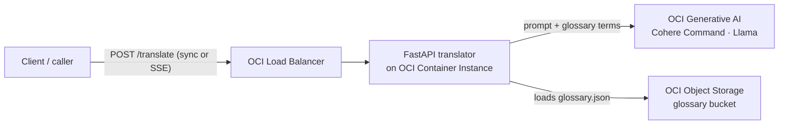

# LLM Translation App on OCI

A production-shaped translation service that translates between multiple language
pairs using **OCI Generative AI** models, with a pluggable **domain-specific
glossary**. It ships as a FastAPI app you can run locally in seconds, and deploy
to OCI as an always-on **Container Instance behind a Load Balancer** via an
included Terraform / Resource Manager Stack.

Reviewed: 24.07.2026

## Architecture

One OCI GenAI endpoint serves every language pair, the glossary steers domain
terminology, and the service is stateless — so you scale simply by adding
container instances behind the load balancer.

## When to use this asset

Use this asset when you need to demonstrate or build:

- **LLM-based translation** across many language pairs from a single OCI GenAI
  endpoint — no per-language models to manage.
- A **domain-specific glossary** that steers terminology (the included example
  covers online-gaming / finance vocabulary; swap in your own domain).
- Both **sync and streaming (SSE)** translation behind a simple REST API.
- A **model-agnostic** integration that auto-detects the request format for
  Cohere (Command R/R+/A) and generic (Llama/Meta) models.
- A clean path from **local development** (`uvicorn`) to a **deployable OCI
  Stack** (Container Instance + Load Balancer) with Terraform.

## What's inside

| Path | What it is |
|---|---|
| `files/core/` | Translation engine — auth, config, glossary, prompt, model handling |
| `files/app/` | FastAPI service (sync + streaming) + Dockerfiles |
| `files/terraform/` | Resource Manager Stack — Container Instance + Load Balancer |
| `files/tests/` | Pytest suite (all language pairs, validation, request formatting) |
| `files/load_test/` | k6 load-test script |
| `files/README.md` | Full usage, configuration, deployment and cost guide |

Start with **`files/README.md`** for quick-start and deployment steps.
