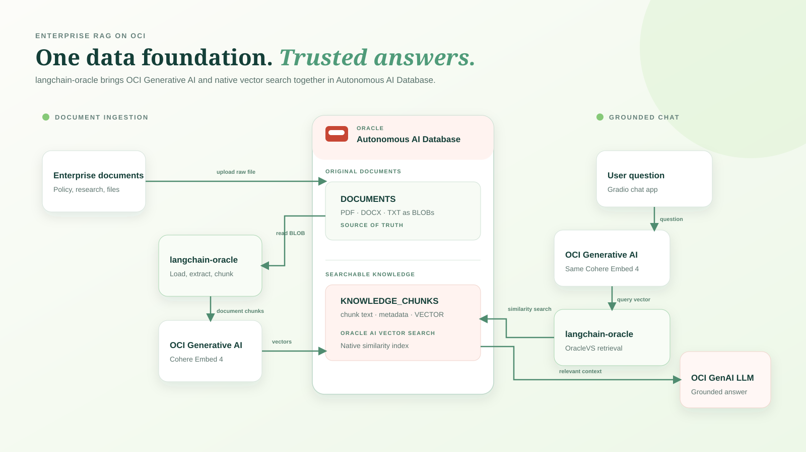

# OCI Autonomous AI Database RAG Chatbot

A reference application for building a grounded enterprise chatbot with OCI Generative AI, Autonomous AI Database, and `langchain-oracle`.

The application retrieves relevant document chunks from Oracle AI Vector Search and asks an OCI Generative AI model to answer only from that context.



## How it works

1. Source files are stored in Autonomous AI Database.
2. `langchain-oracle` loads, extracts, and splits their text into chunks.
3. An OCI embedding model converts each chunk into a vector.
4. OracleVS stores and searches the chunks in the `KNOWLEDGE_CHUNKS` vector table.
5. A user question is embedded with the same model, then matched against the vector table.
6. An OCI Generative AI chat model generates a grounded answer using the retrieved chunks.

## Prerequisites

- Python 3.10 or later.
- An OCI account with access to OCI Generative AI models in your chosen region.
- An Autonomous AI Database instance with a downloaded database wallet.
- A local OCI SDK configuration and API-key profile.
- A populated `KNOWLEDGE_CHUNKS` table created through the ingestion workflow.

Refer to the official OCI documentation for configuring an OCI API-key profile, IAM policies, Autonomous AI Database wallets, and model access. Keep all credentials and wallet files outside this repository.

## Install

```bash
git clone <YOUR-REPOSITORY-URL>
cd oci-adb-rag-chatbot
python -m venv .venv
```

Activate the virtual environment:

```powershell
# Windows PowerShell
.\.venv\Scripts\Activate.ps1
```

```bash
# macOS or Linux
source .venv/bin/activate
```

Install the dependencies:

```bash
python -m pip install --upgrade pip
python -m pip install -r files/requirements.txt
```

## Configure

Copy the template, then add your local connection values:

```bash
cp files/.env.example .env
```

On Windows PowerShell:

```powershell
Copy-Item files/.env.example .env
```

Required variables:

| Variable | Purpose |
| --- | --- |
| `ORACLE_DB_USERNAME` | Autonomous AI Database user name. |
| `ORACLE_DB_PASSWORD` | Database user password. |
| `ORACLE_DB_DSN` | Database service name from the wallet configuration. |
| `TNS_ADMIN` | Absolute path to the unzipped wallet folder. |
| `ORACLE_WALLET_PASSWORD` | Wallet password. |
| `OCI_PROFILE` | Name of your local OCI SDK profile. |
| `VECTOR_TABLE` | OracleVS table name; defaults to `KNOWLEDGE_CHUNKS`. |
| `OCI_EMBEDDING_MODEL` | Embedding model available in your OCI region. |
| `OCI_CHAT_MODEL` | Chat model available in your OCI region. |

The app reads the compartment and region from the selected local OCI profile. It does not store OCI credentials in source code or in `.env`.

## Ingest documents

`ingest_documents.py` uses the same simple workflow as the notebook for one PDF and one DOCX file:

1. Uploads both local files to the existing `DOCUMENTS` BLOB table.
2. Reads each BLOB back from Autonomous AI Database.
3. Uses `PyPDFLoader` for the PDF and `Docx2txtLoader` for the DOCX file.
4. Splits extracted text with `RecursiveCharacterTextSplitter`.
5. Generates OCI embeddings and stores the chunks in OracleVS.

Place non-confidential test files under `files/sample_documents/`, then change these two variables at the top of `files/ingest_documents.py`:

```bash
PDF_PATH = PROJECT_FILES / "sample_documents/your-document.pdf"
DOCX_PATH = PROJECT_FILES / "sample_documents/your-document.docx"
```

Then run:

```bash
python files/ingest_documents.py
```

The script expects the `DOCUMENTS` and `KNOWLEDGE_CHUNKS` tables created in the notebook. Keep the original files in `DOCUMENTS`; the vector table contains chunks, metadata, and embeddings for search.

## Run order

The two Python files have different jobs and are run separately:

1. Run `ingest_documents.py` **first** when you add or change source documents. It uploads files, extracts their text, creates embeddings, and indexes the chunks in `KNOWLEDGE_CHUNKS`.
2. Run `app.py` **after ingestion** to start the Gradio chatbot. It searches the indexed chunks and generates grounded answers.

```bash
# Run after adding or updating documents
python files/ingest_documents.py

# Run after ingestion to open the chatbot
python files/app.py
```

You do not normally run both files at the same time.

## Run the chatbot

```bash
python files/app.py
```

Gradio prints a local URL, usually `http://127.0.0.1:7860`. Open it in a browser and ask questions about the indexed documents.

## Project structure

```text
.
├── README.md
├── .gitignore             # Prevents secrets and wallet files from being committed
└── files/
    ├── app.py                 # Gradio chat application
    ├── ingest_documents.py    # PDF and DOCX ingestion workflow
    ├── requirements.txt       # Python dependencies
    ├── .env.example           # Safe local configuration template
    ├── assets/
    │   └── architecture.svg   # Solution architecture
    └── sample_documents/      # Add safe public test documents here
```

## Security notes

- Never commit `.env`, database wallets, private keys, or passwords.
- Use an OCI profile with least-privilege permissions.
- Choose only models available to your tenancy and region.
- Review and sanitize source documents before indexing them.

## Troubleshooting

| Issue | Suggested check |
| --- | --- |
| OCI profile cannot be found | Confirm `OCI_PROFILE` exists in your local OCI SDK configuration. |
| Model request fails | Confirm the model ID is available in the selected region and that IAM access is granted. |
| Database connection fails | Confirm the wallet path, DSN, database credentials, and network access. |
| Answers have no supporting context | Confirm the intended documents were indexed in the table named by `VECTOR_TABLE`. |
