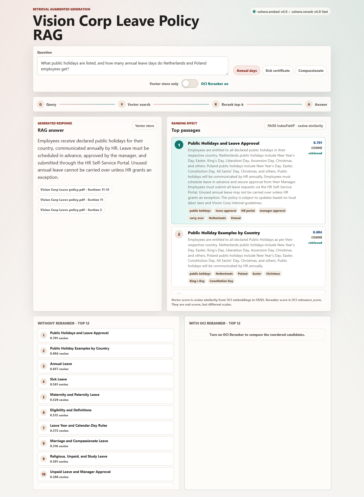
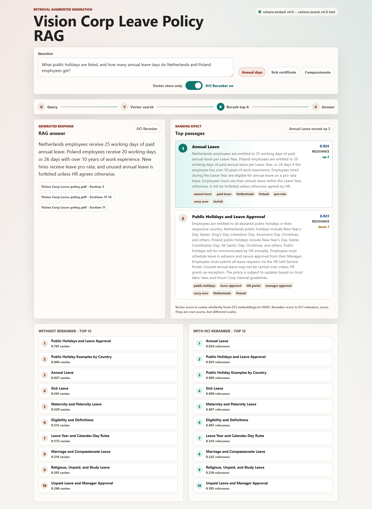
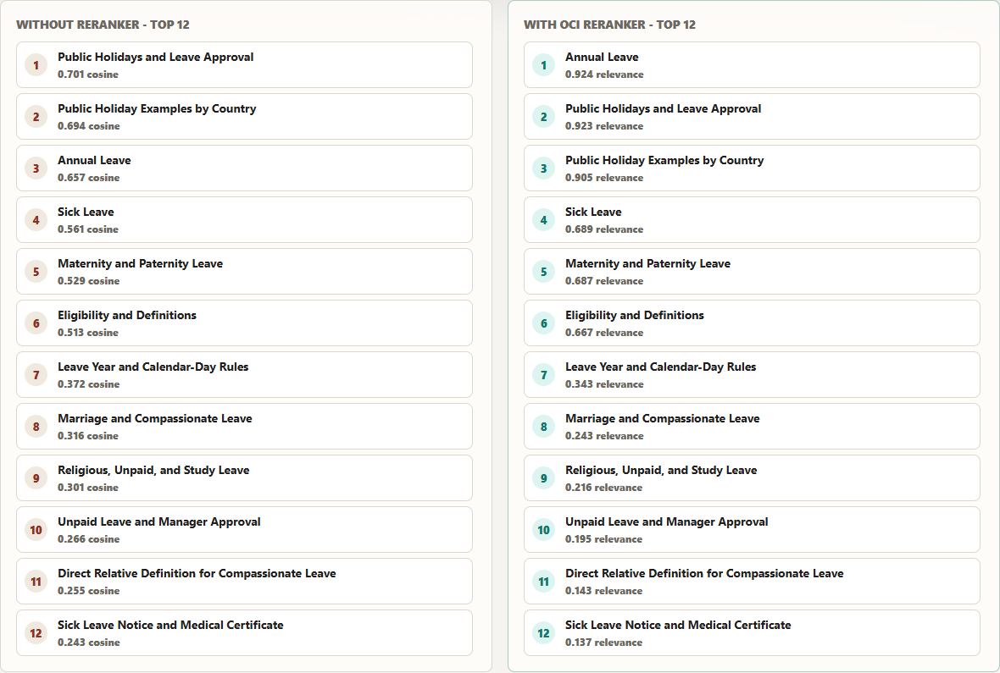
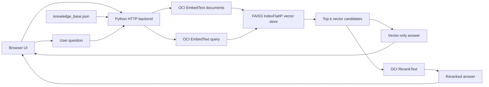

# OCI Reranker RAG Demo - Vision Corp Leave Policy

A lightweight demo that shows the practical difference between using only a vector store and adding OCI Reranker on top of retrieval.

The app uses a small leave-policy knowledge base derived from `Vision Corp Leave policy.pdf`. A user asks a policy question, the backend retrieves candidate passages with OCI embeddings and FAISS, and the UI lets you switch between:

- **Vector store only:** answer from the highest cosine-similarity document.
- **OCI Reranker on:** answer from the same retrieved candidates after OCI Reranker reorders them by query-document relevance.

This makes the reranker effect visible: the retrieved candidate list can contain the right document, but plain vector similarity may not rank it first. The reranker can promote the better passage before the answer is shown.

## Screenshots

### Vector Store Only



### OCI Reranker Enabled



### Side-by-Side Ranking Comparison



## What This Demo Does

- Loads a PDF-derived knowledge base from `files/knowledge_base.json`.
- Embeds every knowledge-base chunk with OCI Generative AI embeddings.
- Stores normalized vectors in an in-memory FAISS `IndexFlatIP` index.
- Embeds the user query with the same OCI embedding model.
- Retrieves the top-k candidates by cosine similarity.
- Optionally sends those same candidates to OCI Generative AI `RerankText`.
- Shows the answer, citations, vector ranking, reranked ranking, and score differences in the browser.

The demo intentionally uses compound policy questions, such as asking about public holidays and annual leave in the same query, so the value of reranking is easier to see.

## Demo Questions

The UI includes three preset questions:

1. **Annual days:** What public holidays are listed, and how many annual leave days do Netherlands and Poland employees get?
2. **Sick certificate:** If leave is without manager approval it may be unpaid, but what if the absence is illness over two days?
3. **Compassionate:** Who counts as a direct relative, and how much compassionate leave is given for death of a spouse or direct relative?

You can also type your own question in the text box.

## Architecture



## How Retrieval Works

### 1. Knowledge Base

The runtime knowledge base is persisted in:

```text
files/knowledge_base.json
```

It currently contains 12 chunks from the Vision Corp leave policy, including annual leave, sick leave, maternity and paternity leave, compassionate leave, public holidays, manager approval, and direct-relative definitions.

The app does not read the PDF at runtime. The PDF content has already been converted into structured JSON chunks with this shape:

```json
{
  "id": "annual-leave",
  "title": "Annual Leave",
  "source": "Vision Corp Leave policy.pdf - Section 2",
  "text": "...policy passage...",
  "tags": ["annual leave", "Netherlands", "Poland"],
  "answer": "...grounded answer used by the demo..."
}
```

### 2. Vector Store

On the first query, `server.py`:

1. Reads `knowledge_base.json`.
2. Sends each document passage to OCI `EmbedText` with `input_type=SEARCH_DOCUMENT`.
3. Normalizes the embedding matrix with `faiss.normalize_L2`.
4. Builds an in-memory FAISS `IndexFlatIP` index.

Because the vectors are normalized, FAISS inner product is used as cosine similarity.

The vector index is not written to disk. It is rebuilt in memory when the server starts or when the knowledge-base fingerprint changes.

### 3. Query Search

For each question, the backend:

1. Sends the query to OCI `EmbedText` with `input_type=SEARCH_QUERY`.
2. Normalizes the query vector.
3. Searches FAISS for the top-k most similar chunks.
4. Returns the vector results and cosine scores to the UI.

### 4. OCI Reranking

When the switch is on, the backend sends the retrieved candidates to OCI Generative AI `RerankText`:

```text
input: the user question
documents: top-k passages from vector search
top_n: number of candidates to return
model: cohere.rerank-v4.0-fast
region: me-riyadh-1
```

OCI returns a `relevance_score` for each candidate. The app then reorders the same vector-retrieved candidates using that reranker score.

### 5. Answer Display

This demo keeps generation simple and transparent: it displays the curated `answer` field from the top-ranked document.

That means:

- In vector-only mode, the answer comes from the top vector result.
- In reranker mode, the answer comes from the top reranked result.

No LLM chat generation is currently used after retrieval. This keeps the demo focused on proving the retrieval and reranking difference. You can extend it later by sending the top reranked passages into an LLM prompt.

## Scores Explained

The UI shows two different score types:

- **Cosine score:** Produced by FAISS from normalized OCI embeddings. This is used in vector-only retrieval.
- **Relevance score:** Returned by OCI Reranker. This is the reranker model's relevance score for a query-document pair.

These scores are real, but they are not the same scale. Compare cosine scores with cosine scores, and reranker relevance scores with reranker relevance scores. The important signal is how the candidate order changes.

## Tech Stack

- Frontend: HTML, CSS, vanilla JavaScript
- Backend: Python `http.server` with custom API handlers
- Embeddings: OCI Generative AI `cohere.embed-v4.0`
- Reranker: OCI Generative AI `cohere.rerank-v4.0-fast`
- Vector search: FAISS `IndexFlatIP`
- Knowledge base: local JSON file generated from the policy PDF

## Project Structure

```text
Reranker Demo/
|-- README.md
`-- files/
    |-- app.js
    |-- index.html
    |-- knowledge_base.json
    |-- screenshots/
    |   |-- vector-search-only.png
    |   |-- oci-reranker-enabled.png
    |   `-- ranking-comparison.png
    |-- server.py
    `-- styles.css
```

## Setup

### 1. Install Python Dependencies

From the app folder:

```powershell
cd files
python -m venv .venv
.\.venv\Scripts\Activate.ps1
pip install oci numpy faiss-cpu
```

If you already have these packages installed globally, you can run the server without creating a virtual environment.

### 2. Configure OCI Credentials

The backend reads your OCI config from `~/.oci/config` by default and uses the `DEFAULT` profile unless overridden.

Required OCI access:

- A valid OCI config profile with API key authentication.
- A compartment with permission to call OCI Generative AI inference.
- Access to OCI Generative AI in the Riyadh region, `me-riyadh-1`.

Recommended PowerShell environment variables:

```powershell
$env:OCI_CONFIG_PROFILE="DEFAULT"
$env:OCI_REGION="me-riyadh-1"
$env:OCI_COMPARTMENT_ID="<your-compartment-ocid>"
$env:OCI_EMBED_MODEL_ID="cohere.embed-v4.0"
$env:OCI_RERANK_MODEL_ID="cohere.rerank-v4.0-fast"
```

Optional overrides:

```powershell
$env:OCI_CONFIG_FILE="<path-to-your-oci-config>"
$env:OCI_GENAI_ENDPOINT="https://inference.generativeai.me-riyadh-1.oci.oraclecloud.com"
$env:OCI_EMBED_ENDPOINT_ID="<dedicated-embedding-endpoint-ocid>"
$env:OCI_RERANK_ENDPOINT_ID="<dedicated-rerank-endpoint-ocid>"
$env:OCI_EMBED_BATCH_SIZE="96"
$env:HOST="127.0.0.1"
$env:PORT="4173"
```

Do not commit your OCI private key, local OCI config, or secrets to GitHub.

## Run Locally

```powershell
cd files
python server.py
```

Then open:

```text
http://127.0.0.1:4173/
```

Health check:

```powershell
Invoke-RestMethod -Uri http://127.0.0.1:4173/api/status
```

## API Endpoints

### `GET /api/status`

Returns OCI configuration status, selected region, embedding model, reranker model, and vector-store engine.

### `POST /api/search`

Runs vector retrieval, and optionally reranking.

Example request:

```json
{
  "query": "What public holidays are listed, and how many annual leave days do Netherlands and Poland employees get?",
  "useReranker": true,
  "topK": 12
}
```

Example response fields:

```json
{
  "answer": "...",
  "answerMode": "reranker",
  "vectorResults": [],
  "rerankedResults": [],
  "vector": {},
  "reranker": {},
  "timingsMs": {}
}
```

## Updating the Knowledge Base

To change the demo content, edit:

```text
files/knowledge_base.json
```

Each chunk should have a clear `title`, `source`, `text`, `tags`, and `answer`. The `text` field is what gets embedded and reranked. The `answer` field is what the demo displays when that chunk wins.

After editing the JSON, refresh the browser or run another query. The backend fingerprints the knowledge base and rebuilds the in-memory FAISS index when the content changes.

## Troubleshooting

### `ModuleNotFoundError: No module named 'faiss'`

Install FAISS for Python:

```powershell
pip install faiss-cpu
```

### OCI returns `404 Authorization failed or requested resource not found`

The code reached OCI, but the configured profile, compartment, model, or endpoint is not authorized. Check:

- `OCI_COMPARTMENT_ID`
- IAM policies for Generative AI inference
- Region availability, especially `me-riyadh-1`
- Model IDs or dedicated endpoint OCIDs

### Port `4173` is already in use

Use another port:

```powershell
$env:PORT="4174"
python server.py
```

### Reranker and vector answers look the same

That can happen when vector search already ranks the best passage first. Use the compound preset questions or add overlapping KB chunks to make the reranking effect easier to demonstrate.

## Notes for GitHub

Do not commit OCI config files, private keys, `.env` files, or personal OCIDs. This demo reads sensitive deployment values from environment variables or your local OCI config at runtime.

The app is intentionally simple: no build step, no frontend framework, and no database. It is meant to be a clear demo asset for explaining why reranking improves RAG retrieval quality.

