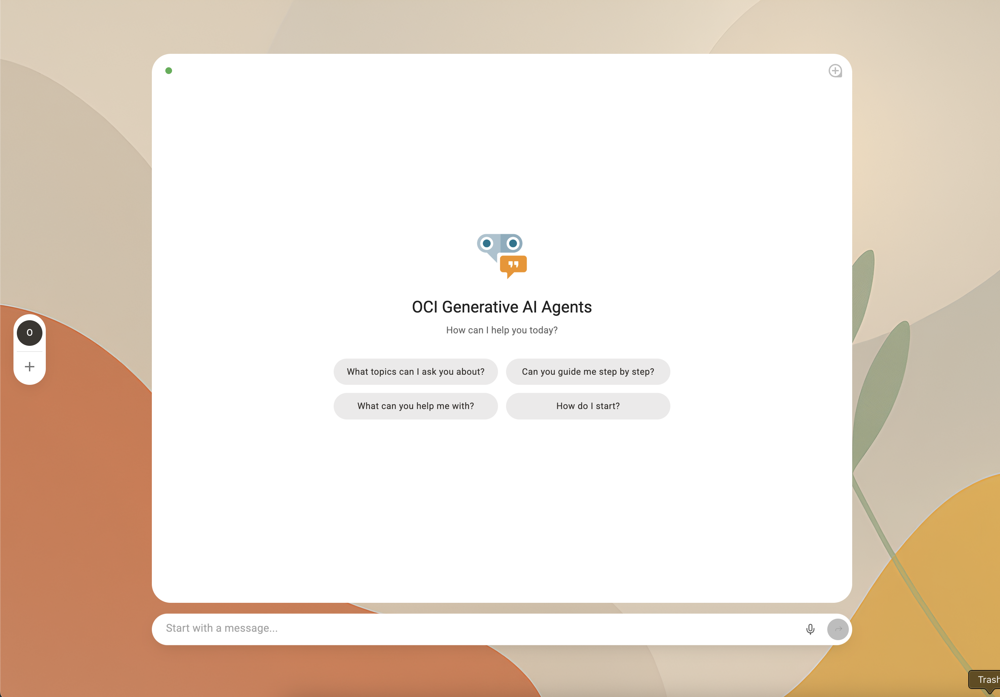
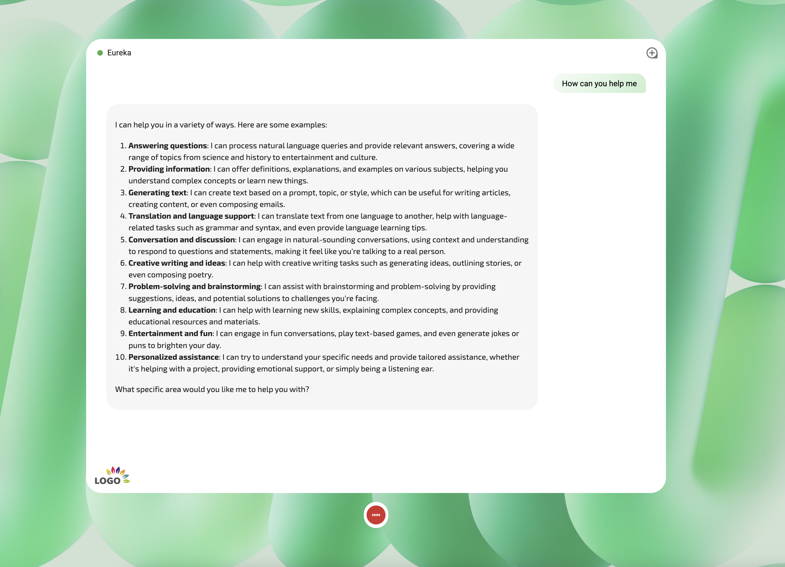
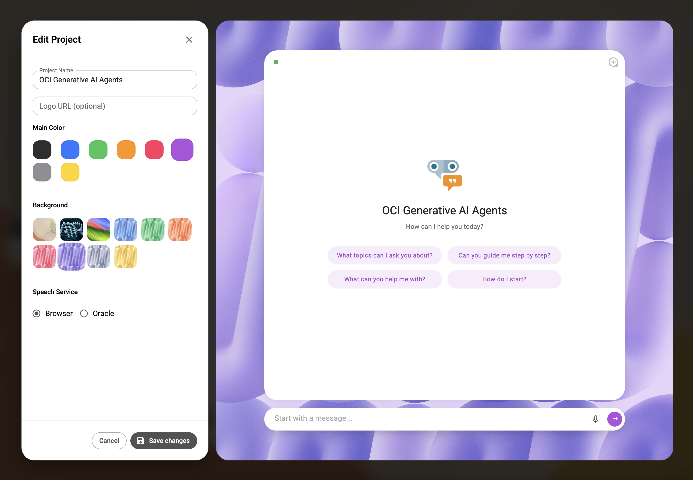

# ODA Pro Style - Frontend

A sleek, modern React chat interface that brings your Oracle Digital Assistant to life with professional theming and multi-project capabilities.



## What's This All About?

Meet the frontend powerhouse of ODA Pro Style! This isn't just another chat interface - it's a fully customizable, multi-themed chat experience designed for showcasing Oracle Digital Assistant to multiple clients and use cases.

Perfect for solution architects, sales teams, and developers who need to quickly demo different branded chat experiences without rebuilding everything from scratch.

## Key Features

**🎨 Multi-Project Showcase**

- Create up to 8 different chat projects with unique branding
- Perfect for client demos - switch between different company themes instantly
- Lightning-fast configuration - new project setup in under 30 seconds

**🔊 Advanced Speech Integration**

- **Speech-to-Text**: Send messages by speaking (browser native or Oracle AI Speech Service via backend API)
- **Text-to-Speech**: Automatic message reading using Oracle Digital Assistant's built-in TTS
- Seamless voice conversations - speak your questions, hear the responses

**💬 Rich Chat Experience**

- **Markdown Support**: Responses render with full markdown formatting for rich content

**🔒 Privacy-First Architecture**

- **Local Storage**: All projects and configurations stored in browser localStorage
- **No Server Dependencies**: Logo URLs and project data never leave the client

## Technology Stack

- **Next.js 15** - React framework with advanced optimizations
- **React 19** - Latest React features and performance improvements
- **Material-UI v7** - Professional UI components and theming
- **Framer Motion** - Smooth animations and transitions
- **Oracle Digital Assistant Client Web SDK, Release: 25.02** - Direct ODA integration

## Setup Options

### Option 1: Frontend Only (Browser Speech)

Basic setup with browser-native speech recognition:

```bash
npm install
cp .env.example .env.local

# Configure your Oracle DA connection
NEXT_PUBLIC_ODA_URI=your-oda-instance.data.digitalassistant.oci.oraclecloud.com
NEXT_PUBLIC_ODA_CHANNEL_ID=your-channel-id-here

npm run dev
```

### Option 2: Full Stack (Including integration with Oracle AI Speech)

Enhanced setup with Oracle AI Speech Service via our companion backend `ai-speech-backend`:

```bash
# Same as above, plus:
NEXT_PUBLIC_SPEECH_SERVICE_URL=http://localhost:3001

# Requires ai-speech-backend backend running
```

## Project Structure

```
src/
├── app/
│   ├── components/
│   │   ├── Chat/          # Core chat interface and messaging
│   │   ├── Settings/      # Project configuration and theming
│   │   └── NavMenu.js     # Multi-project navigation
│   ├── contexts/          # State management (projects, chat, themes)
│   ├── services/          # ODA WebSDK and speech service integrations
│   ├── theme/             # Dynamic theming system
│   └── utils/             # Message formatting and utilities
```

## Core Components

- **Chat.js**: Main chat container with dynamic theming
- **MessageList.js**: Markdown-enabled message rendering
- **ChatInputBar.js**: Speech-enabled input
- **ProjectModal.js**: Rapid project configuration interface
- **ProjectsContext**: localStorage-based multi-project management

## Speech Capabilities



**Voice Input Options:**

- **Browser Native**: Built-in Web Speech API for basic speech recognition
- **Oracle AI Speech**: Premium service requiring the `ai-speech-backend` backend

**Voice Output:**

- **Oracle TTS**: Automatic message reading using Oracle Digital Assistant's text-to-speech
- **Conversation Flow**: Complete hands-free chat experience

## Multi-Project Management



**Perfect for Client Showcases:**

- Switch between different branded configurations instantly
- Each project maintains independent chat history
- Rapid setup for new client demonstrations
- Professional theming options (colors, backgrounds, logos)

**Privacy & Data Isolation:**

- All project data stored locally in browser
- Logo URLs and configurations never transmitted to servers
- Client information remains completely private
- No cross-project data contamination

## Available Commands

```bash
npm run dev    # Development server with Turbopack
npm run build  # Production build
npm run start  # Production server
```

## Browser Requirements

- Modern browser with WebSocket support
- Web Speech API for browser-based speech recognition
- localStorage for project persistence

## Integration Modes

**Standalone Frontend:**

- Quick demos and prototypes
- Browser-based speech recognition

**With Backend API:**

- Production-ready Oracle AI Speech Service
- Enhanced speech accuracy and features
- Full enterprise speech capabilities

## License

Copyright (c) 2025 Oracle and/or its affiliates.

Licensed under the Universal Permissive License v1.0.
