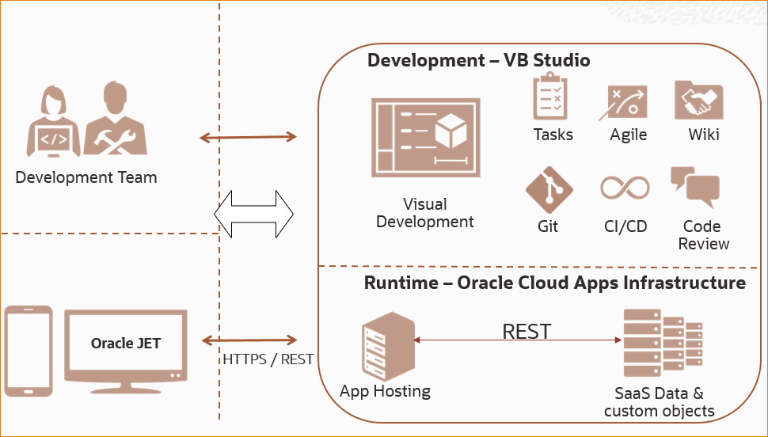
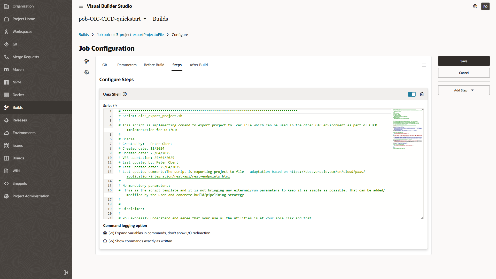

# OCI CICD

This folder purpose is to share atomic artifacts on the CICD implementation for OIC. 
Attached scripts is possible to use and process on a linux machine however the best option is to use it directly within your prefered CICD Tool.
CLI interaction is implemented using [cURL - command-line tool](https://curl.se/) primarily used for transferring data using various protocols like HTTP, HTTPS, FTP, and more.

## OCI CICD Tooling

OCI provides [PaaS service Oracle Visual Builder Studio(VBS)](https://www.oracle.com/uk/application-development/visual-builder-studio/#rc30p3) that helps rapidly create and extend SaaS applications using a visual development environment with integrated agile and collaborative development, version control, and continuous delivery automation.
Scripts located in the folder is possible to use directly as the Step in the VBS.

## OCI VBS and CICD 
[BS provides Free* OCI PaaS Service](https://vbcookbook.oracle.com/) to
- Plan and manage development processes with issue tracking, agile and sprint planning, wikis, and development dashboards
- Manage code lifecycle with Git repositories, peer code review, and continuous integration and delivery pipelines
- Gain flexibility with support for popular build and testing frameworks and infrastructure-as-code standards

*Note: One(Fisrst) instance of the Oracle Visual Builder Studio service is for Free (20 gigabyte storage included)*
