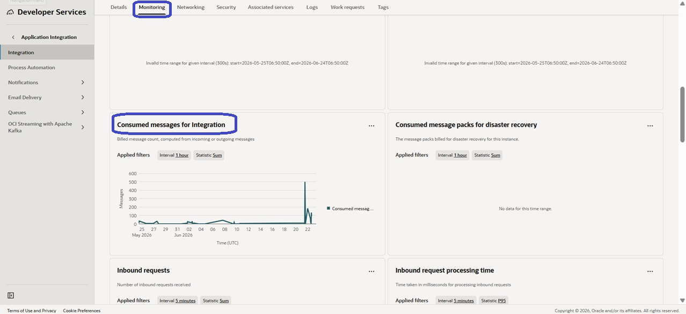
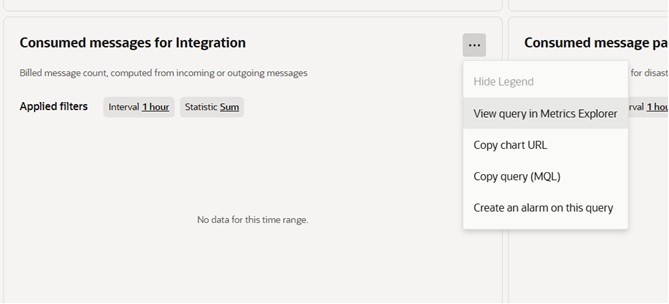
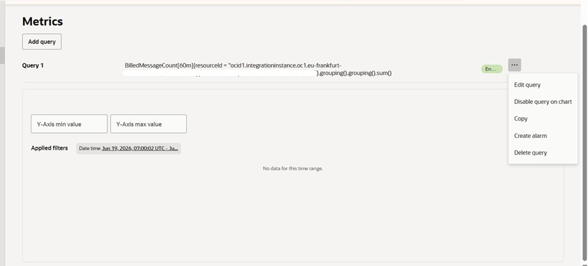
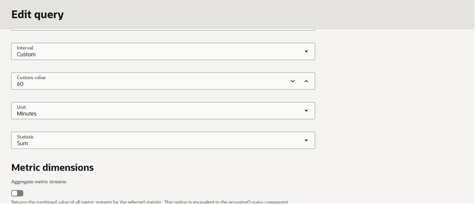
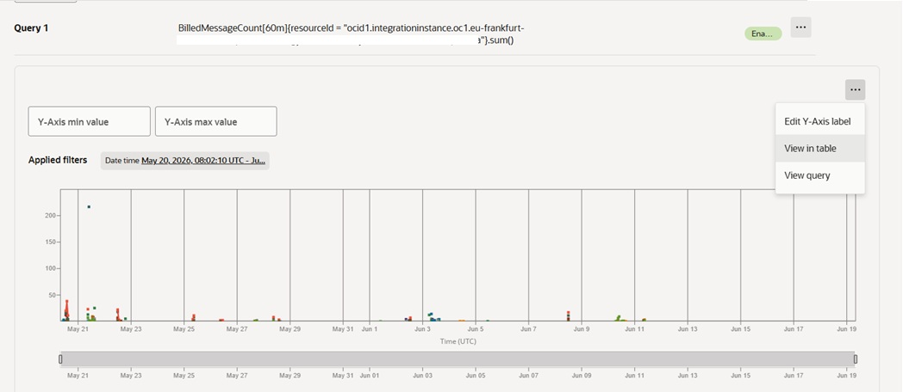
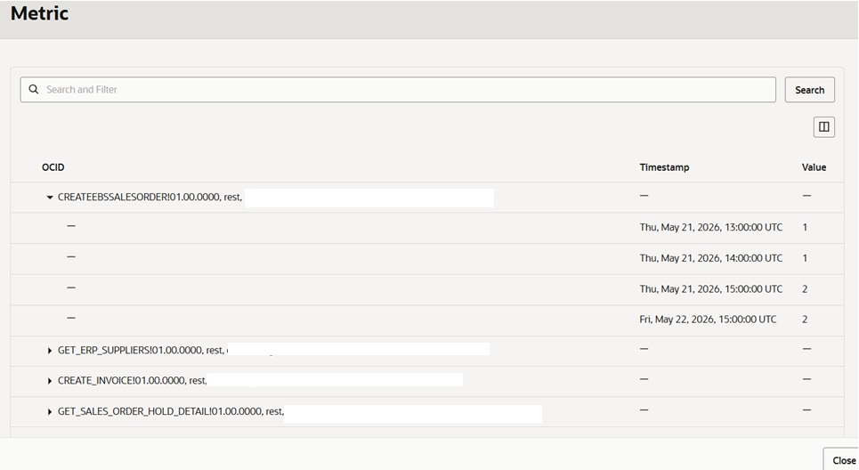

# How to Check Consumption Per Integration in OIC

*By Harris Qureshi*

Understanding message consumption at the integration level can help you identify which integrations are driving usage and monitor your Oracle Integration billing more effectively.

This guide shows how to view the number of billed messages consumed by each integration using the **Consumed Messages for Integration** metric.

---

## Prerequisites

- Access to the Oracle Cloud Console
- Permissions to view Oracle Integration metrics in OIC Monitoring

<small><i>Check References section.</i></small>

---

## Step 1: Open the "Consumed Messages for Integration" Metric

Navigate to your Oracle Integration Monitoring tab and locate the **Consumed Messages for Integration** metric.

From the chart menu (⋮), select **View query in Metrics Explorer**.

### Why?

This opens the metric query in Metrics Explorer, where you can customize how the data is displayed.

---

## Step 2: Edit the Metric Query

In Metrics Explorer, click the query menu (⋮) and select **Edit Query**.

---

## Step 3: Configure the Query

On the **Edit Query** page:

- Set **Statistic** to **Sum**
- Ensure **Aggregate metric streams** is **unchecked**

> **Important:** Disabling aggregation allows Oracle Integration to display metrics separately for each integration instead of combining all integrations into a single value.

---

## Step 4: Apply the Desired Time Range

Select the date range you want to analyze.

Examples:

- Last 24 Hours
- Last 7 Days
- Last 30 Days
- Custom Date Range

After applying the filter, the chart will display billed message activity for individual integrations.

---

## Step 5: View the Data in Table Format

From the chart options (⋮), select **View in Table**.

---

## Step 6: Review Billed Messages Per Integration

The table displays message consumption grouped by integration.

You can expand each integration to see:

- Integration Name
- Timestamp
- Number of Billed Messages

This provides a detailed breakdown of consumption for each integration during the selected time period.

---

## Summary

To view billed message consumption per integration:

1. Open **Consumed Messages for Integration**.
2. Select **View query in Metrics Explorer**.
3. Edit the query.
4. Set **Statistic = Sum**.
5. Uncheck **Aggregate metric streams**.
6. Apply the desired date range.
7. Select **View in Table**.
8. Review the billed message counts for each integration.

Using this approach provides a clear view of Oracle Integration message consumption at the integration level, making it easier to monitor usage and understand billing trends.

---

### Reference

[Track Billing Metrics](https://docs.oracle.com/en/cloud/paas/application-integration/oracle-integration-oci/viewing-message-metrics.html#GUID-1C1539D5-EE73-4F2E-9087-59466E534A61)

