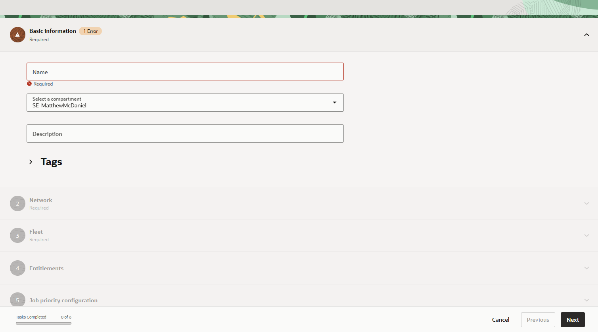
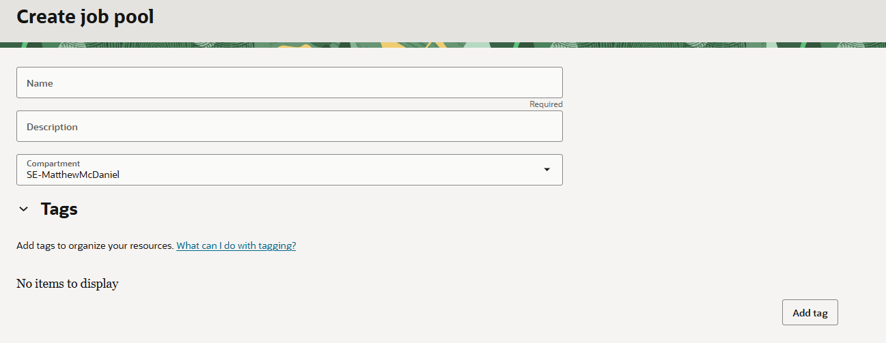
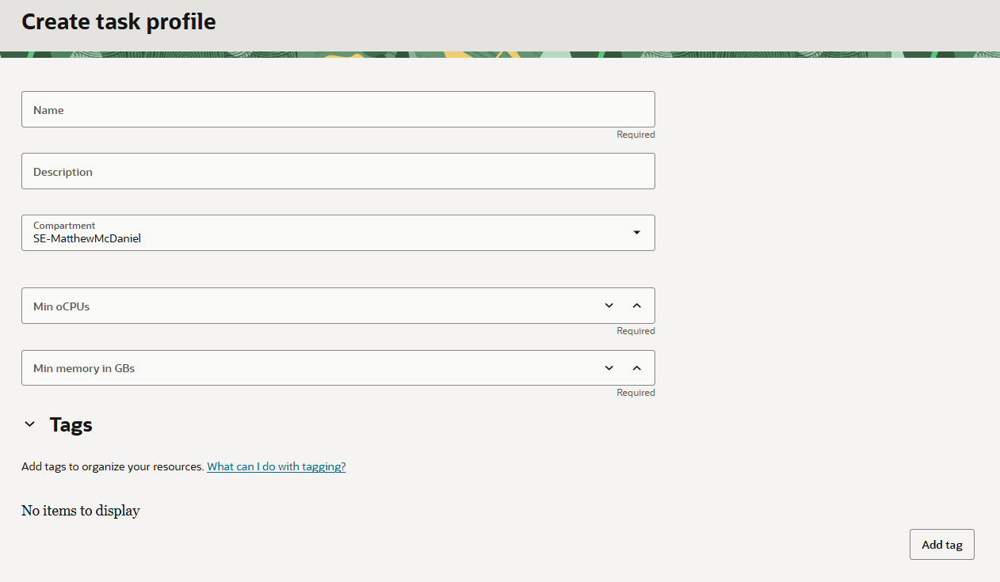
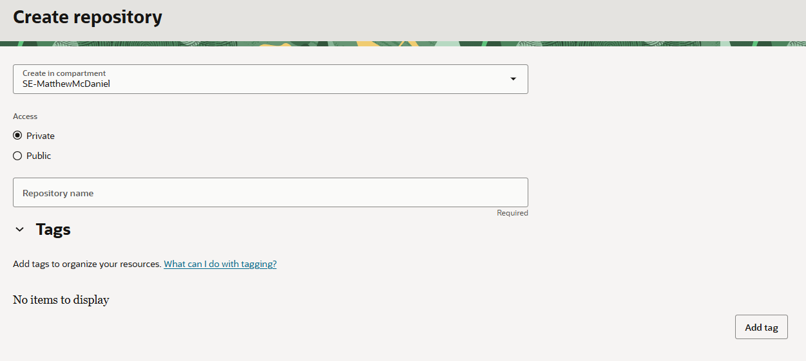
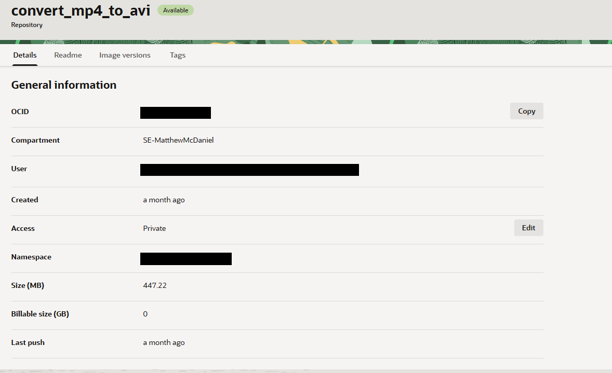
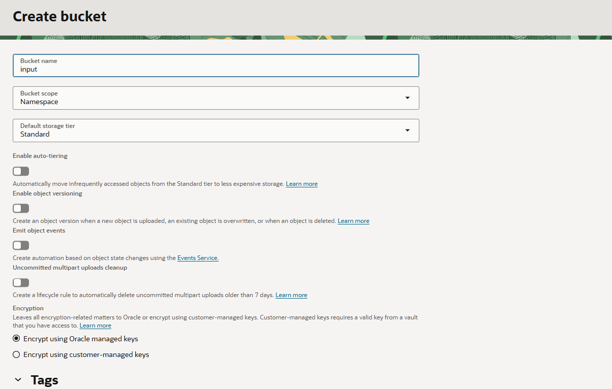
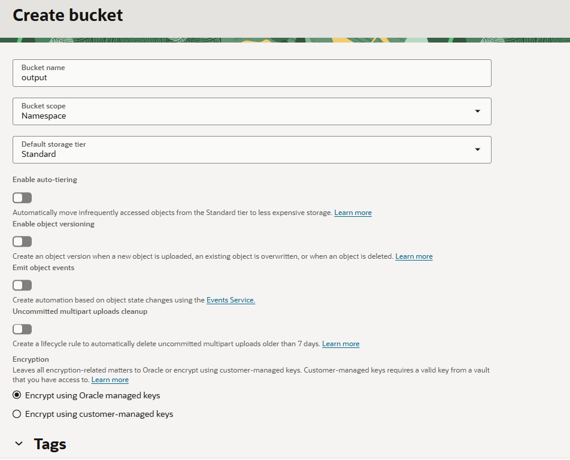
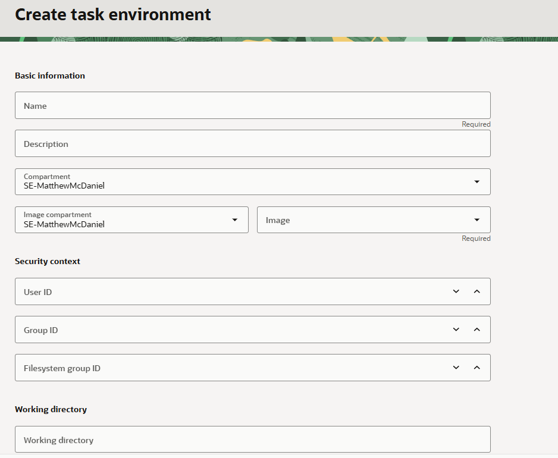

# OCI Batch Demo - Video transcoding pipeline

# Table of Contents

1. [Description](#description)
2. [Prerequisites](#prerequisites)
3. [Instructions](#instructions)
4. [Useful Links](#useful-links)
5. [License](#license)

# Description

This project contains a small Oracle Cloud Infrastructure (OCI) media-transcoding demo. It builds a Docker image that runs as an OCI Batch task, reads an input video from OCI Object Storage, converts it with `ffmpeg`, and writes the converted output back to Object Storage.

This demo performs the following:
- Downloads an `.mp4` video from an OCI Object Storage bucket.
- Converts the `.mp4` to `.avi` using `ffmpeg`.
- Uploads the resulting `.avi` file to an OCI Object Storage bucket.

# Prerequisites

- An OCI environment with permission to read the input object and create or overwrite the output object in Object Storage.
- The required OCI IAM setup from the `OCI IAM Setup` section below.
- A network in which the batch jobs will run.
- A service gateway to route requests to OCI Object Storage.
- If you do not have access to a browser, you will need the OCI CLI.

## OCI IAM Setup


For this demo, you will need to add IAM policies to authorize your users to modify Batch resources. Furthermore, you will need to add policies that authorizes the Batch service to fetch and upload files to Object Storage. Please follow [this](https://docs.oracle.com/en-us/iaas/Content/oci-batch/iam-policy-example.htm) documentation to create the necessary policies.

Replace the placeholders with your actual compartment name(s).


# Instructions

#### Task 1. Create Batch Context
The batch container is the top-level container for your batch workloads. It consists of the networking, fleets, entitlements, job priorities, and logging configuration.

To create a batch context, go to the batch service and click **Batch Contexts**, then click **Create batch context**. Fill out the following details according to your environment.

 1. Name
 2. Compartment
 3. Description
 4. VCN
 5. Subnet
 6. Fleet
 7. Entitlements (Optional)
 8. Job Priority Configuration (Optional)
 9. Logging Configuration

 

#### Task 2. Create Job Pool
A job pool is simply a logical container for jobs. When running a job, you will select a job pool to create it under. To create a job pool, you only need the following configurations.

 1. Name
 2. Description
 3. Compartment

 

#### Task 3. Create Task Profile 
A task profile is a reusable configuration which defines the resource requirements for your tasks i.e. 1 OCPU 16 GB of Memory. You can create multiple profiles, each corresponding to a different resource requirement. To create a task profile, you need the following configurations:

 1. Name
 2. Description
 3. Minimum oCPUs
 4. Minimum memory in GBs

 

#### Task 4. Set up Local environment and push container images.
  1. Create container registry in OCI
  
  2. Go to the directory where the Dockerfile is located.
  3. Push container image to OCIR. The image should match the region and name of your repository i.e. `iad.ocir.io/convert_mp4_to_avi:latest`

  ```
  docker build -t <image>:<tag> .
  docker push <image>:<tag>
  ```
  
  
  4. Create Object Storage buckets for input and output video

  

  

  5. Upload video file to Object Storage.
  
  **NOTE:** If you are using the OCI CLI, you can use this command.

```
oci os object put --namespace <os-namespace> --file <path/to/file> --bucket-name <name_of_bucket>
```


For the purpose of this demo, we've included a `.mp4` that you may use. The file is located here: 

```
technology-engineering/app-dev/developer-tools-and-lowcode/batch/20190530-SPITZRf-0001-Stars of Cephus~small.mp4
```

**Disclaimer:** The video is taken from the NASA Image and Video Library, which can be found here: https://images.nasa.gov/

This demonstration is not endorsed by NASA and is compliant with the NASA Images and Media Usage Guidelines: https://www.nasa.gov/nasa-brand-center/images-and-media/


 #### Task 5. Create Task environment
 A task environment is the runtime configuration for your tasks. To set up a task environment, you will need:

  1. Name
  2. Description
  3. Security Context
      a. User ID - 1
      b. Group ID - 1
      c. Filesystem group ID - 1
      **NOTE:** Setting these as 1 should suffice for this example but should be changed according to your security requirements. 
  4. Working directory

  

 #### Task 6. Submit Job

There are various ways to submit a job to the Batch service. For this tutorial, we are going to use the OCI CLI.

  1. Create a file called `task.json`
  2. Copy and paste the following into `task.json`
  ```
  {
  "batchJobPoolId": "JOB_POOL_OCID",
  "compartmentId": "COMPARTMENT_ID",
  "description": "Task to convert video from MP4 to AVI format",
  "displayName": "convert_video",
  "maxWaitSeconds": 0,
  "tasks": [
      {
        "batchTaskEnvironmentId": "TASK_ENVIRONMENT_OCID",
        "batchTaskProfileId": "TASK_PROFILE_OCID",
        "description": "Task to convert video from MP4 to AVI format",
        "environmentVariables": [
          {
            "name": "INPUT_BUCKET",
            "value": "input_bucket"
          },
          {
            "name": "INPUT_OBJECT",
            "value": "input.mp4"
          },
        {
            "name": "OCI_BUCKET",
            "value": "output_bucket"
        },
        {
            "name": "OUTPUT_FILENAME",
            "value": "output.avi"
        },
        {
            "name": "OCI_NAMESPACE",
            "value": "TENANCY_NAMESPACE"
        },
        {
            "name": "OCI_REGION",
            "value": "REGION"
        }
        ],
        "fleetAssignmentPolicy":
        {
            "type": "BEST_FIT"
          },
        "name": "convert_video",
        "type": "COMPUTE"
      }
  ],
  "waitForState": [
    "ACCEPTED"
  ],
  "waitIntervalSeconds": 0
}
  ```
  Replace the following according to your environment:
  *JOB_POOL_OCID*
  *COMPARTMENT_ID*
  *TASK_ENVIRONMENT_OCID*
  *TASK_PROFILE_OCID*
  *TENANCY_NAMESPACE*
  *REGION*

  3. Run the following command
  
  ```
  oci batch batch-job create --from-json file://video_conversion_job.json
  ```

  The job will take up to 10 minutes to complete. Observe the job in the OCI Console to see what stage it is in.
#### Task 8. Validate results
  1. In the OCI Console, go to Object Storage.
  2. Find the output bucket and validate that the transcoded video is present.

# Useful Links 

- [OCI Batch](https://docs.oracle.com/en-us/iaas/Content/oci-batch/overview.htm)

# License

Copyright (c) 2026 Oracle and/or its affiliates.
Licensed under the Universal Permissive License (UPL), Version 1.0.

See [LICENSE](https://github.com/oracle-devrel/technology-engineering/blob/main/LICENSE.txt) for more details.