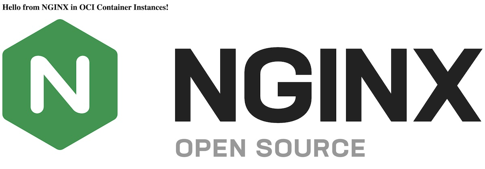

<!--
Copyright (c) 2025 Oracle and/or its affiliates.

The Universal Permissive License (UPL), Version 1.0

Subject to the condition set forth below, permission is hereby granted to any
person obtaining a copy of this software, associated documentation and/or data
(collectively the "Software"), free of charge and under any and all copyright
rights in the Software, and any and all patent rights owned or freely
licensable by each licensor hereunder covering either (i) the unmodified
Software as contributed to or provided by such licensor, or (ii) the Larger
Works (as defined below), to deal in both

(a) the Software, and
(b) any piece of software and/or hardware listed in the lrgrwrks.txt file if
one is included with the Software (each a "Larger Work" to which the Software
is contributed by such licensors),

without restriction, including without limitation the rights to copy, create
derivative works of, display, perform, and distribute the Software and make,
use, sell, offer for sale, import, export, have made, and have sold the
Software and the Larger Work(s), and to sublicense the foregoing rights on
either these or other terms.

This license is subject to the following condition:
The above copyright notice and either this complete permission notice or at
a minimum a reference to the UPL must be included in all copies or
substantial portions of the Software.

THE SOFTWARE IS PROVIDED "AS IS", WITHOUT WARRANTY OF ANY KIND, EXPRESS OR
IMPLIED, INCLUDING BUT NOT LIMITED TO THE WARRANTIES OF MERCHANTABILITY,
FITNESS FOR A PARTICULAR PURPOSE AND NONINFRINGEMENT. IN NO EVENT SHALL THE
AUTHORS OR COPYRIGHT HOLDERS BE LIABLE FOR ANY CLAIM, DAMAGES OR OTHER
LIABILITY, WHETHER IN AN ACTION OF CONTRACT, TORT OR OTHERWISE, ARISING FROM,
OUT OF OR IN CONNECTION WITH THE SOFTWARE OR THE USE OR OTHER DEALINGS IN THE
SOFTWARE.
-->

# OCI Container Instances NGINX example 
## With multiple volumes and a custom sidecar to tail access log to OCI Logging and mount the filesystem from OCI Object Storage bucket  

Reviewed: 9.10.2025
 
## When to use this asset?
 
Anyone who wants to experiment with OCI Container Instances and setup a multi-container instance with multiple volumes. In this example I'm using volumes to:
<ul>
    <li>Mount the NGINX filesystem for html data from OCI Object Storage bucket</li>
    <li>Tail NGINX access log to OCI Logging for monitoring</li>
</ul>
These operations will be handled by a custom container that is being built in this example. 
The NGINX container is the latest one from Docker Hub without modifications. 
The sidecar container is built using <code>OCI SDK</code> in NodeJS, but this could be done also in an other language like Java, Go, Python or .net.

## Author
<a href="https://github.com/mikarinneoracle">mikarinneoracle</a>

## How to use this asset?

First, the sidecar container is built from the <code>source</code> in this repo. This can be done in OCI tenancy Cloud Shell. 
Once built it is pushed to OCI Registry (OCIR) repo for deployment as part of the to Container Instances (CI) deployment.

Then, the CI deployment is created in OCI Resource Manager (RM) from the <code>terraform</code> in this repo.

However, before creating the RM terraform stack a few other OCI resources need to be created for the CI deployment:
<ul>
    <li>Object Storage (OS) bucket for the NGINX filesystem. The example content is under <code>www-data</code> in this repo. The NGINX container custom sidecar will mount these files to NGINX <code>/usr/share/nginx/html</code> volume directory</li>
    <li>OCI Logging target for the container sidecar to send the <code>access.log</code> with <code>tail</code> to</li>
</ul>
Once these are created, the RM stack can be created with a configuration that incudes these above among other variables and be deployed. 
The result will be a working NGINX with html content from OS and access logs being to OCI Logging for monitoring.

## Steps to complete

### Create OCIR repo

In your OCI tenancy open Cloud UI.

Create a new repo <code>nginx-sidecar</code> to your home compartment. Keep it as private repo (the default setting).

### Create the sidecar container from source in Cloud Shell

#### Copy source from this repo

In your OCI tenancy open Cloud shell. 

In cloud shell create subdir for the sidecar container with <code>mkdir nginx-sidecar</code> and cd to it.
 
Create the 3 files in <code>source</code> directory. There are several ways to do this but probably easiest is to just a <code>nano</code> editor and copy-paste file contents and save.
 
Other ways are to use the file upload from the cloud shell menu after cloning this repo to your localhost and using the Code Editor in the Cloud UI. Choose the one which suits you the best.
 

#### Setup OCI SDK Authentication

Since the sidecar container uses OCI SDk to use other OCI services in tenancy we need authenticate and authorize it for the use.

Normally with any SDK code that runs inside OCI we use use either <code>instance-principal</code> or <code>resource-principal</code> for this purpose depending on the case. Anything that runs on a Virtual Machine (VM) uses <code>instance-principal</code> and services like OCI Functions and Container Instances like in this case use <code>resource-principal</code>. See <a href="https://docs.oracle.com/en-us/iaas/Content/API/Concepts/sdk_authentication_methods.htm">https://docs.oracle.com/en-us/iaas/Content/API/Concepts/sdk_authentication_methods.htm</a> for more info.

To make testing this example slightly easier let's use your IAM user instead. To do this we package your OCI CLI config into the container image. But be aware not to distribute the container outside your OCI tenancy since it contains your tenancy <code>API KEY</code>.

To do this create OCI config with OCI CLI in your localhost with <code>oci setup config</code> and copy the created config to your directory in cloud shell. After adding the created API KEY to your profile in OCI tenancy copy the created private key file to your directory in cloud shell, too. Modify the config with nano editor to remove the path from the keyfile e.g.
<pre>key_file = oci_api_key.pem</pre>

#### Build and push to OCIR

After adding the CLI config and API Key build the container and push it to OCIR repo:

<pre>
export ns=$(oci os ns get | jq .data | tr -d '"')
docker build . -t "fra.ocir.io/$ns/nginx-sidecar:1"
docker push  "fra.ocir.io/$ns/nginx-sidecar:1"
</pre>

As always you can change the <code>region</code> to match yours, I'm using the <i>EU-frankurt-1</i> region in this case.

### Create Object Storage bucket with html in www-data

In Cloud UI create the Object Storage bucket to your compartment with name <code>nginx-www-data</code>.

You can manually upload the files in <code>www-data</code> of this repo after cloning using Cloud UI or use OCI CLI bulk upload in localhost to do this:
<pre>
cd www-data
oci os object bulk-upload --bucket-name nginx-www-data --overwrite --src-dir . 
</pre>
There is one consideration though: 
CLI bulk upload uploads directories but it does not seem to set the "directory" type for directories unlike the Cloud UI by default, and since the container sidecar code expects this type to be able to copy the directory structure from OS I suggest first creating the directories to the bucket before using the CLI bulk upload. 
Hence, in this example create also the <code>images</code> directory manually using Cloud UI to the bucket after creating it, before using the bulk upload to copy the files to the bucket.

### Create OCI Logging target for NGINX access log

In Cloud UI navigate to OCI Logging and create a Log with name <code>nginx-log</code> using the Default Log Group (if you don't have that one then create a Log Group first and then the Log itself).

The log's OCID need to be then configured to the Resorce Manager Terraform stack variables in the later step.

### Create a VCN with a public subnet for NGINX access to port 80 from Internet

In Cloud create a new Virtual Cloud Network with a subnet having public Internet access.
The adjust the public subnet's security list ingress rule to allow traffic from CIDR <code>0.0.0.0/</code> to port 80.

The subnet's OCID need to be then configured to the Resorce Manager Terraform stack variables in next step.

### Create Resource Manager stack from terraform files

In Cloud UI create a RM new stack in your home compartment.

First copying the <code>terraform</code> directory to your localhost either by cloning this repo or copy-pasting the 2 files manually into a local directory named <code>terraform</code>.

Then drag-and-drop the directory folder to the Stack Configuration box on the Cloud UI's Create Stack screen. Now, click "Next" to setup the variables for the stack:

<ul>
    <li><b>ad_number</b> : 1 (or 2 or 3 if your region supports it)</li>
    <li><b>compartment_ocid</b> : <i>prefilled with the current compartment OCID</i></li>
    <li><b>log_file</b> : access.log</li>
    <li><b>log_mount_name</b> : nginxlogs</li>
    <li><b>log_mount_path</b> : /var/log/nginx</li>
    <li><b>log_ocid</b> : <i>Here copy the OCID of the Log created in earlier step</i></li>
    <li><b>sidecar_image</b> : fra.ocir.io/&lt;<i>Here put the OS namespace according to your sidecar image</i>&gt;/nginx-sidecar:1</li>
    <li><b>subnet_id</b> : <i>Here copy the OCID of the public subnet created in previous step</i></li>
    <li><b>tenancy_ocid</b> : <i>prefilled with the current compartment OCID</i></li>
    <li><b>www_data_bucket</b> : nginx-www-data</li>
    <li><b>www_mount_name</b> : nginxdata</li>
    <li><b>www_mount_path</b> : /usr/share/nginx/html</li>
</ul>

As it can be seen we are using NGINX defaults for access.log and html data directory to create CI <code>volumes</code> and <code>volume_mounts</code> for the containers in the deployment (i.e. NGINX and the custom sidecar container).

### Run the the RM stack to create the CI deployment and test NGINX

This is the final step to apply the RM stack in the Cloud UI, simply navigate to the stack details and click "Apply" which will run the stack.

The result is a CI instance named <code>Nginx with OCI SDK sidecar</code> and navigate to it in the Cloud UI.

Navigate to containers and 2 containers should be running as part of the CI instance deployment:

<ul>
    <li>nginx</li>
    <li>nginx-sidecar</li>
</ul>
Navigate to <code>nginx-sidecar</code>, click the "View environment variables" -button and you should these key-values on the screen:

<ul>
    <li>log_file : /var/log/nginx/access.log</li>
    <li>log_ocid : <i>OCID of the Log that was created in earlier step</i></li>
    <li>os_bucket : nginx-www-data</li>
    <li>www_path : /usr/share/nginx/html</li>
</ul>

Now, close this, click the "View logs" -button and this log should appear on the screen (example):
<pre>
2025-10-09T11:45:19.882545929Z stdout F OCI LOG:ocid1.log.oc1.eu-frankfurt-1.amaaaaaauev...ae5q
2025-10-09T11:45:19.88275791Z stdout F ACCESS LOG:/var/log/nginx/access.log
2025-10-09T11:45:19.88276303Z stdout F WWW DATA:/usr/share/nginx/html
2025-10-09T11:45:19.882795Z stdout F OS BUCKET:nginx-www-data
2025-10-09T11:45:20.046498505Z stdout F images/
2025-10-09T11:45:20.085388327Z stdout F images/ is a directory, creating .. 
2025-10-09T11:45:20.08573349Z stdout F images/nginx_logo.svg
2025-10-09T11:45:20.117605278Z stdout F /usr/share/nginx/html/images/nginx_logo.svg
2025-10-09T11:45:20.117760561Z stdout F index.html
2025-10-09T11:45:20.121175176Z stdout F File written successfully to/usr/share/nginx/html/images/nginx_logo.svg
2025-10-09T11:45:20.141964765Z stdout F /usr/share/nginx/html/index.html
2025-10-09T11:45:20.142309646Z stdout F File written successfully to/usr/share/nginx/html/index.html
</pre>

Close this, copy the <code>Public IP address</code> and paste it to your browser. Now, the NGINX website should show up with the html content mounted from OS bucket:

Now go back to Cloud UI to check the OCI Logging. Under Logs find the log <code>nginx-log</code> and see log rows from the NGINX access.log starting to appear on the screen.

## Useful Links
 
- [OCI Container Instances](https://www.oracle.com/cloud/cloud-native/container-instances/)
    - Learn how OCI Container Instances lets you easily run applications on serverless compute optimized for containers
- [OCI SDK](https://docs.oracle.com/en-us/iaas/Content/API/Concepts/sdks.htm)
    - Oracle Cloud Infrastructure provides a number of Software Development Kits (SDKs) and a Command Line Interface (CLI) to facilitate development of custom solutions
- [OCI Logging](https://docs.oracle.com/en-us/iaas/Content/Logging/Concepts/loggingoverview.htm)
    - The Oracle Cloud Infrastructure Logging service is a highly scalable and fully managed single pane of glass for all the logs in your tenancy. Logging provides access to logs from Oracle Cloud Infrastructure resources
- [OCI Object Storage](https://www.oracle.com/cloud/storage/object-storage/)
    - Oracle Cloud Infrastructure (OCI) Object Storage provides scalable, durable, low-cost storage for any type of data. Benefit from 11 nines of durability. Scale storage to nearly unlimited capacity for your unstructured data
- [Oracle](https://www.oracle.com/)
    - Oracle Website

## License

Copyright (c) 2025 Oracle and/or its affiliates.

Licensed under the Universal Permissive License (UPL), Version 1.0.

See [LICENSE](LICENSE) for more details.

ORACLE AND ITS AFFILIATES DO NOT PROVIDE ANY WARRANTY WHATSOEVER, EXPRESS OR IMPLIED, FOR ANY SOFTWARE, MATERIAL OR CONTENT OF ANY KIND CONTAINED OR PRODUCED WITHIN THIS REPOSITORY, AND IN PARTICULAR SPECIFICALLY DISCLAIM ANY AND ALL IMPLIED WARRANTIES OF TITLE, NON-INFRINGEMENT, MERCHANTABILITY, AND FITNESS FOR A PARTICULAR PURPOSE.  FURTHERMORE, ORACLE AND ITS AFFILIATES DO NOT REPRESENT THAT ANY CUSTOMARY SECURITY REVIEW HAS BEEN PERFORMED WITH RESPECT TO ANY SOFTWARE, MATERIAL OR CONTENT CONTAINED OR PRODUCED WITHIN THIS REPOSITORY. IN ADDITION, AND WITHOUT LIMITING THE FOREGOING, THIRD PARTIES MAY HAVE POSTED SOFTWARE, MATERIAL OR CONTENT TO THIS REPOSITORY WITHOUT ANY REVIEW. USE AT YOUR OWN RISK. 
