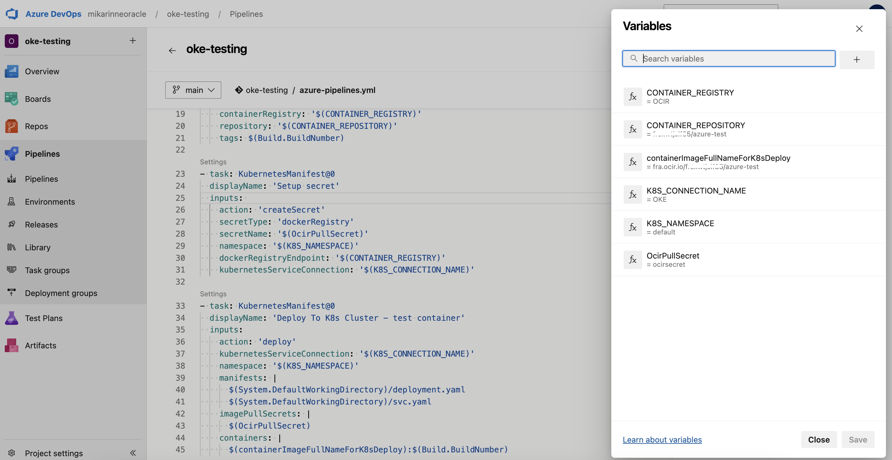
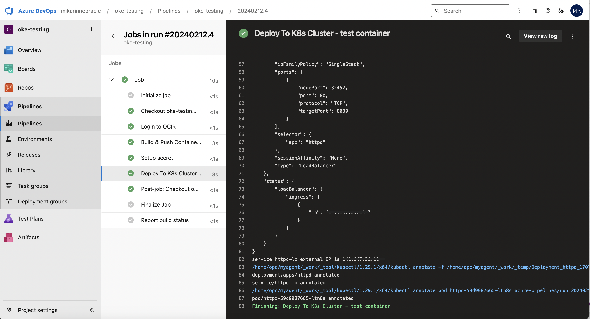

<!--
Copyright (c) 2024 Oracle and/or its affiliates.

The Universal Permissive License (UPL), Version 1.0

Subject to the condition set forth below, permission is hereby granted to any
person obtaining a copy of this software, associated documentation and/or data
(collectively the "Software"), free of charge and under any and all copyright
rights in the Software, and any and all patent rights owned or freely
licensable by each licensor hereunder covering either (i) the unmodified
Software as contributed to or provided by such licensor, or (ii) the Larger
Works (as defined below), to deal in both

(a) the Software, and
(b) any piece of software and/or hardware listed in the lrgrwrks.txt file if
one is included with the Software (each a "Larger Work" to which the Software
is contributed by such licensors),

without restriction, including without limitation the rights to copy, create
derivative works of, display, perform, and distribute the Software and make,
use, sell, offer for sale, import, export, have made, and have sold the
Software and the Larger Work(s), and to sublicense the foregoing rights on
either these or other terms.

This license is subject to the following condition:
The above copyright notice and either this complete permission notice or at
a minimum a reference to the UPL must be included in all copies or
substantial portions of the Software.

THE SOFTWARE IS PROVIDED "AS IS", WITHOUT WARRANTY OF ANY KIND, EXPRESS OR
IMPLIED, INCLUDING BUT NOT LIMITED TO THE WARRANTIES OF MERCHANTABILITY,
FITNESS FOR A PARTICULAR PURPOSE AND NONINFRINGEMENT. IN NO EVENT SHALL THE
AUTHORS OR COPYRIGHT HOLDERS BE LIABLE FOR ANY CLAIM, DAMAGES OR OTHER
LIABILITY, WHETHER IN AN ACTION OF CONTRACT, TORT OR OTHERWISE, ARISING FROM,
OUT OF OR IN CONNECTION WITH THE SOFTWARE OR THE USE OR OTHER DEALINGS IN THE
SOFTWARE.
-->

### Author
<a href="https://github.com/mikarinneoracle">mikarinneoracle</a>

## Building and Deploying to OKE with Azure DevOps

There are two ways (at least) to build and deploy to OKE from Azure DevOps:
<ul>
    <li>Use OCI VM as Azure parallel job self-hosted build agent that will run as <code>instance-principal</code> and hence no OCI credentials are needed to be shared with Azure DevOps. Here <code>kubectl</code> and OCI native tooling like <code>oci cli</code> can be used in pipelines.</li>
     
    <li>Use Azure DevOps native <code>tasks</code> that can run as either Azure-hosted or as self-hosted Azure parallel jobs. Credentials will be stored to Azure DevOps.</li>
</ul>

For this example I've used the second option. I'm also using a self-hosted agent/runner on OCI but that's just because I can use the <code>always-free</code> VM instance for it as part of the default OCI subscription and I don't have any Azure-hosted agents available in my Azure subscription. Technically that does not matter since the agent is a vanilla Oracle Linux VM instance and does not contain any customizations whatsover to do the pipeline work (it could however, but it does not).

## Copy the files to the Azure DevOps repo

To make this build and deploy to OKE to work is not a big task. First copy the files in this repo to you empty Azure DevOps project repo.

## Create OCIR repository for the test image

Before building the Docker image repo needs to be created under the desired <code>compartment</code>. This can be easily done using OCI Cloud UI. Name the repository as <b><i>Azure-test</i></b>, for example.

Then modify the <code>deployment.yaml</code> <a href="https://github.com/oracle-devrel/technology-engineering/blob/azure-devops-oke/app-dev/devops/azure-devops-oke/deployment.yaml#L19">line 19</a> by replacing the &lt;TENANCY_NAMESPACE&gt; with yours and if you gave another name for the OCIR repo then modify also that here, too. Modify also the <code>region</code> if using some other OCI region than <b><i>fra.ocir.io</i></b>.

To be able to do <code>Docker login</code> to the repo create <code>auth token</code> for your OCI user unless you already have one.
    
## Create OKE cluster (or use existing) and setup Service Account for Azure DevOps

Using Cloud UI and OKE Quick create setup a new Kubernetes cluster in OCI for this example. Alternatively you can also use an existing one. Make sure the OKE cluster has <code>public</code> API endpoint access for <code>kubectl</code>.

Once the OKE cluster is up and running with <code>kubectl</code> access setup the Service Account for Azure DevOps by following this guide: 
    <a href="https://docs.oracle.com/en-us/iaas/Content/ContEng/Tasks/contengaddingserviceaccttoken.htm" target="_NEW">https://docs.oracle.com/en-us/iaas/Content/ContEng/Tasks/contengaddingserviceaccttoken.htm</a>. 
    

Name the secret <b><i>oke-kubeconfig-azure-token</i></b> as in <code>azure-token.yaml</code> <a href="https://github.com/oracle-devrel/technology-engineering/blob/azure-devops-oke/app-dev/devops/azure-devops-oke/azure-token.yaml#L4" target="_NEW">line 14</a>.

## Setup Azure DevOps OCI connections for OKE and OCIR

To make the Azure DevOps pipeline to work with OCIR and OKE two <code>Service Connections are</code> needed with the following settings:
<ul>
    <li>OCIR</li>
    <ul>
        <li>Type: Docker Registry</li>
        <li>Registry Type: Others</li>
        <li>Docker ID: Your OCI user e.g. <i>&lt;TENANCY_NAMESPACE&gt;/oracleidentitycloudservice/mika.rinne@oracle.com</i></li>
        <li>Docker Password: Your OCI user's auth token</li>
        <li>Service connection name: OCIR</li>
        <li>Grant access permissions to all pipelines: YES</li>
    </ul>
    <li>OKE</li>
    <ul>
        <li>Type: Kubernetes</li>
        <li>Authentication method: Service Account</li>
        <li>Server URL: OKE cluster server address from your <i>~/.kube/config</i> e.g. <i>https://145.144.233.100:6443</i></li>
        <li>Authorization Secret: Get the secret JSON by doing <i>kubectl get secret oke-kubeconfig-azure-token -n kube-system -o json</i> and paste it here</li>
        <li>Service connection name: OKE</li>
        <li>Grant access permission to all pipelines: YES</li>
    </ul>
</ul>

## Create env vars for the build pipeline

Create a pipeline from existing Azure DevOps pipeline file by selecting the project repo and the file <b><i>azure-pipelines.yaml</i></b>.

Edit the created pipeline and select <code>Variables</code> to create them as follows:

<ul>
    <li>CONTAINER_REGISTRY: OCIR</li>
    <li>CONTAINER_REPOSITORY: Use the same name as in the <code>deployment.yaml</code> <a href="https://github.com/oracle-devrel/technology-engineering/blob/azure-devops-oke/app-dev/devops/azure-devops-oke/deployment.yaml#L19">line 19</a> but <b><i>without</i></b> the <code>region</code> and the <code>tag</code> ("1" in the example YAML file) e.g. <b><i>&lt;TENANCY_NAMESPACE&gt;/azure-test</i></b></li>
    <li>containerImageFullNameForK8sDeploy: The same as above but with the OCI region e.g. <b><i>fra.ocir.io/&lt;TENANCY_NAMESPACE&gt;/azure-test</i></b></li>
    <li>K8S_CONNECTION_NAME: OKE</li>
    <li>K8S_NAMESPACE: default</li>
    <li>OcirPullSecret: ocirsecret</li>
</ul>

## Run the pipeline

Pipeline runs automatically after commiting changes and when all of the above are properly set it should complete succesfully.

Pipeline will create a Kubernetes <b><i>load balancer</i></b> service to provide a public access point to the pod in the OKE cluster:

<PRE>
kubectl get svc
NAME         TYPE           CLUSTER-IP     EXTERNAL-IP      PORT(S)             AGE
httpd-lb     LoadBalancer   10.96.175.74   144.200.51.195   80:32452/TCP        4h1m
</PRE>

Calling the LB endpoint with cURL or from the browser should show an echo:

<PRE>
curl 144.200.51.195
{
  "path": "/",
  "headers": {
    "host": "144.200.51.195",
    "user-agent": "curl/8.4.0",
    "accept": "*/*"
  },
  "method": "GET",
  "body": "",
  "fresh": false,
  "hostname": "144.200.51.195",
  "ip": "::ffff:10.0.10.220",
  "ips": [],
  "protocol": "http",
  "query": {},
  "subdomains": [],
  "xhr": false,
  "os": {
    "hostname": "httpd-59d9987665-ltn8s"
  },
  "connection": {}
}%
</PRE>

### License

Copyright (c) 2024 Oracle and/or its affiliates.

Licensed under the Universal Permissive License (UPL), Version 1.0.

See [LICENSE](https://github.com/oracle-devrel/technology-engineering/blob/main/LICENSE) for more details.