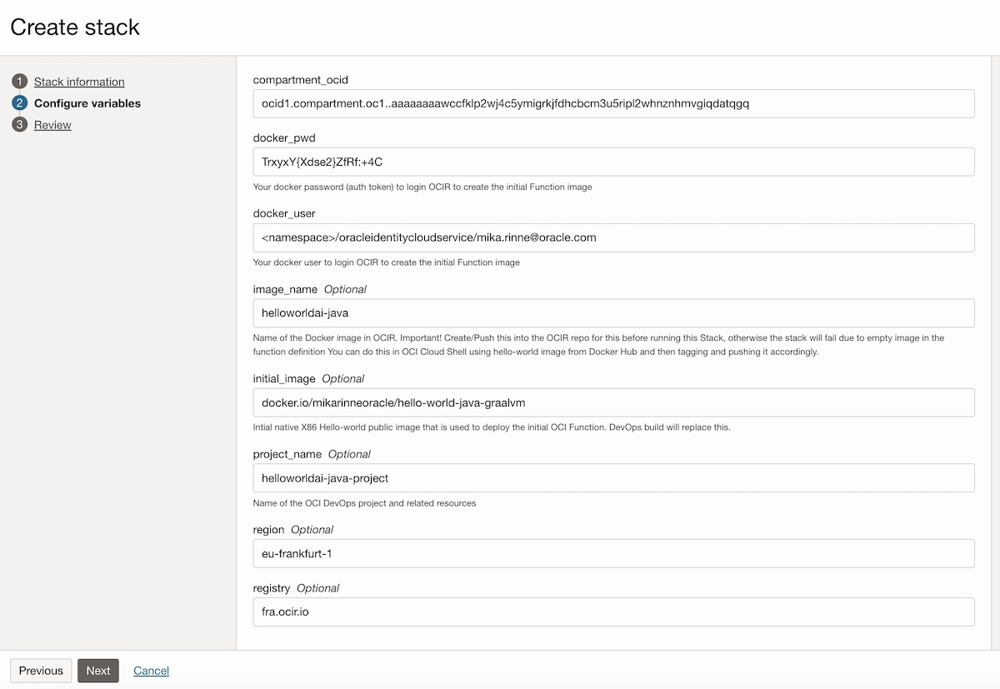

<!--
Copyright (c) 2024 Oracle and/or its affiliates.

The Universal Permissive License (UPL), Version 1.0

Subject to the condition set forth below, permission is hereby granted to any
person obtaining a copy of this software, associated documentation and/or data
(collectively the "Software"), free of charge and under any and all copyright
rights in the Software, and any and all patent rights owned or freely
licensable by each licensor hereunder covering either (i) the unmodified
Software as contributed to or provided by such licensor, or (ii) the Larger
Works (as defined below), to deal in both

(a) the Software, and
(b) any piece of software and/or hardware listed in the lrgrwrks.txt file if
one is included with the Software (each a "Larger Work" to which the Software
is contributed by such licensors),

without restriction, including without limitation the rights to copy, create
derivative works of, display, perform, and distribute the Software and make,
use, sell, offer for sale, import, export, have made, and have sold the
Software and the Larger Work(s), and to sublicense the foregoing rights on
either these or other terms.

This license is subject to the following condition:
The above copyright notice and either this complete permission notice or at
a minimum a reference to the UPL must be included in all copies or
substantial portions of the Software.

THE SOFTWARE IS PROVIDED "AS IS", WITHOUT WARRANTY OF ANY KIND, EXPRESS OR
IMPLIED, INCLUDING BUT NOT LIMITED TO THE WARRANTIES OF MERCHANTABILITY,
FITNESS FOR A PARTICULAR PURPOSE AND NONINFRINGEMENT. IN NO EVENT SHALL THE
AUTHORS OR COPYRIGHT HOLDERS BE LIABLE FOR ANY CLAIM, DAMAGES OR OTHER
LIABILITY, WHETHER IN AN ACTION OF CONTRACT, TORT OR OTHERWISE, ARISING FROM,
OUT OF OR IN CONNECTION WITH THE SOFTWARE OR THE USE OR OTHER DEALINGS IN THE
SOFTWARE.
-->

# Terraform Stack to be used in OCI Resource Manager to create OCI DevOps pipelines for OCI Functions

Reviewed: 11.2.2025
 
# When to use this asset?
 
Anyone who wants to create OCI DevOps pipelines for OCI Functions using Terraform in OCI Resource manager.
The DevOps project is not specific to any programming language but includes <a href="./files/build_pipeline_specs/">build pipeline specs</a> example files to build and deploy jvm and native Java functions. Source code for a such Function can be found <a href="https://github.com/oracle-devrel/technology-engineering/blob/main/app-dev/devops-and-containers/functions/java-helloworld-AI-with-local-dev-and-oci-functions/README.md">here</a>.

# Author
<a href="https://github.com/mikarinneoracle">mikarinneoracle</a>

# How to use this asset?

Clone this repo locally. In OCI Console click <code>Create Stack</code> under <code>Resource Manager</code> in your project compartment. Drag-n-drop the <a href="./files">files -folder</a> to <code>Stack Configuration</code> (<b>folder type</b>).

OCI DevOps IAM Policies are not part of the stack, please refer to <a href="https://docs.oracle.com/en-us/iaas/Content/devops/using/devops_iampolicies.htm">docs</a> how to create them first.

### Stack settings

Before applying the Stack fill in the vars:

<ul>
    <li><i>initial_image</i> that is used to create the OCI Function as target environment for the OCI DevOps deployment pipeline.
    By default it is loaded from Dockerhub, but you can use any X86 arch image if want to replace this</li>
    <li><i>docker_user</i> is your OCIR Docker user to push the initial image (above) to OCIR repo for the Function. Replace &lt;namespace&gt; with your <code>tenancy namespace</code>. <code>oracleidentitycloudservice</code> is used for federated domains/users, not local</li>
    <li><i>docker_user</i> is our OCIR Docker user password (your user profile auth token in OCI)</li>
    <li></li>
</ul>

Run Stacks's Apply to create the OCI DevOps project. 

The Stack creates only a <i>private subnet</i> in the VCN and hence the Function cannot be called outside the tenancy by default after the build and deploy.
 
However, the Function invocation can be done from OCI Cloud Shell either by connecting to the VCN private subnet or to OCI Service Network, both options will work. The invocation can be done as follows using the Stack <code>project_name</code> e.g. :
<pre>
fn invoke helloworldai-java-project helloworldai-java-project
</pre>

# Useful Links

- [OCI DevOps](https://www.oracle.com/cloud/cloud-native/devops-service/)
    - Oracle Cloud Infrastructure (OCI) DevOps is a continuous integration and continuous delivery (CI/CD) service for development teams building on OCI
- [OCI Functions](https://docs.oracle.com/en-us/iaas/Content/Functions/Concepts/functionsoverview.htm)
    - Learn how the Functions service lets you create, run, and scale business logic without managing any infrastructure
- [OCI SDK for Java](https://docs.oracle.com/en-us/iaas/Content/API/SDKDocs/javasdk.htm)
    - The Oracle Cloud Infrastructure SDK for Java enables you to write code to manage Oracle Cloud Infrastructure resources
- [Fn](https://fnproject.io/)
    - The Fn project is an open-source container-native serverless platform that you can run anywhere -- any cloud or on-premise. It’s easy to use, supports every programming language, and is extensible and performant
- [OCI Functions with GraalVM](https://github.com/shaunsmith/graalvm-fn-init-images)
    - Discover GraalVM Native Image -based functions with this example GitHub repo
- [Oracle](https://www.oracle.com/)
    - Oracle Website

## License

Copyright (c) 2024 Oracle and/or its affiliates.

Licensed under the Universal Permissive License (UPL), Version 1.0.

See [LICENSE](LICENSE) for more details.

ORACLE AND ITS AFFILIATES DO NOT PROVIDE ANY WARRANTY WHATSOEVER, EXPRESS OR IMPLIED, FOR ANY SOFTWARE, MATERIAL OR CONTENT OF ANY KIND CONTAINED OR PRODUCED WITHIN THIS REPOSITORY, AND IN PARTICULAR SPECIFICALLY DISCLAIM ANY AND ALL IMPLIED WARRANTIES OF TITLE, NON-INFRINGEMENT, MERCHANTABILITY, AND FITNESS FOR A PARTICULAR PURPOSE.  FURTHERMORE, ORACLE AND ITS AFFILIATES DO NOT REPRESENT THAT ANY CUSTOMARY SECURITY REVIEW HAS BEEN PERFORMED WITH RESPECT TO ANY SOFTWARE, MATERIAL OR CONTENT CONTAINED OR PRODUCED WITHIN THIS REPOSITORY. IN ADDITION, AND WITHOUT LIMITING THE FOREGOING, THIRD PARTIES MAY HAVE POSTED SOFTWARE, MATERIAL OR CONTENT TO THIS REPOSITORY WITHOUT ANY REVIEW. USE AT YOUR OWN RISK. 