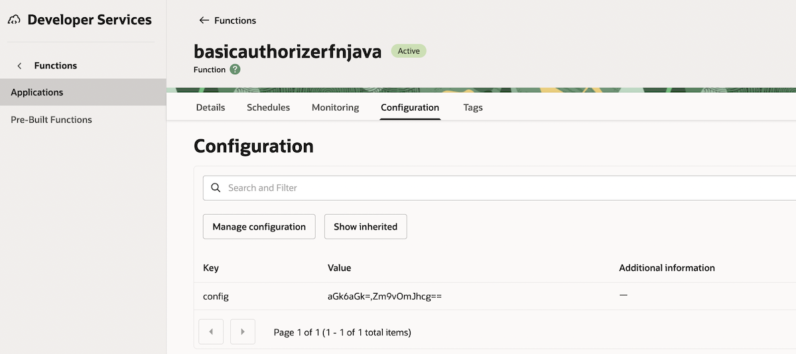
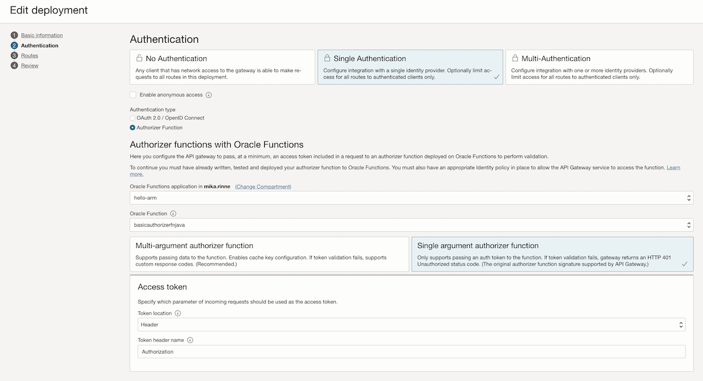
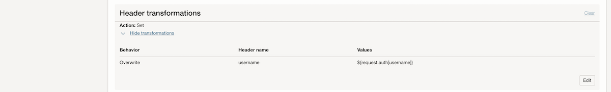

<!--
Copyright (c) 2025 Oracle and/or its affiliates.

The Universal Permissive License (UPL), Version 1.0

Subject to the condition set forth below, permission is hereby granted to any
person obtaining a copy of this software, associated documentation and/or data
(collectively the "Software"), free of charge and under any and all copyright
rights in the Software, and any and all patent rights owned or freely
licensable by each licensor hereunder covering either (i) the unmodified
Software as contributed to or provided by such licensor, or (ii) the Larger
Works (as defined below), to deal in both

(a) the Software, and
(b) any piece of software and/or hardware listed in the lrgrwrks.txt file if
one is included with the Software (each a "Larger Work" to which the Software
is contributed by such licensors),

without restriction, including without limitation the rights to copy, create
derivative works of, display, perform, and distribute the Software and make,
use, sell, offer for sale, import, export, have made, and have sold the
Software and the Larger Work(s), and to sublicense the foregoing rights on
either these or other terms.

This license is subject to the following condition:
The above copyright notice and either this complete permission notice or at
a minimum a reference to the UPL must be included in all copies or
substantial portions of the Software.

THE SOFTWARE IS PROVIDED "AS IS", WITHOUT WARRANTY OF ANY KIND, EXPRESS OR
IMPLIED, INCLUDING BUT NOT LIMITED TO THE WARRANTIES OF MERCHANTABILITY,
FITNESS FOR A PARTICULAR PURPOSE AND NONINFRINGEMENT. IN NO EVENT SHALL THE
AUTHORS OR COPYRIGHT HOLDERS BE LIABLE FOR ANY CLAIM, DAMAGES OR OTHER
LIABILITY, WHETHER IN AN ACTION OF CONTRACT, TORT OR OTHERWISE, ARISING FROM,
OUT OF OR IN CONNECTION WITH THE SOFTWARE OR THE USE OR OTHER DEALINGS IN THE
SOFTWARE.
-->

# API Gateway basic-auth Authorizer Function example

Reviewed: 13.10.2025
 
# When to use this asset?
 
Anyone who wants to implement an API Gateway authorizer Function for HTTP basic-auth

# Author
<a href="https://github.com/mikarinneoracle">mikarinneoracle</a>

# How to use this asset?

Build and deploy both functions <code>fn-authorizer-auth-basic</code> and <code>fn-authorizer-auth-basic-test</code> under <code>/files</code> to a Function Application in OCI.

Create a config for the <code>basicauthorizerfnjava</code> Function:

Config above contains two comma-separated base64 encoded key-value pairs for basic-auth authentication:
<pre>
aGk6aGk=,Zm9vOmJhcg==
</pre>

<b>aGk6aGk=</b> is <b>hi:hi</b> => username is <b>hi</b>, password <b>hi</b>

<b>aGk6aGk=</b> is <b>foo:bar</b> => username is <b>foo</b>, password <b>bar</b>

(You can modify the config by adding new pairs as you like and remove the existing ones)

After deploing the functions add an API Gateway instance and configure the Functions:

Settings for the <b><i>Single argument authorizer function</i></b>:

Token location: <b>Header</b>
 
Token header name: <b>Authentication</b>
 

Configure the route for the backend function:
    

    
Configure Route Request Policies Header transformations:

Settings for the <b><i>Header transformations</i></b>:

Behavior: <b>Overwrite</b>
 
Header name: <b>username</b>
 
Values: <b>${request.auth[username]}</b>

    
Test by accessing the API Gateway url from the browse and after the functions have been loaded you should see a basic-auth authentication request popping up. Enter <code>foo</code> and <code>bar</code> and after accepting the backend function should return:

<pre>
Username: foo
</pre>

# Useful Links

- [OCI Functions](https://docs.oracle.com/en-us/iaas/Content/Functions/Concepts/functionsoverview.htm)
    - Learn how the Functions service lets you create, run, and scale business logic without managing any infrastructure
- [Oracle](https://www.oracle.com/)
    - Oracle Website

### License

Copyright (c) 2025 Oracle and/or its affiliates.

Licensed under the Universal Permissive License (UPL), Version 1.0.

See [LICENSE](https://github.com/oracle-devrel/technology-engineering/blob/main/LICENSE) for more details.
