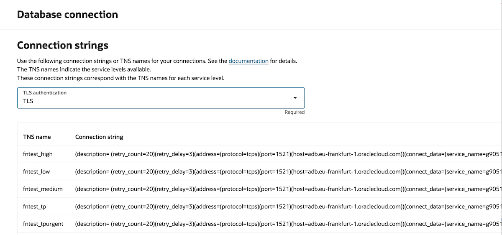

<!--
Copyright (c) 2025 Oracle and/or its affiliates.

The Universal Permissive License (UPL), Version 1.0

Subject to the condition set forth below, permission is hereby granted to any
person obtaining a copy of this software, associated documentation and/or data
(collectively the "Software"), free of charge and under any and all copyright
rights in the Software, and any and all patent rights owned or freely
licensable by each licensor hereunder covering either (i) the unmodified
Software as contributed to or provided by such licensor, or (ii) the Larger
Works (as defined below), to deal in both

(a) the Software, and
(b) any piece of software and/or hardware listed in the lrgrwrks.txt file if
one is included with the Software (each a "Larger Work" to which the Software
is contributed by such licensors),

without restriction, including without limitation the rights to copy, create
derivative works of, display, perform, and distribute the Software and make,
use, sell, offer for sale, import, export, have made, and have sold the
Software and the Larger Work(s), and to sublicense the foregoing rights on
either these or other terms.

This license is subject to the following condition:
The above copyright notice and either this complete permission notice or at
a minimum a reference to the UPL must be included in all copies or
substantial portions of the Software.

THE SOFTWARE IS PROVIDED "AS IS", WITHOUT WARRANTY OF ANY KIND, EXPRESS OR
IMPLIED, INCLUDING BUT NOT LIMITED TO THE WARRANTIES OF MERCHANTABILITY,
FITNESS FOR A PARTICULAR PURPOSE AND NONINFRINGEMENT. IN NO EVENT SHALL THE
AUTHORS OR COPYRIGHT HOLDERS BE LIABLE FOR ANY CLAIM, DAMAGES OR OTHER
LIABILITY, WHETHER IN AN ACTION OF CONTRACT, TORT OR OTHERWISE, ARISING FROM,
OUT OF OR IN CONNECTION WITH THE SOFTWARE OR THE USE OR OTHER DEALINGS IN THE
SOFTWARE.
-->

# A Java Hello World function accessing ATP database with local dev and then building and deploying to OCI Functions

Reviewed: 14.04.2025
 
# When to use this asset?
 
Anyone who wants to develop Functions with Autonomous Database access and this example shows how I'm doing this locally using Fn (<a href="https://fnproject.io">https://fnproject.io</a>) on my mac with Apple silicon that uses mainly ARM architecture and then building and then deploying the same to Functions in OCI.

# Author
<a href="https://github.com/mikarinneoracle">mikarinneoracle</a>

# How to use this asset?

## Local Dev

I've installed maven and <code>Fn cli</code> on my mac. This is how to do the <a href="https://docs.oracle.com/en-us/iaas/Content/Functions/Tasks/functionsinstallfncli.htm">Fn cli install</a> or like in here <a href="https://fnproject.io/tutorials/install/">following the Fn tutorial</a>. 

To develop functions locally I'm running the Fn server. Normally you would start it with <code>fn start</code> command but I'm using this command with Rancher Desktop that works for me:

<pre>
docker run --rm -i --name fnserver \
-v /tmp/iofs:/iofs \
-e FN_IOFS_DOCKER_PATH=/tmp/iofs \
-e FN_IOFS_PATH=/iofs \
-v /tmp/data:/app/data \
-v /var/run/docker.sock:/var/run/docker.sock \
--privileged \
-p 8080:8080 \
--entrypoint ./fnserver \
-e FN_LOG_LEVEL=DEBUG fnproject/fnserver:latest
</pre>

Now that the Fn server is running create an application for our function using the cli:

<pre>
fn create app hellofunction
</pre>

Then clone this repo and project and cd to the project root directory under <code>/files</code>. Then run Fn cli command to build and deploy the function locally:

<pre>
fn --verbose deploy --app hellofunction --local
</pre>

## Testing 

Create new ATP database instance (eg. "fntest") with a public VCN/subnet and <i>Access type</i> <code>Allow secure access from specified IPs and VCNs</code> and set the <i>Mutual TLS (mTLS) authentication</i> to <code>Not required</code>. 

To access the ATP database from local dev your <i>IP address</i> needs to be <b>whitelisted</b> the ATP instance Network configuration.

Before running the function config for the ATP connection needs to be set:

<pre>
fn config app hellofunction DB_USER admin
fn config app hellofunction DB_PASSWORD &lt;YOUR ATP PASSWORD HERE&gt;
fn config app hellofunction DB_URL (description= (retry_count=20)(retry_delay=3)(address=(protocol=tcps)(port=1521)(host=adb.eu-frankfurt-1.oraclecloud.com))(connect_data=(service_name=g90....6d8_fntest_tp.adb.oraclecloud.com))(security=(ssl_server_dn_match=yes)))
</pre>

<code>DB_URL</code> can be found by clicking the <i>Database Connection</i> -button on ATP database instance in the Cloud UI, e.g. :

After this you are ready to call the function to test it and get the SYSDATE from ATP:

<pre>
fn invoke hellofunction hellofunc
2025-04-14 08:49:13
</pre>

## OCI

Now that the function is properly working locally let's build and deploy it to OCI.

First create a OCIR repo for the container in your OCI tenancy <code>compartment</code> you want push the container into. Unless you do this first the container will be pushed to the <code>root</code> comaprtment that is not a good idea and will usually lead to 404 or 502 errors when the OCI Function pulling the container due to missing OCI policies. You can create the OCIR repo from the Cloud UI or using the <a href="https://docs.oracle.com/en-us/iaas/tools/oci-cli/3.41.0/oci_cli_docs/cmdref/artifacts/container/repository/create.html">oci cli</a>.

Next, let's build the Docker container for the function using <code>docker build</code>, let's not use Fn this time (that is also possible), using the FRA region:

<pre>
docker build -t fra.ocir.io/&lt;YOUR OCI TENANCY NAMESPACE&gt;/helloworld-java:1 .
</pre>

In the docker build command above replace the <code>region</code> if necessary and the <code>&lt;YOUR OCI TENANCY NAMESPACE&gt;</code> with yours.

After building let's do <code>docker login</code> and <code>docker push</code> to push the container to the OCIR repo:

<pre>
docker login ams.ocir.io -u '&lt;YOUR OCI TENANCY NAMESPACE&gt;/oracleidentitycloudservice/&lt;YOUR USERNAME&gt;' -p '&lt;YOUR ACCESS TOKEN&gt;'
docker push fra.ocir.io/&lt;YOUR OCI TENANCY NAMESPACE&gt;/helloworld-java:1
</pre>

The same as above but using OCI cli to get the &lt;YOUR OCI TENANCY NAMESPACE&gt; which is especially handy in scripting:

<pre>
export namespace=$(oci os ns get | jq .data | tr -d '"')
docker build -t fra.ocir.io/$namespace/helloworld-java:1 .
docker push fra.ocir.io/$namespace/helloworld-java:1
</pre>

The last step is to create the Function Application and the function deployment for it. This can be easily done using the Cloud UI. 

To create a mac binary compatible Function Application use the <code>shape GENERIC_ARM</code>. Let's name this <code>hello-arm</code>.

Using the application create a function for it from the container image that was pushed to the OCIR repo e.g. <code>fra.ocir.io/&lt;YOUR OCI TENANCY NAMESPACE&gt;/helloworld-java:1</code>. Let's name this <code>helloworld-java-arm</code>.

Like previously add the configuration for the ATP database connection, either on the application or function level (both will work with our example function) using the Cloud UI:

<pre>
DB_USER admin
DB_PASSWORD &lt;YOUR ATP PASSWORD HERE&gt;
DB_URL (description= (retry_count=20)(retry_delay=3)(address=(protocol=tcps)(port=1521)(host=adb.eu-frankfurt-1.oraclecloud.com))(connect_data=(service_name=g90....6d8_fntest_tp.adb.oraclecloud.com))(security=(ssl_server_dn_match=yes)))
</pre>

After deployment the Function can be easily tested in Cloud Shell following the Getting Started guide for the Application and giving:

<pre>
fn invoke hello-arm helloworld-java-arm
2025-04-14 08:49:13
</pre>

Optionally can create API Gateway for the function that will assign a public endpoint to it over HTTPS that can be easily tested with curl:

<pre>
curl https://n3yu.....ghhi.apigateway.eu-frankfurt-1.oci.customer-oci.com/
2025-04-14 08:49:13
</pre>

# Useful Links
 
- [OCI Functions](https://docs.oracle.com/en-us/iaas/Content/Functions/Concepts/functionsoverview.htm)
    - Learn how the Functions service lets you create, run, and scale business logic without managing any infrastructure
- [Fn](https://fnproject.io/)
    - The Fn project is an open-source container-native serverless platform that you can run anywhere -- any cloud or on-premise. It’s easy to use, supports every programming language, and is extensible and performant
- [Autonomous Database](https://www.oracle.com/autonomous-database/)
    - Develop scalable AI-powered apps with any data using built-in AI capabilities. Use your choice of large language model (LLM) and deploy in the cloud or your data center
- [Oracle](https://www.oracle.com/)
    - Oracle Website

## License

Copyright (c) 2025 Oracle and/or its affiliates.

Licensed under the Universal Permissive License (UPL), Version 1.0.

See [LICENSE](LICENSE) for more details.

ORACLE AND ITS AFFILIATES DO NOT PROVIDE ANY WARRANTY WHATSOEVER, EXPRESS OR IMPLIED, FOR ANY SOFTWARE, MATERIAL OR CONTENT OF ANY KIND CONTAINED OR PRODUCED WITHIN THIS REPOSITORY, AND IN PARTICULAR SPECIFICALLY DISCLAIM ANY AND ALL IMPLIED WARRANTIES OF TITLE, NON-INFRINGEMENT, MERCHANTABILITY, AND FITNESS FOR A PARTICULAR PURPOSE.  FURTHERMORE, ORACLE AND ITS AFFILIATES DO NOT REPRESENT THAT ANY CUSTOMARY SECURITY REVIEW HAS BEEN PERFORMED WITH RESPECT TO ANY SOFTWARE, MATERIAL OR CONTENT CONTAINED OR PRODUCED WITHIN THIS REPOSITORY. IN ADDITION, AND WITHOUT LIMITING THE FOREGOING, THIRD PARTIES MAY HAVE POSTED SOFTWARE, MATERIAL OR CONTENT TO THIS REPOSITORY WITHOUT ANY REVIEW. USE AT YOUR OWN RISK. 