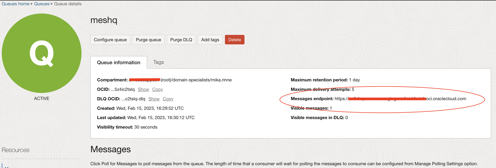
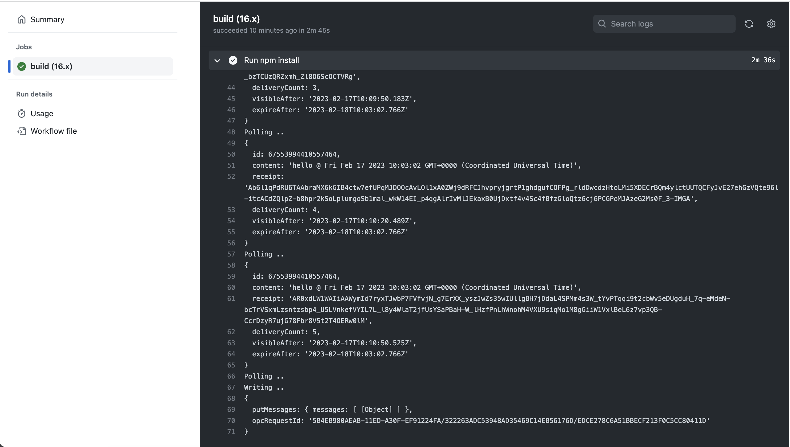

# OCI Queue Example usage

TEXT

Author: [mikarinneoracle](https://github.com/mikarinneoracle)

Reviewed: 08.05.2024

# When to use this asset?

# How to use this asset?

## OCI Queue

Create Queue and copy the Queue <i>OCID</i> and <i>Messages endpoint</i>:

When using another <code>region</code> than <code>EU_FRANKFURT_1</code> please modify the 
<a href="index.js#L48">
<code>index.js</code></a> Line #48 accordingly:

<pre>
const region = common.Region.EU_FRANKFURT_1;
</pre>

## Policies

Setup policies for your user in the tenancy

e.g. <code>Allow &lt;USER_GROUP&gt; to manage queues in compartment &lt;COMPARTMENT&gt;</code>

More on OCI Queue IAM policies: https://docs.oracle.com/en-us/iaas/Content/queue/policy-reference.htm

## Secrets

Setup secrets to run this example with GitHub Actions:

<ul>
    <li><b>OCI_TENANCY</b>: OCI Tenancy OCID</li>
    <li><b>OCI_USER</b>: OCI User OCID</li>
    <li><b>OCI_FINGERPRINT</b>: OCI User Fingerprint</li>
    <li><b>OCI_KEY</b>: OCI User Private Key</li>
    <li><b>OCI_PASSPHRASE</b>: OCI User Private Key passphrase (optional)</li>
    <li><b>Q_ID</b>: OCI Queue OCID</li>
    <li><b>Q_ENDPOINT</b>: OCI Queue Messages endpoint</li>
</ul>

## Run Action

Monitor the GitHub action to run:

This example will poll for messages in the queue and finally writes a new message to it.

## View messages in the Queue

## Running locally

Clone this repo, setup npm and <code>oci cli</code> and modify <a href="index.js#L46">index.js</a> line 46 by uncommenting it and removing/commenting lines 49-56 and replace lines 59-60
with Queue details :

<pre>
// Use this locally instead of env vars and region:
const provider = new common.ConfigFileAuthenticationDetailsProvider();

// Q settings
const queueId = 'ocid1.queue.oc1.eu-frankfurt-1.ama....a5z4ic2tslq';
const endpoint = 'https://cell-1.queue......oci.oraclecloud.com';
</pre>

Then run:

<pre>
npm install
node index.js
</pre>

### Sending messages to Queue

You can manually send messages to the queue using the OCI Queue Console  
<code>Actions/Send Message</code> and then see them being received by re-running the build.

You can also play with the queue's <code>Dead Letter Queue</code> settings to see how many
times the same message is being received (default is 5). To do this comment the 
<a href="index.js#L99">line 99 of the index.js</a> and re-run the build by committing the change. 

# License
 
Copyright (c) 2024 Oracle and/or its affiliates.
 
Licensed under the Universal Permissive License (UPL), Version 1.0.
 
See [LICENSE](https://github.com/oracle-devrel/technology-engineering/blob/main/LICENSE) for more details.

