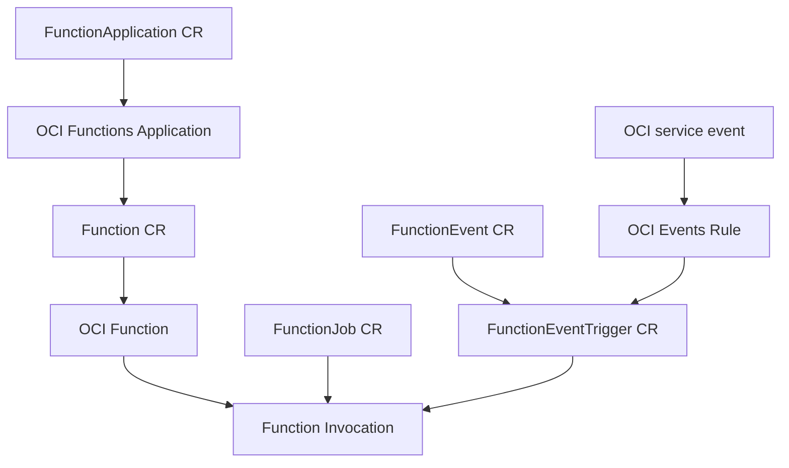

# OCI Functions Operator

Kubernetes-native APIs for managing and invoking OCI Functions from OKE.

Current controller image:

```text
ghcr.io/ronsevetoci/oci-functions-operator/controller:v0.1.7
```

## What This Operator Provides

The operator exposes five namespaced CRDs in `functions.oci.oracle.com/v1alpha1`:

- `FunctionApplication`: maps to an OCI Functions Application. It owns app-level settings such as compartment, region, subnets, NSGs, application config, and invocation log settings.
- `Function`: maps to an OCI Function. It can reference an existing OCI Function or manage one inside a `FunctionApplication`.
- `FunctionJob`: invokes a referenced `Function` with one or more inline JSON payloads, parallelism, retry limits, and per-payload status.
- `FunctionEventTrigger`: routes an OCI Events rule or a Kubernetes-native `functionevent.*` event type to a `Function`.
- `FunctionEvent`: an in-cluster event envelope that the operator matches against `FunctionEventTrigger` resources.

`FunctionJob` and `FunctionEvent` both end in a Function invocation, but they are not the same resource. Use `FunctionJob` when a user or system wants to submit explicit invocation work and track that work as a job. Use `FunctionEvent` when an application emits an event and wants the operator to route it through matching triggers.

## Resource Flow



Read it top to bottom: a `FunctionApplication` is the application wrapper, a `Function` lives inside it, and every invocation path eventually invokes that function. `FunctionJob` is direct work submission. `FunctionEventTrigger` routes either OCI service events through an OCI Events Rule or in-cluster `FunctionEvent` objects.

The important boundary is that the operator does not turn OCI Functions into Pods. It keeps OCI Functions as OCI resources and gives Kubernetes users a clear control plane for application setup, function setup, invocation, event routing, status, and events.

## Two Images

The operator image and function runtime image are separate artifacts:

- Operator/controller image: runs as a Kubernetes Deployment in OKE. It can be in GHCR, OCIR, or any registry OKE can pull from.
- Function runtime image: runs in OCI Functions. It must be an OCI Functions-compatible Fn image in same-region OCIR, for example `jed.ocir.io/<TENANCY_NAMESPACE>/hello-function:fn-v1` for Jeddah.

Do not use GHCR for the OCI Functions runtime image. OCI Functions pulls the runtime image from the Functions application network during invocation, so the application subnet and any attached NSGs must allow egress to Oracle Services Network/OCIR even when the OCIR repository is public.

## Start Here

- [Helm install](docs/helm-install.md): supported OKE installation and upgrade path.
- [OKE deployment](docs/oke-deployment.md): Workload Identity, IAM, networking, and the core resource sequence.
- [Function event triggers](docs/event-triggers.md): OCI Events and `functionevent.*` routing.
- [Function events](docs/function-events.md): Kubernetes-native event emission.
- [Debugging Functions](docs/debugging-functions.md): image, CRD, Workload Identity, NSG, and invocation failure checks.
- [Design overview](docs/design.md): controller architecture, resource behavior, and current limitations.
- [Sample function image](examples/hello-function/README.md): Fn-compatible Python function runtime image.

Tracked files under `config/samples/` are generic examples with placeholders. Live walkthrough manifests with OCIDs, tenancy namespaces, bucket names, or temporary cleanup settings should live in the ignored `local/` directory, not in the repository history.

## Helm CRDs

The Helm chart includes CRDs for `FunctionApplication`, `Function`, `FunctionJob`, `FunctionEventTrigger`, and `FunctionEvent`.

Fresh Helm installs install CRDs from `charts/oci-functions-operator/crds/`, but existing Helm upgrades do not add or update CRDs from that directory. Before installing or upgrading after API changes, apply the chart CRDs first:

```sh
kubectl apply -f charts/oci-functions-operator/crds/
```

Then run `helm upgrade --install`.

## Modes

`INVOKER_MODE=fake` is the default for local controller development and tests. It requires no OCI auth and creates no OCI resources.

`INVOKER_MODE=oci` uses the OCI Go SDK:

- On OKE, the Helm chart configures Workload Identity with `oci.authMode=workload`.
- For local development only, use `OCI_AUTH_MODE=config` with `OCI_CONFIG_FILE` and `OCI_CONFIG_PROFILE`.

The Helm chart is the supported way to deploy the operator on OKE. Kustomize under `config/` is kept for Kubebuilder-generated manifests and local development only. Do not mix Helm and Kustomize for the same cluster install.

## Resource Model

Preferred managed mode is explicit:

1. Create a `FunctionApplication` for the shared OCI Functions Application.
2. Create one or more managed `Function` resources with `spec.applicationRef.name`.
3. Wait for `Function.status.functionId` and `Function.status.invokeEndpoint`.
4. Invoke through `FunctionJob`, OCI Events-backed `FunctionEventTrigger`, or Kubernetes-native `FunctionEvent`.

Legacy managed `Function` manifests that put app-level settings under `spec.config` still work for compatibility, but new manifests should use `FunctionApplication`.

`Function.spec.deletionPolicy` defaults to `Retain`. Deleting a managed `Function` with `Retain` leaves OCI resources untouched. Set `deletionPolicy: Delete` only when Kubernetes deletion should also delete the managed OCI Function. `FunctionApplication.spec.deletionPolicy` controls OCI Application cleanup separately; `Delete` is honored only for managed applications and only when no functions remain. Existing-mode resources never delete OCI resources.

## Local Development

Install or refresh generated CRDs:

```sh
make generate
make manifests
kubectl apply -k config/crd
```

Run the manager in fake mode:

```sh
INVOKER_MODE=fake go run ./cmd
```

Apply the safe sample resources:

```sh
kubectl apply -k config/samples
kubectl get functions,functionjobs
kubectl describe functionjob hello-job
```

Fake mode proves only Kubernetes reconciliation and status behavior. It does not prove OCI auth, OCI Functions network egress, OCIR image access, or function image compatibility.
