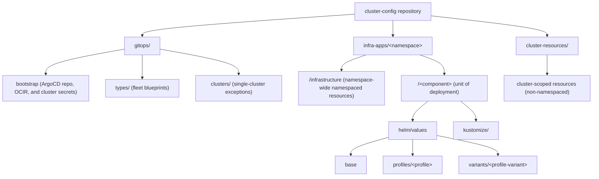
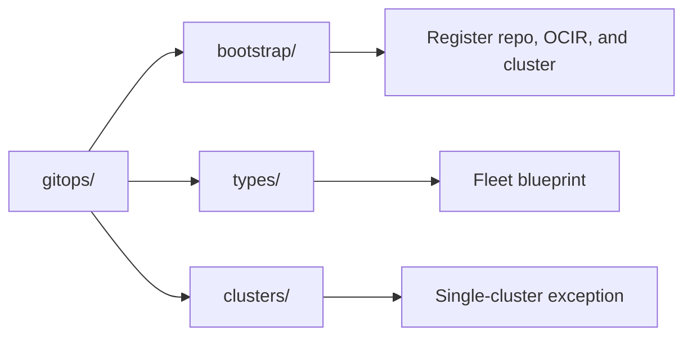
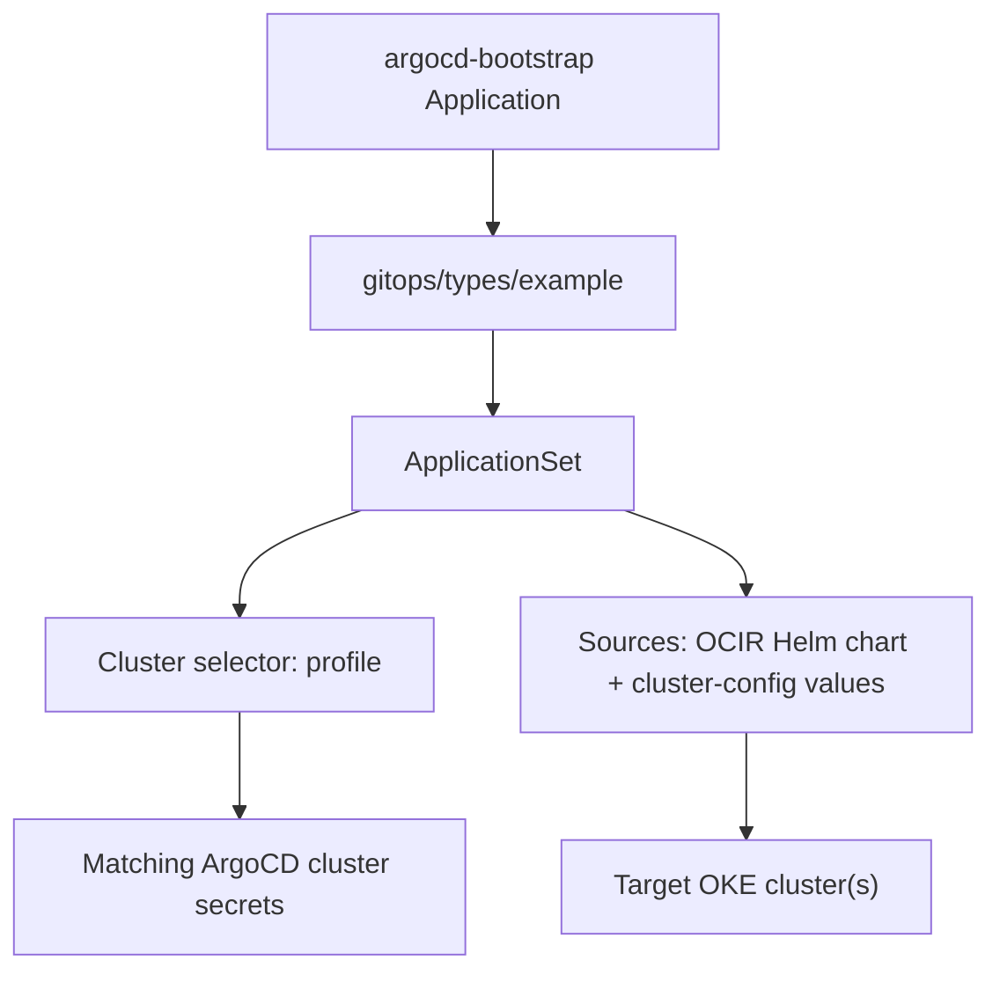
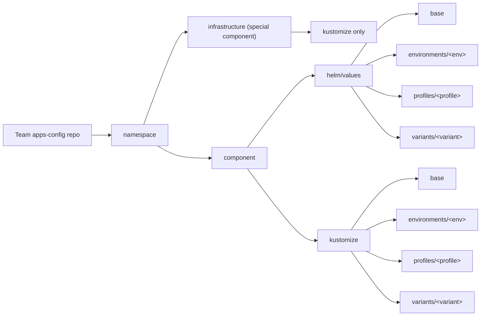

# ArgoCD GitOps on OKE with OCI DevOps

## Summary
This guide explains how platform engineers use the OCI resources created by this solution to bootstrap and operate ArgoCD GitOps on OKE.

The flow is:
1. Run the OCI Resource Manager stack and select `argocd` as the GitOps agent.
2. Use the created OCI DevOps project and repositories.
3. Mirror the ArgoCD Helm chart and required images to OCIR with the Build Pipeline.
4. Deploy ArgoCD on OKE with the Deployment Pipeline.
5. Bootstrap ArgoCD so it reconciles the `cluster-config` repository.

## What This Solution Delivers
After stack creation, you get:

- One OCI DevOps project.
- Three OCI Code Repositories:
  - `pipelines`: build specs and scripts for mirroring Helm charts and container images into OCIR.
  - `cluster-config`: cluster/platform GitOps configuration, ArgoCD bootstrap resources, infrastructure applications, and cluster resources.
  - `apps-config`: sample application configuration repository for development teams.
- One OCI Build Pipeline:
  - Mirrors the latest ArgoCD Helm chart and the images rendered by the chart into OCIR.
- One OCI Deployment Pipeline:
  - Installs ArgoCD into the target OKE cluster.
- One OCI DevOps OKE deploy environment (public or private based on cluster topology).
- Required OCI DevOps integrations:
  - ONS notifications.
  - OCI Logging integration.
  - IAM dynamic group and policies required for OCI DevOps operations.

## End-to-End Usage

### 1. Configure and Run the Resource Manager Stack
In OCI Resource Manager:

1. Select `argocd` as the GitOps agent.
2. Provide stack values (project naming, OCIR repository prefix, OKE target cluster, and authentication token).
3. Run `Plan` then `Apply`.
4. Wait for completion and confirm no failed resources.

Outcome:
- OCI DevOps project is ready with repositories, build/deploy pipelines, logging, notifications, IAM, and OKE environment.

### 2. Verify DevOps Project Artifacts
Open the created OCI DevOps project and confirm:

1. Repositories:
  - `pipelines`
  - `cluster-config`
  - `apps-config`
2. Build pipeline:
  - `mirror-gitops-agent`
3. Deployment pipeline:
  - `helm-install-pipeline`
4. OKE environment exists and points to the expected cluster.

### 3. Create Cluster Prerequisites
Before running the Build Pipeline, create these Kubernetes prerequisites in the target cluster:

1. Namespace `argocd`.
2. Image pull secret `ocirsecret` in namespace `argocd` with OCIR credentials.

Example:

```bash
kubectl create namespace argocd
kubectl create secret docker-registry ocirsecret \
  --namespace argocd \
  --docker-server=<region-key>.ocir.io \
  --docker-username='<tenancy-namespace>/<identity-domain-name>/<username>' \
  --docker-password='<auth-token>' \
  --docker-email='<email>'
```

The same command template is also available in `gitops/bootstrap/create-ocirsecret.txt` inside the seeded `cluster-config` repository.

### 4. Run Mirror Build Pipeline
Run build pipeline `mirror-gitops-agent`:

1. Trigger pipeline run on `main`.
2. Validate successful stages for:
  - ArgoCD chart version resolution.
  - Helm chart mirroring (`mirror_argocd.yaml` flow).
  - Required image mirroring to OCIR.
3. Verify mirrored artifacts in OCIR under your configured prefix.

Expected result:
- ArgoCD chart is available at `oci://<region-key>.ocir.io/<tenancy-namespace>/<prefix>/charts/argo-cd`.
- ArgoCD images are available under your configured OCIR prefix.

### 5. Run Helm Deployment Pipeline
Run deployment pipeline `helm-install-pipeline`:

1. Trigger deployment pipeline (normally invoked automatically after successful build; manual run is also valid).
2. Confirm stage `deploy-helm` succeeds.
3. Confirm ArgoCD is installed in namespace `argocd`.

Recommended checks:

```bash
kubectl get pods -n argocd
kubectl get applications,applicationsets,appprojects -n argocd
```

### 6. Bootstrap ArgoCD Reconciliation
Use the `cluster-config` repository to bootstrap ArgoCD:

1. Configure repository credentials in `gitops/bootstrap/cluster-config-git-credentials.yml`.
2. Configure OCIR repository credentials in `gitops/bootstrap/ocir-credentials.yml`.
3. Configure the initial cluster secret in `gitops/bootstrap/in-cluster.yml`.
4. Apply the generated bootstrap application from `gitops/bootstrap/argocd-bootstrap.yml`.

The bootstrap `Application` points ArgoCD to `gitops/types/example` in `cluster-config`. From there, ArgoCD reconciles the GitOps definitions that bind infrastructure apps and cluster resources to matching clusters.

## Repository User Guide

### `pipelines` Repository
Purpose: reusable pipeline-as-code assets for mirroring third-party artifacts into OCIR.

Key files:
- `mirror_argocd.yaml`: default bootstrap build spec used to mirror the latest ArgoCD Helm chart and images rendered by that chart.
- `mirror_helm.yaml`: template build spec to mirror any Helm chart and chart-dependent images.
- `mirror_images.yaml`: template build spec to mirror a custom list of container images.
- `mirror_git_dr.yaml`: optional build spec pattern to mirror a Git repository to a DR repository.
- `script/`: shared mirror scripts used by build specs.

How to extend:
1. Copy `mirror_helm.yaml` or `mirror_images.yaml`.
2. Set chart/image inputs for your use case.
3. Create a new OCI DevOps Build Pipeline stage or pipeline pointing to the copied build spec.
4. Run and verify artifacts in OCIR.

### `cluster-config` Repository
Repository purpose:
- This repository merges two platform-admin concerns:
  - ArgoCD bootstrap and reconciliation wiring (`gitops`).
  - Infrastructure-application delivery (`infra-apps`).
- It is owned by platform engineers and is used for cluster/platform configuration, not team application delivery.

Schema (logical view):



Resource boundaries:
- `infra-apps` contains namespaced resources only.
- `cluster-resources` contains cluster-scoped resources (non-namespaced objects).
- `gitops` contains ArgoCD bootstrap resources and ArgoCD `Application` / `ApplicationSet` definitions.

Deployment unit model:
- Infrastructure applications are organized as `<namespace>/<component>`.
- `<namespace>` is usually the application name and is the boundary for namespaced resources.
- `<component>` is the deployment unit; it can be Helm-based, Kustomize-based, or a combination of both.
- `<namespace>/infrastructure` is reserved for namespace-wide resources shared across components in that namespace.

Configuration layering:
- Infrastructure applications are environment-agnostic in this model; use cluster profiles instead of app environments.
- A profile represents a standard configuration set for a cluster purpose.
- A variant is a profile-specific override layer for edge cases where creating a new profile is unnecessary.
- Overlay and merge precedence is:
  - `base` -> `profile` -> `variant`
  - For same keys, last applied value wins.

How to choose location:
1. Namespace-wide shared namespaced policy (for example `ResourceQuota`) -> `<namespace>/infrastructure`.
2. One component deployment logic (Helm, Kustomize, or both) -> `<namespace>/<component>`.
3. Non-namespaced object (for example `ClusterRole` or `StorageClass`) -> `cluster-resources`.

### GitOps Binding Model (`gitops/`)
The `gitops` folder is the platform-admin control point that binds infrastructure apps, application configs, and cluster resources to real clusters.

Main concepts:
- `bootstrap/`: ArgoCD secrets and the bootstrap `Application`.
- `types/`: reusable cluster blueprints for fleets of similar clusters.
- `clusters/`: per-cluster definitions for exceptions or single-cluster customization.

Logical model:



Binding flow:



The default example uses:
- `gitops/types/example/config.json` to define `profile: example`.
- `gitops/bootstrap/in-cluster.yml` to register the in-cluster target with label `profile: example`.
- `gitops/types/example/argocd/argocd.yml` to define an `ApplicationSet` that deploys ArgoCD to clusters matching that profile.

When to use `types`:
- Use for a fleet where the same set of platform components should be applied to many similar clusters.
- Define the desired application set once, then let labels select matching clusters.

When to use `clusters`:
- Use for one-off clusters, exceptions, or cases where a cluster should diverge from its fleet baseline.
- Keeps special cases isolated without forcing changes to all clusters of a type.

Important design note:
- It is possible to map `type == profile` for maximum standardization, but this is generally not recommended.
- Reason: adding a new application to that type can force rollout to all clusters with that profile.
- Recommended approach is to keep type definitions stable and handle controlled exceptions in `clusters/`.

### `apps-config` Repository
Repository purpose:
- `apps-config` is the developer-facing repository pattern for application delivery.
- This repository in the project is an example/template; in real usage, each development team has its own `apps-config` repository.
- Teams are scoped to assigned namespaces and can deploy only namespaced resources.

Key boundary:
- There is no `cluster-resources` folder in `apps-config`.
- There is no `gitops` folder in `apps-config` by default.
- GitOps binding remains under cluster administrator control in `cluster-config/gitops`, so developers do not need to learn ArgoCD `Application` or `ApplicationSet` definitions to ship applications.

Logical model:



Override model:
- `apps-config` adds an environment layer compared to infra-apps.
- Precedence is:
  - `base` -> `environment` -> `profile` -> `variant`
  - For same keys/fields, last applied layer wins.

Why GitOps stays centralized:
- Recommended model is a single GitOps source of truth in cluster-admin-managed `cluster-config/gitops`.
- Multiple GitOps repositories can create operational ambiguity:
  - Potential overlap or conflict on what is deployed.
  - Extra effort to trace effective cluster state across repositories.
- A separate developer GitOps repository is possible, but generally not suggested.

## Secret Management with GitOps
For secrets in GitOps workflows, use one of these recommended approaches:

1. ESO (External Secrets Operator) with OCI Vault
- Install External Secrets Operator in the cluster.
- Configure it to sync secrets from OCI Vault into Kubernetes Secrets.
- Keep secret values out of Git; only secret references and ESO manifests are versioned.
- The sample `apps-config` repository includes `app-secret.yml` and `oci-secret.sh` examples for this pattern.

2. ArgoCD repository and registry credentials
- Use ArgoCD-labeled Kubernetes Secrets in the `argocd` namespace.
- `cluster-config-git-credentials.yml` registers the `cluster-config` Git repository.
- `ocir-credentials.yml` registers OCIR as an OCI Helm repository credential.
- `in-cluster.yml` registers the target cluster and attaches labels used by ApplicationSet selectors.

## Operational Runbook

### Day-1 Checklist
1. Stack apply completed successfully in Resource Manager with `gitops_agent = argocd`.
2. DevOps project contains all three repositories and both pipelines.
3. `ocirsecret` exists in namespace `argocd`.
4. `mirror-gitops-agent` build run is successful.
5. ArgoCD chart/images exist in OCIR expected path.
6. `helm-install-pipeline` deployment run is successful.
7. Bootstrap secrets are configured in `cluster-config`.
8. Bootstrap `Application` is applied and healthy.
9. Generated `ApplicationSet` creates Applications for matching clusters.

### Day-2 Operating Workflow
1. Re-run the mirror build pipeline to refresh ArgoCD chart/images.
2. Re-run the deployment pipeline for controlled ArgoCD upgrades.
3. Promote `cluster-config` and `apps-config` updates through pull requests and approvals.
4. Add new cluster targets by registering ArgoCD cluster secrets with the right labels.
5. Add new fleet behavior in `gitops/types`; isolate exceptions in `gitops/clusters`.

### Verification Steps
In OCI:
1. Build/deploy pipeline executions are `Succeeded`.
2. OCIR artifacts exist for chart and mirrored images.
3. DevOps logs show successful stage execution.

In cluster:
1. ArgoCD pods are running in namespace `argocd`.
2. Repository and cluster secrets exist in namespace `argocd`.
3. Bootstrap `Application` is `Synced` and `Healthy`.
4. `ApplicationSet` creates the expected Applications.

```bash
kubectl get pods -n argocd
kubectl get secrets -n argocd
kubectl get applications,applicationsets -n argocd
```

## Troubleshooting

### Repository Credential or Auth Errors
Symptom:
- Bootstrap `Application` cannot fetch `cluster-config`, or ArgoCD shows repository connection errors.

Likely cause:
- Invalid Git credentials or incorrect repository URL in `cluster-config-git-credentials.yml`.

Immediate action:
1. Validate repository clone URL and auth token.
2. Re-apply the repository secret in namespace `argocd`.
3. Refresh/retry the ArgoCD Application.

### OCIR Chart or Image Pull Failures
Symptom:
- OCI DevOps deploy fails, or ArgoCD cannot pull the mirrored chart/images.

Likely cause:
- Missing `ocirsecret`, incorrect OCIR credentials, wrong repository prefix, or mirror build did not complete.

Immediate action:
1. Confirm mirror build pipeline succeeded.
2. Verify chart and image repositories exist in OCIR.
3. Validate `ocirsecret` and `ocir-credentials.yml`.
4. Re-run build/deploy pipelines after correcting credentials or prefix.

### ApplicationSet Does Not Create Applications
Symptom:
- Bootstrap Application is healthy, but expected Applications are missing.

Likely cause:
- Cluster secret labels do not match the profile in `gitops/types/<type>/config.json`.

Immediate action:
1. Check `config.json` profile value.
2. Check labels on ArgoCD cluster secrets.
3. Align labels and refresh the ApplicationSet.

### Deployment Pipeline Fails at Helm Stage
Symptom:
- OCI DevOps deployment fails at `deploy-helm`.

Likely cause:
- OKE environment mismatch, private cluster connectivity issue, missing OCIR image pull secret, or insufficient OCI DevOps permissions.

Immediate action:
1. Confirm target OKE environment in DevOps.
2. Validate private-cluster subnet/NSG configuration when applicable.
3. Verify required IAM policies are present.
4. Re-run the deployment pipeline.

## Guardrails and Best Practices
1. Mirror all external Helm charts/images through OCI DevOps pipelines into OCIR.
2. Keep ArgoCD GitOps binding centralized in `cluster-config/gitops`.
3. Use `types` for fleet standards and `clusters` for exceptions.
4. Keep developers focused on namespaced resources in `apps-config`.
5. Pin or promote ArgoCD chart updates through controlled pipeline runs.
6. Use pull requests and approvals for both `cluster-config` and team-owned `apps-config` repositories.
7. Monitor OCI DevOps logs and ArgoCD Application health as standard operational checks.
