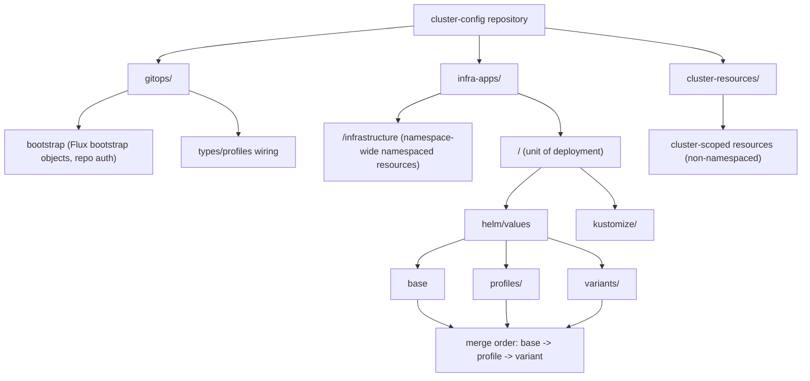
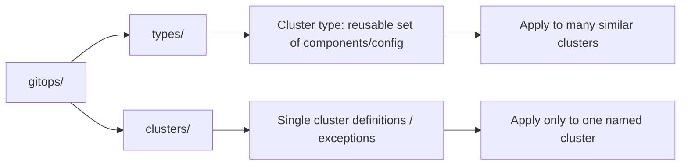
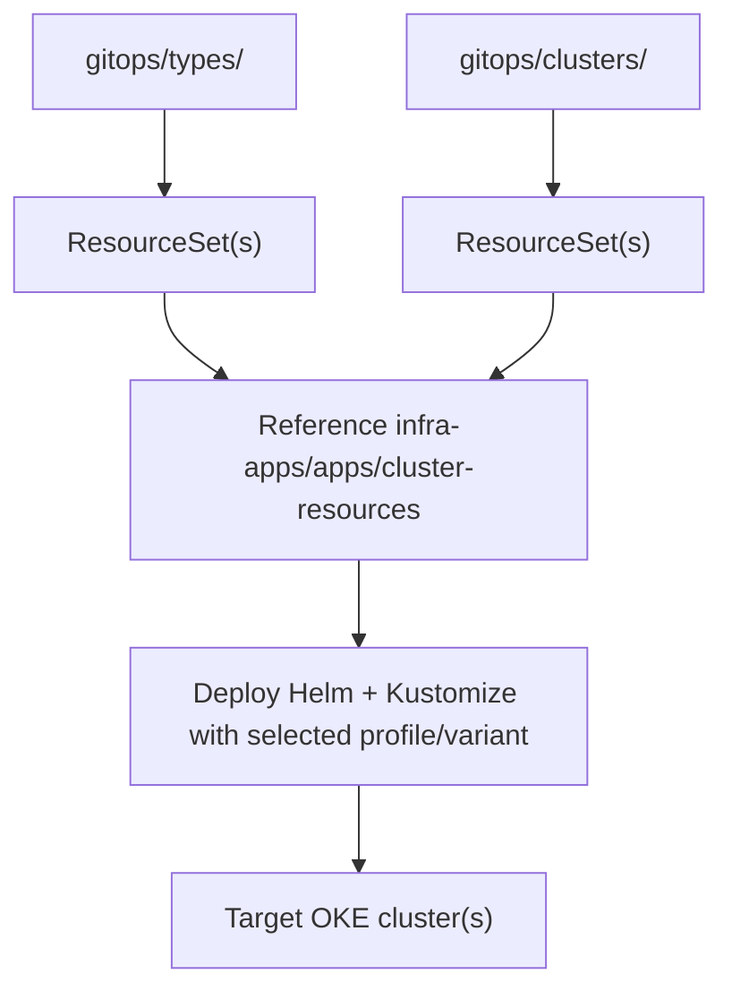
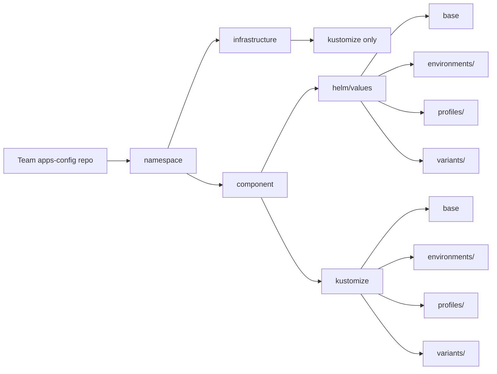

# Flux Operator GitOps on OKE with OCI DevOps

## Summary
This guide explains how platform engineers use the OCI resources created by this solution to bootstrap and operate Flux Operator GitOps on OKE.

The flow is:
1. Run the OCI Resource Manager stack.
2. Use the created OCI DevOps project and repositories.
3. Mirror Flux Operator chart/images to OCIR with the Build Pipeline.
4. Deploy Flux Operator on OKE with the Deployment Pipeline.
5. Bootstrap Flux reconciliation from the `cluster-config` repository.

## What This Solution Delivers
After stack creation, you get:

- One OCI DevOps project (GitOps control plane in OCI DevOps).
- Three OCI Code Repositories:
  - `pipelines`: build specs and scripts for mirroring Helm charts and container images into OCIR.
  - `cluster-config`: cluster/platform GitOps configuration (bootstrap + infrastructure configuration).
  - `apps-config`: sample application configuration repository for development teams.
- One OCI Build Pipeline:
  - Mirrors Flux Operator Helm chart and required images into your OCIR path.
- One OCI Deployment Pipeline:
  - Installs Flux Operator into your target OKE cluster.
- One OCI DevOps OKE deploy environment (public or private based on cluster topology).
- Required OCI DevOps integrations:
  - ONS notifications.
  - OCI Logging integration.
  - IAM dynamic group and policies required for OCI DevOps operations.

## End-to-End Usage

### 1. Configure and Run the Resource Manager Stack
In OCI Resource Manager:

1. Create or select the stack from this repository package.
2. Provide stack values (project naming, OCIR repository prefix, OKE target cluster, Flux chart version, and authentication token).
3. Run `Plan` then `Apply`.
4. Wait for completion and confirm no failed resources.

Outcome:
- OCI DevOps project is ready with repositories, build/deploy pipelines, logging, notifications, IAM, and OKE environment.

### 2. Verify DevOps Project Artifacts
Open the created OCI DevOps project and confirm:

1. Repositories:
  - `pipelines`
  - `cluster-config`
  - `apps-config`
2. Build pipeline:
  - `mirror-gitops-agent`
3. Deployment pipeline:
  - `helm-install-pipeline`
4. OKE environment exists and points to the expected cluster.

### 3. Run Mirror Build Pipeline
Run build pipeline `mirror-gitops-agent`:

1. Trigger pipeline run on `main`.
2. Validate successful stages for:
  - Helm chart mirroring (`mirror_flux_operator.yaml` flow).
  - Required image mirroring to OCIR.
3. Verify mirrored artifacts in OCIR under your configured prefix.

Expected result:
- Flux Operator chart and images are available in OCIR and ready for deployment.

### 4. Run Helm Deployment Pipeline
Run deployment pipeline `helm-install-pipeline`:

1. Trigger deployment pipeline (normally invoked automatically after successful build; manual run is also valid).
2. Confirm stage `deploy-helm` succeeds.
3. Confirm Flux Operator is installed in namespace `flux-system`.

### 5. Bootstrap Flux Reconciliation
Use the `cluster-config` repository to bootstrap reconciliation:

1. Update bootstrap credentials in:
  - `gitops/bootstrap/git-token-auth.yml`
2. Apply bootstrap manifests to the cluster (for example from `gitops/bootstrap`).
3. Validate Flux resources start reconciling against `cluster-config`.

Recommended in-cluster checks:

```bash
kubectl get pods -n flux-system
kubectl get fluxinstance -n flux-system
kubectl get gitrepositories,kustomizations,helmreleases -A
```

### Secret Management with GitOps
For secrets in GitOps workflows, use one of these recommended approaches:

1. ESO (External Secrets Operator) with OCI Vault
- Install External Secrets Operator (ESO) in the cluster.
- Configure it to sync secrets from OCI Vault into Kubernetes Secrets.
- Keep secret values out of Git; only secret references and ESO manifests are versioned.

2. SOPS with Flux Operator
- Encrypt secret manifests in Git using SOPS.
- Use an age key deployed in the cluster so Flux can decrypt during reconciliation.
- This keeps Git as source of truth while protecting secret values at rest.

SOPS mini-guide:
- A bootstrap mini-guide is provided at `gitops/bootstrap/install-sops-age-key.md`.
- Follow it to generate/deploy the age key and encrypt files with SOPS.

## Repository User Guide

### `pipelines` Repository
Purpose: reusable pipeline-as-code assets for mirroring third-party artifacts into OCIR.

Key files:
- `mirror_flux_operator.yaml`: default bootstrap build spec used to mirror Flux Operator and required Flux controller images.
- `mirror_helm.yaml`: template build spec to mirror any Helm chart and chart-dependent images.
- `mirror_images.yaml`: template build spec to mirror a custom list of container images.
- `script/`: shared mirror scripts used by build specs.

How to extend:
1. Copy `mirror_helm.yaml` or `mirror_images.yaml`.
2. Set chart/image inputs for your use case.
3. Create a new OCI DevOps Build Pipeline stage or pipeline pointing to the copied build spec.
4. Run and verify artifacts in OCIR.

### `cluster-config` Repository
Repository purpose:
- This repository merges two concerns in one place:
  - GitOps bootstrap and reconciliation wiring (`gitops`).
  - Infrastructure-application delivery (`infra-apps`).
- It is owned by platform engineers and is used for cluster/platform configuration, not team application delivery.

Schema (logical view):



Reference structure:

```text
cluster-config/
  gitops/
    bootstrap/
    types/
  infra-apps/
    <namespace>/
      infrastructure/
        kustomize/
          base/
          profiles/<profile>/
          variants/<profile-variant>/
      <component>/
        helm/
          values/
            base/
            profiles/<profile>/
            variants/<profile-variant>/
        kustomize/
          base/
          profiles/<profile>/
          variants/<profile-variant>/
  cluster-resources/
    kustomize/
      base/
      profiles/<profile>/
      variants/<profile-variant>/
```

Resource boundaries:
- `infra-apps` contains namespaced resources only.
- `cluster-resources` contains cluster-scoped resources (non-namespaced objects).
- `gitops` contains bootstrap/auth and Flux reconciliation entrypoint definitions.

Deployment unit model:
- Infrastructure applications are organized as `<namespace>/<component>`.
- `<namespace>` is usually the application name and is the boundary for namespaced resources.
- `<component>` is the deployment unit; it can be Helm-based, Kustomize-based, or a combination of both.
- `<namespace>/infrastructure` is reserved for namespace-wide resources shared across components in that namespace (example: `ResourceQuota`).
- Mixed model is supported:
  - Deploy the component itself with Helm.
  - Add closely related namespaced objects with Kustomize for that same component.

Configuration layering:
- Infrastructure applications are environment-agnostic in this model; use cluster profiles instead of app environments.
- A profile represents a standard configuration set for a cluster purpose.
- A variant is a profile-specific override layer for edge cases (for example regional differences) where creating a new profile is unnecessary.
- Overlay and merge precedence is explicit:
  - `base` applies everywhere.
  - `profile` overrides `base`.
  - `variant` overrides `profile`.
  - For same keys, last applied value wins.

How to choose location:
1. Namespace-wide shared namespaced policy (for example `ResourceQuota`) -> `<namespace>/infrastructure`.
2. One component deployment logic (Helm, Kustomize, or both) -> `<namespace>/<component>`.
3. Non-namespaced object (for example `ClusterRole` or `StorageClass`) -> `cluster-resources`.

GitOps binding model (`gitops/`):
- Inside `cluster-config`, the `gitops` folder is the admin control point that binds infrastructure apps, apps, and cluster resources to real clusters.
- It contains two main concepts:
  - `types/`: reusable cluster blueprints for fleets of similar clusters.
  - `clusters/`: per-cluster definitions for exceptions or single-cluster customization.
- Flux Operator `ResourceSet` objects are defined here to deploy components with the right profile/variant selection.

Logical model:



Binding flow to real clusters:



Typical path example:
- `gitops/clusters/<cluster-name>/<namespace>/component.yml`
- `component.yml` contains a `ResourceSet` that deploys the component (Helm, Kustomize, or both) with the intended profile/variant for that cluster.

When to use `types`:
- Preferred when operating a fleet and you want consistent rollout of the same set of components across similar clusters.
- Usually defined by platform/cluster administrators as standard blueprints.

When to use `clusters`:
- Use for one-off clusters, exceptions, or cases where a cluster should diverge from its fleet baseline.
- Keeps special cases isolated without forcing changes to all clusters of a type.

Important design note:
- It is possible to map `type == profile` for maximum standardization, but this is generally not recommended.
- Reason: adding a new application to that profile/type can force rollout to all clusters in that type, which is not always desirable.
- Recommended approach is to keep type definitions stable and handle controlled exceptions in `clusters/`.

### `apps-config` Repository
Repository purpose:
- `apps-config` is the developer-facing repository pattern for application delivery.
- This repository in the project is an example/template; in real usage, each development team has its own `apps-config` repository.
- Teams are scoped to assigned namespaces and can deploy only namespaced resources.

Key boundary:
- There is no `cluster-resources` folder in `apps-config`.
- There is no `gitops` folder in `apps-config` by default.
- GitOps binding remains under cluster administrator control in `cluster-config/gitops`, so developers do not need to learn Flux Operator CRDs to ship applications.

Logical model:



Reference structure:

```text
apps-config/
  <namespace>/
    infrastructure/
      base/
      environments/<environment>/
      profiles/<profile>/
      variants/<profile-variant>/
    <component>/
      helm/
        values/
          base/
          environments/<environment>/
          profiles/<profile>/
          variants/<profile-variant>/
      kustomize/
        base/
        environments/<environment>/
        profiles/<profile>/
        variants/<profile-variant>/
```

Override model:
- `apps-config` adds an environment layer compared to infra-apps.
- Precedence is explicit:
  - `base` -> `environment` -> `profile` -> `variant`
  - For same keys/fields, last applied layer wins.

How to use this repository:
1. Create one team repository following this structure.
2. Organize workloads by assigned namespace.
3. For each component, choose Helm, Kustomize, or both.
4. Treat `infrastructure` as a special component path in the namespace and manage it with Kustomize only.
5. Put common defaults in `base`.
6. Add `environments` overlays for stage-specific differences (for example dev/test/prod).
7. Add `profiles` overlays for cluster-purpose differences.
8. Add `variants` only for edge-case overrides without creating a new profile.

Why GitOps stays centralized:
- Recommended model is a single GitOps source of truth in cluster-admin-managed `cluster-config/gitops`.
- Multiple GitOps repositories can create operational ambiguity:
  - Potential overlap/conflict on what is deployed.
  - Extra effort to trace effective cluster state across repositories.
- A separate developer GitOps repository is possible, but generally not suggested.

Responsibility model:
- Platform/cluster admins own:
  - `cluster-config/gitops`
  - Cluster-wide policies and bindings.
- Development teams own:
  - Their `apps-config` repositories.
  - Namespaced application definitions and overlays.

## Operational Runbook

### Day-1 Checklist
1. Stack apply completed successfully in Resource Manager.
2. DevOps project contains all three repositories and both pipelines.
3. `mirror-gitops-agent` build run is successful.
4. Flux chart/images exist in OCIR expected path.
5. `helm-install-pipeline` deployment run is successful.
6. Bootstrap credentials are set in `cluster-config`.
7. Flux reconciliation is healthy in-cluster.

### Day-2 Operating Workflow
1. Update Flux chart/image version inputs in the pipeline repository.
2. Commit changes to `main` (or via your release branch strategy).
3. Re-run mirror build pipeline.
4. Re-run deployment pipeline for controlled upgrades.
5. Promote `cluster-config`/`apps-config` updates through pull requests and approvals.

### Verification Steps
In OCI:
1. Build/deploy pipeline executions are `Succeeded`.
2. OCIR artifacts exist for chart and mirrored images.
3. DevOps logs show successful stage execution.

In cluster:
1. Flux Operator pods are running.
2. Source/Kustomization/Helm resources reconcile successfully.
3. No persistent errors in controller logs.

## Troubleshooting

### Repository Credential or Auth Errors
Symptom:
- Build fails while cloning/pushing repository content, or Flux cannot fetch Git repo.

Likely cause:
- Invalid authentication token or incorrect repository credentials.

Immediate action:
1. Regenerate/validate OCI auth token.
2. Update credentials in bootstrap secret (`git-token-auth.yml`).
3. Re-run failed build/bootstrap steps.

### OCIR Mirror Failures
Symptom:
- Mirror stage fails on chart/image push or registry auth.

Likely cause:
- Incorrect OCIR prefix/permissions, missing access, or wrong chart/image version.

Immediate action:
1. Confirm OCIR path/prefix and repository visibility in OCI Console.
2. Validate IAM permissions for DevOps dynamic group.
3. Re-run mirror pipeline after correcting chart/image inputs.

### OKE Connectivity or Deployment Failures
Symptom:
- Deployment pipeline fails at Helm deploy stage.

Likely cause:
- OKE environment mismatch, private cluster network path issue, or insufficient DevOps access.

Immediate action:
1. Confirm target OKE environment and cluster in DevOps project.
2. Validate private-cluster subnet/NSG connectivity for DevOps.
3. Verify required IAM policies are present.
4. Re-run deployment pipeline.

### Flux Bootstrap or Reconciliation Failures
Symptom:
- Flux resources remain `NotReady`, or repo sync errors continue.

Likely cause:
- Bootstrap secret is invalid, Git URL mismatch, or repo content path/configuration issue.

Immediate action:
1. Validate bootstrap credentials and Git repository URL.
2. Check Flux controller logs in `flux-system`.
3. Fix configuration in `cluster-config`, commit, and let reconciliation retry.

## Guardrails and Best Practices
1. Mirror all external Helm charts/images through OCI DevOps pipelines into OCIR; avoid direct pulls from public registries in production.
2. Keep strict repository boundaries:
  - `cluster-config` for platform/infrastructure.
  - `apps-config` for application workloads.
3. Pin chart/image versions and promote updates with controlled pipeline runs.
4. Use pull requests and approvals for both `cluster-config` and `apps-config`.
5. Use staged promotion (for example dev -> test -> prod) with environment/profile/variant overlays.
6. Monitor OCI DevOps logs and Flux reconciliation status as standard operational health checks.
