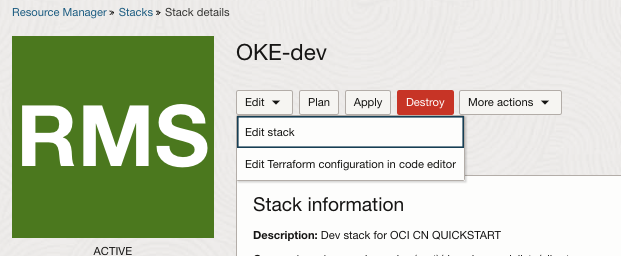
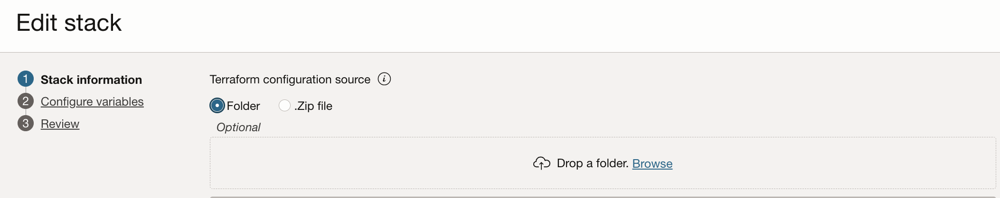
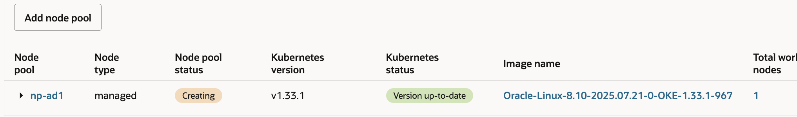

# OKE Quickstart

This repository was created with the intent of facilitating users with the creation of an OKE cluster from scratch.

The plan is to have a documentation and some stacks for the majority of use cases.

In this repository we are going to provision all the components one by one (network, OKE control plane, OKE data plane)

NOTE: If you want to create an OKE cluster with GPU and RDMA, then the stack that creates everything is public and available [here](https://github.com/oracle-quickstart/oci-hpc-oke)

## Step 1: Create the network infrastructure for OKE

This stack is used to create the initial network infrastructure for OKE. When configuring it, pay attention to some details:
* Select Flannel as CNI if you are planning to use Bare Metal shapes for the OKE data plane, or if you do not have many IPs available in the VCN
* You can apply this stack even on an existing VCN, so that only the NSGs for OKE will be created
* By default, everything is private, but there is the possibility to create public subnets
* Be careful when modifying the default values, as inputs are not validated

[](https://cloud.oracle.com/resourcemanager/stacks/create?zipUrl=https://github.com/oracle-devrel/technology-engineering/releases/download/oke-rm-1.1.7/infra.zip)

## Step 2: Create the OKE control plane

This stack is used to create the OKE control plane ONLY.

[](https://cloud.oracle.com/resourcemanager/stacks/create?zipUrl=https://github.com/oracle-devrel/technology-engineering/releases/download/oke-rm-1.1.7/oke.zip)

Also note that if the network infrastructure is located in a different compartment than the OKE cluster AND you are planning to use the OCI_VCN_NATIVE CNI,
you must add these policies:

```ignorelang
Allow any-user to manage instances in tenancy where all { request.principal.type = 'cluster' }
Allow any-user to use private-ips in tenancy where all { request.principal.type = 'cluster' }
Allow any-user to use network-security-groups in tenancy where all { request.principal.type = 'cluster' }
```
For a more restrictive set of policies, see the [documentation](https://docs.oracle.com/en-us/iaas/Content/ContEng/Concepts/contengpodnetworking_topic-OCI_CNI_plugin.htm).

## Step 3: Create the OKE data plane

As the data plane vastly depends on the particular use case, there is no stack for it, as there are many options.

### Option 3.1: Create the OKE data plane with Oracle Linux nodes

This option is most commonly used for general purpose CPU workloads.

Although GPU workloads are supported too, the Nvidia GPU Operator is not supported, so take this into account if you are planning to use Oracle Linux nodes and GPUs.

#### Option 3.1.1: Create worker nodes manually through the OCI web console

In some cases, some users prefer to create the nodes directly using the OCI web console. In this case there is nothing else to do, you are free to login and create the node pools.

#### Option 3.1.2: Create worker nodes by modifying the Terraform Resource Manager stack

It is possible to easily modify the Terraform code of an OCI Resource Manager stack.

By using this feature, we can modify the stack we deployed in Step 2 and add the data plane nodes:



Instructions on how to modify the stack and add node pools can be found in comments on the bottom of the <code>oke.tf</code> file. Set <code>create = true</code> on the pool you want to be added by Terraform.

Alternatively, clone this repo locally and edit <code>oke.tf</code> file to add a node pool and then load the folder including the modified Terraform to your RM stack:



After adding the Terraform source save and apply the stack.Now, the RM should add the new pool:



### Option 3.2: Create the OKE data plane with Ubuntu nodes

This option is most commonly used for AI workloads and GPU nodes, as Nvidia officially supports the Nvidia GPU plugin and DCGM exporter only on Ubuntu.

#### Option 3.2.1: Create worker nodes by modifying the Terraform Resource Manager stack

To use Ubuntu nodes on OKE, an Ubuntu custom image must be created beforehand. Documentation on how to do this is present in the oke.tf comments.

Once we have an image, we can modify the Terraform configurations directly from the OCI web console, as with option 3.1.2

### Option 3.3: Create an OKE RDMA cluster with Ubuntu nodes

If you are looking to provision an OKE cluster for RDMA and GPUs using this stack and approach, feel free to contact one of the [EMEA AppDev team](../../../README.md) as we prefer to help you, and to give you some tips to go faster.

# What to do next?

Provisioning an OKE cluster is just the first step, be sure to also check out these guides to learn how to configure it:
* [OKE policies](../oke-policies/policies.md)
* [GitOps with ArgoCD](../oke-gitops/README.md)
* [Ingress guide](ingress.md)
