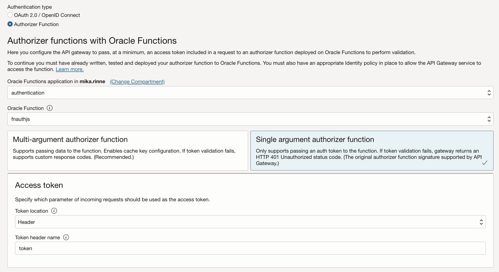
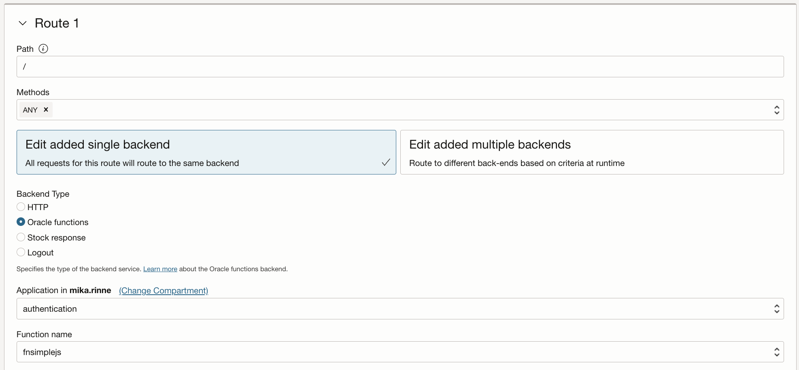
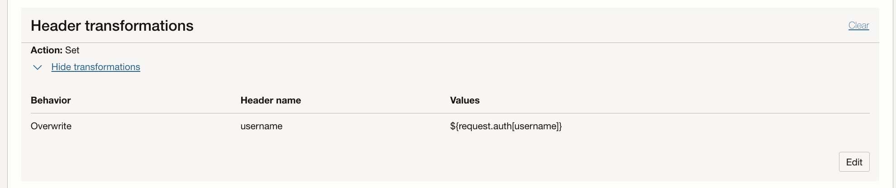

<!--
Copyright (c) 2024 Oracle and/or its affiliates.

The Universal Permissive License (UPL), Version 1.0

Subject to the condition set forth below, permission is hereby granted to any
person obtaining a copy of this software, associated documentation and/or data
(collectively the "Software"), free of charge and under any and all copyright
rights in the Software, and any and all patent rights owned or freely
licensable by each licensor hereunder covering either (i) the unmodified
Software as contributed to or provided by such licensor, or (ii) the Larger
Works (as defined below), to deal in both

(a) the Software, and
(b) any piece of software and/or hardware listed in the lrgrwrks.txt file if
one is included with the Software (each a "Larger Work" to which the Software
is contributed by such licensors),

without restriction, including without limitation the rights to copy, create
derivative works of, display, perform, and distribute the Software and make,
use, sell, offer for sale, import, export, have made, and have sold the
Software and the Larger Work(s), and to sublicense the foregoing rights on
either these or other terms.

This license is subject to the following condition:
The above copyright notice and either this complete permission notice or at
a minimum a reference to the UPL must be included in all copies or
substantial portions of the Software.

THE SOFTWARE IS PROVIDED "AS IS", WITHOUT WARRANTY OF ANY KIND, EXPRESS OR
IMPLIED, INCLUDING BUT NOT LIMITED TO THE WARRANTIES OF MERCHANTABILITY,
FITNESS FOR A PARTICULAR PURPOSE AND NONINFRINGEMENT. IN NO EVENT SHALL THE
AUTHORS OR COPYRIGHT HOLDERS BE LIABLE FOR ANY CLAIM, DAMAGES OR OTHER
LIABILITY, WHETHER IN AN ACTION OF CONTRACT, TORT OR OTHERWISE, ARISING FROM,
OUT OF OR IN CONNECTION WITH THE SOFTWARE OR THE USE OR OTHER DEALINGS IN THE
SOFTWARE.
-->

## Functions overview
[Document functions-overview](files/Fn.pdf)

# API Gateway authorizer function context var example

## Build and deploy the functions

### Authorizer function fnauthjs
<pre>
const fdk=require('@fnproject/fdk');

fdk.handle(function(input){
  let json = "";

  if(input.token) {
      json = {
        "active": true,
        "principal": "myprincipal",
        "scope": ["fnsimplejs"],
        "clientId": "clientIdFromHeader",
        "expiresAt": "2023-12-31T00:00:00+00:00",
        "context": {
            "username": input.token
        }
      }
  } else {
      json = {
        "active": false,
        "expiresAt": "2023-12-31T00:00:00+00:00",
        "wwwAuthenticate": "Bearer realm=\"www.com\""
      }
  }
  return json;
})
</pre>

The authorizer function will pass on the <code>username</code> in <code>auth context</code> as a custom variable. The value for it is set from REST call input as <code>token</code> on the <a href="fnauthjs/func.js#L52">line 52</a>.
 
Here's the call using API Gateway:
<pre>
curl -H "token: test-token" https://drp....56kvgu.apigateway.eu-amsterdam-1.oci.customer-oci.com/
</pre>
Hence the auth context var <code>username</code> gets the value <code>test-token</code>

### Backend / secondary function fnsimplejs
<pre>
const fdk=require('@fnproject/fdk');

fdk.handle(function(input, ctx){
  return ctx.headers['Fn-Http-H-Username'];
})    
</pre>

The secondary / backend function will get the authorizer passed variable <code>username</code>
as a transformed header variable <code>Fn-Http-H-Username</code> and will print it out as the
function REST call result on the <a href="fnsimplejs/func.js#L42">line 42</a>.
 
Here's the call using API Gateway:
<pre>
curl -H "token: test-token"  https://drp....56kvgu.apigateway.eu-amsterdam-1.oci.customer-oci.com/
["test-token"]
</pre>

## Create the API Gateway based on the functions and configure as follows

To achieve this as described above create and configure API Gateway deployment as follows:

### Authorizer function fnauthjs

    
Use these settings for the <b><i>Single argument authorizer function</i></b>:

Token location: <b>Header</b>
 
Token header name: <b>token</b>
 
### Backend / secondary function fnsimplejs

    
### <i>auth context</i> variable <i>username</i> transformation in <i>Route Request Policies</i>

Use these settings for the <b><i>Header transformations</i></b>:

Behavior: <b>Overwrite</b>
 
Header name: <b>username</b>
 
Values: <b>${request.auth[username]}</b>

## Authorization error 401 Unauthorized

If no <code>token</code> is given in the API Gateway REST call the secondary/backend function will not be called and API Gateway will return <b>401 Unauthorized</b> error instead e.g. 
<pre>
curl https://drp....56kvgu.apigateway.eu-amsterdam-1.oci.customer-oci.com/
{"code":401,"message":"Unauthorized"}
</pre>

