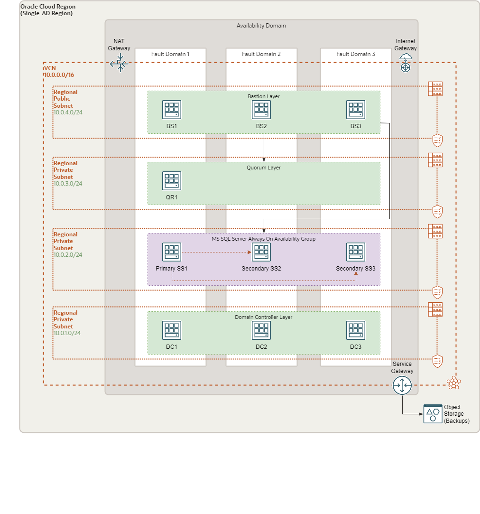
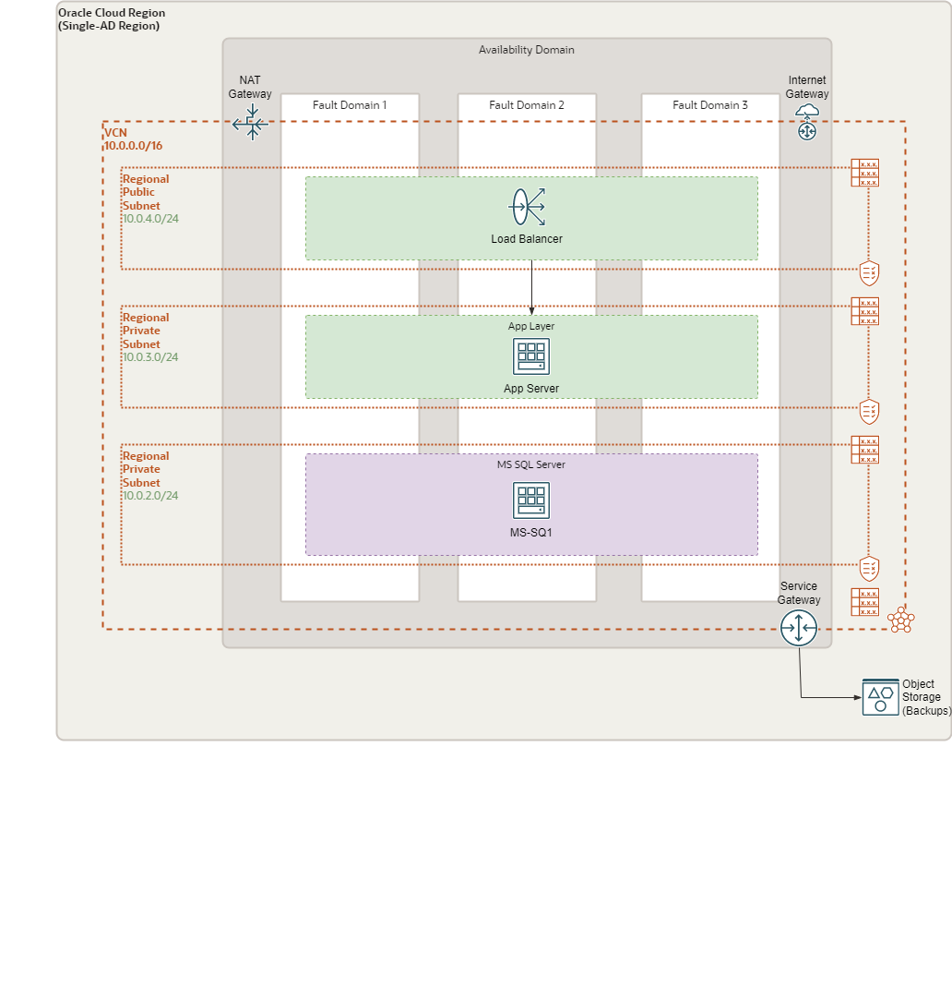

# Document Control

## Version Control

Version     | Author          | Date                    | Comment
:---        |:---             |:---                     |:---

## Document Purpose

The scope of this document is the solution definition for setting up Microsoft SQL Server Always On availability groups on Oracle Cloud Infrastructure (OCI) to take advantage of the built-in redundancy and resiliency features of Oracle Cloud and enhance an existing deployed current architecture with High Availability capabilities.

## Workload Business Value

Configuring the MS SQL Server database nodes to run in a HA manner will provide assurance for increased uptime, availability in case of one server going down or one of the Fault Domains in the OCI region failing. Automatic failover will occur therefore ensuring business continuity.

# Workload Requirements and Architecture

## Overview

The primary goal of this Lift project is to implement HA for the existing MS SQL Server database, which effectively will increase the overall resilience and uptime of the system. This will done by implementing an MS SQL Server Always On Availability Group - an advanced enterprise level feature to provide high availability to MS SQL Server.

### Resilience and Recovery

The solution architecture topology consists of independent SQL Server instances on distinct Windows Server instances working together to host a discrete set of user databases, known as availability databases. At any point in time, a single set of primary read/write databases is co-located on a single instance. High-throughput, transaction consistent background replication processes maintain secondary sets of non-writeable availability databases on independent servers. During an instance failure or planned maintenance activity, the status of availability databases and associated resources on a secondary instance might be automatically or manually promoted from standby to primary.

High Availability for the MS SQL Server database layer can be complemented at the application tier through:

  - Redundancy of public-facing front-end Load Balancer
  - Redundancy of the application servers

With the implementation of HA in active-passive mode an application's time should be virtually 100%.

## Future State Architecture

Several aspects worth mentioning regarding the proposed architecture deployment:

- SQL Server instances are independent and don’t share access to a storage subsystem or floating IP address. This independence allows for geographically dispersed and flexible node topologies.
- Automatic failure detection and database failover can be triggered by common Windows host and SQL Server instance failures. Typically, logical data corruption, user database crashes, client connection blocking, and related activities on the database level don’t trigger a failover.
- Transactionally consistent replication is leveraged (also referred to as synchronous-commit mode) in an active-passive cluster configuration. MS SQL Server and Windows Server Failover Clustering (WSFC) offer numerous other feature configuration options such as heterogeneous replication modes, read-only secondary databases, symmetric cluster topologies, and so on, that might be relevant for specific requirements. For more information, see the [Microsoft documentation](https://docs.microsoft.com/en-us/sql/database-engine/availability-groups/windows/overview-of-always-on-availability-groups-sql-server)

WSFC is leveraged to provide interserver coordination and resource management to support service high availability in a distributed environment. If a clustered Windows Server or SQL Server instance fails, the primary role of user databases and related services can be automatically or manually transferred to another available server.
WSFC provides the following capabilities:

- Robust administrative tools and PowerShell commands to configure, review, and manage cluster deployments
- Active background health monitoring of cluster nodes and resources
- Automated host/instance failure recovery via resource failover and replication reconfiguration

Oracle Cloud Infrastructure further enhances the availability and resilience of this environment with several capabilities that are not typically available in traditional environments, such as the following ones:

- Deployment of individual cluster nodes in distinct availability domains, which are geographically separate physical data centers that are transparently connected by means of a high-speed network. This capability provides node isolation from many common failures related to building damage, power disruptions, or network ingress or egress slowdowns to the internet backbone.
- Agile deployment of new or replacement nodes, storage-capacity expansion, or instance resizing to quickly meet unpredictable loads without overprovisioning the environment.
- Capacity on demand to quickly replicate clusters for test validation of proposed changes. The ability to quickly and inexpensively replicate a production environment, schema, and data set might result in better testing with less risk of unintended consequences to the production environment.

### Physical Architecture: SQL Server Always on HA deployment

### Physical Architecture: Sample Architecture for Single Instance Deployment

### MS SQL Server System Requirements

When deploying MS SQL Server from the OCI Marketplace you need to be aware of the following requirements related to the OCI Compute shapes that can be used for each version:

1. The following Compute shapes are supported for SQL 2016:

- VM.Standard2 series (except VM.Standard2.1)
- VM.DenseIO2 series

2. The following Compute shapes are supported for SQL 2019:

- VM.Standard2 series (except single core shape VM.Standard2.1)
- VM.Standard.E2 series (except single core shapes VM.Standard.E2.1 and VM.Standard.E2.1.Micro)
- VM.Standard.B1 series (except single core shape VM.Standard.B1.1)
- VM.Standard1 series (except single core shape VM.Standard1.1)
- VM.DenseIO1 series

For more details please refer to the following links:

- [Microsoft SQL Server image for Oracle Cloud Infrastructure VMs](https://cloudmarketplace.oracle.com/marketplace/en_US/listing/60923152)
- [Deploying Microsoft SQL Server on Oracle Cloud Infrastructure](https://blogs.oracle.com/cloud-infrastructure/post/deploying-microsoft-sql-server-on-oracle-cloud-infrastructure)
- [Deploy a highly available Microsoft SQL Server database](https://docs.oracle.com/en/solutions/deploy-microsoft-sql-on-oci/index.html)

## SAMPLE BoM Items

| Product  Description            | Metric                              | Qty  |
| ------------------------------- | ----------------------------------- | ---- |
| OCI - Compute  - Optimized - X7 | OCPU Per Hour                       | 8    |
| OCI - Compute  - Windows OS     | OCPU Per Hour                       | 4    |
| OCI - Block  Volume Storage     | GB per Month                        | 750  |
| OCI - Block  Volume Performance | Performance Units Per  GB Per Month | 7500 |
| OCI - Object  Storage - Storage | GB per Month                        | 0    |

## SAMPLE Deployment Build

Below details are for the reference.
Lift team will look at the current environment and replicate as it is implemented currently.

### Naming Convention

| Component                        | Use                                                     | Naming Convention                          | Example                     |
| :------------------------------- | :------------------------------------------------------ | :----------------------------------------- | :-------------------------- |
| Virtual Cloud Network (VCN)      | Primary Network Encapsulation (/16)                     | Vcn-xxx                                    | vcn-prod or vcn-dev         |
| Private Subnet                   | Individual IP Networks (/24)                            | snet-Priv-dev                              | snet-priv-db or snet-dev-db |
| Public Subnet                    | Individual IP Network with Public IPs (/26)             | snet-xxx-xxx snet-pub-dmz or snet-prod-dmz |                             |
| Customer Premise Equipment (CPE) | Logical VPN Device at Oracle Cloud                      | cpe-xxx	cpe-amsterdam or cpe-prod       |                             |
| Dynamic Routing Gateway (DRG)    | Logical Router at Oracle Cloud                          | drg-xxx	drg-prod                        |                             |
| Compute Nodes                    | Instances in Oracle Cloud                               | xxx-xxx-xxx                                | bastion-prod-001            |
| Block Volume                     | Block Volume in Oracle Cloud                            | Instance name(xxx)                         | bastion-prod-001(001)       |
| File Storage                     | Shared file storage service                             | fss-xxx-xx                                 | fss-prod-data01             |
| Object Storage Bucket            | Elastic Volume for Object Storage                       | xxx-xxx                                    | prod-bucket001              |
| Service Gateway (SGW)            | Internal Gateway for Object Storage Access              | Vcnname-sgw                                | vcn-prod-sgw                |
| Internet Gateway (IGW)           | External Gateway for Internet Access (unused)           | Vcnname-igw                                | vcn-prod-igw                |
| Local Peering Gateway (LPG)      | Gateway for multiple VCN communication                  | vcnname-lpgx                               | vcn-prod-lpg01              |
| NAT                              | Outbound internet access gateway                        | vcnname-nat                                | vcn-prod-nat                |
| Route Table                      | Virtual Route Tables for sending traffic out of the VCN | rt-xxx-xxx                                 | rt-prod-db                  |
| Security List                    | Cloud firewall rules                                    | sl-xxx-xx                                  | sl-dev-app                  |
| <!--END-->                       |                                                         |                                            |                             |
<!--END-->

### Compartments

Name | Region | Parent Compartment | Description | Tags
:--- |:---    |:---                |:---         |:---
Production   | Dubai |   |  Compartment for production application and database tier

### Policies

| Name | Statements | Region | Compartment | Description |
|:------|:------|:------|:------|:------|
| Prd_Admin_Policy | Allow group Prd_Admin_Group to manage all-resources in compartment Production | Dubai    | Production | Policy for production compartment admin group |
| <!--END-->            |                                                              |        |             |                                           |

### Groups

| Name       | Matching Rule | Region    | Authentication | Description                                                  |
| :--------- | :------------ | :-------- | :------------- | :----------------------------------------------------------- |
| Prd_Admin_Group |               | Dubai   | IAM            | Users that have admin access to network,Apps, DB... for Production compartment and subcompartment only |
| <!--END--> |               |           |                |                                                              |

### Users

Name | Email | Group | Description
:--- |:---   |:---   |:---
 |   |   |

### Virtual Cloud Networks

| Compartment | VCN Name | CIDR Block  | IGW | DRG | NGW | SGW | Region | Tags |
|:------|:------|:------|:------|:------|:------|:------|:------|:------|
| Production | vcn-prod | 10.0.1.0/24 | vcn-prod-igw |      | vcn-prod-ngw | vcn-prod-sgw | Dubai |Production|
| <!--END-->  |            |             |     |      |      |        |      ||

### Subnets

| Compartment | VCN Name | Subnet Name    | CIDR Block    | Type    | Security List Name | Route Table Name | Region |
| :---------- | :------- | :------------- | :------------ | :------ | :----------------- | :--------------- | :----- |
| Production  | vcn-prod | snet-priv-app  | 10.0.10.0/24   | Private | sl-priv-app        | rt-priv-app     | Dubai  |
| Production  | vcn-prod | snet-priv-db   | 10.0.20.0/24  | Private | sl-priv-db         | rt-priv-db      | Dubai  |
| Production  | vcn-prod | snet-pub-web   | 10.0.30.0/24 | Public  | sl-pub-web        | rt-pub-web      | Dubai  |
| <!--END-->  |          |                |               |         |                    |                  |        |

### Route Tables

| Name            | Table Compartment | Destination CIDR  | Target Type | Description   |
| :-------------- | :---------------- | :-------------- | :---------- | :------------------------------- |
| rt-priv-app               | Production        | 0.0.0.0/0                               | NAT         | Access from Application  to Internet               |
| rt-pub-web                | Production        | 0.0.0.0/0                               | IGW         | Access from public subnet resources to Internet |
| rt-priv-db               | Production        | 0.0.0.0/0                               | NAT         | Access from Database  to Internet               |
| rt-priv-db              | Production        | OCI Dubai Object Storage                | SGW         | Access from database  to object Storage               |
| <!--END-->                 |                   |                                         |             |                                                 |
<!--END-->

### Security Lists (Egress)

Name | Compartment | Egress Type | Destination | Protocol | Source Port | Dest. Port | Region | Description
:--- |:---         |:---         |:---         |:---      |:---         |:---        |:---    |:---          
sl-priv-db | Production | Stateful | 0.0.0.0/0 | TCP | all | all | Dubai |
sl-priv-app | Production | Stateful | 0.0.0.0/0 | TCP | all | all | Dubai |
sl-pub-web | Production | Stateful | 0.0.0.0/0 | TCP | all | all | Dubai |

### Security Lists (Ingress)

| Name        | Compartment | Ingress Type   | Source  | Protocol | Source Port | Dest. Port | Description     |
| :------------ | :--------| :----------| :------------| :------- | :---------- | :--------- | :-----------|
| sl-priv-db | Production  | Stateful/ CIDR | 10.0.30.0/24 | TCP      | all         | 22         |  |
| sl-priv-db | Production  | Stateful/ CIDR | 10.0.10.0/24 | TCP      | all         | 1521      |  |
| sl-priv-app | Production  | Stateful/ CIDR | 10.0.30.0/24 | TCP      | all         | all    |  |
| sl-pub-web | Production | Stateful/ CIDR | 0.0.0.0/0 | RDP | all | 3389 |                                                              |
| sl-pub-web | Production | Stateful/ CIDR | 0.0.0.0/0 | TCP | all | 80 | |
|<!--END-->||||||||

### Compute Instances

Compartment | Availability Domain | Name | Fault Domain | Subnet | OS Image | Shape | Backup Policy | Region | NSG | Tags
:---        |:---                 |:---  |:---          |:---    |:---      |:---   |:---           |:---      |:--- |:---
Production | AD1 |  AppsInstances1 |  FD1 | sl-priv-app | Windows Server 2019 | VM.Standard2.2 | | Dubai | |
Production | AD1 |  AppsInstances2 |  FD2 | sl-priv-app | Windows Server 2019 | VM.Standard2.2 | | Dubai | |
Production | AD1 |  AppsReporting |  FD3 | sl-priv-app | Windows Server 2019 | VM.Standard2.2 | | Dubai | |
Production | AD1 |  AppsClient |  FD3 | sl-priv-app | Windows Server 2019 | VM.Standard2.2 | | Dubai | |
Production | AD1  | Bastion | FD1  | sl-pub-web | Windows Server 2019  | VM.Standard2.1| | Dubai | |

### Block Volumes

Compartment | Name | Size (in GB) | Availability Domain | Attached to Instance | Backup Policy | Region | Tags
:---        |:---  |:---          |:---                 |:---                  |:---           |:---    |:---
Production | AppsInstances1-blkvol01 | 500 | AD1 | AppsInstances1 | Silver | Dubai |
 Production  | AppsInstances2-blkvol01 | 500          | AD1                 | AppsInstances2       | Silver        | Dubai  |      
 Production  | AppsReporting-blkvol01  | 500          | AD1                 | AppsReporting        | Silver        | Dubai |
Production | AppsClient-blkvol01 | 500 | AD1 | AppsClient | Silver | Dubai |
Prodution | bastion-blkvol01  | 1000 | AD1  | Bastion | None  | Dubai |
<!--END-->|||||||

### Object Storage Buckets

| Compartment | Bucket       | Visibility | Region | Tags |
| :---------- | :----------- | :--------- | :----- | :--- |
| Production | prodbucket | Private    | Dubai | Production |
| <!--END-->  |              |            |        |      |

### Load Balancers

Compartment | LB Name | Shape | Subnet | Visibility | Hostnames | NSG | Region | Tags
:---        |:---     |:---   |:---    |:---        |:---       |:--- |:---    |:---
Production | prdlb |  800Mbps | snet-pub-web | Public  | prdlb_host |  | Dubai |

#### Backend Sets

LB Name | Backend Set Name | Backend Server Port | Backend Policy | SSL | Region | Tags | HC Protocol | HC Port
:---    |:---              |:---                 |:---            |:--- |:---    |:---  |:---         |:---
prdlb | prdappbs | AppsInstances1:8080 AppsInstances2:8080 |  Round Robin |   | Dubai | | |
prdlb | prdreportbs | AppsReporting | Round Robin |  | Dubai | | |
prdlb | AppsClient | AppsReporting | Round Robin |  | Dubai

#### Listeners

LB Name | Backend Set Name | Hostname | SSL | Listener Name | Protocol | Port | Region
:---    |:---              |:---      |:--- |:---           |:---      |:---  |:---
prdlb | prdappbs | www.esaterp.com | Yes | Listener1  | HTTP | 443 | Dubai

### Databases

#### DBSystem Info

| Compartment | Display Name | Shape         | Total Node count | DB Software Edition       | DB Size | Region | Tags     |
| :---------- | :----------- | :------------ | :------------| :---------------------- | :------ | :----- | :---------- |
| Production  | esatdb | VMStandard2.4 | 1          | Enterprise Edition | 1024    | Dubai   |   |
|             |              |               |             |                                        |         |        |             |

#### DBSystem Network

| Display Name | Hostname Prefix | Subnet Name | Availability Domain | License Type                | Time Zone |
| :----------- | :-------------- | :---------- | :------------------ | :-------------------------- | :-------- |
| esat | esathostdb | snet-priv-db | AD1                 | LICENSE_INCLUDED | Asia/Dubai     |
| <!--END-->   |                 |             |                     |                                         |           |

#### Database

| Display Name | PDB Name | Workload Type | Database Name | Database Version | Character Set | ncharacter Set |
| :----------- | :------- | :------------ | :------------ | :--------------- | :------------ | :------------- |
| esatdb | esatpdb | OLTP      | esatdb | 19c              | AL32UTF8 |    AL16UTF16         |
|<!--END-->|||||||
