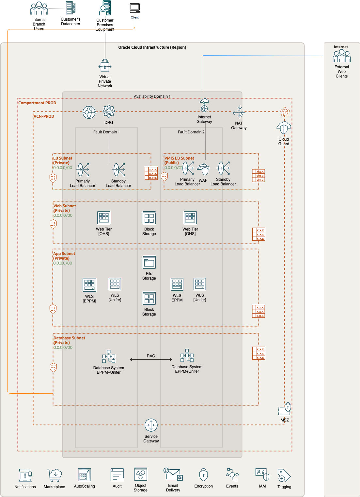
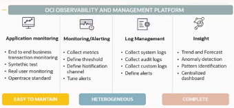
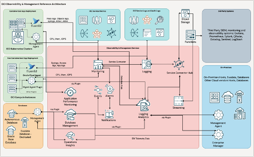
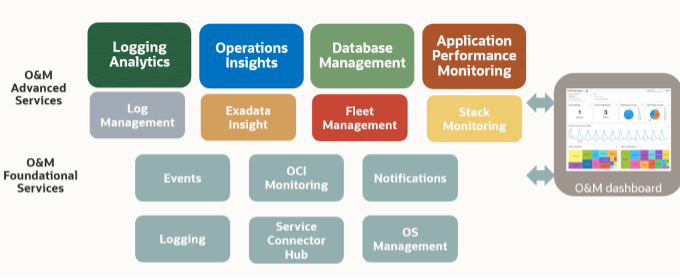

*Guide:*

*Author Responsibility*

- *Chapter 1-3: Sales Consultant*

# Document Control

*Guide:*

*The first chapter of the document describes the metadata for the document. Such as versioning and team members.*

## Version Control

*Guide:*

*A section describing the versions of this document and its changes.*

*Example:*

Version     | Author          | Date                    | Comment
:---        |:---             |:---                     |:---
0.1         | Name            | June 12th, 2023     | Updates to network design
1.0         | Name            | June 13th, 2023     | Updates to HA design
2.4         | Name            | February 26th, 2024     | Added the network firewall in the requirment, the solution considerations and in the Annex.
2.4         | Name            | April 18th, 2024     | Added the manageability section in the Annex.

## Team

*Guide:*

*A section describing the Oracle team.*

*Example:*

This is the team that is delivering the WAD.

Name           | eMail                     | Role                    | Company
:---           |:---                       |:---                     |:---
Name   | email@example.com     | Project Manager         | Oracle
Name  | email@example.com     | Cloud Architect         | Oracle

## Abbreviations and Acronyms (Optional)

*Guide:*

*If needed, maintain a list of:*
- *Abbreviation: a shortened form of a word or phrase.*
- *Acronyms: an abbreviation formed from the initial letters of other words and pronounced as a word (e.g. ASCII, NASA ).*

*Example:*

| Term         | Meaning                               |
|:-------------|:--------------------------------------|
| AD-Bridge    | Active Directory Bridge               |
| CG           | Oracle Cloud Guard                    |
| EBS          | E-Business Suite                      |
| EBS-Asserter | Oracle E-Business Suite Asserter      |
| IaaS         | Infrastructure as a Service           |
| IaaS         | ABC                                   |
| IDCS         | Oracle Identity Cloud Service         |
| MFA          | Multi Factor Authentication           |
| NSG          | Network Security Group                |
| OAC          | Oracle Analytics Cloud                |
| OCI          | Oracle Cloud Infrastructure           |
| OIC          | Oracle Integration Cloud              |
| SSO          | Single Sign-On                        |
| VCN          | Virtual Cloud Network                 |
| VSS          | Oracle Vulnerability Scanning Service |
| WLS          | Weblogic Server                       |

## Document Purpose

*Guide:*

*Describe the purpose of this document and the Oracle-specific terminology, specifically around 'Workload'.*

*Example:*

This document provides a high-level solution definition for the Oracle solution and aims at describing the current state, and to-be state as well as a potential project scope and timeline. The intended purpose is to provide all parties involved with a clear and well-defined insight into the scope of work and intention of the project.

The document may refer to a 'Workload', which summarizes the full technical solution for a customer (You) during a single engagement. The Workload is described in the chapter Workload Requirements and Architecture.

<!--                            -->
<!-- End of 1) Document Control -->
<!--                            -->

# Business Context

*Guide:*

*Describe the customer's business and background. What is the context of the customer's industry and line of business? What are the business needs and goals which this Workload is an enabler for? How does this technical solution impact and support the customer's business goals? Does this solution support a specific customer strategy, or maybe certain customer values? How does this solution help our customers to either generate more revenue or save costs?*

Example:

${doc.customer.name} is one of the world's most valuable XXX companies. It is a multi-national company located in the XXX. The company operates internationally providing XXX services.

Currently ${doc.customer.name} uses Primavera application extensively for the project planning and scheduling of their construction projects. They want to move their Primavera applications to cloud to reduce the cost and to leverage the agility and scalability of cloud.

This project will use  OCI to create a standby system for the existing Primavera implementation, thereby providing customer with much better fault-tolerance compared to the current architecture.

## Executive Summary

*Guide:*

*A section describing the Oracle differentiator and key values of the solution for the customer, allowing the customer to make decisions quickly.*

Example:

The following document defines a tentative high level deployment architecture that may be used at ${doc.customer.name}.

Highlighted details are only presented for the Primavera application environment.

## Workload Business Value

*Guide:*

*A clear statement of specific business value as part of the full workload scope. Try to keep it SMART: Specific, Measurable, Assignable, Realistic, and Time-Related - Agree on the business value with the customer. Keep it business-focused, and speak the language of the LoB which benefits from this Workload: "Increase Customer Retention by 3% in the next year" or "Grow Customer Base with Executive Decision-Making from our Sales and Support Data". Avoid technical success criteria such as "Migrate App X to Oracle Cloud" or "Provision 5 Compute Instances".*

Example:

The success completion of this project is to provide a fully migrated Primavera comprising of XXX x non-production environments, XXX x production-support environment XXX x production environment and 1 x DR environment.

The production environment should be
- **Performant:** at least matching the on-premise system
- **Secure:** comply with ${doc.customer.name}'s cloud security model (to be provided)

<!--                            -->
<!-- End of 2) Business Context -->
<!--                            -->

# Workload Requirements and Architecture

## Overview

*Guide:*

*Describe the Workload: What applications and environments are part of this Workload migration or new implementation project, and what are their names? The implementation will be scoped later and can be a subset of the Solution Definition and proposed overall solution. For example, a Workload could exist of two applications, but the implementer would only include one environment of one application.*

Example:

The Primavera workload described here documents a full Oracle Cloud Infrastructure (OCI) solution which replicates ${doc.customer.name}'s existing on-premises Oracle Primavera implementation.

## Functional Requirements (Optional)

*Guide:*

*Provide a brief overview of the functional requirements, the functional area they belong to, the impacted business processes, etc.*

*Provide a formal description of the requirements as 1. a set of Use Cases or 2. a description of Functional Capabilities or 3. a Requirement Matrix. The three descriptions are not mutually exclusive.*

### Use Cases (Optional)

*Guide:*

*A Use Case (UC) can be represented in a table as the following one. See https://www.visual-paradigm.com/guide/use-case/what-is-use-case-specification/ for a quick introduction to the concept of UC. See https://www.usability.gov/how-to-and-tools/methods/use-cases.html for more examples and detailed instructions.*

### Functional Capabilities (Optional)

*Guide:*

*In specific cases, a set of Functional Capabilities can be represented in a functional decomposition diagram. This is typical of functional analysis in the System Engineering domain. For more information on Functional Analysis see, e.g. https://spacese.spacegrant.org/functional-analysis/.*

### Requirement Matrix (Optional)

*Guide:*

*A Requirement Matrix can be used when the solution will be based on software capabilities already available in existing components (either custom or vendor provided). The Requirements Matrix is a matrix that is used to capture client requirements for software selection and to evaluate the initial functional “fit” of a vendor’s software solution to the business needs
of the client.*

## Non-Functional Requirements

*Guide:*

*Describe the high-level technical requirements for the Workload. Consider all sub-chapters, but decide and choose which Non-Functional Requirements are necessary for your engagement. You might not need to capture all requirements for all sub-chapters.*

*This chapter is for describing customer-specific requirements (needs), not to explain Oracle solutions or capabilities.*

Example:

The solution as described in this document will be based within a single OCI Region, utilising a single Availability Domain to deliver the solution.

Each OCI Availability Domain contains 3 x Fault Domains and these will be utilised to ensure that the solution delivers a high level of availability and component fault tolerance.

### Regulations and Compliances Requirements

*Guide:*

*This section captures specific regulatory or compliance requirements for the Workload. These may limit the types of technologies that can be used and may drive some architectural decisions.*

*The Oracle Cloud Infrastructure Compliance Documents service lets you view and download compliance documents:
https://docs.oracle.com/en-us/iaas/Content/ComplianceDocuments/Concepts/compliancedocsoverview.htm*

*If there are none, then please state it. Leave the second sentence as a default in the document.*

*Example:*

At the time of this document creation, no Regulatory and Compliance requirements have been specified.

In addition to these requirements, the [CIS Oracle Cloud Infrastructure Foundation Benchmark, v1.2](https://www.cisecurity.org/benchmark/Oracle_Cloud) will be applied to the Customer tenancy.

### Environments

*Guide:*

*A diagram or list detailing all the required environments (e.g. development, text, live, production, etc).*

*If you like to describe a current state, you can use or add the chapter 'Current State Architecture' before the 'Future State Architecture'.*

### High Availability and Disaster Recovery Requirements

*Guide:*

*This section captures the resilience and recovery requirements for the Workload. Note that these may be different from the current system.*

*The Recovery Point Objective (RPO) and Recovery Time Objective (RTO) requirement of each environment should be captured in the environments section above, and wherever possible.*

- *What are the RTO and RPO requirements of the Application?*
- *What are the SLAs of the application?*
- *What are the backup requirements*

*Note that if needed, this section may also include an overview of the proposed backup and disaster recovery proposed architectures.*

*This chapter is mandatory, while there could be no requirements on HA/DR, please mention that in a short single sentence.*

*Example:*

At the time of this document creation, no Resilience or Recovery requirements have been specified.

#### High Availability (Optional)

*Guide:*

*A subsection, if cleaner separation of Resilience and Recovery into HA, DR, and Backup & Restore is needed.*

*Example:*

The following table captures the High availability requirements for the Production environment:

Service Name  	| KPI	            	| Unit	  	| Value
---		      		|---	            	|---	    	|---
Oracle DB		       		| Uptime	          | percent		| 99.98
Primavera Application	| Max Interruption	| minutes 	| 20

#### Disaster Recovery (Optional)

*Guide:*

*A subsection, if cleaner separation of Resilience and Recovery into HA, DR, and Backup & Restore is needed.*

*Example:*

Environment  |RPO   |RTO
--|---|--
PROD  | 24 Hours  |  4 Hours
UAT  | 24 Hours  |  4 Hours

#### Backup and Restore (Optional)

*Guide:*

*A subsection, if cleaner separation of Resilience and Recovery into HA, DR, and Backup & Restore is needed.*

*Example:*

Service Name	    | KPI		    | Unit		| Value
:---			   	|:---		    |:---		|:---
Database			    	| Frequency	  	| /day		| 2
Block Storage			    	| BckpTime (F)	| hours		| 4

For OCI, the Backup tier will be set to Gold: The gold policy includes daily incremental backups, retained for seven days, along with weekly incremental backups, run on Sunday and retained for four weeks. Includes monthly incremental backups, run on the first day of the month, retained for twelve months. Also, include a full backup, run yearly, during the first part of January. This backup is retained for five years. The backups can be potentially done to a different cloud region as well. Refer to the documentation for more details: [Scheduling volume backups](https://docs.oracle.com/en-us/iaas/Content/Block/Tasks/schedulingvolumebackups.htm)

### Security Requirements

*Guide:*

*Capture the Non-Functional Requirements for security-related topics. Security is a mandatory subsection that is to be reviewed by the x-workload security team. The requirements can be separated into:*
- *Identity and Access Management*
- *Data Security*

*Other security topics, such as network security, application security, key management or others can be added if needed.*

*Example:*

At the time of this document creation, no Security requirements have been specified.

#### Identity and Access Management (Optional)

*Guide:*

*The requirements for identity and access control. This section describes any requirements for authentication, identity management, single-sign-on, and necessary integrations to retained customer systems (e.g. corporate directories).*
- *Is there any Single Sign On or Active Directory Integration Requirement?*
- *Is the OS hardened if so please share the hardening guideline.*

#### Data Security (Optional)

*Guide:*

*Capture any specific or special requirements for data security. This section should also describe any additional constraints such as a requirement for data to be held in a specific location or for data export restrictions.*

### Networking Requirements

*Guide*

*Capture the Non-Functional Requirements for networking-related topics. You can use the networking questions in the [Annex](#networking-requirement-considerations)*

*As businesses increasingly rely on Cloud Infrastructure to store, process, and transmit sensitive data, the need for comprehensive security solutions has never been more important. Potential customers evaluating network security solutions typically prioritize the following requirements: Some of the broader category considerations are below.*

- *Data Protection: Safeguarding sensitive information against unauthorized access, theft, or modification is a primary concern for any organization and industry today.*
    - *Threat Prevention: Advanced capabilities like IDPS and malware detection for blocking threats.*
    - *Data Loss Prevention (DLP): Monitoring and controlling sensitive data transmission.*
    - *Encryption and Decryption: Inspecting encrypted traffic without compromising privacy.*
- *Threat Prevention: Proactively identifying and mitigating security threats is essential for maintaining the integrity of network infrastructure. *
    - *Intrusion Detection and Prevention: Monitoring for suspicious or malicious activity.*
    - *Application Control: Granular control over specific applications or services.*
    - *URL Filtering: Controlling access to permitted URLs.*
- *Security compliance: Does your organization have network security requirements based on industry or organization compliance? For example - SAMA (Saudi Arabia Monetary Authority), HIPAA (Health Insurance Portability and Accountability Act), GDPR (General Data Protection Regulation), SWIFT, etc.*

*Example:*

At the time of this document creation, no Networking requirements have been specified.

### Integration and Interfaces (Optional)

*Guide:*

*A list of all the interfaces into and out of the defined Workload. The list should detail the type of integration, the type of connectivity required (e.g. VPN, VPC, etc) the volumes, and the frequency.*
- *list of integrations*
- *list of user interfaces*

*                | Source    	| Target	  | Protocol  | Function
:---		                |:---		    |:---		  |:---		  |:---
IOT		                    | FieExample:*

Name	    ld Sensor	| MQTT Server | MQTT	  | Data collection
ELT	                       	| ODI		    | EBS DB	  | SQL Net	  | Data extraction
General Ledger Integration  | EBS           | ERP Cloud   | Batch     | Batch extraction
Mobile API                  | Mobile User   | HR Cloud    | Rest API  | Via API Cloud

### System Configuration Control Lifecycle (Optional)

*Guide:*

*This section should detail the requirements for the development and deployment lifecycle across the Workload. This details how code will be deployed and how consistency across the environments will be maintained over future software deployment. This may include a need for CI/CD.*
- *Will a CI/CD tool need access to deploy to the target environment*
- *Does the customer require software to be delivered to a repository*
- *How will configuration and software be promoted through the environments*

Example:

Oracle recommends the below approach to automate continuous delivery onto servers running on OCI for customer's application:

- Git version management
- Automating deployment

### Operating Model (Optional)

*Guide:*

*This section captures requirements on how the system will be managed after implementation and migration. In the vast majority of cases, the solution will be handed back to the customer (or the customer's SI/partner).*

*Also, capture requirements for tools to monitor and manage the solution.*

### Management and Monitoring

*Guide:*

*This subsection helps you capture any requirements for customer management and monitoring needs - e.g. system monitoring, systems management, log analysis, etc.*

*When you move or start an OCI project, you have a choice to use the tools you are familiar with (should they support modern application architectures), replace them with OCI native Observability services, or use a combination to improve your visibility. When contemplating how to proceed, here are some general questions that will guide you:*

- *Does the tool manage across hybrid and multi-cloud environments?*
- *What is the cost of integrating the existing tool with OCI?*
- *Is my current monitor tool enabling you to prevent issues versus reacting to them?*
- *Does the tool tell you how much impact there has been on users or just that there was an impact like something is down or unavailable? *
- *Does the tool provide the full vision of applications and their infrastructure or just a piece of them or specific technology?*

*Example:*

Task				   | Target		    | Location   	    | New   | Notes
:---				   |:---		    |:---		        |:---	|:---
Application Monitoring | All targets	| On-Prem and OCI   | No	|
Monitoring             | All targets	| OCI	(Migration) | No	|
Log Management         | All targets	| OCI	(Migration) | No	|
Insight                | All Oracle DBs	| OCI	(Migration) | No	|

### Performance (Optional)

*Guide:*

*The performance requirements cover all aspects related to the time required to perform a given operation. They can be measured in different ways, for example: (1) AvrgTime: average response time that can be accepted for a given online or real interaction (data retrieve, data insert, etc.) (2) MaxTime: maximum response time for the same operations defined for AvrgRtime The operations can be online (user interactions), offline (batch execution) or (near)realtime (messaging).*

### Capacity (Optional)

*Guide:*

*Capacity is a measure of the total workload the system can bear without affecting performance. There are many KPIs to measure capacity, depending on the system's functionalities. Some of the most relevant KPIs are:*
- *MaxVol: maximum volume of data that can be stored in the system (can be different for different types of data, e.g. relational and file): 800-900GB current database size (probably with a significant waste of space)*
- *MaxFlow: maximum data flow (input/output) that can be managed by the system (can be two different numbers for each major system interface and/or operation): the current value has not been measured but is expected to be at most a few GB.*
- *MaxUser: maximum number of concurrent users (can be differentiated by user profile): up to 10 (number of registered users).*

## Constraints and Risks (Optional)

*Guide:*

*Constraints are limitations that will impact the resulting project or Solution Architecture. It is a technology- or project-related condition or event that prevents the project from fully delivering the ideal solution to customers and end-users. Constraints can be identified on our customer, partner, or even Oracle's side.*

*A project risk is an uncertain event that may or may not occur during a project.*

*Describe constraints and risks affecting the Workload and possible Logical Solution Architecture. These can be technical, but might also be non-technical. Consider budgets, timing, preferred technologies, skills in the customer organization, location, etc.*

*Example:*

Name                | Description                                                               | Type        | Impact               | Mitigation Approach
:---                |:---                                                                       |:---         |:---                  |:---
OCI skills          | Limited OCI skills in customers organization                              | Risk        | No Operating Model   | Involve Ops partner, for example, Oracle ACS
Team Availability   | A certain person is only available on Friday CET time zone                | Constraint  |                      | Arrange meetings to fit that person's availability
Access Restriction  | We are not allowed to access a certain tenancy without customer presence  | Constraint  |                      | Invite customer key person to implementation sessions

## Current State Architecture (Optional)

*Guide:*

*Provide a high-level logical description of the Workload's current state. Stay in the Workload scope, and show potential integrations, but do not try to create a full customer landscape. Use architecture diagrams to visualize the current state. I recommend not putting lists of technical resources or dependencies here. Refer to the attachments instead.*

## Future State Architecture

*Guide:*

*The Workload Future State Architecture can be described in various forms. In the easiest case, we describe a Logical Architecture, possibly with a System Context Diagram. A high-level physical architecture is mandatory as a description of your solution.*

*This should be the final architecture as part of the pre-sales solution, not an intermediate or draft version*

*Additional architectures, in the subsections, can be used to describe needs for specific workloads.*

### Mandatory Security Best Practices

*Guide:*

*Use this text for every engagement. Do not change. Aligned with the Cloud Adoption Framework*

The safety of the ${doc.customer.name}'s Oracle Cloud Infrastructure (OCI) environment and data is the ${doc.customer.name}’s priority.
To following table of OCI Security Best Practices lists the recommended topics to provide a secure foundation for every OCI implementation. It applies to new and existing tenancies and should be implemented before the Workload defined in this document will be implemented.
Workload-related security requirements and settings like tenancy structure, groups, and permissions are defined in the respective chapters.
Any deviations from these recommendations needed for the scope of this document will be documented in chapters below. They must be approved by ${doc.customer.name}.

The customer is responsible for implementing, managing, and maintaining all listed topics.

+--------------------------+---------------------------+------------------------------------------------------------------------------------------------------------------------------------------------------------------------------------------------------+
| CATEGORY                 | TOPIC                     | DETAILS                                                                                                                                                                                              |
+==========================+===========================+======================================================================================================================================================================================================+
| User Management          | IAM Default Domain        | Multi-factor Authentication (MFA) should be enabled and enforced for every non-federated OCI user account.                                                                                           |
|                          |                           | - For configuration details see [Managing Multi-Factor Authentication](https://docs.oracle.com/en-us/iaas/Content/Identity/mfa/understand-multi-factor-authentication.htm).                          |
|                          |                           |                                                                                                                                                                                                      |
|                          |                           | In addition to enforcing MFA for local users, Adaptive Security will be enabled to track the Risk Score of each user of the Default Domain.                                                          |
|                          |                           | - For configuration details see [Managing Adaptive Security and Risk Providers](https://docs.oracle.com/en-us/iaas/Content/Identity/adaptivesecurity/overview.htm).                                  |
+--------------------------+---------------------------+------------------------------------------------------------------------------------------------------------------------------------------------------------------------------------------------------+
|                          | OCI Emergency Users       | A maximum of **three** non-federated OCI user accounts should be present with the following requirements:                                                                                            |
|                          |                           | - Username does not match any username in the Customer’s Enterprise Identity Management System                                                                                                       |
|                          |                           | - Are real humans.                                                                                                                                                                                   |
|                          |                           | - Have a recovery email address that differs from the primary email address.                                                                                                                         |
|                          |                           | - User capabilities have Local Password enabled only.                                                                                                                                                |
|                          |                           | - Has MFA enabled and enforced (see IAM Default Domain).                                                                                                                                             |
+--------------------------+---------------------------+------------------------------------------------------------------------------------------------------------------------------------------------------------------------------------------------------+
|                          | OCI Administrators        | Daily business OCI Administrators are managed by the Customer’s Enterprise Identity Management System.                                                                                               |
|                          |                           | This system is federated with the IAM Default Domain following these configuration steps:                                                                                                            |
|                          |                           | - Federation Setup                                                                                                                                                                                   |
|                          |                           | - User Provisioning                                                                                                                                                                                  |
|                          |                           | - For configuration guidance for major Identity Providers see the OCI IAM Identity Domain tutorials.                                                                                                 |
+--------------------------+---------------------------+------------------------------------------------------------------------------------------------------------------------------------------------------------------------------------------------------+
|                          | Application Users         | Application users like OS users, Database users, or PaaS users are not managed in the IAM Default Domain but either directly or in dedicated identity domains.                                       |
|                          |                           | These identity domains and users are covered in the Workload design.                                                                                                                                 |
|                          |                           | For additional information see [Design Guidance for IAM Security Structure](https://docs.oracle.com/en-us/iaas/Content/cloud-adoption-framework/iam-security-structure.htm).                         |
+--------------------------+---------------------------+------------------------------------------------------------------------------------------------------------------------------------------------------------------------------------------------------+
| Cloud Posture Management | OCI Cloud Guard           | OCI Cloud Guard will be enabled at the root compartment of the tenancy home region. This way it covers all future extensions, like new regions or new compartments, of your tenancy automatically.   |
|                          |                           | It will use the Oracle Managed Detector and Responder recipes at the beginning and can be customized by the Customer to fulfill the Customer’s security requirements.                                |
|                          |                           | - For configuration details see [Getting Started with Cloud Guard](https://docs.oracle.com/en-us/iaas/cloud-guard/using/part-start.htm).                                                             |
|                          |                           | Customization of the Cloud Guard Detector and Responder recipes to fit the Customer’s requirements is highly recommended. This step requires thorough planning and decisions to make.                |
|                          |                           | - For configuration details see [Customizing Cloud Guard Configuration](https://docs.oracle.com/en-us/iaas/cloud-guard/using/part-customize.htm)                                                     |
+--------------------------+---------------------------+------------------------------------------------------------------------------------------------------------------------------------------------------------------------------------------------------+
|                          | OCI Vulnerability         | In addition to OCI Cloud Guard, the OCI Vulnerability Scanning Service will be enabled at the root compartment in the home region.                                                                   |
|                          | Scanning Service          | This service provides vulnerability scanning of all Compute instances once they are created.                                                                                                         |
|                          |                           | - For configuration details see [Vulnerability Scanning](https://docs.oracle.com/en-us/iaas/scanning/home.htm).                                                                                      |
+--------------------------+---------------------------+------------------------------------------------------------------------------------------------------------------------------------------------------------------------------------------------------+
| Monitoring               | SIEM Integration          | Continuous monitoring of OCI resources is key for maintaining the required security level (see [Regulations and Compliance](#regulations-and-compliances-requirements) for specific requirements).   |
|                          |                           | See [Design Guidance for SIEM Integration](https://docs.oracle.com/en-us/iaas/Content/cloud-adoption-framework/siem-integration.htm) to implement integration with the existing SIEM system.         |
+--------------------------+---------------------------+------------------------------------------------------------------------------------------------------------------------------------------------------------------------------------------------------+
| Additional Services      | Budget Control            | OCI Budget Control provides an easy-to-use and quick notification on changes in the tenancy’s budget consumption. It will be configured to quickly identify unexpected usage of the tenancy.         |
|                          |                           | - For configuration details see [Managing Budgets](https://docs.oracle.com/en-us/iaas/Content/Billing/Tasks/managingbudgets.htm)                                                                     |
+--------------------------+------------------------

# Naming Convention
*Guide:*

*This chapter describes naming convention best practices and usually does not require any changes. If changes are required please refer to [Landing Zone GitHub](https://github.com/oracle-devrel/technology-engineering/tree/main/landing-zones). The naming convention zone needs to be described in the Solution Design by the service provider.*

*Use this template ONLY for new cloud deployments and remove it for brownfield deployments.*

A naming convention is an important part of any deployment to ensure consistency, governance, and security within your tenancy. Find [here](https://github.com/oracle-devrel/technology-engineering/blob/main/landing-zones/commons/resource_naming_conventions.md) Oracle's recommended best practices.

### OCI Landing Zone Solution Definition

*Guide:*

*This chapter describes landing zone best practices and usually does not require any changes. If changes are required please refer to [Landing Zone GitHub](https://github.com/oracle-devrel/technology-engineering/tree/main/landing-zones). The full landing zone needs to be described in the Solution Design by the service provider.*

*Use this template ONLY for new cloud deployments and remove it for brownfield deployments.*

An OCI Landing Zone sets the foundations for a secure tenancy, providing design best practices and operational control over OCI resources. A Landing Zone also simplifies the onboarding of workloads and teams, with clear patterns for network isolation and segregation of duties in the organization, which sets the cloud operating model for day-to-day operations.

Oracle highly recommends the use of an OCI Landing Zone for any deployment. Use these [guidelines](https://github.com/oracle-devrel/technology-engineering/blob/main/landing-zones/commons/lz_solution_definition.md) to set up your OCI Landing Zone, including design considerations, approaches, and solutions to use.

Note that all workloads in a tenancy should sit on top of a Landing Zone, meaning that the workload architecture defined in the next section can be subject to adjustments (e.g., network structure) towards the landing zone model, along with other future workloads. 

### Functional Architecture (Optional)
*Guide:*

*Provide a brief description of the functional architecture, split into two main areas: application capabilities and data.*

### Logical Architecture

*Guide:*

*Provide a high-level logical Oracle solution for the complete Workload. Indicate Oracle products as abstract groups, and not as physical detailed instances. Create an architecture diagram following the latest notation and describe the solution.*

*To implement a solution the Physical Architecture is needed in the next chapter. The physical notation can show individual components with physical attributes such as IP addresses, hostnames, or sizes.*

*[The Oracle Cloud Notation, OCI Architecture Diagram Toolkits](https://docs.oracle.com/en-us/iaas/Content/General/Reference/graphicsfordiagrams.htm)*

Example:

The below diagram describes the future logical architecture for Primavera at ${doc.customer.name}.

### Physical Architecture

*Guide:*

*The Workload Architecture is typically described in a physical form. This should include all solution components. You do not have to provide solution build or deployment details such as IP addresses.*

*Please describe the solution as a written text. If you have certain specifics you like to explain, you can also use the Solution Consideration chapter to describe the details there.*

*[The Oracle Cloud Notation, OCI Architecture Diagram Toolkits](https://docs.oracle.com/en-us/iaas/Content/General/Reference/graphicsfordiagrams.htm)*

*Example:*

The below diagram describes the future physical architecture for Primavera at ${doc.customer.name}

 

*The attached "images" folder includes alternative architectural designs, encompassing both multi-availability domain (AD) and multi-region deployments. The diagrams are provided in draw.io format and are editable.*

In the proposed cloud architecture, to ensure the security of the system, inbound and outbound data traffic will be screened utilizing Network Security Groups (NSGs) attached to Oracle Cloud Infrastructure (OCI) resources like compute instances and database services.

The intended environments will be segregated by situating them in distinct Virtual Cloud Networks (VCNs), a strategy aimed at facilitating granular control over network traffic, improving fault isolation, and enhancing security through minimizing potential attack surfaces. This structural division ensures a reduced risk of cross-contamination between different parts of the architecture in the event of a security incident.

Moreover, within these environments, the application tiers will be further segregated via the implementation of distinct subnets. This measure will facilitate enhanced access control, improved network traffic management, and additional security isolation. By isolating tiers into separate subnets, we can define fine-grained security rules for the inbound and outbound traffic specific to each application tier, further hardening our system against potential security threats.

### Data Architecture (Optional)

*Guide:*

*Show how data is acquired, transported, stored, queried, and secured as in the scope of this Workload. This could include Data Ecosystem Reference Architectures, Master Data Management models, or any other data-centric model.*

## Solution Considerations

*Guide:*

*Describe certain aspects of your solution in detail. What are the security, resilience, networking, and operations decisions you have taken that are important for your customer?*

### High Availability and Disaster Recovery

*Reference:*

[Primavera Performance and Sizing Guide](https://docs.oracle.com/cd/F25601_01/English/Planning/p6_eppm_performance_sizing/p6_eppm_performance_sizing.pdf)

### Security

*Guide:*

*Please describe your solution from a security point of view. Generic security guidelines are in the Annex chapter.*

Please see our security guidelines in the [Annex](#security-guidelines).

### Networking

*Guide:*

*If your customers have any or one of the needs described in the guide of the [Network Requirements](#networking-requirements), then the OCI Network Firewall (OCI NFW) is the cloud native solution that provides all of it. It is based on the industry-leading Nextgen firewall solution by Palo Alto (VM-Series). Refer to the Annex for more best practices around deployment models.*

*Reference:*

*A list of possible Oracle solutions can be found in the [Annex](#networking-solutions).*

*Example:*

The OCI Network Firewall can be deployed as a Distributed Network Firewall Model or Transit Network Firewall Model, where the firewall is hosted in the Hub VCN. In general, the OCI Network Firewall can be used to protect North-South traffic (Internet traffic) and/or East-West traffic (internal traffic). As a best practice, we do recommend using one dedicated OCI Network Firewall instance per type of traffic (North-South and East-West) in separated VCNs. This way performance will be maximized as well as ensuring the network isolation between the types of traffic.

For more information please follow [this link.](https://docs.oracle.com/en/solutions/oci-network-firewall/index.html#GUID-875E911C-8D7D-4205-952B-5E8FAAD6C6D3)

### Manageability and Observability

Observability is a technology advancement focused on getting insights from a vast array of data, logs, and events generated within an IT environment. By implementing an Observability strategy, organizations gain the capability to anticipate system disruptions, prevent resource overconsumption, and enhance the overall application user satisfaction. That means being proactive, which is a must, especially in a distributed environment.

Gone are the days when the IT landscape remained a mysterious black box. The company's digitalization and the Cloud model compel C-level executives to gain comprehensive insights into asset utilization. The efficient allocation of resources directly influences budgetary considerations.

Observability helps organizations examine how well their infrastructure is working, predict future needs, and help take proactive steps to improve efficiency and protect investments. Therefore, Observability tools are needed to cover these important areas.

{ width=50% }

#### Observability Architecture

The basic monitoring OCI services collect the data and send logs and metrics to OCI Monitoring and Logging services. If you want to apply machine-learning capabilities and perform analysis, you can send the data to the Logging Analytics service. If you want to use OCI Logging Analytics to collect logs coming from both on-premises and cloud sources to analyze them for auditing, security purposes, or to integrate data with an external SIEM solution, the Connector Hub serves as the solution.

It's advisable to plan your monitoring strategy by considering both the O&M (Observability and Management) native service of OCI and its integration with third-party tools, as O&M is flexible and a highly customizable solution.

#### Real-Time Monitoring

Real-time monitoring is the delivery of continuously updated data about systems, processes, or events. Such monitoring provides information streaming at zero or low latency, so there is minimal delay between data collection and analysis. It enables quick detection of anomalies, performance issues, and critical events.

Please find all references for this chapter in the [Annex](#real-time-monitoring-annex).

#### Performance and Tuning

Performance tuning is the improvement of system performance. It can be done proactively to prevent issues or reactively in response to increased workload, which is crucial for avoiding system outages.

Please find all references for this chapter in the [Annex](#performance-and-tuning-annex).

#### Administration

Administrator tasks involve upholding a data management policy and ensuring essential equipment functionality, such as instance management, backup & restore operations, key management, and allocating resources from the database to the storage.

Please find all references for this chapter in the [Annex](#administration-annex).

#### Troubleshooting

Issues can happen on several levels. To identify the root cause, it is important to be able to correlate resources, drill down into the issues, and analyze trends in the systems. It's crucial to consider that the application itself might be the root cause of the issue. Therefore, it's essential to gather information about the application's behavior and performance to fully understand the problem and resolve it effectively. Troubleshooting also allows you to avoid an outage which is why it is important to notice issues as early as possible.

Please find all references for this chapter in the [Annex](#troubleshooting-annex).

#### Cost Control and Chargeback

Cost control is the practice of identifying and reducing business expenses to increase profits. It starts with the budgeting process. Cost control is an important factor in maintaining and growing profitability.

IT chargeback can provide greater visibility into the costs of IT services and infrastructure usage. It enables organizations to identify opportunities for cost optimization and reduce wasteful spending.

Cost control and chargeback are critical concerns, especially for companies transitioning to the cloud, presenting new financial operational challenges (FinOps). In this context, reducing consumption directly impacts the company's business.

Please find all references for this chapter in the [Annex](#cost-control-and-chargeback-annex).

### Operations (Optional)

*Guide:*

*In this chapter, we provide a high-level introduction to various operations-related topics around OCI. We do not design, plan, or execute any detailed operations for our customers. We can provide some best practices and workload-specific recommendations.*

*[Please visit our Operations Catalogue for more information, best practices, and examples](https://github.com/oracle-devrel/technology-engineering/tree/main/manageability-and-operations/operations-advisory)* 

*The below example text represents the first asset from this catalog PCO#01. Please consider including other assets as well. You can find MD text snippets within each asset.*

*Example:*

This chapter provides an introduction and collection of useful resources, to relevant topics to operate the solution on Oracle Infrastructure Cloud.

Cloud Operations Topic                       | Short Summary      | References
:---                                         |:------             |:---
Cloud Shared Responsibility Model            | The shared responsibility model conveys how a cloud service provider is responsible for managing the security of the public cloud while the subscriber of the service is responsible for securing what is in the cloud.	                |  [Shared Services Link](https://www.oracle.com/a/ocom/docs/cloud/oracle-ctr-2020-shared-responsibility.pdf)
Oracle Support Portal	                       | Search Oracle knowledge base and engage communities to learn about products, services, and to find help resolving issues.	   |  [Oracle Support Link](https://support.oracle.com/portal/)
Support Management API	                     | Use the Support Management API to manage support requests	  |  [API Documentation Link](https://docs.oracle.com/en-us/iaas/api/#/en/incidentmanagement/20181231/) and [Other OCI Support Link](https://docs.oracle.com/en-us/iaas/Content/GSG/Tasks/contactingsupport.htm)
OCI Status	                                 | Use this link to check the global status of all OCI Cloud Services in all Regions and Availability Domains.	  |  [OCI Status Link](https://ocistatus.oraclecloud.com/)
Oracle Incident Response	                   | Reflecting the recommended practices in prevalent security standards issued by the International Organization for Standardization (ISO), the United States National Institute of Standards and Technology (NIST), and other industry sources, Oracle has implemented a wide variety of preventive, detective, and corrective security controls with the objective of protecting information assets.	  |  [Oracle Incident Response Link](https://ocistatus.oraclecloud.com/)
Oracle Cloud Hosting and Delivery Policies   | Describe the Oracle Cloud hosting and delivery policies in terms of security, continuity, SLAs, change management, support, and termination.	  |  [Oracle Cloud Hosting and Delivery Policies](https://www.oracle.com/us/corporate/contracts/ocloud-hosting-delivery-policies-3089853.pdf)
OCI SLAs                                     | Mission-critical workloads require consistent performance, and the ability to manage, monitor, and modify resources running in the cloud at any time. Only Oracle offers end-to-end SLAs covering performance, availability, manageability of services. This document applies to Oracle PaaS and IaaS Public Cloud Services purchased, and supplements the Oracle Cloud Hosting and Delivery Policies | [OCI SLA's](https://www.oracle.com/cloud/sla/) and [PDF Link](https://www.oracle.com/assets/paas-iaas-pub-cld-srvs-pillar-4021422.pdf)

## Roadmap (Optional)

*Guide:*

*Explain a high-level roadmap for this Workload. Include a few easy high-level steps to success (See Business Context). Include implementation services (if possible) as a first fast step. Add other implementation partners and their work as part of your roadmap as well. Do not include details about the implementation scope or timeline. This is not about product roadmaps.*

## Sizing and Bill of Materials

*Guide:*

*Estimate and size the physically needed resources of the Workload. The information can be collected and is based upon previously gathered capacities, business user numbers, integration points, or translated existing on-premises resources. The sizing is possibly done with or even without a Physical Architecture. It is okay to make assumptions and to clearly state them!*

<!--                                                 -->
<!-- End of 3) Workload Requirements and Architecture -->
<!--                                                 -->

# Glossary (Optional)

*Guide:*

*A chapter for Product, Technology, or Concept descriptions*

*Please avoid describing products, and linking to product documentation at the first occurrence of a product.*

*Example:*

You can learn about Oracle Cloud Infrastructure terms and concepts in this [glossary](https://docs.oracle.com/en-us/iaas/Content/libraries/glossary/glossary-intro.htm). Further terms, product names, or concepts are described below in each subsection.

## 2-Factor Authentication

*Example:*

A second verification factor is required each time that a user signs in. Users can't sign in using just their username and password.

For more information please visit our documentation for [Administering Oracle Identity Cloud](https://docs.oracle.com/en/cloud/paas/identity-cloud/uaids/enable-multi-factor-authentication-security-oracle-cloud.html).

## Other

# Annex

# Security Guidelines

## Oracle Security, Identity, and Compliance

Oracle Cloud Infrastructure (OCI) is designed to protect customer workloads with a security-first approach across compute, network, and storage – down to the hardware. It’s complemented by essential security services to provide the required levels of security for your most business-critical workloads.

- [Security Strategy](https://docs.oracle.com/en-us/iaas/Content/cloud-adoption-framework/security-strategy.htm) – To create a successful security strategy and architecture for your deployments on OCI, it's helpful to understand Oracle's security principles and the OCI security services landscape.
- The [security pillar capabilities](https://docs.oracle.com/en-us/iaas/Content/cloud-adoption-framework/security.htm#capabilities) pillar capabilities reflect fundamental security principles for architecture, deployment, and maintenance. The best practices in the security pillar help your organization to define a secure cloud architecture, identify and implement the right security controls, and monitor and prevent issues such as configuration drift.

### References

- The Best Practices Framework for OCI provides architectural guidance about how to build OCI services in a secure fashion, based on recommendations in the [Best practices framework for Oracle Cloud Infrastructure](https://docs.oracle.com/en/solutions/oci-best-practices).
- Learn more about [Oracle Cloud Security Practices](https://www.oracle.com/corporate/security-practices/cloud/).
- For detailed information about security responsibilities in Oracle Cloud Infrastructure, see the [Oracle Cloud Infrastructure Security Guide](https://docs.oracle.com/iaas/Content/Security/Concepts/security_guide.htm).

## Compliance and Regulations

Cloud computing is fundamentally different from traditionally on-premises computing. In the traditional model, organizations are typically in full control of their technology infrastructure located on-premises (e.g., physical control of the hardware, and full control over the technology stack in production). In the cloud, organizations leverage resources and practices that are under the control of the cloud service provider, while still retaining some control and responsibility over other components of their IT solution. As a result, managing security and privacy in the cloud is often a shared responsibility between the cloud customer and the cloud service provider. The distribution of responsibilities between the cloud service provider and customer also varies based on the nature of the cloud service (IaaS, PaaS, SaaS).

## Additional Resources
- [Oracle Cloud Compliance](https://www.oracle.com/corporate/cloud-compliance/) – Oracle is committed to helping customers operate globally in a fast-changing business environment and address the challenges of an ever more complex regulatory environment. This site is a primary reference for customers on Shared Management Model with Attestations and Advisories.
- [Oracle Security Practices](https://www.oracle.com/corporate/security-practices/) – Oracle’s security practices are multidimensional, encompassing how the company develops and manages enterprise systems, and cloud and on-premises products and services.
- [Oracle Cloud Security Practices](https://www.oracle.com/corporate/security-practices/cloud/) documents.
- [Contract Documents](https://www.oracle.com/contracts/cloud-services/#online) for Oracle Cloud Services.
- [OCI Shared Security Model](https://docs.oracle.com/en-us/iaas/Content/cloud-adoption-framework/security.htm#shared-security-model)
- [OCI Cloud Adoption Framework Security Strategy](https://docs.oracle.com/en-us/iaas/Content/cloud-adoption-framework/security-strategy.htm)
- [OCI Security Guide](https://docs.oracle.com/en-us/iaas/Content/Security/Concepts/security_guide.htm)
- [OCI Cloud Adoption Framework Security chapter](https://docs.oracle.com/en-us/iaas/Content/cloud-adoption-framework/security.htm)

# Networking Requirement Considerations

The below questions help to identify networking requirements.

## Application Connectivity

- Does your application need to be exposed to the internet?
- Does your solution on DC (on-prem) need to be connected 24x7 to OCI in a Hybrid model?
  - Site-to-Site IPSEC (Y/N)
  - Dedicated Lines (FC) (Y/N)
- Are there any specific network security requirements for your application? (No internet, encryption, etc, etc)
- Will your application require connectivity to other cloud providers?
  - Site-to-Site IPSEC (Y/N)
  - Dedicated Lines (FC)  (Y/N)
- Will your application require inter-region connectivity?
- Are you planning to reuse IP addresses from your on-premises environment in OCI?
- If yes, what steps have you taken to ensure IP address compatibility and avoid conflicts?
- How will you handle network address translation (NAT) for IP reuse in OCI?
- Will you bring your own public IPs to OCI?

## DR and Business Continuity 

- Does your organization need a Business Continuity/DR Plan to address potential disruptions? 
  - Network Requirements (min latency, bandwidth, etc)
  - RPO/RTO values
- What are your requirements regarding Data Replication and Geo-Redundancy (different regions, restrictions, etc.)?
- Are you planning to distribute incoming traffic across multiple instances or regions to achieve business continuity?
- What strategies do you require to guarantee minimal downtime and data loss, and to swiftly recover from any unforeseen incidents?

## High Availability and Scalability

- Does your application require load balancing for high availability and scalability? (y/n)
  - Does your application span around the globe or is regionally located?
  - How do you intend to ensure seamless user experiences and consistent connections in your application (session persistence, affinity, etc.)?
  - What are the network Security requirements for traffic management (SSL offloading, X509 certificates management, etc.)?
  - Does your application use name resolutions and traffic steering across multiple regions (Public DNS steering)?

## Security and Access Control

<!--
- Are you familiar with the concept of Next-Generation Firewalls (NGFW) and their benefits over traditional firewalls?
- Have you considered the importance of protecting your web applications from potential cyber threats using a Web Application Firewall (WAF)?
-->

- Some of the below questions help you to adopt the right sizing and deployment model of the network firewall.
    - Does the customer need to protect traffic from VCN to VCN? 
    - Does the customer need to protect traffic from subnet to subnet in the same VCN?
    - When deploying an OCI Network Firewall in a dedicated HUB or secure VCN, do you want to protect inter-VCN traffic and/or inter-subnet traffic from within the same VCN?
    - Does the customer need to protect incoming or egressing traffic to the internet?
    - Does the customer need to protect internal traffic (including on-premises via IPSEC/FC)?
    - Is the network performance critical? 
    - Does the customer have any requirement on network isolation (i.e., internet traffic never traverses or is mixed with internal traffic)? 
- Have you considered the importance of protecting your web applications from potential cyber threats using a Web Application Firewall (WAF)?

## Monitoring and Troubleshooting

- How do you plan to monitor your application's network performance in OCI?
- How can you proactively address and resolve any potential network connectivity challenges your company might face? 
- How do you plan to troubleshoot your network connectivity?

# Networking Solutions

## OCI Network Firewall

Oracle Cloud Infrastructure Network Firewall is a next-generation managed network firewall and intrusion detection and prevention service for your Oracle Cloud Infrastructure VCN, powered by Palo Alto Networks®.

- [Overview](https://docs.oracle.com/en-us/iaas/Content/network-firewall/overview.htm)
- [OCI Network Firewall](https://docs.oracle.com/en/solutions/oci-network-firewall/index.html#GUID-875E911C-8D7D-4205-952B-5E8FAAD6C6D3)

## OCI Load Balancer

The Load Balancer service provides automated traffic distribution from one entry point to multiple servers reachable from your virtual cloud network (VCN). The service offers a load balancer with your choice of a public or private IP address and provisioned bandwidth.

- [Load Balancing](https://www.oracle.com/es/cloud/networking/load-balancing/)
- [Overview](https://docs.oracle.com/en-us/iaas/Content/NetworkLoadBalancer/overview.htm)
- [Concept Overview](https://docs.oracle.com/en-us/iaas/Content/Balance/Concepts/balanceoverview.htm)

## OCI DNS Traffic Management

Traffic Management helps you guide traffic to endpoints based on various conditions, including endpoint health and the geographic origins of DNS requests.

- [Concept Overview](https://docs.oracle.com/en-us/iaas/Content/TrafficManagement/Concepts/overview.htm)
- [DNS](https://docs.oracle.com/en-us/iaas/Content/DNS/home.htm)

## OCI WAF

Protect applications from malicious and unwanted internet traffic with a cloud-based, PCI-compliant, global web application firewall service.

- [Cloud Security Web Application Firewall](https://www.oracle.com/security/cloud-security/web-application-firewall/)
- [Add WAF to a load balancer](https://docs.oracle.com/en/learn/oci-waf-flex-lbaas/index.html#add-oracle-cloud-infrastructure-web-application-firewall-protection-to-a-flexible-load-balancer)

## OCI IGW

An internet gateway is an optional virtual router that connects the edge of the VCN with the internet. To use the gateway, the hosts on both ends of the connection must have public IP addresses for routing

- [Managing IGW](https://docs.oracle.com/en-us/iaas/Content/Network/Tasks/managingIGs.htm)

## OCI Site-to-Site VPN

Site-to-site VPN provides a site-to-site IPSec connection between your on-premises network and your virtual cloud network (VCN). The IPSec protocol suite encrypts IP traffic before the packets are transferred from the source to the destination and decrypts the traffic when it arrives. Site-to-Site VPN was previously referred to as VPN Connect and IPSec VPN.

- [Overview IPSec](https://docs.oracle.com/en-us/iaas/Content/Network/Tasks/overviewIPsec.htm)
- [Setup IPSec](https://docs.oracle.com/en-us/iaas/Content/Network/Tasks/settingupIPsec.htm)

## OCI Fast Connect

FastConnect allows customers to connect directly to their Oracle Cloud Infrastructure (OCI) virtual cloud network via dedicated, private, high-bandwidth connections.

- [FastConnect](https://www.oracle.com/cloud/networking/fastconnect/)
- [Concept Overview](https://docs.public.oneportal.content.oci.oraclecloud.com/en-us/iaas/Content/Network/Concepts/fastconnect.htm)

## OCI VTAP

A Virtual Test Access Point (VTAP) provides a way to mirror traffic from a designated source to a selected target to facilitate troubleshooting, security analysis, and data monitoring

- [VTAP](https://docs.oracle.com/en-us/iaas/Content/Network/Tasks/vtap.htm)
- [Network VTAP Wireshark](https://docs.oracle.com/en/solutions/oci-network-vtap-wireshark/index.html#GUID-3196621D-12EB-470A-982C-4F7F6F3723EC)

## OCI NPA

Network Path Analyzer (NPA) provides a unified and intuitive capability you can use to identify virtual network configuration issues that impact connectivity. NPA collects and analyzes the network configuration to determine how the paths between the source and the destination function or fail.

- [Path Analyzer](https://docs.oracle.com/en-us/iaas/Content/Network/Concepts/path_analyzer.htm)

## OCI DRG (Connectivity Options)

A DRG acts as a virtual router, providing a path for traffic between your on-premises networks and VCNs, and can also be used to route traffic between VCNs. Using different types of attachments, custom network topologies can be constructed using components in different regions and tenancies.

- [Managing DRGs](https://docs.oracle.com/es-ww/iaas/Content/Network/Tasks/managingDRGs.htm)
- [OCI Pilot Light DR](https://docs.oracle.com/en/solutions/oci-pilot-light-dr/index.html#GUID-3C1F7B6B-0195-4166-A38C-8B7AD53F0B79)
- [Peering VCNs in different regions through a DRG](https://docs.oracle.com/en-us/iaas/Content/Network/Tasks/scenario_e.htm)

## OCI Oracle Cloud Infrastructure Certificates

Easily create, deploy, and manage Secure Sockets Layer/Transport Layer Security (SSL/TLS) certificates available in Oracle Cloud. In a flexible Certificate Authority (CA) hierarchy, Oracle Cloud Infrastructure Certificates help create private CAs to provide granular security controls for each CA.

- [SSL TLS Certificates](https://www.oracle.com/security/cloud-security/ssl-tls-certificates/)

## OCI Monitoring

You can monitor the health, capacity, and performance of your Oracle Cloud Infrastructure resources by using metrics, alarms, and notifications. For more information, see [Monitoring](https://docs.oracle.com/iaas/Content/Monitoring/home.htm) and [Notifications](https://docs.oracle.com/en-us/iaas/Content/Notification/home.htm#top).

- [Networking Metrics](https://docs.oracle.com/en-us/iaas/Content/Network/Reference/networkmetrics.htm)

## Manageability

OCI offers a full set of services to cover all Observability and Monitoring requirements.

Thanks to AI algorithms the OCI O&M (Observability and Management) solutions offer valuable insights into system status, requirements, and trends. Furthermore, it identifies SQL performance issues. This proactive approach empowers proactive measures to prevent future issues.

### OCI O&M Services List

The observability and management services include the following services:

[Application Performance Monitoring](https://docs.oracle.com/en-us/iaas/Content/connector-hub/overview.htm) offers in-depth insight into application performance and facilitates rapid diagnostics to ensure a reliable level of service. This includes monitoring various components and application logic spread across clients, third-party services, and backend computing tiers, whether on-premises or in the cloud.

[Database Management](https://docs.oracle.com/en-us/iaas/database-management/index.html) provides comprehensive database performance diagnostics and management capabilities to monitor and manage Oracle databases.

[Logging](https://docs.oracle.com/en-us/iaas/Content/Logging/home.htm) lets you enable, view, and manage all the logs in your tenancy and provides access to logs from Oracle Cloud Infrastructure resources. These logs include critical diagnostic information that describes how resources are performing and being accessed.

[Logging Analytics](https://docs.oracle.com/en-us/iaas/logging-analytics/home.htm) is a unified, integrated cloud solution that enables users to monitor, aggregate, index, analyze, search, explore, and correlate all log data from their applications and system infrastructure.

[OCI Monitoring](https://docs.oracle.com/en-us/iaas/Content/Monitoring/home.htm) enables you to query [metrics](https://docs.oracle.com/en-us/iaas/Content/Monitoring/Concepts/monitoringoverview.htm#SupportedServices) and manage [alarms](https://docs.oracle.com/en-us/iaas/Content/Monitoring/Tasks/managingalarms.htm). Metrics and alarms help monitor the health, capacity, and performance of your cloud resources.

[Ops Insights](https://docs.oracle.com/en-us/iaas/operations-insights/index.html) provides a 360-degree insight into the resource utilization and capacity of Oracle Autonomous Databases. You can easily analyze CPU and storage resources, forecast capacity issues, and proactively identify SQL performance issues across a fleet of Autonomous Databases.

[Service Connector Hub](https://docs.oracle.com/en-us/iaas/Content/connector-hub/overview.htm) is a cloud message bus platform that offers a single pane of glass for describing, running, and monitoring interactions for data moving between Oracle Cloud Infrastructure services.

[Stack Monitoring](https://docs.oracle.com/en-us/iaas/stack-monitoring/index.html) enables proactive monitoring of applications and their underlying stack, including application servers and databases. By discovering all components of an application, including the application topology, Stack Monitoring automatically collects status, load, response, error, and utilization metrics for all application components. Each component of the application stack is referred to as a resource.

### Real-Time Monitoring Annex

| Service/Product Name  | Description | Collateral
|---|------|---|
| **Monitoring** |  OCI Monitoring collects PaaS and IaaS OCI services metrics. It is enabled by default for all the OCI services. | [List of metrics collected by default](https://docs.oracle.com/en-us/iaas/Content/Monitoring/Concepts/monitoringoverview.htm#SupportedServices) |
| **OCI Application Performance Monitor** | APM is a Distributed Tracing System as a Service. It enables DevOps teams to follow every step of every task. It uses open standards such as OpenTelemetry to monitor various programming languages. Plus, it includes a dedicated Java agent to track older J2EE applications, ensuring complete transaction tracing even in mixed environments. | [OCI Application Performance Monitoring](https://docs.oracle.com/en-us/iaas/Content/connector-hub/overview.htm) |
| **OCI Console** | The Service Console offers a list of visual representations and basic information about critical metrics like CPU, memory, and storage. | [OCI Console ](https://docs.oracle.com/en-us/iaas/Content/GSG/Concepts/console.htm)   [Resource Usage Tracking](https://docs.oracle.com/en-us/iaas/Content/General/Concepts/resourcemonitoring.htm)|
|**OCI Database Management (opt to OEM)**| It is an OCI-managed service that simplifies database operations and enhances efficiency. It offers advanced monitoring and diagnostic capabilities, enabling proactive management and optimization of database performance. | [List of metrics collected by OCI Database Management](https://docs.oracle.com/en-us/iaas/database-management/doc/database-management-metrics.html) |
|**Stack Monitoring**| Stack Monitoring lets you proactively monitor an application and its underlying application stack, including application servers and databases. | [Stack Monitoring for Oracle Database ](https://docs.oracle.com/en-us/iaas/stack-monitoring/doc/promotion-and-discovery.html#GUID-633470D8-9FC3-4FD7-A34A-2A7208586AD6) |
|**Third-Party Tools - Service Connector Hub**|  OCI provides complete O&M capabilities. However, for customers who prefer to use their own tools, OCI allows seamless integration through the Service Connect Hub. | [OCI Connector Hub](https://docs.oracle.com/en-us/iaas/Content/connector-hub/overview.htm)   [Third-Party Tools Use Cases](https://github.com/oracle-devrel/technology-engineering/tree/main/manageability-and-operations/observability-and-manageability)  |

### Performance and Tuning Annex

| Service/Product Name  | Description | Collateral
|---|------|---|
|**OCI Logging**| The OCI Logging service is a highly scalable and fully managed single pane of glass for all the logs in your tenancy. Logging provides access to logs from Oracle Cloud Infrastructure resources. These logs include critical diagnostic information that describes how resources are performing and being accessed. |  [OCI Logging](https://docs.oracle.com/en-us/iaas/Content/Logging/home.htm) | |
|**OCI Monitoring**| Use the Oracle Cloud Infrastructure Monitoring service to actively and passively monitor cloud resources using the Metrics and Alarms features. Metric data posted to the Monitoring service is only presented to you or consumed by the Oracle Cloud Infrastructure features that you enable to use metric data. |  [OCI Monitoring](https://docs.oracle.com/en-us/iaas/Content/Monitoring/home.htm) | |
|**OCI Dashboard**| The Console Dashboards service allows you to create custom dashboards in the Oracle Cloud Infrastructure Console to monitor resources, diagnostics, and key metrics for your tenancy. |  [OCI Dashboard](https://docs.oracle.com/en-us/iaas/Content/Dashboards/home.htm) | |
|**OCI Logging Analytics**| OCI Logging Analytics empowers users to analyze log data from diverse sources across their infrastructure. It provides insights into system performance, identifies trends, and enables proactive resource optimization by correlating data from multiple layers of the infrastructure. |  [OCI Logging Analytics](https://docs.oracle.com/en-us/iaas/logging-analytics/home.htm) | |
| **OCI Application Performance Monitor** | APM allows to drill down from user sessions till the single DB query or external call to identify performance bottleneck. | [OCI Application Performance Monitoring](https://docs.oracle.com/en-us/iaas/Content/connector-hub/overview.htm) |
|**OCI Database Management - PerfHub** |  Is an OCI-managed service that offers performance and tuning capabilities. It provides the same performance and tuning features as the Oracle Enterprise Manager (OEM) Performance and Tuning Pack but in a managed solution. | [Database Management Performance Hub](https://docs.oracle.com/en-us/iaas/performance-hub/index.html) |
|**Ops Insights Sql Warehouse and Capacity Planning** | OCI Ops Insights allows for the tracking of metrics charts and data collection. It allows for the correlation of resources across various infrastructure layers. Additionally, it predicts high resource utilization for computing and database instances.| [OCI Operations Insight SQL Warehouse](https://docs.oracle.com/en-us/iaas/operations-insights/doc/operations-insights.html#GUID-9F401CEC-8B90-4B0C-AF2B-6780BA3E799D)   [OCI Operations Insight Capacity planning](https://docs.oracle.com/en-us/iaas/operations-insights/doc/operations-insights.html#GUID-B2A3E104-494B-46A5-9F3E-8E3977C9328F) | |

### Administration Annex

| Service/Product Name  |  Description | Collateral
|---|------|---|
|**OCI Console**| The OCI Console is embedded in all cloud services. It allows basic tasks such as listing, starting, stopping, or termination of ressources. | [OCI Console](https://docs.oracle.com/en-us/iaas/database-tools/doc/using-oracle-cloud-infrastructure-console.html) |
|**OCI Database Management**|   This OCI-managed service allows you to manage your databases. It provides a subset of functionalities offered by the OEM. | [Database Management](https://www.oracle.com/it/manageability/database-management/) |
|**OCI Organization Management**| The OCI Console has several tenancy management features. You can use Organization Management to centrally manage your multi-tenancy environment. | [Organization Management](https://docs.oracle.com/en-us/iaas/Content/General/Concepts/organization_management_overview.htm) |

### Troubleshooting Annex

| Service/Product Name  | Description | Collateral
|---|------|---|
|**Logging Analytics**| OCI Logging Analytics can handle log events generated by all software applications and infrastructure on the cloud or on-premises. For Oracle software logs, a predefined severity pre-classification exists based on Oracle experience. | [OCI Logging Analytics](https://github.com/oracle-quickstart/terraform-oci-open-lz/blob/master/design/OCI_Open_LZ.pdf)   [OCI Logging Analytics for Exa](https://github.com/oracle-quickstart/terraform-oci-open-lz/blob/master/design/OCI_Open_LZ.pdf) | |
| **OCI Application Performance Monitor** | APM allows to drill down from user sessions till the application logs to find the root cause. | [OCI Application Performance Monitoring](https://docs.oracle.com/en-us/iaas/Content/connector-hub/overview.htm) |
|**OCI Database Management**|  OCI-managed service that allows you to drill down and correlate metrics and data from different layers. it provides built-in links that allow you to connect to other O&M services (ex. Ops Insights). | [Database Management](https://www.oracle.com/it/manageability/database-management/) |
|**Ops Insights**| OCI Ops Insights allows tracking of metrics charts and data collection. It allows for the correlation of resources from different infrastructure layers. | [OCI Operations Insight](https://docs.oracle.com/en-us/iaas/operations-insights/doc/operations-insights.html)   [OCI ExaInsight](https://blogs.oracle.com/cloud-infrastructure/post/available-now-exadata-insights-in-oracle-cloud-infrastructure-operations-insights) | |

### Cost Control and Chargeback Anne

| Service/Product Name  |  Description | Collateral
|---|------|---|
|**Ops Insights Capacity Planning**|  This OCI-managed service allows one to predict the resource consumption for a year. With tags, you can associate the forecast and the consumption to a specific department. | [Operations Insight Capacity Planning](https://docs.oracle.com/en-us/iaas/operations-insights/doc/operations-insights.html#GUID-B2A3E104-494B-46A5-9F3E-8E3977C9328F) |
|**Cost Analysis**|  Cost Analysis is an easy-to-use visualization tool to help you track and optimize your Oracle Cloud Infrastructure spending. It allows for the generation of charts and the download of accurate and reliable tabular reports of aggregated cost data. With tags, you can associate the forecast and the consumption to a specific department. | [OCI Cost Analysis](https://docs.oracle.com/en-us/iaas/Content/Billing/Concepts/costanalysisoverview.htm)    |
|**Usage RestAPI**|  OCI offers various RestAPI’s to manage services, including the one for cost management. | [OCI Usage RestAPI](https://docs.oracle.com/en-us/iaas/Content/Billing/Concepts/costanalysisoverview.htm#cost_analysis_using_the_api)    |
