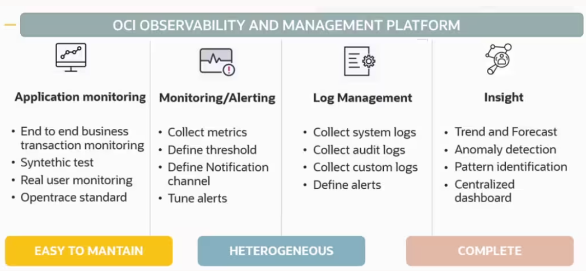
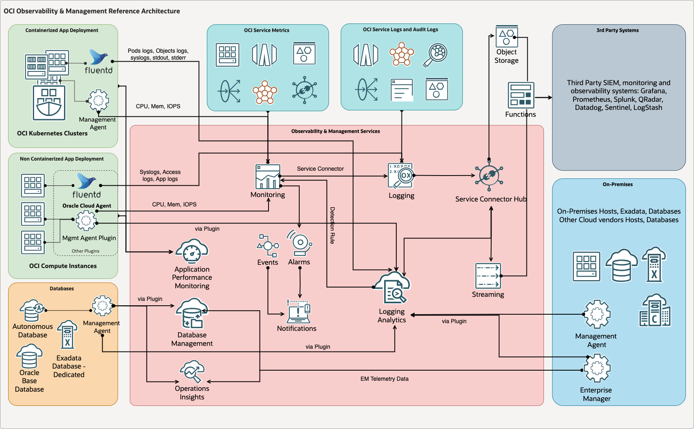
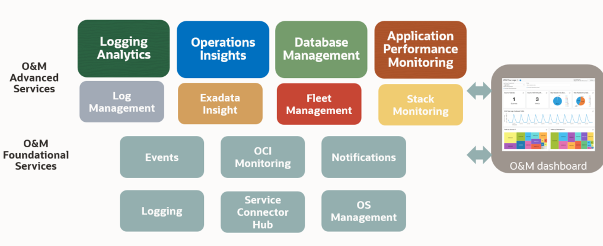

# Document Control

*Guide:*

*The first chapter of the document describes the metadata for the document. Such as versioning and team members.*

## Version Control

| Version | Authors               | Date          | Comments                                                  |
|:--------|:----------------------|:--------------|:----------------------------------------------------------|
| 1.0     | Madhusri Bhattacharya | February 2024 | First version of PeopelSoft Starter Pack in New SD Format |
| 1.1     | Madhusri Bhattacharya | April 2024    | Edited PeopleSoft Starter Pack as per latest SD template  |

## Team

*Guide:*

*A section describing the Oracle team.*

*Example:*

| Name          | Email                 | Role                     | Company |
|:--------------|:----------------------|:-------------------------|:--------|
| ${doc.author} | name.name@example.com | Tech Solution Specialist | Oracle  |
| Ada lovelace  | ada@example.com       | Account Cloud Engineer   | Oracle  |

## Document Purpose

*Guide:*

*Describe the purpose of this document and the Oracle-specific terminology, specifically around 'Workload'.*

*Example:*

This document provides a high-level solution definition for the Oracle solution and aims at describing the current state, and to-be state as well as a potential high-level project scope and timeline for ${doc.config.impl.type}.

The document may refer to a ‘Workload’, which summarizes the full technical solution for a customer (You) during a single engagement. The Workload is described in the chapter [Workload Requirements and Architecture](#workload-requirements-and-architecture).

This is a living document, additional sections will be added as the engagement progresses resulting in a final Document to be handed over to the ${doc.config.impl.type}.

# Business Context

*Guide:*

*Describe the customer's business and background. What is the context of the customer's industry and LoB? What are the business needs and goals which this Workload is an enabler for? How does this technical solution impact and support the customer's business goals? Does this solution support a specific customer strategy, or maybe certain customer values? How does this solution help our customers to either generate more revenue or save costs?*

## Executive Summary

*Guide:*

*A section describing the background of the Customer and the context of the Workload migration*

*Example:*

-   Brief history of the Customer

-   Current Solution and Rationale for moving to Oracle Cloud Infrastructure (OCI)

## Workload Business Value

*Guide:*

*A section describing the business value of the Application on OCI*

*Example:*

Whether you're a large, multi-national corporation or a small local organization, you want your enterprise applications to deliver value. PeopleSoft is an industry leading, proven, functionally deep, full suite of integrated applications. PeopleSoft applications are enabled by a powerful technology foundation in PeopleTools that delivers extensibility and common capabilities like reporting, workflow, search, integration, and security and Oracle is fully committed to supporting and investing in its PeopleSoft solutions indefinitely. PeopleSoft application is designed to address your most complex business requirements and enable your organization to:

-   Effectively execute in the face of complexity.
-   Easily adapt to a changing workforce.
-   Make informed decisions.
-   Lower costs by doing more with less.

PeopleSoft is used by thousands of organizations around the globe across all industries with a strong presence in service-based industries like health care, education and research, public sector, financial services, and professional services. It consists of applications that can address your needs for:

-   Human Capital Management (HCM): HR, payroll, self-service, benefits, time and attendance, talent management etc.
-   Campus Solution (CS): Campus Community, Recruiting and Admissions, Student Records, Academic Advisement, Financial Aid, Student Financials, Contributor Relations and Campus Self Service.
-   Enterprise Resource Management (ERP): Financials, Procurement, Projects etc.

Many Customers want to get to the cloud but are not ready to move to SaaS because of

-   Deep customization.
-   Integration.
-   Control requirements.
-   Familiarity with the current Product.
-   User training and so on.

Oracle Cloud provides comprehensive business and industry solutions, enabling organizations to increase productivity, accelerate business performance, and provide a lower cost of ownership. Running PeopleSoft on Oracle Cloud enables you to:

-   Increase business agility.
-   Better manage growth.
-   Reduce time and cost for new projects.
-   Track and Manage Usage and Cost.
-   Maximise the productivity of your IT staff.

### Value Proposition

While discussing the unique value proposition of OCI, we will focus on **Operating Systems,** **Oracle Database** and **PeopleSoft Cloud Manager (PCM)**. PCM is an orchestration framework to provision and manage Customer's PeopleSoft environments on OCI, and is only available for OCI Customers. Details about PCM are available in section **3.4.6.1**.

**Oracle Linux:** Many customers choose Oracle Linux to support their mission-critical applications. Oracle Linux is also the principal operating system for Oracle’s own Database, Middleware, and Application software engineering projects.

Oracle Cloud Applications, Oracle Cloud Platform, and OCI run on Oracle Linux. Oracle Linux is the development standard across the Oracle Database product portfolio with more than 175,000 Oracle Linux instances deployed on both physical and virtual servers.

Oracle Linux includes the Unbreakable Enterprise Kernel (UEK), which is specifically optimised for the best performance of Oracle software. Oracle engineers extensively test the optimised UEK across Oracle’s database, middleware, and application tiers as well as on Oracle servers and engineered systems.

**Oracle Database:** The Database Service in OCI offers autonomous and co-managed Oracle Database Cloud solutions. Oracle Database has the following offerings:

-   Autonomous databases (ADB) are preconfigured, fully-managed environments that are suitable for either transaction processing or for data warehouse workloads. It has two deployment options: Dedicated Exadata Infrastructure (ADB-D) and Shared Exadata Infrastructure (ADB-S).

-   Co-managed solutions are bare metal, virtual machine, and Exadata DB systems that you can customise with the resources and settings that meet your needs.

**PCM:** With PCM, Oracle has differentiated its offering for OCI customers by offering them a free application that simplifies and automates lifecycle management processes. These features eliminate or significantly reduce the pain points and challenges commonly associated with managing and maintaining a PeopleSoft application environment On-Premises. PCM provides amongst others, the ability to:

-   Provision PeopleSoft environments on OCI.
-   Automate migration of on-premise environment to OCI.
-   Support lifting and shifting of unicode or non-unicode database.
-   Support lifting and shifting of PeopleSoft application environments which have TDE encrypted databases. The on-premise environments must be TDE encrypted before migrating.
-   Support lifting and shifting of Transparent Data Encryption, or TDE, and Real Application Clusters, or RAC, for Database Systems.
-   Orchestrate deployment of PeopleSoft 9.2 and IH 9.1 applications on OCI.
-   Subscription model to auto download application PIs and PRPs.
-   Create repeatable deployment templates.
-   Self service provisioning of PeopleSoft environments.
-   Fully automate deployment which is immune to manual errors and process delays.
-   Manage multiple environments from a single page.
-   Enable application lifecycle management in Oracle Cloud.

Additionally, all the activities mentioned within the scope will ensure the deployment of workload as per Oracle's best practices. As a tried and tested methodology by many customers 'Oracle Lift' brings speed of deployment resulting in successful project without any setbacks; thus it brings value to the overall project provisioning for the Application workload.

# Workload Requirements and Architecture

## Overview

*Guide:*

*A section describing the Current PeopleSoft workload of the Customer. Describe the Workload: What applications and environments are part of this Workload, specify their names and details. The implementation will be scoped later and is typically a subset of the Workload. For example, a Workload could exist of two applications, but the implementer would only include one environment of one application. The workload chapter is about the whole Workload and the implementation scope will be described late in the chapter. [Scope](#scope).*

*Example:*

Currently Customer's PeopleSoft workload is a multi node deployment with PeopleTools release 8.58 and PeopleSoft Application version is 9.2. The Application tier is connected to a 19C Oracle Real Application Cluster (RAC) Database. The PeopleSoft Internet Architecture (PIA) doamin and PeopelSoft Application or middle tier consist of following components:

-   Two nodes hosting the PeopleSoft PIA domain.
-   A single external facing node hosting web functionality to support external students.
-   Two nodes hosting both the PeopleSoft Application Server and the Process Scheduler domains.
-   A shared file system for PeopleSoft application software and report repository.

There are two client connection routes for the PeopelSoft Workload: one is internal via a WAN and another external via the internet. Both routes employ https which is terminated on a load-balancer. The reporting elements of the solution are provided using Oracle Business Intelligence Enterprise Edition.

## Non-Functional Requirements

*Guide:*

*Describe the high-level technical requirements for the Workload. Consider all sub-chapters, but decide and choose which Non-Functional Requirements are necessary for your engagement. You might not need to capture all requirements for all sub-chapters.*

### Regulations and Compliances Requirements

*Guide:*

*This section captures specific regulatory or compliance requirements for the Workload. These may limit the types of technologies that can be used and may drive some architectural decisions.*

*The Oracle Cloud Infrastructure Compliance Documents service lets you view and download compliance documents: https://docs.oracle.com/en-us/iaas/Content/ComplianceDocuments/Concepts/compliancedocsoverview.htm*

*If there are none, then please state it. Leave the second sentence as a default in the document.*

*Example:*

At the time of this document creation, no Regulatory and Compliance requirements have been specified.

In addition to these requirements, the [CIS Oracle Cloud Infrastructure Foundation Benchmark, v1.2](https://www.cisecurity.org/benchmark/Oracle_Cloud) will be applied to the Customer tenancy.

### Environments

*Guide:*

*A section describing the Current PeopleSoft workload of the Customer: Environment details*

*Example:*

Current PeopleSoft workload has four environments:

-   **Production**
    -   PeopleSoft PeopleTools Version: **8.59.U21**
    -   PeopleSoft Campus Solution(CS) Application Version: **9.2.U30**
    -   Oracle Database Version: **19c**
    -   Number of Application Nodes: 2 nodes Application Server (PeopleTools and PeopleSoft Application Binary), 2 Web Servers and 2 Process Scheduler Instances
    -   Application servers require database connectivity software installed locally to maintain the SQL connection with the Oracle Database.
    -   Number of Database Node: 2 Nodes Oracle RAC (Real Application Cluster)
    -   PeopleSoft Client
-   **Pre-Production**
    -   PeopleSoft PeopleTools Version: **8.59.U21**
    -   PeopleSoft (HCM) Application Version: **9.2.U30**
    -   Oracle Database Version: **19c**
    -   Number of Application Nodes: 2 nodes Application Server (PeopleTools and PeopleSoft Application Binary), 2 Web Servers and 2 Process Scheduler Instances.
    -   Application servers require database connectivity software installed locally to maintain the SQL connection with the Oracle Database.
    -   Number of Database Node: 2 Nodes Oracle RAC (Real Application Cluster).
    -   PeopleSoft Client
-   **Development**
    -   PeopleSoft PeopleTools Version: **8.59.U21**
    -   PeopleSoft (HCM) Application Version: **9.2.U30**
    -   Oracle Database Version: **19c**
    -   Number of Application Nodes: Single node Application Server (PeopleTools and PeopleSoft Application Binary), Single Web Server and Single Process Scheduler Instance.
    -   Application servers require database connectivity software installed locally to maintain the SQL connection with the Oracle Database.
    -   Number of Database Node: Single node Oracle Restart
    -   PeopleSoft Client
-   **Disaster Recovery (DR)**
    -   This is a copy of Production environment which is kept in sync with Production environment using following synchronization methods:
        -   PeopleSoft application tier are kept in sync with Production using **rsync** job scheduled via crontab
        -   The PeopelSoft application database repository is synchronized using Oracle **Data Guard Solution**

**Please note**

-   For PeopleTools 8.58 and above, Visual COBOL is the only supported version.
-   PeopleTools 8.58 is the minimum for managed environments with COBOL, Elasticsearch, and Kibana.
-   Beginning with PeopleTools 8.59.U21 and 8.60.U07, OpenSearch and Elasticsearch are the supported search engines.
-   OpenSearch Dashboards and Kibana are supported for analytics and insights.
-   For provisioned environments on PeopleTools 8.61, only OpenSearch and OpenSearch Dashboards are supported.
-   Windows middle tier for PeopleSoft must be on PeopleTools 8.58 or above.
-   Minimum shape of Cloud Manager for OCI is VM.Standard 2.1 or VM.Standard.E2.1.

#### Environment Sizing

*Guide:*

*A section describing the Current PeopleSoft workload of the Customer: Sizing Details, Current On-Premise BoM*

*Example:*

Implementation Partner will capture the current PeopleSoft workload sizing here.

### High Availability and Disaster Recovery Requirements

*Guide:*

*This section captures the resilience and recovery requirements for the Workload. Note that these may be different from the current system.*

*The Recovery Point Objective (RPO) and Recovery Time Objective (RTO) requirement of each environment should be captured in the environments section above, and wherever possible.*

-   *What are the RTO and RPO requirements of the Application?*
-   *What are the SLAs of the application?*
-   *What are the backup requirements*

*Example:*

The recovery time objective (downtime tolerance) and recovery point objective (data loss tolerance) details are very important considerations for the Customer. The overall DR requirement is a cross region DR strategy with the goal of minimizing RTO.

#### Backup and Recovery Practices

*Guide:*

*A section describing the Current PeopleSoft workload of the Customer: Backup and Recovery- RTO and RPO*

*Example:*

Current high level backup and recovery practices are described below:

-   File system and Database backups are retained for 30 days for production and at least 7 days for non-production.
-   Oracle Recovery Manager (RMAN) is the standard backup tool which handles all PeopleSoft workload Databases.
-   Backup of the Oracle Databases uses the standard file system agent which backs up the Oracle RMAN disk based backup to tape.
-   Backup frequency standards are:
    -   Weekly full,
    -   Daily incremental backup, which includes the archive log backups.

### Security Requirements

*Guide:*

*Capture the Non-Functional Requirements for security-related topics. Security is a mandatory subsection that is to be reviewed by the x-workload security team. The requirements can be separated into:*

-   *Identity and Access Management*
-   *Data Security*

*Other security topics, such as network security, application security, or others can be added if needed.*

*Example:* Security is especially critical for any core business applications like PeopelSoft. The PeopleSoft's security definition refers to a collection of related security attributes that you create using PeopleTools. The three main PeopleSoft security definition types are:

-   User profiles: Each user has an individual user profile, which in turn is linked to one or more roles.
-   Roles: Roles are intermediate objects that link user profiles to permission lists. You add one or more permission lists, which ultimately control what a user can and cannot access, to each role.
-   Permission lists: Permission lists are groups of authorizations that you assign to roles. Permission lists store sign-in times, page access, PeopleTools access, and so on.

In general, the foundation of security is access control, which refers to how the system is being accessed and by whom. User security consists of three principal components: authentication, authorization and an audit trail. All current browser-based password login screens send the password as a parameter in the HTTP form submission. Using an HTTPS connection will encrypt this information. The best practice is therefore to use HTTPS for all web-based access. The requirement is to take extra steps to ensure security is not compromised either from the Infrastructure side or from the Application endpoints.

At the time of this document creation, no Security requirements have been specified.

### Workload Access Requirement

*Guide:*

*A section describing the Current PeopleSoft workload of the Customer: How Customer access their Application*

*Example:*

The Customer wants to access the PeopleSoft workload, once they move to OCI, in the same way as they currently do On-Premises. They also need to secure their external internet-facing endpoints from internet threats.

The Customer has both internal and external endpoints of their PeopleSoft workload.

**Internal Users:**

Users access PeopleSoft using the URL https://`<Internal LB URL:port>`. The connection flows via the external/internal firewall to the private Load Balancer. Load Balancer terminates the Secure Socket Layer (SSL) connection and incoming traffic is distributed by the load balancer over port 8000/8443 (http/https). It forwards the requests to the Oracle Tuxedo Jolt port 9000 on the application server. The application server is also responsible for maintaining the SQL connection to the database over port 1521.

**Please note:** The default ports for PeopelSoft Internet Architecture (PIA) set by the DPK setup script are 8000 for HTTP and 8443 for HTTPS.

**External Users:**

External users access PeopleSoft using the URL https://`<External LB URL:port>`. The connection flows via the external/internal firewall to the public Load Balancer in DMZ. Load Balancer terminates the SSL connection and incoming traffic is distributed by the load balancer over port 8000/8443 (http/https). It forwards the requests to the Oracle Tuxedo Jolt port 9000 on the application server. The application server is also responsible for maintaining the SQL connection to the database over port 1521.

*Reference:*

\[SSL in OCI\] (https://www.ateam-oracle.com/post/load-balancing-ssl-traffic-in-oci)

### Workload Monitoring

*Guide:*

*A section describing the Current PeopleSoft workload of the Customer: Monitoring of the Workload (like OEM or any other monitoring tools)*

*Example:*

Currently Oracle Enterprise Manager (OEM) is used as Customer's On-Premises management platform. The PeopleSoft Enterprise Manager Plug-in uses OEM to provide an integrated, graphical user interface for monitoring and managing components of a PeopleSoft environment. The entities that Enterprise Manager monitors and manages are called managed targets, such as databases, application servers, Process Scheduler servers, web servers, and so on.

The OEM product includes the Management Agent, Oracle Management Service, Management Repository Database, and the Cloud Control Console, which is a browser-based central console through which administrators can perform monitoring, administration, and configuration tasks for the enterprise.

### Management and Monitoring (OCI)

*Guide:*

*This subsection helps you capture any requirements for customer management and monitoring needs - e.g. system monitoring, systems management, log analysis, etc.*

*When you move or start an OCI project, you have a choice to use the tools you are familiar with (should they support modern application architectures), replace them with OCI native Observability services, or use a combination to improve your visibility. When contemplating how to proceed, here are some general questions that will guide you:*

-   *Does the tool manage across hybrid and multi-cloud environments?*
-   *What is the cost of integrating the existing tool with OCI?*
-   *Is my current monitor tool enabling you to prevent issues versus reacting to them?*
-   *Does the tool tell you how much impact there has been on users or just that there was an impact like something is down or unavailable? *
-   *Does the tool provide the full vision of applications and their infrastructure or just a piece of them or specific technology?*

*Example:*

| Task                   | Target         | Location        | New | Notes |
|:-----------------------|:---------------|:----------------|:----|:------|
| Application Monitoring | All targets    | On-Prem and OCI | No  |       |
| Monitoring             | All targets    | OCI (Migration) | No  |       |
| Log Management         | All targets    | OCI (Migration) | No  |       |
| Insight                | All Oracle DBs | OCI (Migration) | No  |       |

### Networking Requirements

*Guide*

*Capture the Non-Functional Requirements for networking-related topics. You can use the networking questions in the [Annex](#networking-requirement-considerations)*

*Example:*

At the time of this document creation, no Networking requirements have been specified.

## Future State Architecture

*Guide:*

*The Workload Future State Architecture can be described in various forms. In the easiest case, we describe a Logical Architecture, possibly with a System Context Diagram. A high-level physical architecture is mandatory as a description of your solution.*

*Additional architectures, in the subsections, can be used to describe needs for specific workloads.*

### Mandatory Security Best Practices

*Guide:*

*Use this text for every engagement. Do not change. Align with the Cloud Adoption Framework.*

The safety of the ${doc.customer.name}'s Oracle Cloud Infrastructure (OCI) environment and data is the ${doc.customer.name}’s priority.

The following table of OCI Security Best Practices lists the recommended topics to provide a secure foundation for every OCI implementation. It applies to new and existing tenancies and should be implemented before the Workload defined in this document will be implemented.

Workload-related security requirements and settings like tenancy structure, groups, and permissions are defined in the respective chapters.

Any deviations from these recommendations needed for the scope of this document will be documented in the chapters below. They must be approved by ${doc.customer.name}.

${doc.customer.name} is responsible for implementing, managing, and maintaining all listed topics.

<table style="width:25%;">
<colgroup>
<col style="width: 2%" />
<col style="width: 2%" />
<col style="width: 19%" />
</colgroup>
<thead>
<tr class="header">
<th>CATEGORY</th>
<th>TOPIC</th>
<th>DETAILS</th>
</tr>
</thead>
<tbody>
<tr class="odd">
<td>User Management</td>
<td>IAM Default Domain</td>
<td><p>Multi-factor Authentication (MFA) should be enabled and enforced for every non-federated OCI user account.</p>
<ul>
<li>For configuration details see <a href="https://docs.oracle.com/en-us/iaas/Content/Identity/mfa/understand-multi-factor-authentication.htm">Managing Multi-Factor Authentication</a>.</li>
</ul>
<p>In addition to enforcing MFA for local users, Adaptive Security will be enabled to track the Risk Score of each user of the Default Domain.</p>
<ul>
<li>For configuration details see <a href="https://docs.oracle.com/en-us/iaas/Content/Identity/adaptivesecurity/overview.htm">Managing Adaptive Security and Risk Providers</a>.</li>
</ul></td>
</tr>
<tr class="even">
<td></td>
<td>OCI Emergency Users</td>
<td><p>A maximum of <strong>three</strong> non-federated OCI user accounts should be present with the following requirements:</p>
<ul>
<li>Username does not match any username in the Customer’s Enterprise Identity Management System</li>
<li>Are real humans.</li>
<li>Have a recovery email address that differs from the primary email address.</li>
<li>User capabilities have Local Password enabled only.</li>
<li>Has MFA enabled and enforced (see IAM Default Domain).</li>
</ul></td>
</tr>
<tr class="odd">
<td></td>
<td>OCI Administrators</td>
<td><p>Daily business OCI Administrators are managed by the Customer’s Enterprise Identity Management System. This system is federated with the IAM Default Domain following these configuration steps:</p>
<ul>
<li>Federation Setup</li>
<li>User Provisioning</li>
<li>For configuration guidance for major Identity Providers see the OCI IAM Identity Domain tutorials.</li>
</ul></td>
</tr>
<tr class="even">
<td></td>
<td>Application Users</td>
<td>Application users like OS users, Database users, or PaaS users are not managed in the IAM Default Domain but either directly or in dedicated identity domains. These identity domains and users are covered in the Workload design. For additional information see <a href="https://docs.oracle.com/en-us/iaas/Content/cloud-adoption-framework/iam-security-structure.htm">Design Guidance for IAM Security Structure</a>.</td>
</tr>
<tr class="odd">
<td>Cloud Posture Management</td>
<td>OCI Cloud Guard</td>
<td><p>OCI Cloud Guard will be enabled at the root compartment of the tenancy home region. This way it covers all future extensions, like new regions or new compartments, of your tenancy automatically. It will use the Oracle Managed Detector and Responder recipes at the beginning and can be customized by the Customer to fulfill the Customer’s security requirements.</p>
<ul>
<li>For configuration details see <a href="https://docs.oracle.com/en-us/iaas/cloud-guard/using/part-start.htm">Getting Started with Cloud Guard</a>. Customization of the Cloud Guard Detector and Responder recipes to fit the Customer’s requirements is highly recommended. This step requires thorough planning and decisions to make.</li>
<li>For configuration details see <a href="https://docs.oracle.com/en-us/iaas/cloud-guard/using/part-customize.htm">Customizing Cloud Guard Configuration</a></li>
</ul></td>
</tr>
<tr class="even">
<td></td>
<td>OCI Vulnerability Scanning Service</td>
<td><p>In addition to OCI Cloud Guard, the OCI Vulnerability Scanning Service will be enabled at the root compartment in the home region. This service provides vulnerability scanning of all Compute instances once they are created.</p>
<ul>
<li>For configuration details see <a href="https://docs.oracle.com/en-us/iaas/scanning/home.htm">Vulnerability Scanning</a>.</li>
</ul></td>
</tr>
<tr class="odd">
<td>Monitoring</td>
<td>SIEM Integration</td>
<td>Continuous monitoring of OCI resources is key for maintaining the required security level (see <a href="#regulations-and-compliances-requirements">Regulations and Compliance</a> for specific requirements). See <a href="https://docs.oracle.com/en-us/iaas/Content/cloud-adoption-framework/siem-integration.htm">Design Guidance for SIEM Integration</a> to implement integration with the existing SIEM system.</td>
</tr>
<tr class="even">
<td>Additional Services</td>
<td>Budget Control</td>
<td><p>OCI Budget Control provides an easy-to-use and quick notification on changes in the tenancy’s budget consumption. It will be configured to quickly identify unexpected usage of the tenancy.</p>
<ul>
<li>For configuration details see <a href="https://docs.oracle.com/en-us/iaas/Content/Billing/Tasks/managingbudgets.htm">Managing Budgets</a></li>
</ul></td>
</tr>
</tbody>
</table>

### Naming Conventions

*Guide:*

*This chapter describes naming convention best practices and usually does not require any changes. If changes are required please refer to [Landing Zone GitHub](https://github.com/oracle-devrel/technology-engineering/tree/main/landing-zones). The naming convention zone needs to be described in the Solution Design by the service provider.*

*Use this template ONLY for new cloud deployments and remove it for brownfield deployments.*

A naming convention is an important part of any deployment to ensure consistency, governance, and security within your tenancy. Find [here](https://github.com/oracle-devrel/technology-engineering/blob/main/landing-zones/commons/resource_naming_conventions.md) Oracle's recommended best practices.

### OCI Landing Zone Solution Definition

*Guide:*

*This chapter describes landing zone best practices and usually does not require any changes. If changes are required please refer to [Landing Zone GitHub](https://github.com/oracle-devrel/technology-engineering/tree/main/landing-zones). The full landing zone needs to be described in the Solution Design by the service provider.*

*Use this template ONLY for new cloud deployments and remove it for brownfield deployments.*

An OCI Landing Zone sets the foundations for a secure tenancy, providing design best practices and operational control over OCI resources. A Landing Zone also simplifies the onboarding of workloads and teams, with clear patterns for network isolation and segregation of duties in the organization, which sets the cloud operating model for day-to-day operations.

Oracle highly recommends the use of an OCI Landing Zone for any deployment. Use these [guidelines](https://github.com/oracle-devrel/technology-engineering/blob/main/landing-zones/commons/lz_solution_definition.md) to set up your OCI Landing Zone, including design considerations, approaches, and solutions to use.

Note that all workloads in a tenancy should sit on top of a Landing Zone, meaning that the workload architecture defined in the next section can be subject to adjustments (e.g., network structure) towards the landing zone model, along with other future workloads.

### Physical Architecture

*Guide:*

*A section describing the Deployment Design and its associated Components in OCI*

*Example:*

The design plan of the Customer's Tenancy includes 2 Virtual Cloud Networks (VCNs): one is kept as 'Management VCN', and another is for 'Application/Workload' VCN. Both the VCNs are attached to the Management VCN's Dynamic Routing Gateways (DRG). Traffic will be terminated at the same DRG.

In the **following sections** we are describing the **Solution Design Diagrams for Deployment.**

*Reference:*

*[The Oracle Cloud Notation, OCI Architecture Diagram Toolkits](https://docs.oracle.com/en-us/iaas/Content/General/Reference/graphicsfordiagrams.htm)*

```{=tex}
\pagebreak
```


```{=tex}
\pagebreak
```


```{=tex}
\pagebreak
```


```{=tex}
\pagebreak
```


```{=tex}
\pagebreak
```
## Solutions Considerations

*Guide:*

*A section describing the Future PeopleSoft workload of the Customer in OCI Describe certain aspects of your solution in detail. What are the security, resilience, networking, and operations decisions you have taken that are important for your customer?*

*Example:*

The PeopleSoft components installed by the deployment packages (DPK). It enables you to install the PeopleSoft PeopleTools Server and Client Software, Application Server, Process Scheduler, and PeopleSoft Pure Internet Architecture (PIA) domains, as well as required supporting software.

Proposed deployment plan is to move PeopleSoft PeopleTools **(8.59.21)** and PeopleSoft Application **(9.2.U37)** in the compute VM shapes on the latest OS and kernel version (which is supported). On-Premises RAC Database (**19c**) will be migrated to a VM-DB RAC system based on a multitenant architecture.

We can leverage OCI Web Application Firewall (WAF) which helps to make the application endpoints more secure by monitoring and filtering out potentially malicious traffic. It is also cloud-based, Payment Card Industry (PCI) compliant.

### High Availability and Disaster Recovery

*Guide:*

*Please describe the Oracle MAA in the context of PeopleSoft.*

*Example:*

Oracle Maximum Availability Architecture (MAA) is Oracle's best practice blueprint based on proven Oracle high availability technologies and recommendations. The goal of MAA is to achieve the optimal high-availability architecture at the lowest cost and complexity. Papers are published on the Oracle Technology Network [OTN](http://www.oracle.com/goto/maa).

To achieve maximum availability for PeopleSoft workload, Oracle recommends deploying PeopleSoft on an Oracle Database MAA foundation that includes the following technologies: - Oracle Real Application Clusters and Oracle Clusterware - Oracle Active Data Guard - Oracle Flashback Database - Oracle Automatic Storage Management with high redundancy disk group - Oracle Recovery Manager and Oracle Secure Backup

Please refer to the following high level MAA diagrams for PepleSoft workload.


```{=tex}
\pagebreak
```


*Reference:*

[HA Reference for PeopleSoft](https://www.oracle.com/a/tech/docs/psft-maa-exacs-tech-brief.pdf)

```{=tex}
\pagebreak
```
#### Backup and Recovery

*Guide:*

*A section describing the 'Backup and Recovery' practices of the Customer in OCI*

*Example:*

We will follow the current Backup and Recovery strategy and practices of the Customer. Customer has the following Recovery Time Objective (RTO) and Recovery Point Objective (RPO) requirements which will be achieved with the proposed architecture:

-   Official RTO practices: less than 24 hrs
-   Official RPO practices: 4 hours

### Security

*Guide:*

*A section describing the Security in OCI in the context of the PeopleSoft Application*

*Example:*

The objective of the security architecture is to enable you to maintain your security posture when running PeopleSoft workload in the Oracle Cloud.

Oracle has designed security into every aspect of our infrastructure to help our customers achieve better protection, isolation and control. We started by taking a unique design approach, separating the network and server environments. This way, if an attack occurs on a VM, we can contain that threat and prevent it from moving to other servers, resulting in better protection and lower risk for customers.

We also hyper-segment our physical network and backend infrastructure for secure isolation between customer instances and backend hosts. Additionally, we’ve implemented hardware-based root of trust, making sure each server is pristine each and every time it is provisioned.

The below diagram shows the security posture of PeopleSoft in OCI.


For each customer’s VCN, there is a range of 'defense-in-depth' protections available spanning across **layers 3-7 (from OSI Network to Application layer)**. It is a practical strategy for achieving information security (often called information assurance) in today’s highly networked environments. The defense-in-depth approach builds mutually supporting layers of defense to reduce vulnerabilities and to assist an organization in its efforts to protect against, detect, and react to as many attacks as possible.

**VCN (1):** A VCN provides isolation for your workload from any other workload on OCI, including your other workloads in a different VCN.

**Internal Firewalls (2):** Implement virtual firewalls at the subnet level using VCN security lists.

**Load Balancing Traffic Securely (3):** TLS 1.2 is supported by default to securely balance traffic within the implementation and from external connections.

Secure Traffic Between ADs and Regions: Communications between ADs are encrypted with Media Access Control security (MACsec) to prevent layer 2 security threats such as wiretapping, DDoS, intrusion, man-in-the-middle and playback attacks. VCN traffic that travel between regions are either sent over private links or are encrypted.

**Secure Connectivity to Public Internet (4):** For security, a VCN has no internet connectivity by default. Therefore, internet bound traffic to / from a VCN must pass through an Internet Gateway (IGW). Virtual routing tables can be implemented with private IP addresses for use with NAT and 3rd party firewall devices (Like Palo Alto or Fortinet) for additional security. We can also leverage Network Firewall, which is a next-generation managed network firewall and intrusion detection and prevention service for OCI VCNs, powered by Palo Alto Networks. The Network Firewall service gives you visibility into traffic entering cloud environments (North-south network traffic) as well traffic between subnets (East-west network traffic).

**Secure Connectivity Between Your VCN and Data Center (5):** Traffic can be routed through a DRG for private traffic. It is used with an IPSec VPN or FastConnect connection to establish private connectivity between a VCN and an On-Premises or other cloud network.

**Protect Internet-Facing Applications (6):** OCI WAF is a regional-based and edge enforcement service that is attached to an enforcement point, such as a load balancer or a web application domain name. WAF protects applications from malicious and unwanted internet traffic. WAF can protect any internet facing endpoint, providing consistent rule enforcement across a customer's applications. It also inspects any request going from the web application server to the end user. Additionally, Oracle’s optional global 'anycast' DNS service also takes advantage of DNS-based DDoS protections providing resiliency at the DNS layers. WAF provides you with the ability to create and manage rules for internet threats including Cross-Site Scripting (XSS), SQL Injection, and other OWASP-defined vulnerabilities. Access rules can limit, based on geography or the signature, of the request.

Please note:**WAF policy** is a **regional solution** that works as a plug-in for your load balancer.

**Edge policy** is a **global solution**. Customer can leverage either WAF policy or Edge policy as per their requirements. To use WAF solution for Edge enforcement, allowlist (formerly known as whitelist) Oracle nodes throughout the world and use DNS to point your application to the CNAME that we provide.


\_\_Note:\_\_Please see generic OCI security guidelines in the [Annex](#security-guidelines).

### Workload Access

*Guide:*

*A section describing how Customer will access their Application in OCI*

*Example:*

Customer will access the PeopleSoft workload internally over the OCI FastConnect connectivity solution and PeopleSoft external endpoints will be secured by OCI WAF. FastConnect is a private, dedicated connectivity that improves security. It supports bandwidths from 1Gbps to 10Gbps. An alternative option to FastConnect is Virtual Private Network (VPN). VPN could also be a backup configuration if FastConnect is down.

### Workload Monitoring

*Guide:*

*A section describing how Customer will monitor their Application in OCI*

*Example:*

Customer will use 'Enterprise Manager Plug-in' for PeopelSoft to monitor their PeopleSoft workload. Customer can also leverage OCI Stack Monitoring for PeopleSoft or they can use both and enjoy benefits form both the services. For detail please check the below blog articles specified in the reference section.

*Reference:*

[Use OEM data with OCI to unlock new insights](https://blogs.oracle.com/observability/post/em-data-to-oci-part-1) [OCI Stack Monitoring for PeopleSoft](https://blogs.oracle.com/observability/post/stack-monitoring-now-supports-windows-server-solaris-and-peoplesoft-process-monitor-and-elasticsearch)

### Manageability and Observability (OCI)

*Example:*

Observability is a technology advancement focused on getting insights from a vast array of data, logs, and events generated within an IT environment. By implementing an Observability strategy, organizations gain the capability to anticipate system disruptions, prevent resource overconsumption, and enhance the overall application user satisfaction. That means being proactive, which is a must, especially in a distributed environment.

Gone are the days when the IT landscape remained a mysterious black box. The company's digitalization and the Cloud model compel C-level executives to gain comprehensive insights into asset utilization. The efficient allocation of resources directly influences budgetary considerations.

Observability helps organizations examine how well their infrastructure is working, predict future needs, and help take proactive steps to improve efficiency and protect investments. Therefore, Observability tools are needed to cover these important areas.

{width="50%"}

#### Observability Architecture

The basic monitoring OCI services collect the data and send logs and metrics to OCI Monitoring and Logging services. If you want to apply machine-learning capabilities and perform analysis, you can send the data to the Logging Analytics service. If you want to use OCI Logging Analytics to collect logs coming from both on-premises and cloud sources to analyze them for auditing, security purposes, or to integrate data with an external SIEM solution, the Connector Hub serves as the solution.

It's advisable to plan your monitoring strategy by considering both the O&M (Observability and Management) native service of OCI and its integration with third-party tools, as O&M is flexible and a highly customizable solution.



#### Real-Time Monitoring

Real-time monitoring is the delivery of continuously updated data about systems, processes, or events. Such monitoring provides information streaming at zero or low latency, so there is minimal delay between data collection and analysis. It enables quick detection of anomalies, performance issues, and critical events.

Please find all references for this chapter in the [Annex](#real-time-monitoring-annex).

#### Performance and Tuning

Performance tuning is the improvement of system performance. It can be done proactively to prevent issues or reactively in response to increased workload, which is crucial for avoiding system outages.

Please find all references for this chapter in the [Annex](#performance-and-tuning-annex).

#### Administration

Administrator tasks involve upholding a data management policy and ensuring essential equipment functionality, such as instance management, backup & restore operations, key management, and allocating resources from the database to the storage.

Please find all references for this chapter in the [Annex](#administration-annex).

#### Troubleshooting

Issues can happen on several levels. To identify the root cause, it is important to be able to correlate resources, drill down into the issues, and analyze trends in the systems. It's crucial to consider that the application itself might be the root cause of the issue. Therefore, it's essential to gather information about the application's behavior and performance to fully understand the problem and resolve it effectively. Troubleshooting also allows you to avoid an outage which is why it is important to notice issues as early as possible.

Please find all references for this chapter in the [Annex](#troubleshooting-annex).

#### Cost Control and Chargeback

Cost control is the practice of identifying and reducing business expenses to increase profits. It starts with the budgeting process. Cost control is an important factor in maintaining and growing profitability.

IT chargeback can provide greater visibility into the costs of IT services and infrastructure usage. It enables organizations to identify opportunities for cost optimization and reduce wasteful spending.

Cost control and chargeback are critical concerns, especially for companies transitioning to the cloud, presenting new financial operational challenges (FinOps). In this context, reducing consumption directly impacts the company's business.

Please find all references for this chapter in the [Annex](#cost-control-and-chargeback-annex).

### Regulations and Compliances

*Guide:*

*A section describing any Customer-specific 'Regulation and Compliance if any' in OCI*

*Example:*

None has been discussed at the time of Migration.

### Cloud Manger - PeopleSoft Automation Tool

*Guide:*

*A section describing the Cloud Manager Tooling for PeopleSoft Workload*

*Example:*

#### What is PCM

-   Oracle PCM is a key component of the Oracle PeopleSoft **automation** for OCI.

-   PCM is an **orchestration framework to provision and manage PeopleSoft environments** on OCI. The PCM can help create task-specific environments that can last as long as the task is needed. PCM will enable you to focus more on business and less on infrastructure management by taking away all the complexities involved in acquiring and managing the infrastructure to run PeopleSoft on OCI.

-   PCM is an application available on the Oracle Cloud Marketplace. Any existing PeopleSoft customer can use it by taking advantage of the Oracle Cloud Service resources.

-   This is Oracle’s recommended way to deploy PeopleSoft on OCI.

#### Requirements for PCM

-   See the PeopleTools support information on PCM Home Page **(My Oracle Support, Doc ID 2231255.2)**.

-   See the requirements for OCI accounts, subscriptions, tenancy, and compartments in the Cloud Manager Installation tutorials at [Online Help for PeopleSoft Cloud Manager](https://docs.oracle.com/en/applications/peoplesoft/cloud-manager/index.html#InstallationTutorials).

-   You can also refer to the below PeopelSoft migration workflow diagram for your reference for migration to OCI in general.


#### High level Deployment steps using PCM

Using CM, one can provision a new environment or can perform a 'lift-and-shift' as depicted in the diagram below:

{width="60%" height="60%"}

How PeopleSoft CM can help to migrate PeopleSoft workload to OCI is depicted in the diagram below:

{width="60%" height="60%"}

-   If the Customer PeopleSoft estate is not compatible with CM, then we have to go for other migration options like manual Implementation.

-   Another scenario could be to move Customer Workload and/or other Solution components 'as-is' to OCI using Rackware or similar tool.

### Networking

*Guide:*

*A section describing OCI networking capabilities and features*

*Example:*

OCI networking and connectivity products and services enable customers to manage and scale their networks. Please refer to the following article for a better understanding of OCI networking capabilities and how they can be leveraged for Customer advantage.

*Reference:*

-   [Oracle’s Networking capabilities](https://www.oracle.com/cloud/networking/)
-   [OCI Networking Best Practices](https://www.ateam-oracle.com/post/oci-networking-best-practices-recommendations-and-tips---part-one---general-oci-networking)
-   [Best practices for hybrid and multicloud OCI networking design](https://docs.oracle.com/en/solutions/oci-best-practices-networking/index.html#GUID-368122DF-8B74-4F38-A55F-23E47E04AEB2)

## Sizing and Bill of Materials

*Guide:*

*A section describing the Future PeopleSoft workload sizing in OCI*

*Example:*

A sample sizing of the PeopleSoft workload is reflected in the diagram below for reference purposes:


# Annex

## Security Guidelines

### Oracle Security, Identity, and Compliance

Oracle Cloud Infrastructure (OCI) is designed to protect customer workloads with a security-first approach across compute, network, and storage – down to the hardware. It’s complemented by essential security services to provide the required levels of security for your most business-critical workloads.

-   [Security Strategy](https://docs.oracle.com/en-us/iaas/Content/cloud-adoption-framework/security-strategy.htm) – To create a successful security strategy and architecture for your deployments on OCI, it's helpful to understand Oracle's security principles and the OCI security services landscape.
-   The [security pillar capabilities](https://docs.oracle.com/en-us/iaas/Content/cloud-adoption-framework/security.htm#capabilities) reflect fundamental security principles for architecture, deployment, and maintenance. The best practices in the security pillar, help your organization to define a secure cloud architecture, identify and implement the right security controls, and monitor and prevent issues such as configuration drift.

### References

-   The Best Practices Framework for OCI provides architectural guidance about how to build OCI services in a secure fashion, based on recommendations in the [Best practices framework for Oracle Cloud Infrastructure](https://docs.oracle.com/en/solutions/oci-best-practices).
-   Learn more about [Oracle Cloud Security Practices](https://www.oracle.com/corporate/security-practices/cloud/).
-   For detailed information about security responsibilities in Oracle Cloud Infrastructure, see the [Oracle Cloud Infrastructure Security Guide](https://docs.oracle.com/iaas/Content/Security/Concepts/security_guide.htm).

### Compliance and Regulations

Cloud computing is fundamentally different from traditional on-premises computing. In the traditional model, organizations are typically in full control of their technology infrastructure located on-premises (e.g., physical control of the hardware, and full control over the technology stack in production). In the cloud, organizations leverage resources and practices that are under the control of the cloud service provider, while still retaining some control and responsibility over other components of their IT solution. As a result, managing security and privacy in the cloud is often a shared responsibility between the cloud customer and the cloud service provider. The distribution of responsibilities between the cloud service provider and the customer also varies based on the nature of the cloud service (IaaS, PaaS, SaaS).

### Additional Resources

-   [Oracle Cloud Compliance](https://www.oracle.com/corporate/cloud-compliance/) – Oracle is committed to helping customers operate globally in a fast-changing business environment and address the challenges of an evermore complex regulatory environment. This site is a primary reference for customers on the Shared Management Model with Attestations and Advisories.
-   [Oracle Security Practices](https://www.oracle.com/corporate/security-practices/) – Oracle’s security practices are multidimensional, encompassing how the company develops and manages enterprise systems, and cloud and on-premises products and services.
-   [Oracle Cloud Security Practices](https://www.oracle.com/corporate/security-practices/cloud/) documents.
-   [Contract Documents](https://www.oracle.com/contracts/cloud-services/#online) for Oracle Cloud Services.
-   [OCI Shared Security Model](https://docs.oracle.com/en-us/iaas/Content/cloud-adoption-framework/security.htm#shared-security-model)
-   [OCI Cloud Adoption Framework Security Strategy](https://docs.oracle.com/en-us/iaas/Content/cloud-adoption-framework/security-strategy.htm)
-   [OCI Security Guide](https://docs.oracle.com/en-us/iaas/Content/Security/Concepts/security_guide.htm)
-   [OCI Cloud Adoption Framework Security chapter](https://docs.oracle.com/en-us/iaas/Content/cloud-adoption-framework/security.htm)

## Networking Requirement Considerations

The below questions help to identify networking requirements.

### Application Connectivity

-   Does your application need to be exposed to the internet?
-   Does your solution on DC (on-prem) need to be connected 24x7 to OCI in a Hybrid model?
    -   Site-to-Site IPSEC (Y/N)
    -   Dedicated Lines (FC) (Y/N)
-   Are there any specific network security requirements for your application? (No internet, encryption, etc, etc)
-   Will your application require connectivity to other cloud providers?
    -   Site-to-Site IPSEC (Y/N)
    -   Dedicated Lines (FC) (Y/N)
-   Will your application require inter-region connectivity?
-   Are you planning to reuse IP addresses from your on-premises environment in OCI?
-   If yes, what steps have you taken to ensure IP address compatibility and avoid conflicts?
-   How will you handle network address translation (NAT) for IP reuse in OCI?
-   Will you bring your own public IPs to OCI?

### DR and Business Continuity

-   Does your organization need a Business Continuity/DR Plan to address potential disruptions?
    -   Network Requirements (min latency, bandwidth, etc)
    -   RPO/RTO values
-   What are your requirements regarding Data Replication and Geo-Redundancy (different regions, restrictions, etc.)?
-   Are you planning to distribute incoming traffic across multiple instances or regions to achieve business continuity?
-   What strategies do you require to guarantee minimal downtime and data loss, and to swiftly recover from any unforeseen incidents?

### High Availability and Scalability

-   Does your application require load balancing for high availability and scalability? (y/n)
    -   Does your application span around the globe or is regionally located?
    -   How do you intend to ensure seamless user experiences and consistent connections in your application (session persistence, affinity, etc.)?
    -   What are the network Security requirements for traffic management (SSL offloading, X509 certificates management, etc.)?
    -   Does your application use name resolutions and traffic steering across multiple regions (Public DNS steering)?

### Security and Access Control

-   Some of the below questions help you to adopt the right sizing and deployment model of the network firewall.
    -   Does the customer need to protect traffic from VCN to VCN?
    -   Does the customer need to protect traffic from subnet to subnet in the same VCN?
    -   When deploying an OCI Network Firewall in a dedicated HUB or secure VCN, do you want to protect inter-VCN traffic and/or inter-subnet traffic from within the same VCN?
    -   Does the customer need to protect incoming or egressing traffic to the internet?
    -   Does the customer need to protect internal traffic (including on-premises via IPSEC/FC)?
    -   Is the network performance critical?
    -   Does the customer have any requirement on network isolation (i.e., internet traffic never traverses or is mixed with internal traffic)?
-   Have you considered the importance of protecting your web applications from potential cyber threats using a Web Application Firewall (WAF)?

### Monitoring and Troubleshooting

-   How do you plan to monitor your application's network performance in OCI?
-   How can you proactively address and resolve any potential network connectivity challenges your company might face?
-   How do you plan to troubleshoot your network connectivity?

## Networking Solutions

### OCI Network Firewall

Oracle Cloud Infrastructure Network Firewall is a next-generation managed network firewall and intrusion detection and prevention service for your Oracle Cloud Infrastructure VCN, powered by Palo Alto Networks®.

-   [Overview](https://docs.oracle.com/en-us/iaas/Content/network-firewall/overview.htm)
-   [OCI Network Firewall](https://docs.oracle.com/en/solutions/oci-network-firewall/index.html#GUID-875E911C-8D7D-4205-952B-5E8FAAD6C6D3)

### OCI Load Balancer

The Load Balancer service provides automated traffic distribution from one entry point to multiple servers reachable from your virtual cloud network (VCN). The service offers a load balancer with your choice of a public or private IP address and provisioned bandwidth.

-   [Load Balancing](https://www.oracle.com/es/cloud/networking/load-balancing/)
-   [Overview](https://docs.oracle.com/en-us/iaas/Content/NetworkLoadBalancer/overview.htm)
-   [Concept Overview](https://docs.oracle.com/en-us/iaas/Content/Balance/Concepts/balanceoverview.htm)

### OCI DNS Traffic Management

Traffic Management helps you guide traffic to endpoints based on various conditions, including endpoint health and the geographic origins of DNS requests.

-   [Concept Overview](https://docs.oracle.com/en-us/iaas/Content/TrafficManagement/Concepts/overview.htm)
-   [DNS](https://docs.oracle.com/en-us/iaas/Content/DNS/home.htm)

### OCI WAF

Protect applications from malicious and unwanted internet traffic with a cloud-based, PCI-compliant, global web application firewall service.

-   [Cloud Security Web Application Firewall](https://www.oracle.com/security/cloud-security/web-application-firewall/)
-   [Add WAF to a load balancer](https://docs.oracle.com/en/learn/oci-waf-flex-lbaas/index.html#add-oracle-cloud-infrastructure-web-application-firewall-protection-to-a-flexible-load-balancer)

### OCI IGW

An internet gateway is an optional virtual router that connects the edge of the VCN with the internet. To use the gateway, the hosts on both ends of the connection must have public IP addresses for routing

-   [Managing IGW](https://docs.oracle.com/en-us/iaas/Content/Network/Tasks/managingIGs.htm)

### OCI Site-to-Site VPN

Site-to-site VPN provides a site-to-site IPSec connection between your on-premises network and your virtual cloud network (VCN). The IPSec protocol suite encrypts IP traffic before the packets are transferred from the source to the destination and decrypts the traffic when it arrives. Site-to-Site VPN was previously referred to as VPN Connect and IPSec VPN.

-   [Overview IPSec](https://docs.oracle.com/en-us/iaas/Content/Network/Tasks/overviewIPsec.htm)
-   [Setup IPSec](https://docs.oracle.com/en-us/iaas/Content/Network/Tasks/settingupIPsec.htm)

### OCI Fast Connect

FastConnect allows customers to connect directly to their Oracle Cloud Infrastructure (OCI) virtual cloud network via dedicated, private, high-bandwidth connections.

-   [FastConnect](https://www.oracle.com/cloud/networking/fastconnect/)
-   [Concept Overview](https://docs.public.oneportal.content.oci.oraclecloud.com/en-us/iaas/Content/Network/Concepts/fastconnect.htm)

### OCI VTAP

A Virtual Test Access Point (VTAP) provides a way to mirror traffic from a designated source to a selected target to facilitate troubleshooting, security analysis, and data monitoring

-   [VTAP](https://docs.oracle.com/en-us/iaas/Content/Network/Tasks/vtap.htm)
-   [Network VTAP Wireshark](https://docs.oracle.com/en/solutions/oci-network-vtap-wireshark/index.html#GUID-3196621D-12EB-470A-982C-4F7F6F3723EC)

### OCI NPA

Network Path Analyzer (NPA) provides a unified and intuitive capability you can use to identify virtual network configuration issues that impact connectivity. NPA collects and analyzes the network configuration to determine how the paths between the source and the destination function or fail.

-   [Path Analyzer](https://docs.oracle.com/en-us/iaas/Content/Network/Concepts/path_analyzer.htm)

### OCI DRG (Connectivity Options)

A DRG acts as a virtual router, providing a path for traffic between your on-premises networks and VCNs, and can also be used to route traffic between VCNs. Using different types of attachments, custom network topologies can be constructed using components in different regions and tenancies.

-   [Managing DRGs](https://docs.oracle.com/es-ww/iaas/Content/Network/Tasks/managingDRGs.htm)
-   [OCI Pilot Light DR](https://docs.oracle.com/en/solutions/oci-pilot-light-dr/index.html#GUID-3C1F7B6B-0195-4166-A38C-8B7AD53F0B79)
-   [Peering VCNs in different regions through a DRG](https://docs.oracle.com/en-us/iaas/Content/Network/Tasks/scenario_e.htm)

### OCI Oracle Cloud Infrastructure Certificates

Easily create, deploy, and manage Secure Sockets Layer/Transport Layer Security (SSL/TLS) certificates available in Oracle Cloud. In a flexible Certificate Authority (CA) hierarchy, Oracle Cloud Infrastructure Certificates help create private CAs to provide granular security controls for each CA.

-   [SSL TLS Certificates](https://www.oracle.com/security/cloud-security/ssl-tls-certificates/)

### OCI Monitoring

You can monitor the health, capacity, and performance of your Oracle Cloud Infrastructure resources by using metrics, alarms, and notifications. For more information, see [Monitoring](https://docs.oracle.com/iaas/Content/Monitoring/home.htm) and [Notifications](https://docs.oracle.com/en-us/iaas/Content/Notification/home.htm#top).

-   [Networking Metrics](https://docs.oracle.com/en-us/iaas/Content/Network/Reference/networkmetrics.htm)

## Manageability

OCI offers a full set of services to cover all Observability and Monitoring requirements.



Thanks to AI algorithms the OCI O&M (Observability and Management) solutions offer valuable insights into system status, requirements, and trends. Furthermore, it identifies SQL performance issues. This proactive approach empowers proactive measures to prevent future issues.

### OCI O&M Services List

The observability and management services include the following services:

[Application Performance Monitoring](https://docs.oracle.com/en-us/iaas/Content/connector-hub/overview.htm) offers in-depth insight into application performance and facilitates rapid diagnostics to ensure a reliable level of service. This includes monitoring various components and application logic spread across clients, third-party services, and backend computing tiers, whether on-premises or in the cloud.

[Database Management](https://docs.oracle.com/en-us/iaas/database-management/index.html) provides comprehensive database performance diagnostics and management capabilities to monitor and manage Oracle databases.

[Logging](https://docs.oracle.com/en-us/iaas/Content/Logging/home.htm) lets you enable, view, and manage all the logs in your tenancy and provides access to logs from Oracle Cloud Infrastructure resources. These logs include critical diagnostic information that describes how resources are performing and being accessed.

[Logging Analytics](https://docs.oracle.com/en-us/iaas/logging-analytics/home.htm) is a unified, integrated cloud solution that enables users to monitor, aggregate, index, analyze, search, explore, and correlate all log data from their applications and system infrastructure.

[OCI Monitoring](https://docs.oracle.com/en-us/iaas/Content/Monitoring/home.htm) enables you to query [metrics](https://docs.oracle.com/en-us/iaas/Content/Monitoring/Concepts/monitoringoverview.htm#SupportedServices) and manage [alarms](https://docs.oracle.com/en-us/iaas/Content/Monitoring/Tasks/managingalarms.htm). Metrics and alarms help monitor the health, capacity, and performance of your cloud resources.

[Ops Insights](https://docs.oracle.com/en-us/iaas/operations-insights/index.html) provides a 360-degree insight into the resource utilization and capacity of Oracle Autonomous Databases. You can easily analyze CPU and storage resources, forecast capacity issues, and proactively identify SQL performance issues across a fleet of Autonomous Databases.

[Service Connector Hub](https://docs.oracle.com/en-us/iaas/Content/connector-hub/overview.htm) is a cloud message bus platform that offers a single pane of glass for describing, running, and monitoring interactions for data moving between Oracle Cloud Infrastructure services.

[Stack Monitoring](https://docs.oracle.com/en-us/iaas/stack-monitoring/index.html) enables proactive monitoring of applications and their underlying stack, including application servers and databases. By discovering all components of an application, including the application topology, Stack Monitoring automatically collects status, load, response, error, and utilization metrics for all application components. Each component of the application stack is referred to as a resource.

### Real-Time Monitoring Annex

| Service/Product Name                          | Description                                                                                                                                                                                                                                                                                                                                       | Collateral                                                                                                                                                                                                                                                                           |
|-----------------------------------------------|---------------------------------------------------------------------------------------------------------------------------------------------------------------------------------------------------------------------------------------------------------------------------------------------------------------------------------------------------|--------------------------------------------------------------------------------------------------------------------------------------------------------------------------------------------------------------------------------------------------------------------------------------|
| **Monitoring**                                | OCI Monitoring collects PaaS and IaaS OCI services metrics. It is enabled by default for all the OCI services.                                                                                                                                                                                                                                    | [List of metrics collected by default](https://docs.oracle.com/en-us/iaas/Content/Monitoring/Concepts/monitoringoverview.htm#SupportedServices)                                                                                                                                      |
| **OCI Application Performance Monitor**       | APM is a Distributed Tracing System as a Service. It enables DevOps teams to follow every step of every task. It uses open standards such as OpenTelemetry to monitor various programming languages. Plus, it includes a dedicated Java agent to track older J2EE applications, ensuring complete transaction tracing even in mixed environments. | [OCI Application Performance Monitoring](https://docs.oracle.com/en-us/iaas/Content/connector-hub/overview.htm)                                                                                                                                                                      |
| **OCI Console**                               | The Service Console offers a list of visual representations and basic information about critical metrics like CPU, memory, and storage.                                                                                                                                                                                                           | [OCI Console](https://docs.oracle.com/en-us/iaas/Content/GSG/Concepts/console.htm) `</br>`{=html} [Resource Usage Tracking](https://docs.oracle.com/en-us/iaas/Content/General/Concepts/resourcemonitoring.htm)                                                                      |
| **OCI Database Management (opt to OEM)**      | It is an OCI-managed service that simplifies database operations and enhances efficiency. It offers advanced monitoring and diagnostic capabilities, enabling proactive management and optimization of database performance.                                                                                                                      | [List of metrics collected by OCI Database Management](https://docs.oracle.com/en-us/iaas/database-management/doc/database-management-metrics.html)                                                                                                                                  |
| **Stack Monitoring**                          | Stack Monitoring lets you proactively monitor an application and its underlying application stack, including application servers and databases.                                                                                                                                                                                                   | [Stack Monitoring for Oracle Database](https://docs.oracle.com/en-us/iaas/stack-monitoring/doc/promotion-and-discovery.html#GUID-633470D8-9FC3-4FD7-A34A-2A7208586AD6)                                                                                                               |
| **Third-Party Tools - Service Connector Hub** | OCI provides complete O&M capabilities. However, for customers who prefer to use their own tools, OCI allows seamless integration through the Service Connect Hub.                                                                                                                                                                                | [OCI Connector Hub](https://docs.oracle.com/en-us/iaas/Content/connector-hub/overview.htm)`</br>`{=html}`</br>`{=html} [Third-Party Tools Use Cases](https://github.com/oracle-devrel/technology-engineering/tree/main/manageability-and-operations/observability-and-manageability) |

### Performance and Tuning Annex

| Service/Product Name                                 | Description                                                                                                                                                                                                                                                                                                          | Collateral                                                                                                                                                                                                                                                                                                                                                     |
|------------------------------------------------------|----------------------------------------------------------------------------------------------------------------------------------------------------------------------------------------------------------------------------------------------------------------------------------------------------------------------|----------------------------------------------------------------------------------------------------------------------------------------------------------------------------------------------------------------------------------------------------------------------------------------------------------------------------------------------------------------|
| **OCI Logging**                                      | The OCI Logging service is a highly scalable and fully managed single pane of glass for all the logs in your tenancy. Logging provides access to logs from Oracle Cloud Infrastructure resources. These logs include critical diagnostic information that describes how resources are performing and being accessed. | [OCI Logging](https://docs.oracle.com/en-us/iaas/Content/Logging/home.htm)                                                                                                                                                                                                                                                                                     |
| **OCI Monitoring**                                   | Use the Oracle Cloud Infrastructure Monitoring service to actively and passively monitor cloud resources using the Metrics and Alarms features. Metric data posted to the Monitoring service is only presented to you or consumed by the Oracle Cloud Infrastructure features that you enable to use metric data.    | [OCI Monitoring](https://docs.oracle.com/en-us/iaas/Content/Monitoring/home.htm)                                                                                                                                                                                                                                                                               |
| **OCI Dashboard**                                    | The Console Dashboards service allows you to create custom dashboards in the Oracle Cloud Infrastructure Console to monitor resources, diagnostics, and key metrics for your tenancy.                                                                                                                                | [OCI Dashboard](https://docs.oracle.com/en-us/iaas/Content/Dashboards/home.htm)                                                                                                                                                                                                                                                                                |
| **OCI Logging Analytics**                            | OCI Logging Analytics empowers users to analyze log data from diverse sources across their infrastructure. It provides insights into system performance, identifies trends, and enables proactive resource optimization by correlating data from multiple layers of the infrastructure.                              | [OCI Logging Analytics](https://docs.oracle.com/en-us/iaas/logging-analytics/home.htm)                                                                                                                                                                                                                                                                         |
| **OCI Application Performance Monitor**              | APM allows to drill down from user sessions till the single DB query or external call to identify performance bottleneck.                                                                                                                                                                                            | [OCI Application Performance Monitoring](https://docs.oracle.com/en-us/iaas/Content/connector-hub/overview.htm)                                                                                                                                                                                                                                                |
| **OCI Database Management - PerfHub**                | Is an OCI-managed service that offers performance and tuning capabilities. It provides the same performance and tuning features as the Oracle Enterprise Manager (OEM) Performance and Tuning Pack but in a managed solution.                                                                                        | [Database Management Performance Hub](https://docs.oracle.com/en-us/iaas/performance-hub/index.html)                                                                                                                                                                                                                                                           |
| **Ops Insights Sql Warehouse and Capacity Planning** | OCI Ops Insights allows for the tracking of metrics charts and data collection. It allows for the correlation of resources across various infrastructure layers. Additionally, it predicts high resource utilization for computing and database instances.                                                           | [OCI Operations Insight SQL Warehouse](https://docs.oracle.com/en-us/iaas/operations-insights/doc/operations-insights.html#GUID-9F401CEC-8B90-4B0C-AF2B-6780BA3E799D) `</br>`{=html} [OCI Operations Insight Capacity planning](https://docs.oracle.com/en-us/iaas/operations-insights/doc/operations-insights.html#GUID-B2A3E104-494B-46A5-9F3E-8E3977C9328F) |

### Administration Annex

| Service/Product Name            | Description                                                                                                                                      | Collateral                                                                                                                  |
|---------------------------------|--------------------------------------------------------------------------------------------------------------------------------------------------|-----------------------------------------------------------------------------------------------------------------------------|
| **OCI Console**                 | The OCI Console is embedded in all cloud services. It allows basic tasks such as listing, starting, stopping, or termination of ressources.      | [OCI Console](https://docs.oracle.com/en-us/iaas/database-tools/doc/using-oracle-cloud-infrastructure-console.html)         |
| **OCI Database Management**     | This OCI-managed service allows you to manage your databases. It provides a subset of functionalities offered by the OEM.                        | [Database Management](https://www.oracle.com/it/manageability/database-management/)                                         |
| **OCI Organization Management** | The OCI Console has several tenancy management features. You can use Organization Management to centrally manage your multi-tenancy environment. | [Organization Management](https://docs.oracle.com/en-us/iaas/Content/General/Concepts/organization_management_overview.htm) |

### Troubleshooting Annex

| Service/Product Name                    | Description                                                                                                                                                                                                                              | Collateral                                                                                                                                                                                                                                                                          |
|-----------------------------------------|------------------------------------------------------------------------------------------------------------------------------------------------------------------------------------------------------------------------------------------|-------------------------------------------------------------------------------------------------------------------------------------------------------------------------------------------------------------------------------------------------------------------------------------|
| **Logging Analytics**                   | OCI Logging Analytics can handle log events generated by all software applications and infrastructure on the cloud or on-premises. For Oracle software logs, a predefined severity pre-classification exists based on Oracle experience. | [OCI Logging Analytics](https://github.com/oracle-quickstart/terraform-oci-open-lz/blob/master/design/OCI_Open_LZ.pdf) `</br>`{=html} [OCI Logging Analytics for Exa](https://github.com/oracle-quickstart/terraform-oci-open-lz/blob/master/design/OCI_Open_LZ.pdf)                |
| **OCI Application Performance Monitor** | APM allows to drill down from user sessions till the application logs to find the root cause.                                                                                                                                            | [OCI Application Performance Monitoring](https://docs.oracle.com/en-us/iaas/Content/connector-hub/overview.htm)                                                                                                                                                                     |
| **OCI Database Management**             | OCI-managed service that allows you to drill down and correlate metrics and data from different layers. it provides built-in links that allow you to connect to other O&M services (ex. Ops Insights).                                   | [Database Management](https://www.oracle.com/it/manageability/database-management/)                                                                                                                                                                                                 |
| **Ops Insights**                        | OCI Ops Insights allows tracking of metrics charts and data collection. It allows for the correlation of resources from different infrastructure layers.                                                                                 | [OCI Operations Insight](https://docs.oracle.com/en-us/iaas/operations-insights/doc/operations-insights.html) `</br>`{=html} [OCI ExaInsight](https://blogs.oracle.com/cloud-infrastructure/post/available-now-exadata-insights-in-oracle-cloud-infrastructure-operations-insights) |

### Cost Control and Chargeback Annex

| Service/Product Name               | Description                                                                                                                                                                                                                                                                                                                                    | Collateral                                                                                                                                                            |
|------------------------------------|------------------------------------------------------------------------------------------------------------------------------------------------------------------------------------------------------------------------------------------------------------------------------------------------------------------------------------------------|-----------------------------------------------------------------------------------------------------------------------------------------------------------------------|
| **Ops Insights Capacity Planning** | This OCI-managed service allows one to predict the resource consumption for a year. With tags, you can associate the forecast and the consumption to a specific department.                                                                                                                                                                    | [Operations Insight Capacity Planning](https://docs.oracle.com/en-us/iaas/operations-insights/doc/operations-insights.html#GUID-B2A3E104-494B-46A5-9F3E-8E3977C9328F) |
| **Cost Analysis**                  | Cost Analysis is an easy-to-use visualization tool to help you track and optimize your Oracle Cloud Infrastructure spending. It allows for the generation of charts and the download of accurate and reliable tabular reports of aggregated cost data. With tags, you can associate the forecast and the consumption to a specific department. | [OCI Cost Analysis](https://docs.oracle.com/en-us/iaas/Content/Billing/Concepts/costanalysisoverview.htm) `</br>`{=html}                                              |
| **Usage RestAPI**                  | OCI offers various RestAPI’s to manage services, including the one for cost management.                                                                                                                                                                                                                                                        | [OCI Usage RestAPI](https://docs.oracle.com/en-us/iaas/Content/Billing/Concepts/costanalysisoverview.htm#cost_analysis_using_the_api) `</br>`{=html}                  |
