# Network Insulation During FSDR Drill

Reviewed: 23.03.2026


- [Network Insulation During FSDR Drill](#network-insulation-during-fsdr-drill)
  - [When to use this asset?](#when-to-use-this-asset)
  - [How to use this asset?](#how-to-use-this-asset)
- [Disclaimer](#disclaimer)
- [FSDR Drill Feature Overview](#fsdr-drill-feature-overview)
- [Use Case](#use-case)
- [The Scenario](#the-scenario)
- [Solution Design](#solution-design)
- [Solution Implementation](#solution-implementation)
  - [Instance Principal Configurations](#instance-principal-configurations)
    - [Functions Creation and Deployment](#functions-creation-and-deployment)
  - [Deployment Using Cloud Shell](#deployment-using-cloud-shell)
  - [Testing](#testing)
    - [Functions Testing and Payloads](#functions-testing-and-payloads)
  - [FSR Plans Update](#fsr-plans-update)
    - [Start Drill](#start-drill)
    - [Stop Drill](#stop-drill)
- [Takeaways](#takeaways)
- [References](#references)
- [License](#license)


## When to use this asset?

This asset shows how to update the network posture of a standby environment during an _FSDR Drill_. It can be used as an example and 
an implementation template whenever it is required to insulate an environment during a drill. 

## How to use this asset?

This asset can be used as boilerplate to implement the solution in any applicable environment. It provides:

- the solution description
- detailed implementation instructions
- examples of OCI functions with their Python code

# Disclaimer

What is presented here is just an example of a possible solution and its implementation. It has been tested for a specific
use-case in a specific environment and it should be tested extensively before using it in a production environment. Please
note that. all OCIDs and environment-specific identifiers in this guide are masked placeholders for demonstration purposes only.
Please consider that the example presented here has a very specific use case in which __the VCNs communication between the primary and the secondary region is severed__ during the FSDR Drill, __this could be potentially dangerous__ in some scenarios where that connection
needs to remain always in place. 

# FSDR Drill Feature Overview

Full Stack Disaster Recovery (FSDR) _Drill_ feature allows to test the DR without affecting the primary system. The feature works by starting
up the workload in the standby region as a _copy_ of the primary system. To make a simple example let's assume having a three-tier workload with

- a _Load Balancer_
- two _Movable Compute Instances_ 
- one _Autonomous DB_

When starting the drill (_Start Drill Plan_) FSDR executes the following actions:

1. it makes a copy of the compute instances block volumes from latest replication iteration
2. it creates and starts the compute instances in the standby region 
3. it makes the ADB usable Read/Write in standby region (for example, moving the ADB to a snapshot standby status)
4. it updates the LB backend set to include the two compute instances   

This way the primary is not affected because:

- the block volume replication still goes on
- the application endpoint on the primary LB is not affected 
- the Autonomous DB on the primary is still pushing the changes to the standby 
- the Autonomous DB on the standby is just temporarily moved to the _Snapshot Standby_ status and can be moved back 
  to the original status very quickly 

# Use Case

When performing a FSDR _Drill_ one possible problem is triggering external side effects that are not easy to rollback. For example, 
during the Drill, our application can call an external system to perform some operations. Another possible example is generating 
documents and sending them to external recipients. Creating those documents might be easy to roll back but explaining to the recipients 
to just ignore them might not be. Normally, we also don't want for the drill workload in the standby to be able to reach the primary, 
for example, using a _Remote Peering Connection_ between VCN. 

# The Scenario

To showcase how to solve the problem previously described, we consider a simple scenario with a three tiers workload and
an Active Directory replication between the primary and the standby region. AD provides DHCP and DNS services to the VMs in scope.
While for _Cross-Region Block Storage Replication_ and _Autonomous DataGuard_ the VCNs don't need to be connected, the _AD Replication_ 
is done by its own mechanism and requires network connectivity between the two ADs. 
 

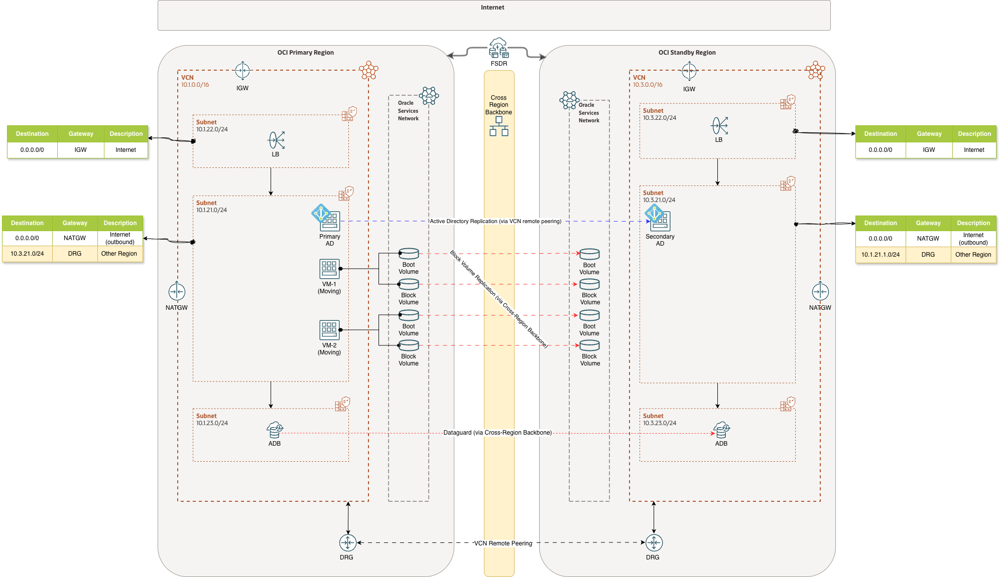

As shown here, when the system in the normal status the network in both regions have the following route rules:

  1. Internet inbound/outbound from the LB subnet through the _Internet GW_
  2. Internet outbound from the Compute Instances subnet through the _NAT GW_
  3. the other region Compute Instances subnet though the _DRG Remote Peering_ 

During the FSDR Drill we want to remove those rules from the Standby subnets. When the Drill is completed we want to put those 
rules back. To accomplish that we need to update the autogenerated _Start Drill_ and _Stop Drill_ FSDR plans with custom steps
and, since we don't want to execute anything, on any compute instance we will use _OCI Functions_. In this specific example we
will focus on removing the rule no. 3 because we want for the _Standby AD_ to take over the services in the drill workload, that
said the solution is generic and can be used to remove and add any number of route rules.

# Solution Design 

The pillars of the solution are the following:

- we will have two OCI Functions, the first one to remove the route rule, the second to put the rule back
- we assume that we will always have preexisting route tables, possibly empty, to update 
- the first function will be called _remove-route_ and its JSON payload will contain the route table OCID (_rt_id_) and the destination
  CIDR block (_cidr_)
- the second function will be called _add-route_ and its JSON payload will contain the route table OCID (_rt_id_), the destination
  CIDR block (_cidr_) and the gateway OCID (gw_id) to use in the route
- the functions will be implemented in Python from the standard template and they will use the OCI SDK
- we will use _Oracle Code Assist_ (OCA) to generate the Python code 
- the authentication in the functions will be done using the _Instance Principal_ method
- in this specific environment and with this kind of workload, interrupting the _Cross-Region_ VCNs connection doesn't 
  affect neither the _Block Storage_ replication nor the _Autonomous Dataguard_ replication and only affects Active 
  Directory replication. Of course in other scenarios, there could be different implications, for example, when using _Base DB System Dataguard_, 
  Cross-Region VCN connection needs to be established. 


# Solution Implementation  

To implement the solution we need to create the two functions and enable them for the networking update in the compartment. 
The solution can be implemented from a PC or Mac or directly for _OCI Cloud Shell_, locally we will need to setup the software 
(OCI Cli, fn Cli, docker) and the OCI profile, directly on Cloud Shell everything will be available. Since the local approach
is more generic, we will showcase that one. 


## Instance Principal Configurations  

We put everything in an existing OCI Compartment called "_Sandbox_". First we create the dynamic group for the functions defined there (we 
need to do it in the home region which, in this case, is Frankfurt that is also the Standby region). The OCI Cli command to do that is 
the following:

```sh
# We need to do it in the home region
oci --region eu-frankfurt-1 iam dynamic-group create --name Sandbox-Functions-Grp \
   --description "All functions in compartment Sandbox" \
   --matching-rule "All {resource.type = 'functions', resource.compartment.name = 'Sandbox'}"
```

Then we have to create the policy that allows the dynamic group to manipulate the network components
in the same compartment. 

```sh
oci --region eu-frankfurt-1 iam policy create --compartment-id ocid1.compartment.oc1..<hidden> \
   --name "Sandbox-Functions-Pol" --description "To manage networking from functions" \
   --statements "['Allow dynamic-group Sandbox-Functions-Grp to manage virtual-network-family in compartment Sandbox']"
```

To setup and use the OCI Cli please see the documentation [here](https://docs.oracle.com/en-us/iaas/Content/API/SDKDocs/cliinstall.htm).

### Functions Creation and Deployment  

To build the function image on a PC or Mac we need:

1. the fn executable ([fnproject client](https://fnproject.io/tutorials/install/))
2. [Rancher Desktop](https://rancherdesktop.io/) or [Docker Desktop](https://www.docker.com/products/docker-desktop)

As preliminary step we need to setup the fn context.

```sh
fn create context --provider oracle --registry <region code>.ocir.io/<tenant namespace> \
--api-url https://functions.<region-name>.oci.oraclecloud.com <context name>
fn use context <context name>
# compartment for functions
fn update context oracle.compartment-id <functions compartment ocid>
# compartment for OCIR registries 
fn update context oracle.image-compartment-id <OCIR registries compartment ocid>
```

for example:

```
fn create context --provider oracle --registry fra.ocir.io<hidden>/fsdr-net-insulation \
--api-url https://functions.<hidden>.oci.oraclecloud.com oracle 
fn use context oracle
# Compartment where to store the functions
fn update context oracle.compartment-id ocid1.compartment.oc1..<hidden>
# Compartment where to store the functions images
fn update context oracle.image-compartment-id ocid1.compartment.oc1..<hidden>
```
now we can inspect the context, for example

```sh
fn inspect context oracle                                                                                                        
Current context: oracle

api-url: https://functions.eu-frankfurt-1.oci.oraclecloud.com
oracle.compartment-id: ocid1.compartment.oc1..<hidden>
oracle.image-compartment-id: ocid1.compartment.oc1..<hidden>
provider: oracle
registry: fra.ocir.io/<hidden>/fsdr-net-insulation
```

Now we can create the application that will contain all the functions:

```sh
fn create app --shape GENERIC_X86 \
--annotation oracle.com/oci/subnetIds='["<subnet OCID>>"]' \
fsdr-net-insulation
```

For example:

```sh
fn create app --shape GENERIC_X86 \
--annotation oracle.com/oci/subnetIds='["ocid1.subnet.oc1.eu-frankfurt-1.<hidden>"]' \
fsdr-net-insulation
```

Before creating and deploying the functions we need, we want to verify that everything works and for that we create a basic
_hello world_ function from the template:

```ssh
fn init --runtime python --name hello files/functions/hello
```

The function is created in the subdirectory functions:


```ssh
functions
|-- hello
    |-- func.py
    |-- func.yaml
    `-- requirements.txt

1 directory, 3 files
```

At this point, before actually deploying the hello function we need to login to the OCI registry. 


```sh
echo "<authentication token>" \
| docker login --username <tenancy namespace>/<Identity Domain >/<account name> \
--password-stdin  <region code>.ocir.io
```

so, for example:

```sh
echo "<hidden>" \
| docker login --username <hidden>/oracleidentitycloudservice/demouser@demo.com \
--password-stdin  fra.ocir.io
```

(to see how to create an authentication token please see the [references](#references)

and we need to have _Rancher Desktop_ or _Docker Desktop_ running. If everything is setup, we can execute:

```sh
fn deploy --verbose --app fsdr-net-insulation files/functions/hello 
```

The command will create the _hello function_ in the _fsdr-net-insulation application_ and a repository named _fsdr-net-insulation/hello_ in the
OCIR registry in the compartment we setup. At this point we can inspect the function:

```JSON
fn inspect function fsdr-net-insulation hello 
{
        "annotations": {
                "fnproject.io/fn/invokeEndpoint": "https://<hidden>/actions/invoke",
                "oracle.com/oci/compartmentId": "ocid1.compartment.oc1..<hidden>",
                "oracle.com/oci/imageDigest": "sha256:<hidden>>"
        },
        "app_id": "ocid1.fnapp.oc1.eu-frankfurt-1.<hidden>",
        "created_at": "2026-03-16T20:39:07.836Z",
        "id": "ocid1.fnfunc.oc1.eu-frankfurt-1.<hidden>>",
        "image": "fra.ocir.io/<hidden>/fsdr-net-insulation/hello:0.0.12",
        "memory": 256,
        "name": "hello",
        "shape": "GENERIC_X86",
        "timeout": 30,
        "updated_at": "2026-03-16T20:39:07.836Z"
}
```

and get the invocation endpoint. To invoke the function we can use fn itself:


```sh
echo '{"name":"Cristiano"}' | fn invoke fsdr-net-insulation hello     
{"message": "Hello Cristiano"}
```

At this point we are ready to create the functions we need.

```ssh
fn init --runtime python --name remove-route files/functions/remove-route
fn init --runtime python --name add-route files/functions/add-route
```

So, under the _functions_ directory we get:

```sh
functions
|-- add-route
|   |-- func.py
|   |-- func.yaml
|   `-- requirements.txt
|-- hello
|   |-- func.py
|   |-- func.yaml
|   `-- requirements.txt
`-- remove-route
    |-- func.py
    |-- func.yaml
    `-- requirements.txt

4 directories, 9 files
```

Naturally we change the code in _func.py_ and we need to add the OCI SDK package in the _requirements.txt_ file:

```sh
cat files/functions/add-route/requirements.txt 
fdk
oci
```

To generate the code and validate it we used Oracle Code Assist. The _remove-route_ function is the following:

```python
"""OCI Function to remove a specific route rule from a given route table.

The function expects a JSON payload with the following keys:
    - ``rt_id``  : OCID of the route table to search.
    - ``cidr``   : Destination CIDR block of the route rule to remove.

It uses the OCI Python SDK with **resource-principal** authentication to:
1. Retrieve the specified route table.
2. Locate the route rule whose ``destination`` matches the provided CIDR.
3. Update the route table by removing that rule.

The function returns a JSON response indicating success, not-found, or any error
information.
"""

import io
import json
import logging
import ipaddress

from fdk import response
import oci


def _remove_route_rule(rt_id: str, cidr: str) -> dict:
    """Remove route rule(s) matching the given CIDR block from a specific route table."""
    signer = oci.auth.signers.get_resource_principals_signer()
    vcn_client = oci.core.VirtualNetworkClient(config={}, signer=signer)

    route_table = vcn_client.get_route_table(rt_id).data
    route_rules = list(route_table.route_rules) if route_table.route_rules else []

    matching_rules = [
        r
        for r in route_rules
        if getattr(r, "destination", None) == cidr and getattr(r, "destination_type", "CIDR_BLOCK") == "CIDR_BLOCK"
    ]
    if not matching_rules:
        return {
            "status": "not_found",
            "message": "No route rule found for the provided CIDR block in the specified route table.",
        }

    new_rules = [
        r
        for r in route_rules
        if not (
            getattr(r, "destination", None) == cidr
            and getattr(r, "destination_type", "CIDR_BLOCK") == "CIDR_BLOCK"
        )
    ]
    update_details = oci.core.models.UpdateRouteTableDetails(route_rules=new_rules)
    vcn_client.update_route_table(rt_id, update_details)

    return {
        "status": "removed",
        "route_table_id": rt_id,
        "removed_rules": len(matching_rules),
    }


def handler(ctx, data: io.BytesIO = None):
    """Function entry point.

    Expects a JSON payload with ``rt_id`` and ``cidr``.
    """
    logger = logging.getLogger()

    try:
        payload = json.loads(data.getvalue()) if data else {}
        rt_id = payload["rt_id"].strip()
        cidr = payload["cidr"].strip()

        if not rt_id or not cidr:
            raise ValueError("'rt_id' and 'cidr' must be non-empty strings")

        ipaddress.ip_network(cidr, strict=False)
    except Exception as ex:
        logger.error("Invalid input payload: %s", ex)
        return response.Response(
            ctx,
            response_data=json.dumps({"error": "Invalid input payload", "details": str(ex)}),
            headers={"Content-Type": "application/json"},
            status_code=400,
        )

    try:
        result = _remove_route_rule(rt_id, cidr)
        status_code = 200 if result.get("status") == "removed" else 404
        return response.Response(
            ctx,
            response_data=json.dumps(result),
            headers={"Content-Type": "application/json"},
            status_code=status_code,
        )
    except oci.exceptions.ServiceError as ex:
        logger.error("OCI service error while removing route rule: %s", ex)
        mapped_status = 404 if ex.status == 404 else 500
        return response.Response(
            ctx,
            response_data=json.dumps(
                {
                    "error": "OCI service error",
                    "status": ex.status,
                    "code": ex.code,
                    "message": ex.message,
                }
            ),
            headers={"Content-Type": "application/json"},
            status_code=mapped_status,
        )
    except Exception as ex:
        logger.exception("Unexpected error while removing route rule")
        return response.Response(
            ctx,
            response_data=json.dumps({"error": "Internal server error", "details": str(ex)}),
            headers={"Content-Type": "application/json"},
            status_code=500,
        )
```

To deploy it:

```sh
fn deploy --verbose --app fsdr-net-insulation files/functions/remove-route
```

The code for _add-route_ function is:


```python
"""OCI Function to add a route rule to a specific route table.

The function expects a JSON payload with the following keys:
    - ``rt_id``  : OCID of the route table where the rule will be added.
    - ``gw_id`` : OCID of the DRG to set as gateway in the route rule.
    - ``cidr``   : Destination CIDR block for the new route rule.

The function uses **resource-principal** authentication, which is appropriate for
functions deployed in OCI Functions.
"""

import io
import json
import logging
import ipaddress

from fdk import response
import oci


def _add_route_rule(rt_id: str, gw_id: str, cidr: str) -> dict:
    """Add a route rule pointing to the provided DRG."""
    signer = oci.auth.signers.get_resource_principals_signer()
    vcn_client = oci.core.VirtualNetworkClient(config={}, signer=signer)

    route_table = vcn_client.get_route_table(rt_id).data
    existing_rules = list(route_table.route_rules) if route_table.route_rules else []

    duplicate_rule = any(
        getattr(rule, "destination", None) == cidr
        and getattr(rule, "network_entity_id", None) == gw_id
        and getattr(rule, "destination_type", "CIDR_BLOCK") == "CIDR_BLOCK"
        for rule in existing_rules
    )
    if duplicate_rule:
        return {
            "status": "already_exists",
            "message": "A matching CIDR route rule for the provided gateway already exists.",
            "route_table_id": rt_id,
            "cidr": cidr,
            "gw_id": gw_id,
        }

    new_rule = oci.core.models.RouteRule(
        network_entity_id=gw_id,
        destination=cidr,
        destination_type="CIDR_BLOCK",
    )

    updated_rules = existing_rules + [new_rule]
    update_details = oci.core.models.UpdateRouteTableDetails(route_rules=updated_rules)
    vcn_client.update_route_table(rt_id, update_details)

    return {
        "status": "added",
        "route_table_id": rt_id,
        "cidr": cidr,
        "gw_id": gw_id,
    }


def handler(ctx, data: io.BytesIO = None):
    """Function entry point.

    Expects a JSON payload with ``rt_id``, ``gw_id`` and ``cidr``.
    """
    logger = logging.getLogger()

    try:
        payload = json.loads(data.getvalue()) if data else {}
        rt_id = payload["rt_id"].strip()
        gw_id = payload["gw_id"].strip()
        cidr = payload["cidr"].strip()

        if not rt_id or not gw_id or not cidr:
            raise ValueError("'rt_id', 'gw_id' and 'cidr' must be non-empty strings")

        ipaddress.ip_network(cidr, strict=False)
    except Exception as ex:
        logger.error("Invalid input payload: %s", ex)
        return response.Response(
            ctx,
            response_data=json.dumps({"error": "Invalid input payload", "details": str(ex)}),
            headers={"Content-Type": "application/json"},
            status_code=400,
        )

    try:
        result = _add_route_rule(rt_id, gw_id, cidr)
        status_code = 200 if result.get("status") in {"added", "already_exists"} else 500
        return response.Response(
            ctx,
            response_data=json.dumps(result),
            headers={"Content-Type": "application/json"},
            status_code=status_code,
        )
    except oci.exceptions.ServiceError as ex:
        logger.error("OCI service error while adding route rule: %s", ex)
        mapped_status = 404 if ex.status == 404 else 500
        return response.Response(
            ctx,
            response_data=json.dumps(
                {
                    "error": "OCI service error",
                    "status": ex.status,
                    "code": ex.code,
                    "message": ex.message,
                }
            ),
            headers={"Content-Type": "application/json"},
            status_code=mapped_status,
        )
    except Exception as ex:
        logger.exception("Unexpected error while adding route rule")
        return response.Response(
            ctx,
            response_data=json.dumps({"error": "Internal server error", "details": str(ex)}),
            headers={"Content-Type": "application/json"},
            status_code=500,
        )
```
And, of course, the command to deploy it is:

```sh
fn deploy --verbose --app fsdr-net-insulation files/functions/add-route
```

## Deployment Using Cloud Shell 

What presented before was tested on a Mac desktop using:

- the OCI Client for Mac with a local configuration and a pre-created API Key (pem file)
- fn client for Mac
- Rancher Desktop for Mac 
- docker client for Mac

The same can be done using the Cloud Shell opened directly on the standby region. Using the Cloud Shell has some advantages and some 
peculiarities.The advantages are that in CS everything is already available:

- OCI Client is installed and already configured
- fn client is installed with a ready-to-go context we can customize 
- docker client and server are available out-of-the-box

In the meantime there are some peculiarities that we need to pay attention to:

- the Cloud Shell architecture must be equal to the function architecture (in this case X86_64)
- the provider to use for the fn context setup is not _oracle_ but _oracle-cs_.

Regarding the Cloud Shell architecture, that can be changed directly from the console as shown in the images below:

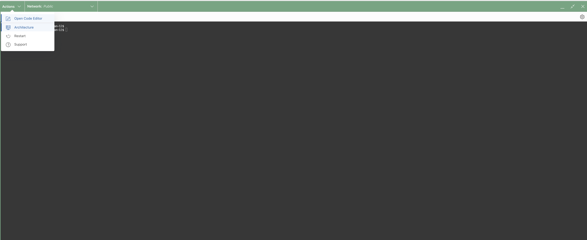

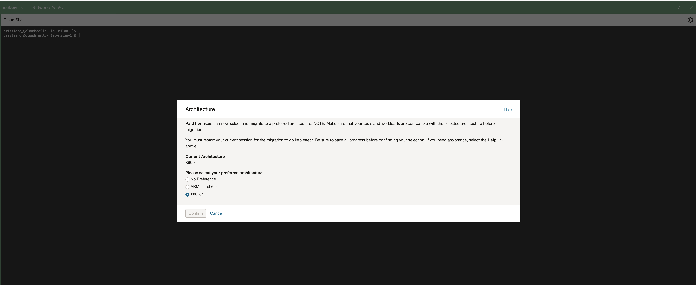
 
Initially in the Cloud Shell the out-of-the-box available fn contexts are:

```sh
<short username>_@cloudshell:~ (<current region>)$ fn list context
CURRENT NAME            PROVIDER        API URL                                                 REGISTRY
        default         oracle-cs
        <home region>   oracle-cs       https://functions.<home region>.oci.oraclecloud.com    
*      <current region> oracle-cs       https://functions.<current region>.oci.oraclecloud.com
```

then we have to create a custom context:

```sh 
fn create context --provider oracle-cs --registry <region code>.ocir.io/<tenancy namespace>/fsdr-net-insulation \
--api-url https://functions.<region>>.oci.oraclecloud.com <context-name>
fn use <context-name> oracle
# compartment for functions 
fn update context oracle.compartment-id <functions compartment ocid>
# compartment for OCIR registries 
fn update context oracle.image-compartment-id <OCIR registries compartment ocid>
```

For example:

```sh
fn create context --provider oracle-cs --registry <hidden>.ocir.io/<hidden>/fsdr-net-insulation \
--api-url https://functions.<hidden>.oci.oraclecloud.com oracle
fn use context oracle
fn update context oracle.compartment-id ocid1.compartment.oc1..<hidden>
fn update context oracle.image-compartment-id ocid1.compartment.oc1..<hidden>
```

The final configuration will be:

```sh
<username>_@cloudshell:~ (<current region>)$ fn inspect context
Current context: oracle

api-url: https://functions.<current region>.oci.oraclecloud.com
oracle.compartment-id: ocid1.compartment.oc1..<hidden>
oracle.image-compartment-id: ocid1.compartment.oc1..<hidden>>
provider: oracle-cs
registry: lin.ocir.io/<tenancy namespace>>/fsdr-net-insulation
```

Once the configuration is finalized in Cloud Shell all the remaining steps are the same.

## Testing

### Functions Testing and Payloads

Now we can test the functions. Assuming we want to remove the outbound route to Internet in the diagram, the payload would be:

```JSON
{"rt_id":"<subnet route table ocid>","cidr":"0.0.0.0/0"}
```

and the REST call would be:

```sh
echo '{"rt_id":"<subnet route table ocid>","cidr":"0.0.0.0/0"}' \
| fn invoke fsdr-net-insulation remove-route   
```

For example:

```sh
echo '{"rt_id":"ocid1.routetable.oc1.eu-frankfurt-1.<hidden>","cidr":"0.0.0.0/0"}' \
| fn invoke fsdr-net-insulation remove-route
{"status": "removed", "route_table_id": "ocid1.routetable.oc1.eu-frankfurt-1.<hidden>", "removed_rules": 1}
```


To add the route back we need to execute the following REST call:

```sh
echo '{"rt_id":"<subnet route table ocid>","cidr":"0.0.0.0/0","gw_id":"drg ocid>"}' \
| fn invoke fsdr-net-insulation add-route   
```

For example:

```sh
echo '{"rt_id":"ocid1.routetable.oc1.eu-frankfurt-1.<hidden>","cidr":"0.0.0.0/0","gw_id":"ocid1.drg.oc1.eu-frankfurt-1.<hidden>"}' \
| fn invoke fsdr-net-insulation add-route
{"status": "added", "route_table_id": "ocid1.routetable.oc1.eu-frankfurt-1.<hidden>sa", "cidr": "0.0.0.0/0", "gw_id": "ocid1.<hidden>"}
```

After we remove the DRG route in the _Start Drill_ the situation is the one represented in the diagram below:


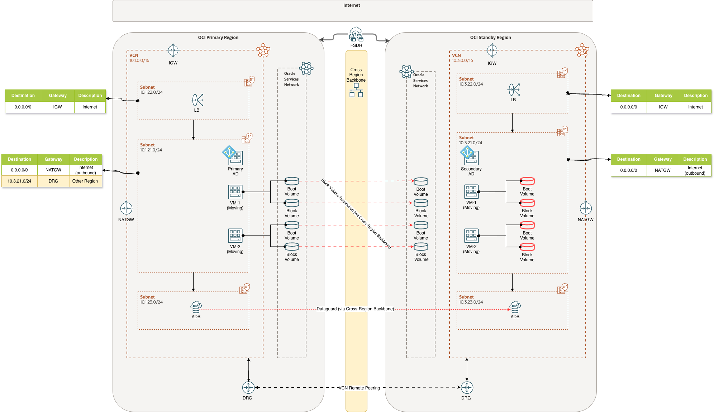


## FSR Plans Update

Now that we have the functions we need, we can go ahead and modify the _Start Drill_ and _Stop Drill_ plans. 

### Start Drill

Below all the steps necessary to add the custom _Plan Group_ to the autogenerated _Start Drill_. We assume only to remove the DRG route
but we could call the function in multiple steps, to remove multiple route rules, inside the same _Plan Group_  and they will be executed 
in parallel.


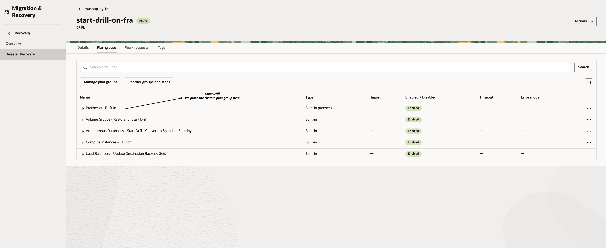


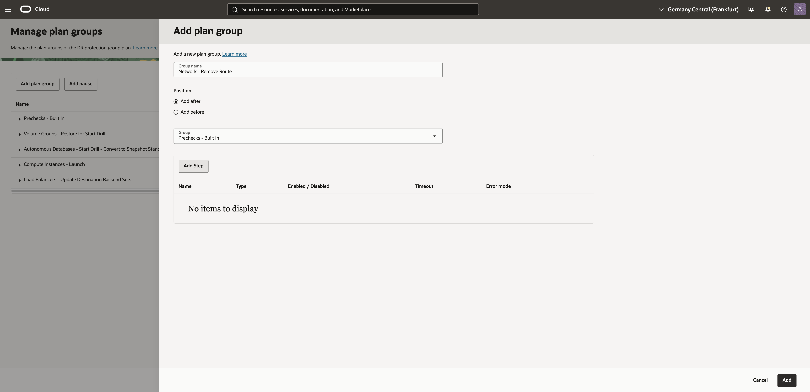


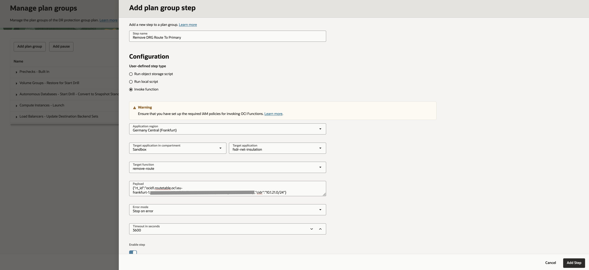


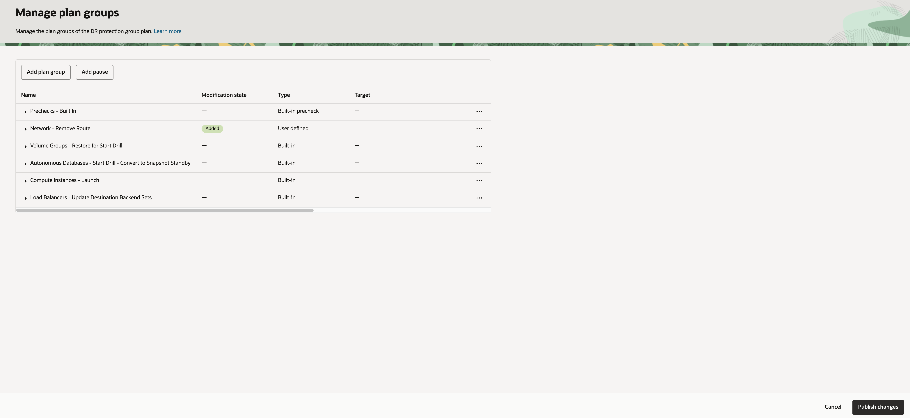


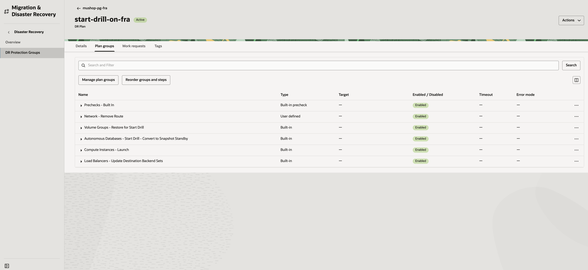

The _Start Drill_ execution summary is the following:

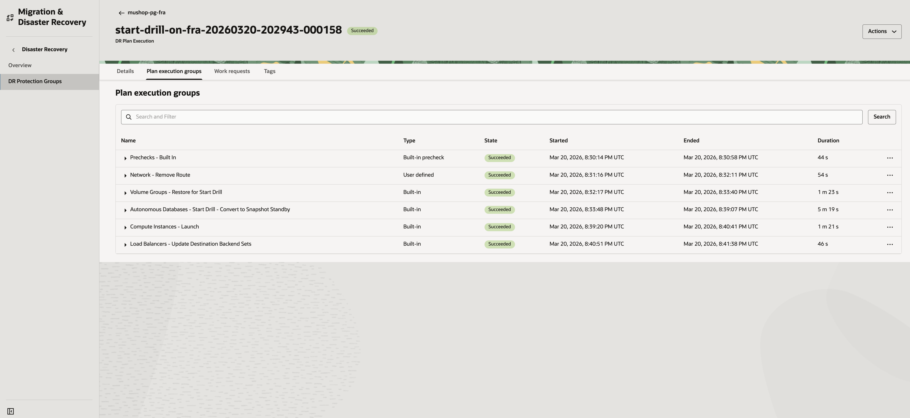

We see that the route is removed from the route table. In fact, the route table before the drill is:

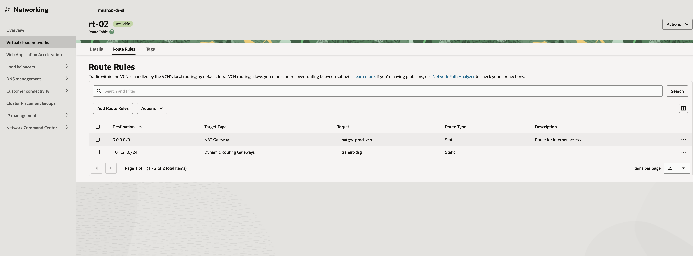

While the route is removed during drill:


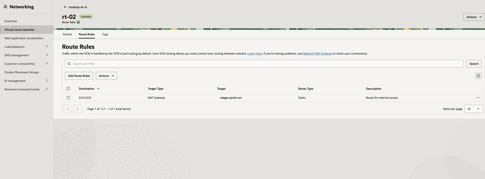


### Stop Drill

Below all the steps necessary to add the custom _Plan Group_ to the autogenerated _Stop Drill_.

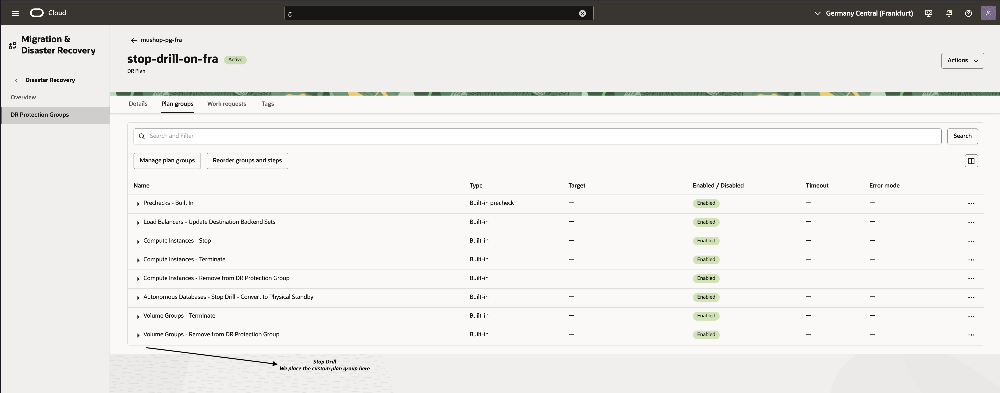


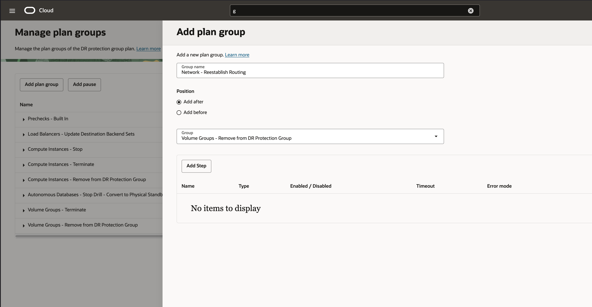


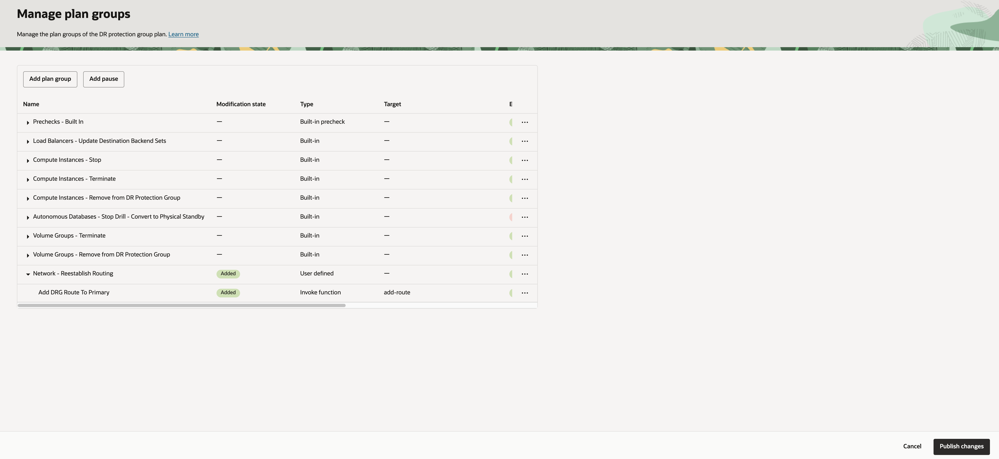


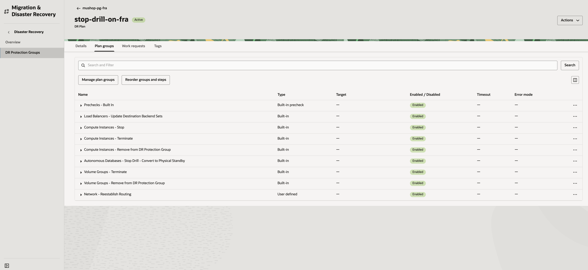

The _Stop Drill_ execution summary is the following:

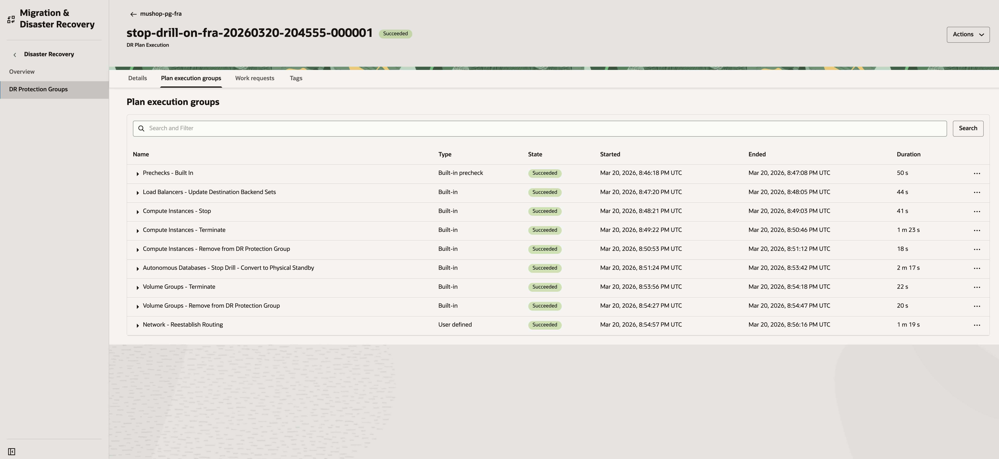


# Takeaways  
 
 1. Enforcing network insulation in the standby is often desirable during a drill.
 2. FSDR is very flexible and allows extensive customization through custom plan groups. 
 3. Functions are very effective to execute short operation inside a FSDR Plan. They don't require a host to run in and are easy to deploy.
 4. Python and the OCI SDK for Python are ideal to interact with OCI services.
 5. Instance Principal authentication and authorization can be leveraged also for OCI Functions.

<!---
(references)=
--->
# References

Some useful links.

1. [Functions get started with Cloud Shell](https://docs.oracle.com/en-us/iaas/Content/developer/functions/func-setup-cs/01-summary.htm)
2. [fn project and OCI](https://docs.oracle.com/en-us/iaas/Content/Functions/Tasks/functionsusingwithfncli.htm)
3. [OCIR Concepts](https://docs.oracle.com/en-us/iaas/Content/Registry/Concepts/registryconcepts.htm)
4. [Getting an Auth Token for OCIR](https://docs.oracle.com/en-us/iaas/Content/Registry/Tasks/registrygettingauthtoken.htm)
5. [FSDR Documentation](https://docs.oracle.com/en-us/iaas/disaster-recovery/index.html)
6. [DR Drills with FSDR](https://blogs.oracle.com/maa/fullstackdr-drill-plans)
7. [Oracle Code Assist](https://www.oracle.com/application-development/code-assist/)
8. [OCI Cloud Shell](https://docs.oracle.com/en-us/iaas/Content/API/Concepts/cloudshellintro.htm)

# License

Copyright (c) 2026 Oracle and/or its affiliates.

Licensed under the Universal Permissive License (UPL), Version 1.0.

See [LICENSE](https://github.com/oracle-devrel/technology-engineering/blob/main/LICENSE.txt) for more details.