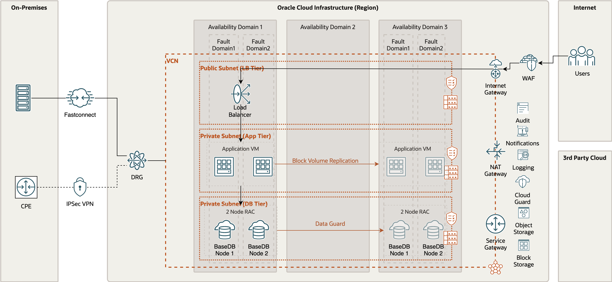
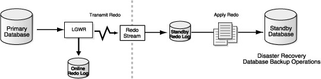

# Document Control

## Version Control

| Version | Authors           | Date               | Comments                               |
|:--------|:----------------  |:-------------------|:-------------------                    |
| 0.1     | \<Name Surname\>  | June 16th, 2023    | Initial Version                        |
| 0.2     | \<Name Surname\>  | June 20th, 2023    | Updated architecture to use public LBs |
|         | \<Name Surname\>  |                    | Added some LBs configuration           |
| 0.3     | \<Name Surname\>  | June 30th, 2023    | Updated after peer review              |

## Team

| Name              | eMail                            | Role                      | Company    |
|:----------------  |:---------------------------      |:--------------------------|:--------   |
| \<Name Surname\>  | \<xxxxx\>@\<xxxx\>.\<xxx\>       | Tech Solution Specialist  | \<XXXXX\>  |
| \<Name Surname\>  | \<xxxxx\>@\<xxxx\>.\<xxx\>       | Account Cloud Engineer    | \<XXXXX\>  |

## Document Purpose

This document provides a high-level solution definition for the Oracle solution and aims at describing the current state, and to-be state as well as a potential high-level project scope and timeline for the \<Implementer\>.

The document may refer to a ‘Workload’, which summarizes the full technical solution for a customer (You) during a single engagement. The Workload is described in the chapter [Workload Requirements and Architecture](#workload-requirements-and-architecture).

This is a living document, additional sections will be added as the engagement progresses resulting in a final Document to be handed over to the \<Implementer\>.

## Abbreviations and Acronyms

| Term | Meaning                     |
|:-----|:----------------            |
| AD   | Availability Domain         |
| Dev  | Development                 |
| DRG  | Dynamic Routing Gateway     |
| DWH  | Data Warehouse              |
| IaaS | Infrastructure as a Service |
| LB   | Load Balancer               |
| NSG  | Network Security Group      |
| OCI  | Oracle Cloud Infrastructure |
| VCN  | Virtual Cloud Network       |
| ACME | A Company Making Everything |

# Business Context

A Company Making Everything also called ACME was established in 1974 to ...
In 2019 ACME was transformed ...
Today, ACME is responsible for the overall planning and development...

## Executive Summary

ACME’s \<Application Name\> application database environment needs hosting the database environment within an OCI Region for production, pre-production, test, and DR environments. The application components will connect to those databases for the data persistence requirements. In this case, ACME is looking for a solution that would allow:

- host the database environment within the region with an OpEx investment for both the infrastructure and the platform services running with it
- automatic backup and restore capabilities to secure the database against failures and/or data loss within the cloud datacenter
- near standby capability across an Availability Domain in short term and a disaster recovery enablement in mid and long term to support the data residency requirements

## Workload Business Value

ACME uses different applications to address its needs to perform its required duties. One of the major areas where ACME has responsibilities is transportation. Among the transportation services, \<Application Name\> solution is used to improve the productivity of the assets to meet safety, regulatory and citizen demands.

The application \<Application Name\> uses Oracle database as a data persistence store backend to safely store and query the data. To provide a consistent and reliable application environment, ACME is looking for a new database platform. In this regard, Oracle Cloud Infrastructure provides several different services to support Oracle databases in Cloud.

# Workload Requirements and Architecture

## Overview

\<Application Name\> components are currently deployed on-premises, in ACME datacenter. Currently, the application and its database reside in the same datacenter within the same physical hardware creating a single point of failure. ACME’s objective is to provide high availability and resilience at the database level to service its application consistently while catering for hardware failures.

Based on these requirements ACME decided to migrate their application and database to the OCI. There are several migration approach and methods for Oracle database and based upon several factors like: Database size, Downtime, Database version and Characterset should be taken into consideration when choosing the migration method.

Below is the list of databases with their existing known versions, sizes, and platforms.

| Database Name | Database Version | Database Platform | Database Size |
|:--------------|:-----------------|:------------------|--------------:|
| ProdDB        | 19c              | Windows 2016      | 100GB         |
| DevDB         | 19c              | Windows 2016      | 75GB          |
| TestDB        | 19c              | Windows 2016      | 60GB          |

## Non-Functional Requirements

Below is the list of non-functional requirements for ACME migration to OCI of the databases supporting the ACME application.

### Regulations and Compliances Requirements

At the time of this document creation, no Regulatory and Compliance requirements have been specified.

In addition to these requirements, the [CIS Oracle Cloud Infrastructure Foundation Benchmark, v1.2](https://www.cisecurity.org/benchmark/Oracle_Cloud) will be applied to the Customer tenancy.

### Environments

| Name           | Size of Prod | Location           | DR     | Scope                      |
|:---------------|-------------:|:-----------------  |:-------|:----------------           |
| Production     | 100%         | \<OCI Region\>     | Yes    | Not in Scope               |
| DR             | 50%          | \<OCI Region\>     | No     | Not in Scope               |
| Dev & Test     | 25%          | \<OCI Region\>     | No     | Workload - \<Implementer\> |

### High Availability and Disaster Recovery Requirements

These are the requirements from ACME:

- For High Availability:

| Service Name   | KPI    | Unit    | Value |
|:---------------|:-------|:--------|------:|
| Production     | Uptime | Percent | 99.98 |
| Non-Production | Uptime | Percent | 95.99 |

- For Disaster Recovery:

| Service Name   | KPI | Unit  | Value |
|:---------------|:----|:------|------:|
| Production     | RTO | Hours |     2 |
| Production     | RPO | Hours |     1 |
| Non-Production | RTO | Days  |     1 |
| Non-Production | RPO | Days  |     1 |

- For Backup:

| Service Name   | KPI          | Unit    | Value |
|:---------------|:-------------|:--------|------:|
| Production     | Frequency    | Per day |     2 |
| Production     | BckpTime (F) | Hours   |     4 |
| Production     | BckpTime (I) | Hours   |     1 |
| Production     | Retention    | Days    |    60 |
| Non-Production | Frequency    | Per day |     1 |
| Non-Production | BckpTime (F) | Hours   |     6 |
| Non-Production | BckpTime (I) | Hours   |     3 |
| Non-Production | Retention    | Days    |    60 |

### Security Requirements

The solution provided must address the following security requirements expressed by ACME:

- Data encryption must be implemented using customer provided keys.
- Use of a Key Management System (KMS) to store the encryption keys.

## Future State Architecture

The future state architecture for ACME \<Application Name\> database environment after a migration from on-premises to OCI is composed of the following:

- End users will connect to the \<Application Name\> application through the Load Balancer (1). Internal users will access through VPN/Fastconnect. For external users accessing the application over the Internet, the traffic will be inspected by a Web Application Firewall (2).
- The Load Balancer will act as a reverse proxy and will distribute the application traffic across several application servers (3).
- \<Application Name\> application environment will connect to OCI Production database (4).
- The primary Oracle database will be synchronized to a secondary one to ensure the disaster recovery plan (5).

### Mandatory Security Best Practices

The safety of the ACME's Oracle Cloud Infrastructure (OCI) environment and data is the ACME’s priority.

To following table of OCI Security Best Practices lists the recommended topics to provide a secure foundation for every OCI implementation. It applies to new and existing tenancies and should be implemented before the Workload defined in this document will be implemented.

Workload related security requirements and settings like tenancy structure, groups, and permissions are defined in the respective chapters.

Any deviations from these recommendations needed for the scope of this document will be documented in chapters below. They must be approved by ACME.

ACME is responsible for implementing, managing, and maintaining all listed topics.

<table style="width:25%;">
<colgroup>
<col style="width: 2%" />
<col style="width: 2%" />
<col style="width: 19%" />
</colgroup>
<thead>
<tr class="header">
<th>CATEGORY</th>
<th>TOPIC</th>
<th>DETAILS</th>
</tr>
</thead>
<tbody>
<tr class="odd">
<td>User Management</td>
<td>IAM Default Domain</td>
<td>
Multi-factor Authentication (MFA) should be enabled and enforced for every non-federated OCI user account.

<ul>
<li>For configuration details see <a href="https://docs.oracle.com/en-us/iaas/Content/Identity/mfa/understand-multi-factor-authentication.htm">Managing Multi-Factor Authentication</a>.</li>
</ul>

In addition to enforcing MFA for local users, Adaptive Security will be enabled to track the Risk Score of each user of the Default Domain.

<ul>
<li>For configuration details see <a href="https://docs.oracle.com/en-us/iaas/Content/Identity/adaptivesecurity/overview.htm">Managing Adaptive Security and Risk Providers</a>.</li>
</ul></td>
</tr>
<tr class="even">
<td></td>
<td>OCI Emergency Users</td>
<td>
A maximum of <strong>three</strong> non-federated OCI user accounts should be present with the following requirements:

<ul>
<li>Username does not match any username in the Customer’s Enterprise Identity Management System</li>
<li>Are real humans.</li>
<li>Have a recovery email address that differs from the primary email address.</li>
<li>User capabilities have Local Password enabled only.</li>
<li>Has MFA enabled and enforced (see IAM Default Domain).</li>
</ul></td>
</tr>
<tr class="odd">
<td></td>
<td>OCI Administrators</td>
<td>
Daily business OCI Administrators are managed by the Customer’s Enterprise Identity Management System. This system is federated with the IAM Default Domain following these configuration steps:

<ul>
<li>Federation Setup</li>
<li>User Provisioning</li>
<li>For configuration guidance for major Identity Providers see the OCI IAM Identity Domain tutorials.</li>
</ul></td>
</tr>
<tr class="even">
<td></td>
<td>Application Users</td>
<td>Application users like OS users, Database users, or PaaS users are not managed in the IAM Default Domain but either directly or in dedicated identity domains. These identity domains and users are covered in the Workload design. For additional information see <a href="https://docs.oracle.com/en-us/iaas/Content/cloud-adoption-framework/iam-security-structure.htm">Design Guidance for IAM Security Structure</a>.</td>
</tr>
<tr class="odd">
<td>Cloud Posture Management</td>
<td>OCI Cloud Guard</td>
<td>
OCI Cloud Guard will be enabled at the root compartment of the tenancy home region. This way it covers all future extensions, like new regions or new compartments, of your tenancy automatically. It will use the Oracle Managed Detector and Responder recipes at the beginning and can be customized by the Customer to fulfill the Customer’s security requirements.

<ul>
<li>For configuration details see <a href="https://docs.oracle.com/en-us/iaas/cloud-guard/using/part-start.htm">Getting Started with Cloud Guard</a>. Customization of the Cloud Guard Detector and Responder recipes to fit the Customer’s requirements is highly recommended. This step requires thorough planning and decisions to make.</li>
<li>For configuration details see <a href="https://docs.oracle.com/en-us/iaas/cloud-guard/using/part-customize.htm">Customizing Cloud Guard Configuration</a></li>
</ul></td>
</tr>
<tr class="even">
<td></td>
<td>OCI Vulnerability Scanning Service</td>
<td>
In addition to OCI Cloud Guard, the OCI Vulnerability Scanning Service will be enabled at the root compartment in the home region. This service provides vulnerability scanning of all Compute instances once they are created.

<ul>
<li>For configuration details see <a href="https://docs.oracle.com/en-us/iaas/scanning/home.htm">Vulnerability Scanning</a>.</li>
</ul></td>
</tr>
<tr class="odd">
<td>Monitoring</td>
<td>SIEM Integration</td>
<td>Continuous monitoring of OCI resources is key for maintaining the required security level (see <a href="#regulations-and-compliances-requirements">Regulations and Compliance</a> for specific requirements). See <a href="https://docs.oracle.com/en-us/iaas/Content/cloud-adoption-framework/siem-integration.htm">Design Guidance for SIEM Integration</a> to implement integration with the existing SIEM system.</td>
</tr>
<tr class="even">
<td>Additional Services</td>
<td>Budget Control</td>
<td>
OCI Budget Control provides an easy-to-use and quick notification on changes in the tenancy’s budget consumption. It will be configured to quickly identify unexpected usage of the tenancy.

<ul>
<li>For configuration details see <a href="https://docs.oracle.com/en-us/iaas/Content/Billing/Tasks/managingbudgets.htm">Managing Budgets</a></li>
</ul></td>
</tr>
</tbody>
</table>

### OCI Secure Landing Zone Architecture

The design considerations for an OCI Cloud Landing Zone have to do with OCI and industry architecture best practices, along with Customer specific architecture requirements that reflect the Cloud Strategy (hybrid, multi-cloud, etc). An OCI Cloud Landing zone involves a variety of fundamental aspects that have a broad level of sophistication. A good summary of a Cloud Landing Zone has been published in the [OCI User Guide](https://docs.oracle.com/en-us/iaas/Content/cloud-adoption-framework/landing-zone.htm).

#### Naming Convention

A naming convention is an important part of any deployment to ensure consistency as well as security within your tenancy. Hence we jointly agree on a naming convention, matches Oracle's best practices and Customer requirements.

Oracle recommends the following Resource Naming Convention:

- The name segments are separated by “-“
- Within a name segment avoid using `<space>` and “.”
- Where possible intuitive/standard abbreviations should be considered (e.g. “shared“ compared to "shared.cloud.team”)
- When referring to the compartment full path, use “:” as a separator, e.g. cmp-shared:cmp-security

Some examples of naming are given below:

- cmp-shared
- cmp-\<workload\>
- cmp-networking

The patterns used are these:

- \<resource-type\>-\<environment\>-\<location\>-\<purpose\>
- \<resource-type\>-\<environment\>-\<source-location\>-\<destination-location\>-\<purpose\>
- \<resource-type\>-\<entity/sub-entity\>-\<environment\>-\<function/department\>-\<project\>-\<custom\>
- \<resource-type\>-\<environment\>-\<location\>-\<purpose\>

Abbreviations per resource type are listed below. This list may not be complete.

| Resource Type                      | Abbreviation       | Example                                                     |
|------------------------------------|--------------------|-------------------------------------------------------------|
| Bastion Service                    | bst                | bst-\<location\>-\<network\>                                |
| Block Volume                       | blk                | blk-\<location\>-\<project\>-\<purpose\>                    |
| Compartment                        | cmp                | cmp-shared, cmp-shared-security                             |
| Customer Premise Equipment         | cpe                | cpe-\<location\>-\<destination\>                            |
| DNS Endpoint Forwarder             | dnsepf             | dnsepf-\<location\>                                         |
| DNS Endpoint Listener              | dnsepl             | dnsepl-\<location\>                                         |
| Dynamic Group                      | dgp                | dpg-security-functions                                      |
| Dynamic Routing Gateway            | drg                | drg-prod-\<location\>                                       |
| Dynamic Routing Gateway Attachment | drgatt             | drgatt-prod-\<location\>-\<source_vcn\>-\<destination_vcn\> |
| Fast Connect                       | fc# \<# := 1...n\> | fc0-\<location\>-\<destination\>                            |
| File Storage                       | fss                | fss-prod-\<location\>-\<project\>                           |
| Internet Gateway                   | igw                | igw-dev-\<location\>-\<project\>                            |
| Jump Server                        | js                 | js-\<location\>-xxxxx                                       |
| Load Balancer                      | lb                 | lb-prod-\<location\>-\<project\>                            |
| Local Peering Gateway              | lpg                | lpg-prod-\<source_vcn\>-\<destination_vcn\>                 |
| NAT Gateway                        | nat                | nat-prod-\<location\>-\<project\>                           |
| Network Security Group             | nsg                | nsg-prod-\<location\>-waf                                   |
| Managed key                        | key                | key-prod-\<location\>-\<project\>-database01                |
| OCI Function Application           | fn                 | fn-security-logs                                            |
| Object Storage Bucket              | bkt                | bkt-audit-logs                                              |
| Policy                             | pcy                | pcy-services, pcy-tc-security-administration                |
| Region Code, Location              | xxx                | fra, ams, zch \# three letter region code                   |
| Routing Table                      | rt                 | rt-prod-\<location\>-network                                |
| Secret                             | sec                | sec-prod-wls-admin                                          |
| Security List                      | sl                 | sl-\<location\>                                             |
| Service Connector Hub              | sch                | sch-\<location\>                                            |
| Service Gateway                    | sgw                | sgw-\<location\>                                            |
| Subnet                             | sn                 | sn-\<location\>                                             |
| Tenancy                            | tc                 | tc                                                          |
| Vault                              | vlt                | vlt-\<location\>                                            |
| Virtual Cloud Network              | vcn                | vcn-\<location\>                                            |
| Virtual Machine                    | vm                 | vm-xxxx                                                     |

#### Security and Identity Management

This chapter covers the Security and Identity Management definitions and resources which will be implemented for Customer.

##### Universal Security and Identity and Access Management Principles

- Groups will be configured at the tenancy level and access will be governed by policies configured in OCI.
- Any new project deployment in OCI will start with the creation of a new compartment. Compartments follow a hierarchy, and the compartment structure will be decided as per the application requirements.
- It is also proposed to keep any shared resources, such as Object Storage, Networks, etc. in a shared services compartment. This will allow the various resources in different compartments to access and use the resources deployed in the shared services compartment and user access can be controlled by policies related to specific resource types and user roles.
- Policies will be configured in OCI to maintain the level of access/control that should exist between resources in different compartments. These will also control user access to the various resources deployed in the tenancy.
- The tenancy will include a pre-provisioned Identity Cloud Service (IDCS) instance (the primary IDCS instance) or, where applicable, the Default Identity Domain. Both provide access management across all Oracle cloud services for IaaS, PaaS, and SaaS cloud offerings.
- The primary IDCS or the Default Identity Domain will be used as the access management system for all users administrating (OCI Administrators) the OCI tenant.

##### Authentication and Authorization for OCI

The provisioning of respective OCI administration users will be handled by Customer.

###### User Management

Only OCI Administrators are granted access to the OCI Infrastructure. As a good practice, these users are managed within the pre-provisioned and pre-integrated Oracle Identity Cloud Service (primary IDCS) or, where applicable, the OCI Default Identity Domain, of OCI tenancy. These users are members of groups. IDCS Groups can be mapped to OCI groups while Identity Domains groups do not require any mapping. Each mapped group membership will be considered during login.

**Local Users**

The usage of OCI Local Users is not recommended for the majority of users and is restricted to a few users only. These users include the initial OCI Administrator created during the tenancy setup and additional emergency administrators.

**Local Users are considered Emergency Administrators and should not be used for daily administration activities!**

**No additional users are to be, nor should be, configured as local users.**

**Customer is responsible to manage and maintain local users for emergency use cases.**

**Federated Users**

Unlike Local Users, Federated Users are managed in the Federated or Enterprise User Management system. In the OCI User list Federated Users may be distinguished by a prefix that consists of the name of the federated service in lower case, a '/' character followed by the user name of the federated user, for example:

`oracleidentityservicecloud/user@example.com`

Providing the same attributes (OCI API Keys, Auth Tokens, Customer Secret Keys, OAuth 2.0 Client Credentials, and SMTP Credentials) for Local and *Federated Users* federation with third-party Identity Providers should only be done in the pre-configured primary IDCS or the Default Identity Domain where applicable.

All users have the same OCI-specific attributes (OCI API Keys, Auth Tokens, Customer Secret Keys, OAuth 2.0 Client Credentials, and SMTP Credentials).

OCI Administration users should only be configured in the pre-configured primary IDCS or the Default Identity Domain where applicable.

**Note:** Any federated user can be a member of 100 groups only. The OCI Console limits the number of groups in a SAML assertion to 100 groups. User Management in the Enterprise Identity Management system will be handled by Customer.

**Authorization**

In general, policies hold permissions granted to groups. Policy and Group naming follows the Resource Naming Conventions.

**Tenant Level Authorization**

The policies and groups defined at the tenant level will provide access to administrators and authorized users, to manage or view resources across the entire tenancy. The tenant-level authorization will be granted to tenant administrators only.

These policies follow the recommendations of the [CIS Oracle Cloud Infrastructure Foundations Benchmark v1.2.0, recommendations 1.1, 1.2, 1.3](https://www.cisecurity.org/cis-benchmarks).

**Service Policy**

A Service Policy is used to enable services at the tenancy level. It is not assigned to any group.

**Shared Compartment Authorization**

Compartment-level authorization for the cmp-shared compartment structure uses the following specific policies and groups.

Apart from tenant-level authorization, authorization for the cmp-shared compartment provides specific policies and groups. In general, policies will be designed so that lower-level compartments are not able to modify the resources of higher-level compartments.

Policies for the cmp-shared compartment follow the recommendations of the [CIS Oracle Cloud Infrastructure Foundations Benchmark v1.2.0, recommendations 1.1, 1.2, 1.3](https://www.cisecurity.org/cis-benchmarks).

**Compartment Level Authorization**

Apart from tenant-level authorization, compartment-level authorization provides compartment structure-specific policies and groups. In general, policies will be designed so that lower-level compartments are not able to modify the resources of higher-level compartments.

**Authentication and Authorization for Applications and Databases**

Application (including Compute Instances) and Database User management are completely separate and done outside of the primary IDCS or Default Identity Domain. The management of these users is the sole responsibility of Customer using the application, compute instance and database-specific authorization.

##### Security Posture Management

**Oracle Cloud Guard**

Oracle Cloud Guard Service will be enabled using the pcy-service policy and with the following default configuration. Customization of the Detector and Responder Recipes will result in clones of the default (Oracle Managed) recipes.

Cloud Guard default configuration provides a number of good settings. It is expected that these settings may not match Customer's requirements.

**Targets**

In accordance with the [CIS Oracle Cloud Infrastructure Foundations Benchmark, v1.2.0, Chapter 3.15](https://www.cisecurity.org/cis-benchmarks), Cloud Guard will be enabled in the root compartment.

**Detectors**

The Oracle Default Configuration Detector Recipes and Oracle Default Activity Detector Recipes are implemented. To better meet the requirements, the default detectors must be cloned and configured by Customer.

**Responder Rules**

The default Cloud Guard Responders will be implemented. To better meet the requirements, the default detectors must be cloned and configured by Customer.

**Vulnerability Scanning Service**

In accordance with the [CIS Oracle Cloud Infrastructure Foundations Benchmark, v1.2.0, OCI Vulnerability Scanning](https://www.cisecurity.org/cis-benchmarks) will be enabled using the pcy-service policy.

Compute instances that should be scanned *must* implement the *Oracle Cloud Agent* and enable the *Vulnerability Scanning plugin*.

**OCI OS Management Service**

Required policy statements for OCI OS Management Service are included in the pcy-service policy.

By default, the *OS Management Service Agent plugin* of the *Oracle Cloud Agent* is enabled and running on current Oracle Linux 6, 7, 8, and 9 platform images.

##### OCI Monitoring, Auditing, and Logging

In accordance with the [CIS Oracle Cloud Infrastructure Foundations Benchmark, v1.2.0, Chapter 3 Logging and Monitoring](https://www.cisecurity.org/cis-benchmarks) the following configurations will be made:

- OCI Audit log retention period set to 365 days.
- At least one notification topic and subscription to receive monitoring alerts.
- Notification for Identity Provider changes.
- Notification for IdP group mapping changes.
- Notification for IAM policy changes.
- Notification for IAM group changes.
- Notification for user changes.
- Notification for VCN changes.
- Notification for changes to route tables.
- Notification for security list changes.
- Notification for network security group changes.
- Notification for changes to network gateways.
- VCN flow logging for all subnets.
- Write level logging for all Object Storage Buckets.
- Notification for Cloud Guard detected problems.
- Notification for Cloud Guard remedied problems.

For IDCS or OCI Identity Domain Auditing events, the respective Auditing API can be used to retrieve all required information.

##### Data Encryption

All data will be encrypted at rest and in transit. Encryption keys can be managed by Oracle or the customer and will be implemented for identified resources.

###### Key Management

All keys for **OCI Block Volume**, **OCI Container Engine for Kubernetes**, **OCI Database**, **OCI File Storage**, **OCI Object Storage**, and **OCI Streaming** are centrally managed in a shared or a private virtual vault will be implemented and placed in the compartment cmp-security.

**Object Storage Security**

For Object Storage security the following guidelines are considered.

- **Access to Buckets** -- Assign least privileged access for IAM users and groups to resource types in the object-family (Object Storage Buckets & Object)
- **Encryption at rest** -- All data in the Object Storage is encrypted at rest using AES-256 and is on by default. This cannot be turned off and objects are encrypted with a master encryption key.

**Data Residency**

It is expected that data will be held in the respective region and additional steps will be taken when exporting the data to other regions to comply with the applicable laws and regulations. This should be reviewed for every project onboard into the tenancy.

##### Operational Security

**Security Zones**

Whenever possible OCI Security Zones will be used to implement a security compartment for Compute instances or Database resources. For more information on Security Zones refer to the *Oracle Cloud Infrastructure User Guide* chapter on [Security Zones](https://docs.oracle.com/en-us/iaas/security-zone/using/security-zones.htm).

**Remote Access to Compute Instances or Private Database Endpoints**

To allow remote access to Compute Instances or Private Database Endpoints, the OCI Bastion will be implemented for defined compartments.

To be able to use OCI services for OS management, Vulnerability Scanning, Bastion Service, etc. it is highly recommended to implement the Oracle Cloud Agent as documented in the *Oracle Cloud Infrastructure User Guide* chapter [Managing Plugins with Oracle Cloud Agent](https://docs.oracle.com/en-us/iaas/Content/Compute/Tasks/manage-plugins.htm).

##### Network Time Protocol Configuration for Compute Instance

Synchronized clocks are a necessity for securely operating environments. OCI provides a Network Time Protocol (NTP) server using the OCI global IP number 169.254.169.254. All compute instances should be configured to use this NTP service.

##### Regulations and Compliance

Customer is responsible for setting the access rules to services and environments that require stakeholders’ integration into the tenancy to comply with all applicable regulations. Oracle will support in accomplishing this task.

### Physical Architecture

For the production environment Oracle RAC database will be deployed to ensure High Availability in Single AD with a Disaster Recovery across Availability Domain using Dataguard.

For the non-production environment, a single Oracle database node will be deployed. Automatic Backup stored in the Oracle Cloud Infrastructure Object Storage will be enabled to ensure database recovery in case of failure.

### Architecture components

The components used within the architecture design are as follows :

- **Region** An Oracle Cloud Infrastructure region is a localized geographic area that contains one or more data centers, called availability domains. Regions are independent of other regions, and vast distances can separate them (across countries or even continents). \<OCI Region\> Region is placed in \<OCI Region\> and the tenancy explained in the physical architecture will be placed in \<OCI Region\> OCI.
- **Availability domains** are standalone, independent data centers within a region. The physical resources in each availability domain are isolated from the resources in the other availability domains, which provides fault tolerance. Availability domains don’t share infrastructure such as power or cooling, or the internal availability domain network. So, a failure at one availability domain is unlikely to affect the other availability domains in the region. \<OCI Region\> OCI has only one availability domain installed therefore every cloud component will be placed in the single availability domain.
- **Fault domains** A fault domain is a grouping of hardware and infrastructure within an availability domain. Each availability domain has three fault domains with independent power and hardware. When you distribute resources across multiple fault domains, your applications can tolerate physical server failure, system maintenance, and power failures inside a fault domain.
- **Virtual cloud network (VCN) and subnets** A VCN is a customizable, software-defined network that you set up in an Oracle Cloud Infrastructure region. Like traditional data center networks, VCNs give you complete control over your network environment. A VCN can have multiple non-overlapping CIDR blocks that you can change after you create the VCN. You can segment a VCN into subnets, which can be scoped to a region or to an availability domain. Each subnet consists of a contiguous range of addresses that don't overlap with the other subnets in the VCN. You can change the size of a subnet after creation. A subnet can be public or private.
- **Route tables** Virtual route tables contain rules to route traffic from subnets to destinations outside a VCN, typically through gateways.
- **Security lists** For each subnet, you can create security rules that specify the source, destination, and type of traffic that must be allowed in and out of the subnet.
- **Network security groups** NSGs act as virtual firewalls for your compute instances. With the zero-trust security model of Oracle Cloud Infrastructure, all traffic is denied, and you can control the network traffic inside a VCN. An NSG consists of a set of ingress and egress security rules that apply to only a specified set of VNICs in a single VCN.
- **Dynamic routing gateway (DRG)** The DRG is a virtual router that provides a path for private network traffic between a VCN and a network outside the region, such as a VCN in another Oracle Cloud Infrastructure region, an on-premises network, or a network in another cloud provider.
- **DRG VCN Attachment** allows different VCNs to be connected to a common DRG to support central routing of traffic.
- **Service gateway** The service gateway provides access from a VCN to other services, such as Oracle Cloud Infrastructure Object Storage. The traffic from the VCN to the Oracle service travels over the Oracle network fabric and never traverses the internet.
- **Load Balancer** The Oracle Cloud Infrastructure Load Balancing service provides automated traffic distribution from one entry point to multiple servers reachable from your virtual cloud network (VCN). The service offers a load balancer with your choice of a public or private IP address, and provisioned bandwidth. A load balancer improves resource utilization, facilitates scaling, and helps ensure high availability.
- **Block volume** With block storage volumes, you can create, attach, connect, and move storage volumes, and change volume performance to meet your storage, performance, and application requirements. After you attach and connect a volume to an instance, you can use the volume like a regular hard drive. You can also disconnect a volume and attach it to another instance without losing data. Object storage
- **Object storage** provides quick access to large amounts of structured and unstructured data of any content type, including database backups, analytic data, and rich content such as images and videos. Use standard storage for "hot" storage that you need to access quickly, immediately, and frequently. Use archive storage for "cold" storage that you retain for long periods of time and seldom or rarely access.
- **Bastion Service and Bastion Service Backend** provides a logical entity that provide secured, public access to target resources in the cloud that one cannot otherwise reach from the internet. Bastions reside in a public subnet and establish the network infrastructure needed to connect a user to a target resource in a private subnet.

## Solution Considerations

### High Availability and Disaster Recovery

ACME \<Application Name\> application and database deployment will benefit from all the major resilience principles and best practices. Application VMs and Oracle database RAC nodes will be deployed on separate Fault Domains to ensure server availability in case of server or rack failure.

- For Application data:

For the application layer, the High Availability (HA) requirements will be supported by multiple OCI compute instances with OCI load balancer in front. On the front-end, there is a unique name configured to access the applications running in the system. This front-end name will point to the IP of the OCI Load Balancer.

The Oracle Cloud Infrastructure Block Volume service offer a high level of data durability compared to standard, attached drives. All volumes will be replicated, helping to protect against data loss. Multiple copies of data are stored redundantly across multiple storage servers with built-in repair mechanisms. For service level objective, the Block Volume service is designed to provide 99.99% annual durability for block volumes and boot volumes. Regular backups are recommended to protect against the failure of an availability domain.

**Application Continuity**

Application Continuity hides disruptions in the database tier from the application and end-users. It effectively masks rolling patching activities, network failures, database instance stalls and crashes, switchovers to Active Data Guard standby databases and many other previously disruptive events. With Application Continuity configured, users will no longer be subject to planned downtime or unexpected outages. They can simply continue working without knowing that planned or unplanned events are transpiring behind the scenes.

Application Continuity (AC), first available for JDBC thin applications with Oracle Database 12.1, requires the use of an Oracle connection pool (such as the Universal Connection Pool for JDBC clients or the OCI Session Pool). Support for OCI and ODP.NET were added in Oracle Database 12.2. Oracle connection pools can also be configured for third-party application stacks, such as IBM WebSphere, RedHat JBoss and Apache Tomcat.

Transparent Application Continuity (TAC), introduced with Oracle Database 18c and further enhanced in Oracle Database 19c, extends support to application configurations that do not use Oracle connection pools. TAC is enabled by default for Oracle Autonomous Database and can be easily configured in the Oracle Cloud.

- For Oracle database:

The resilience and recovery requirements for ACME \<Application Name\> database environment on OCI is supported through Oracle RAC and Oracle Data Guard as near standby - which are explained in more detail in the following sub-sections. The availability SLA is met through Oracle Database Cloud Services (>99.95%).

**Oracle Real Application Clusters (RAC)**

Oracle RAC improves application availability within a datacenter should there be an outage of a database instance or of the server on which it runs. Server failover with Oracle RAC is instantaneous. There is a very brief brownout before service is resumed on surviving instances and users from the down instance can reconnect. Downtime is also eliminated for planned maintenance tasks that can be performed in a rolling manner across Oracle RAC nodes. Users complete their work and terminate their sessions on the node where maintenance is to be performed. When they reconnect, they are directed to a database instance already running on another node. Oracle RAC uses an active-active architecture that enables multiple database instances, each running on different nodes, to simultaneously read and write to the same database.

The active-active architecture of Oracle RAC provides several advantages:

- Improved high availability: If a server or database instance fails, connections to surviving instances are not affected; connections to the failed instance are quickly failed over to surviving instances that are already running and open on other servers in the cluster.
- Scalability: Oracle RAC is ideal for high volume applications or consolidated environments where scalability and the ability to dynamically add or reprioritize capacity across more than a single server are required. An individual database may have instances running on one or more nodes of a cluster. Similarly, a database service may be available on one or more database instances. Additional nodes, database instances, and database services can be provisioned online. The ability to easily distribute workload across the cluster makes Oracle RAC the ideal complement for Oracle Multitenant.
- Reliable performance: Oracle Quality of Service (QoS) can be used to allocate capacity for high priority database services to deliver consistent high performance in database consolidated environments. Capacity can be dynamically shifted between workloads to quickly respond to changing requirements.

HA during planned maintenance: High availability is maintained by implementing changes in a rolling manner across Oracle RAC nodes. This includes hardware, OS, or network maintenance that requires a server to be taken offline; software maintenance to patch the Oracle Grid Infrastructure or database; or if a database instance needs to be moved to another server to increase capacity or balance the workload.

**Oracle Database Active Data Guard as Near Standby**

Oracle Data Guard ensures high availability, data protection, and disaster recovery for enterprise data. Data Guard provides a comprehensive set of services that create, maintain, manage, and monitor one or more standby databases to enable production Oracle databases to survive disasters and data corruptions. Data Guard maintains these standby databases as transactionally consistent copies of the production database. Then, if the production database becomes unavailable because of a planned or an unplanned outage, Data Guard can switch any standby database to the production role, minimizing the downtime associated with the outage. Data Guard can be used with traditional backup, restoration, and cluster techniques to provide a high level of data protection and data availability.

A Data Guard configuration consists of one production database and one or more standby databases. The databases in a Data Guard configuration are connected by Oracle Net and may be dispersed geographically. One can manage primary and standby databases using the SQL command-line interfaces or the Data Guard broker interfaces, including a command-line interface (DGMGRL) and a graphical user interface that is integrated in Oracle Enterprise Manager.

A Data Guard configuration contains one production database, also referred to as the primary database, that functions in the primary role. This is the database that is accessed by most of your applications. On the other hand, a standby database is a transactionally consistent copy of the primary database. Once created, Data Guard automatically maintains the standby database by transmitting redo data from the primary database and then applying the redo to the standby database.
Like a primary database, a standby database can be either a single-instance Oracle database or an Oracle Real Application Clusters database.

Below is a guideline for how the DataGuard works:

Redo transport services in Dataguard configuration controls the automated transfer of redo data from the production database to one or more archival destinations. It performs the following tasks:

- Transmit redo data from the primary system to the standby systems in the configuration.
- Manage the process of resolving any gaps in the archived redo log files due to a network failure.
- Enforce the database protection modes for maximum protection, maximum availability, and maximum performance.
- Automatically detect missing or corrupted archived redo log files on a standby system and automatically retrieve replacement archived redo log files from the primary database or another standby database.

The redo data transmitted from the primary database is written on the standby system into standby redo log files, if configured, and then archived into archived redo log files. Log apply services automatically apply the redo data on the standby database to maintain consistency with the primary database.

When the primary database is unavailable, a failover occurs to transition of a standby database to the primary role. The database administrator can configure Data Guard to ensure no data loss.

Below are the DataGuard protection modes briefly explained:

- **Maximum protection** ensures that no data loss will occur if the primary database fails. To provide this level of protection, the redo data needed to recover each transaction must be written to both the local online redo log and to the standby redo log on at least one standby database before the transaction commits. To ensure data loss cannot occur, the primary database shuts down if a fault prevents it from writing its redo stream to the standby redo log of at least one transactionally consistent standby database.
- **Maximum availability** provides the highest level of data protection that is possible without compromising the availability of the primary database. Like maximum protection mode, a transaction will not commit until the redo needed to recover that transaction is written to the local online redo log and to the standby redo log of at least one transactionally consistent standby database. Unlike maximum protection mode, the primary database does not shut down if a fault prevents it from writing its redo stream to a remote standby redo log. Instead, the primary database operates in maximum performance mode until the fault is corrected, and all gaps in redo log files are resolved. When all gaps are resolved, the primary database automatically resumes operating in maximum availability mode.
- **Maximum performance** provides the highest level of data protection that is possible without affecting the performance of the primary database. This is accomplished by allowing a transaction to commit as soon as the redo data needed to recover that transaction is written to the local online redo log. The primary database's redo data stream is also written to at least one standby database, but that redo stream is written asynchronously with respect to the transactions that create the redo data. When network links with sufficient bandwidth are used, this mode provides a level of data protection that approaches that of maximum availability mode with minimal impact on primary database performance.

Based on all the above advantages, ACME \<Application Name\> application database environment will be deployed on an environment that supports multiple levels of availability and disaster recovery scenarios.

**Automatic Backups**

When the Automatic Backup feature is enabled for a database, the service creates the following on an on-going basis:

- Weekly level 0 backup, generally created on a specified weekend day. A level 0 backup is the equivalent of a full backup. Note that in the Console, weekly level 0 backups appear in the list of backups with backup type "incremental", as do the daily level 1 backups.
- Daily level 1 backups, which are incremental backups created on each day for the six days following the level 0 backup day.
- Level 0 and level 1 backups are stored in Object Storage and have an assigned OCID.
- Ongoing archived redo log backups (with a minimum frequency of every 60 minutes). The Last Backup Time field on the database details page in the Oracle Cloud Infrastructure Console displays the time of the last archived redo logs. This backup differs from the level 0 and level 1 automatic backups in that it is based on log data and does not have an assigned OCID. The last archived redo log backup can be used to create a new database or to recover a database with minimal data loss.

The automatic backup process used to create level 0 and level 1 backups can run at any time within the daily backup window (between midnight and 6:00 AM). See note for backup window time zone information. Automatic incremental backups (level 0 and level 1) are retained in Object Storage for 30 days by default.

The retention periods for automatic backups can be one of the following retention periods: 7 days, 15 days, 30 days, 45 days, or 60 days. The system automatically deletes your incremental backups at the end of your chosen retention period.

#### Backup and Recovery

### Security

Please see generic OCI security guidelines in the [Annex](#security-guidelines).

### OCI Networking

Network Failure:

ACME headquarters is planned to be connected to OCI through Fastconnect, with a backup connection using IPSec VPN. We recommend using both FastConnect and IPSec VPN connections so that ACME have sufficient redundancy for your network connections.

## Sizing (Sample)

The sizing estimation for the ACME \<Application Name\> database environment is based on the current sizing and near future growth estimations.

Based on the above sizing, the following is recommended:

| Database Name | Total Database OCPU | Storage GB (Block Volume) | Memory GB | RAC | CDB | Notes       |
|:--------------|--------------------:|--------------------------:|----------:|:----|:----|:------------|
| ProdDB        |                  16 |                       912 |       128 | Yes | No  | 2 nodes RAC |
| DevDB         |                   4 |                       712 |        64 | No  | No  | 1 node      |
| TestDB        |                   4 |                       712 |        64 | No  | No  | 1 node      |
| DRDB          |                   8 |                       912 |        64 | Yes | No  | 2 nodes RAC |

# Annex

## Security Guidelines

### Oracle Security, Identity, and Compliance

Oracle Cloud Infrastructure (OCI) is designed to protect customer workloads with a security-first approach across compute, network, and storage – down to the hardware. It’s complemented by essential security services to provide the required levels of security for your most business-critical workloads.

- [Security Strategy](https://docs.oracle.com/en-us/iaas/Content/cloud-adoption-framework/security-strategy.htm) – To create a successful security strategy and architecture for your deployments on OCI, it's helpful to understand Oracle's security principles and the OCI security services landscape.
- The [security pillar capabilities](https://docs.oracle.com/en-us/iaas/Content/cloud-adoption-framework/security.htm#capabilities) pillar capabilities reflect fundamental security principles for architecture, deployment, and maintenance. The best practices in the security pillar help your organization to define a secure cloud architecture, identify and implement the right security controls, and monitor and prevent issues such as configuration drift.

#### References

- The Best Practices Framework for OCI provides architectural guidance about how to build OCI services in a secure fashion, based on recommendations in the [Best practices framework for Oracle Cloud Infrastructure](https://docs.oracle.com/en/solutions/oci-best-practices).
- Learn more about [Oracle Cloud Security Practices](https://www.oracle.com/corporate/security-practices/cloud/).
- For detailed information about security responsibilities in Oracle Cloud Infrastructure, see the [Oracle Cloud Infrastructure Security Guide](https://docs.oracle.com/iaas/Content/Security/Concepts/security_guide.htm).

### Compliance and Regulations

Cloud computing is fundamentally different from traditionally on-premises computing. In the traditional model, organizations are typically in full control of their technology infrastructure located on-premises (e.g., physical control of the hardware, and full control over the technology stack in production). In the cloud, organizations leverage resources and practices that are under the control of the cloud service provider, while still retaining some control and responsibility over other components of their IT solution. As a result, managing security and privacy in the cloud is often a shared responsibility between the cloud customer and the cloud service provider. The distribution of responsibilities between the cloud service provider and customer also varies based on the nature of the cloud service (IaaS, PaaS, SaaS).

## Additional Resources

- [Oracle Cloud Compliance](https://www.oracle.com/corporate/cloud-compliance/) – Oracle is committed to helping customers operate globally in a fast-changing business environment and address the challenges of an ever more complex regulatory environment. This site is a primary reference for customers on Shared Management Model with Attestations and Advisories.
- [Oracle Security Practices](https://www.oracle.com/corporate/security-practices/) – Oracle’s security practices are multidimensional, encompassing how the company develops and manages enterprise systems, and cloud and on-premises products and services.
- [Oracle Cloud Security Practices](https://www.oracle.com/corporate/security-practices/cloud/) documents.
- [Contract Documents](https://www.oracle.com/contracts/cloud-services/#online) for Oracle Cloud Services.
- [OCI Shared Security Model](https://docs.oracle.com/en-us/iaas/Content/cloud-adoption-framework/security.htm#shared-security-model)
- [OCI Cloud Adoption Framework Security Strategy](https://docs.oracle.com/en-us/iaas/Content/cloud-adoption-framework/security-strategy.htm)
- [OCI Security Guide](https://docs.oracle.com/en-us/iaas/Content/Security/Concepts/security_guide.htm)
- [OCI Cloud Adoption Framework Security chapter](https://docs.oracle.com/en-us/iaas/Content/cloud-adoption-framework/security.htm)
